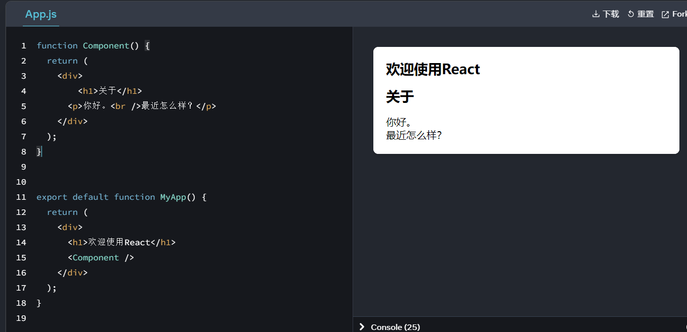
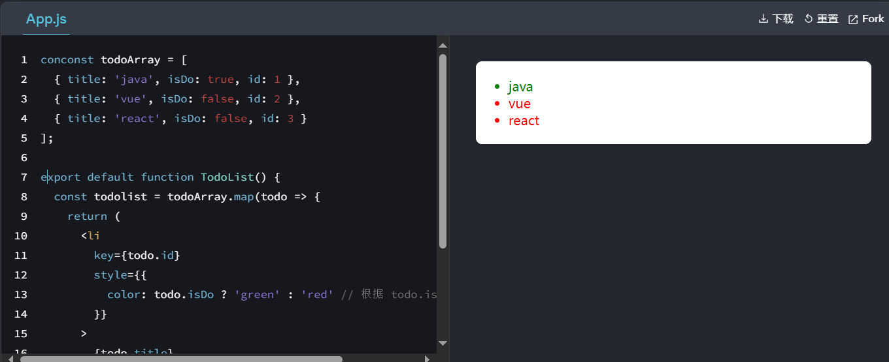
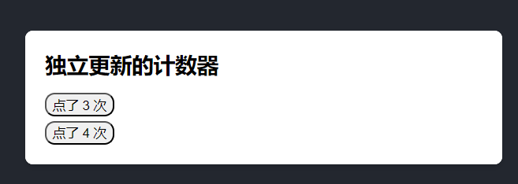
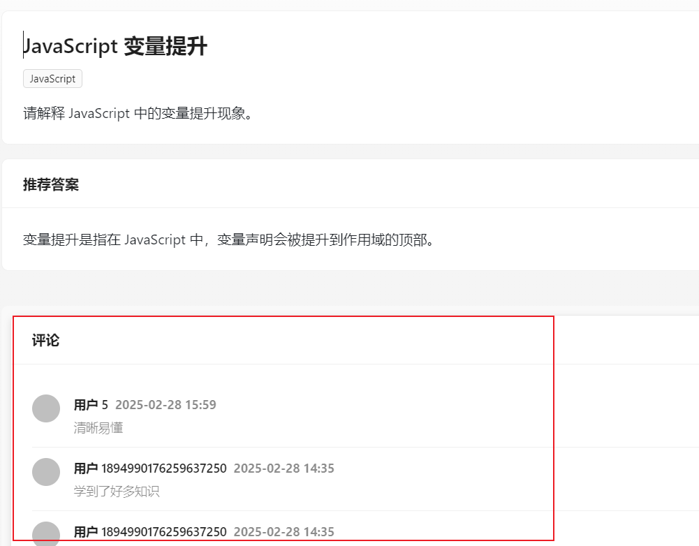
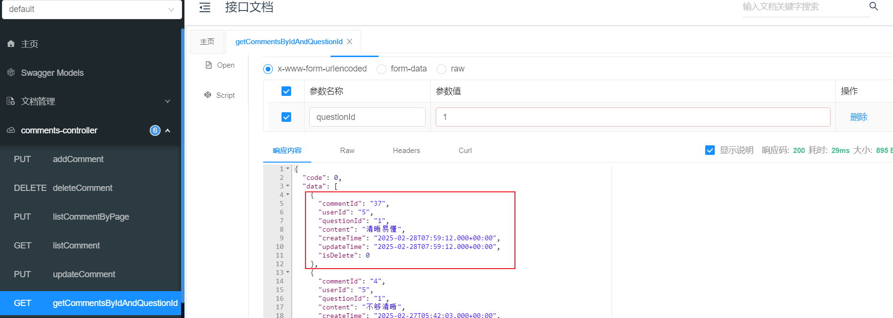
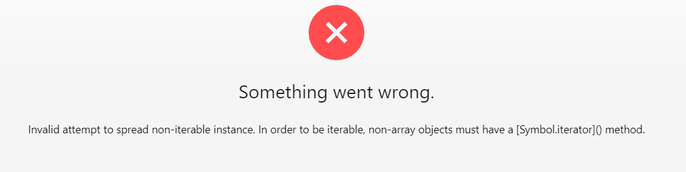
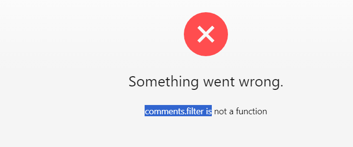

## Day 2

### 前端学习React

[快速入门 – React 中文文档](https://zh-hans.react.dev/learn)

核心：React 以组件的形式组织，并且不允许返回多个标签，意思是我们只能返回一个<div></div> 父标签的文件

```app.js
function Component() {
  return (
    <div>
        <h1>关于</h1>
      <p>你好。<br />最近怎么样？</p>
    </div>
  );
}


export default function MyApp() {
  return (
    <div>
      <h1>欢迎使用React</h1>
      <Component />
    </div>
  );
}

```




取值，在{}取值

```jsx
const user = {
  name : 'hsnqls',
  imgUrl:"https://img.shetu66.com/2023/04/25/1682405982916194.png",
  imgSize: 50,
}

export default function Profile() {
  return (
    <>
      <h1>{user.name}</h1>
      
    </>
  );
}

```

tips: style={{}}，外层括号表示嵌入一个嵌入 JavaScript 表达式。 内层 `{}`：用于定义 JavaScript 对象,双花括号 `{{ }}` 是 JSX 中定义内联样式的标准写法


列表渲染

```jsx
const todoArray = [
  { title: 'java', isDo: true, id: 1 },
  { title: 'vue', isDo: false, id: 2 },
  { title: 'react', isDo: false, id: 3 }
];

export default function TodoList() {
  const todolist = todoArray.map(todo => {
    return (
      <li
        key={todo.id}
        style={{
          color: todo.isDo ? 'green' : 'red' // 根据 todo.isDo 的值设置颜色
        }}
      >
        {todo.title}
      </li>
    );
  });

  return <ul>{todolist}</ul>;
}
```




组件绑定响应事件

```jsx
import { useState } from 'react';

function MyClick1(){
  const [mycount,setMyCount] = useState(0);

  function handermyClick1(){
    setMyCount(mycount+1)
  }

  return (
    <button onClick={handermyClick1}
      style={{
         borderRadius: '10px'
      }}
      >
      点了 {mycount} 次
    </button>
  )
}


export default function MyApp() {
  return (
    <div>
      <h1>独立更新的计数器</h1>
      <MyClick1 />
      <MyClick1 />
    </div>
  );
}
```



.

### 新增前端评论模块

不会前端，我是怎么搞出来的，评论模块的。算是对我之前没有实现思路的总结。



首先，我了解，React是一组件的形式，来组织页面的。

我要想新添加一个页面，也就是编写一个组件，之后在所需要展示的地方引入组件就行。

**如何编写一个组件**

会React就能编写（.....），不会就用AI编写，如何用AI编写组件。

首先我们要想清楚我们想要编写组件的数据是什么样子的？

我是一个后端开发，我已经编写好了，后端的接口，比如说获得题库下相关的评论集合。



也就是

```json

const comments = [
  {
    commentId: '1',
    userId: '5',
    questionId: '1',
    content: '不够清晰',
    createTime: '2025-02-27T05:02:48.000+00:00',
    updateTime: '2025-02-27T05:02:48.000+00:00',
    isDelete: 0,
  },
  {
    commentId: '3',
    userId: '5',
    questionId: '1',
    content: '需要更多示例',
    createTime: '2025-02-27T05:42:02.000+00:00',
    updateTime: '2025-02-27T05:42:02.000+00:00',
    isDelete: 0,
  },
  {
    commentId: '4',
    userId: '6',
    questionId: '1',
    content: '已删除的评论',
    createTime: '2025-02-27T06:00:00.000+00:00',
    updateTime: '2025-02-27T06:00:00.000+00:00',
    isDelete: 1, // 已删除的评论
  },
];
```


交给AI 用React写一个XXX组件，展示的数据格式是如下。DeepSeek最好用。

```tsx
'use client';
import React from 'react';
import { List, Avatar, Typography, Card } from 'antd';
import dayjs from 'dayjs';

interface Comment {
  commentId: string;
  userId: string;
  questionId: string;
  content: string;
  createTime: string;
  updateTime: string;
  isDelete: number;
}

interface Props {
  comments: Comment[]; // 评论数据
}

const CommentList: React.FC<Props> = ({ comments }) => {
  // 过滤掉已删除的评论
  const validComments = comments.filter((comment) => comment.isDelete === 0);

  return (
    <Card
      title="评论" // 添加标题
      style={{
        border: '1px solid #e8e8e8', // 边框颜色
        borderRadius: '8px', // 圆角
        boxShadow: '0 2px 8px rgba(0, 0, 0, 0.1)', // 阴影
        
      }}
    >
      <List
        dataSource={validComments}
        renderItem={(comment) => (
          <List.Item>
            <List.Item.Meta
              avatar={<Avatar src={"https://vcg01.cfp.cn/creative/vcg/800/new/VCG211302657498.jpg"} />} // 用户头像
              title={
                <div>
                  <Typography.Text strong>用户 {comment.userId}</Typography.Text>
                  <Typography.Text type="secondary" style={{ marginLeft: 8 }}>
                    {dayjs(comment.createTime).format('YYYY-MM-DD HH:mm')}
                  </Typography.Text>
                </div>
              }
              description={comment.content} // 评论内容
            />
          </List.Item>
        )}
      />
    </Card>
  );
};

export default CommentList;
```


组件编写好，的第一件是就是，引入，看看组件到底能不能用。随便找一个页面，引入该组件，数据部分，就先用假数据，先不请求后端。看看能不能用。报错信息给AI. 直到组件可以使用。


下一步，在需要该组件的地方，引入该组件，可以使用<div style={{}}> <组件></div>>，对组件的布局进行调整。

现在还是假数据，我们需要从后端请求数据。真得学学Axios，Axios才是主要的前后端交互（页面算什么......）。

**不会，就尽快学。**

我确实不会，但是时间紧迫确实要开发，找一个项目种，最简单的一个GET请求的Axios,问AI是什么意思。了解了就仿照着写。

这里，重要的就是参数定义， 响应的数据接口，请求的地址，请求的方法。

如下例子

```ts
import request from '@/libs/request';

export async function getCommentsByQuestionIdUsingGet(
  questionId: number,
  options?: { [key: string]: any },
) {
  return request<API.CommentVO[]>(`/api/comments/list/${questionId}`, {
    method: 'GET',
    ...(options || {}),
  });
}
```

写完Axios请求， 就在我们使用组件的地方，用该方法获取数据。

怎么用这个Axios请求，看原来的方法怎么，获取的，大概模仿一下。

```ts
"use server";
import { message } from "antd";
import { getQuestionVoByIdUsingGet } from "@/api/questionController";
import QuestionCard from "@/components/QuestionCard";
import "./index.css";
import Comments from "@/components/Comments/Comments";
import { getCommentsByQuestionIdUsingGet } from "@/api/commentController";

/**
 * 题目详情页
 * @constructor
 */
export default async function QuestionPage({ params }) {
  const { questionId } = params;

  // 获取题目详情
  let question = undefined;
  try {
    const res = await getQuestionVoByIdUsingGet({
      id: questionId,
    });
    question = res.data;
  } catch (e) {
    message.error("获取题目详情失败，" + e.message);
  }
  // 错误处理
  if (!question) {
    return <div>获取题目详情失败，请刷新重试</div>;
  }
  
  // todo 获取评论详情
  let comments = undefined;
  try {
    const res = await getCommentsByQuestionIdUsingGet(questionId);
    comments = res.data;
  } catch (e) {
    message.error("获取评论详情失败，" + e.message);
  }
  // 错误处理
  if (!comments) {
    return <div>获取评论详情失败，请刷新重试</div>;
  }

  return (
    <>
    <div id="questionPage">
      <QuestionCard question={question} />
    </div>

    <div  
    style={{
      marginTop: '40px',
      padding: '10px',
     
      borderRadius: '8px',
      backgroundColor: '#f9f9f9',
    }
    }>
    <Comments comments={comments} />
    </div>

    </>
    
  );
}

```


这里出错了问AI,最好打开DeepSeek或者Kimi的深度思考，看他的思考过程，是如何排查错误的，我们也可以学到。

至此就可以开发一个新组件了。

总结一下：开发新页面的流程，第一步学一点点框架，直到项目用什么框架，框架的文件是怎么组织的。第二部，模块化的做最简单的页面（后续在更新，添加功能），最简单的基本上就是展示了。就先做展示。

做该模块的展示功能， 编写组件，引入组件，用假数据测试组件，<div style={{}}> <组件></div>>调整组件的格式。编写Axios请求。


#### 分页获取评论模块

上述已经完成了最简单的，评论模块，但是评论太多，我们应该分页查询。

那就分页请求数据，




还是找不出错误，不知道那里错了。.......................................

不知道那里错了，但是弄好了，原因是

```java
// 过滤掉已删除的评论
  const validComments = comments.filter((comment) => comment.isDelete === 0);
```

一开始说filter 不是函数，我就给删了，..........，不太明白。

我真服了



comment 可能不是数组。 服了。


### 总结

​	React大概了解，也能简单的新增页面了，不过还是很吃力。还要多做才能熟练。

​	看了Java集合的八股。

​	改了昨天的小bug。

​	没写sql。

周六日学点什么呢？把AI那块实现一下（后端），最好也一起跟着写前端。用户中心项目前端实现。

早点睡觉


