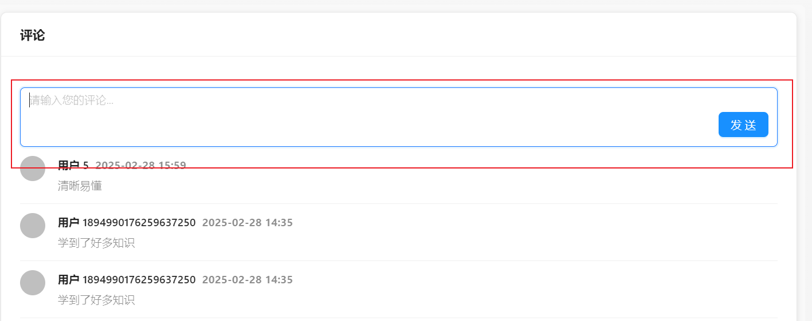
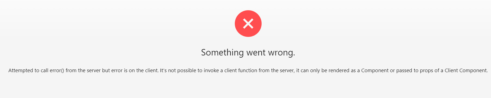
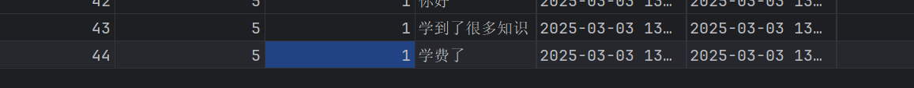
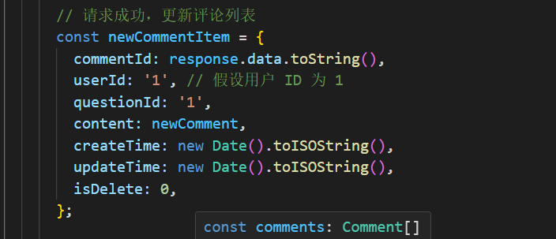
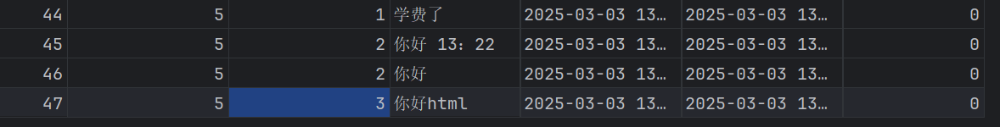
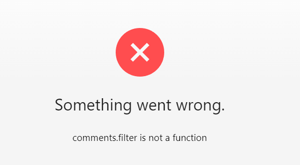
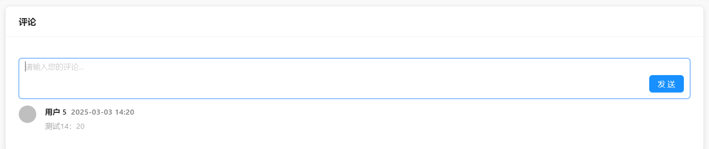
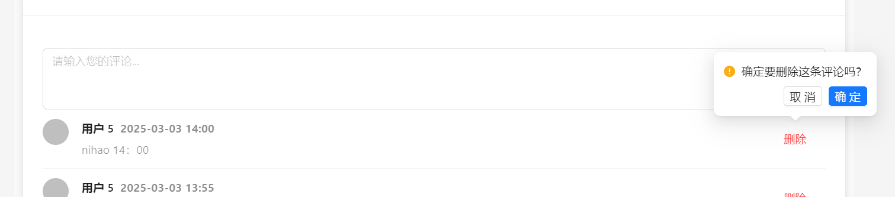

## Day 27


### 评论页面

在评论页面上，加一个评论框，和发送按钮



在写好的评论组件中添加。

axios 请求

```ts
/** 新增评论 请求类型*/
interface CommentsAddRequest {
  /**
   * 题目 ID
   */
  questionId: number;

  /**
   * 评论内容
   */
  content: string;
}

/** 新增评论 */
export async function addCommentUsingPut(
  commentsAddRequest: CommentsAddRequest,
  options?: { [key: string]: any },
) {
  return request<API.BaseResponseLong_>('/api/comments/add', {
    method: 'PUT', // 使用 PUT 方法
    data: commentsAddRequest, // 请求体数据
    ...(options || {}), // 其他可选配置
  });
}
```

点击发送，发送axios请求



明明刚刚还没问题，发送了两条评论，然后有错了。fk

回滚了，还报错，fk

```text
 ⨯ Error: Attempted to call error() from the server but error is on the client. It's not possible to invoke a client function from the server, it can only be rendered as a Component or passed to props of a Client Component.
    at HomePage (./src/app/page.tsx:72:95)
```

重启了，前后端，不报错了


有一个bug，题目id都是1





写死了值，我们要根据页面获取，userid，questionid.

不清楚有没有全局共享变量 userid， 不用也可以把，后端根据session去查。

questionId,可以获取uri，然后获得到questionid.试试看把


确实可以



新增评论实现。

获取评论列表失效了，我之前在questionpage中写的请求，还是转到comment组件中请求吧。


又遇到前几天的错误，卡在了这个，之前我是想做分页查询评论，但是调用那个函数就出现这个错误。



经过排查，好像是函数的返回值，和接受类型不一致，还真是，从返回值里面去除data就行了。



做个简短的总结：

* 如何实现，发送评论框的

  直接将我们写好的组件（之前只有评论），交给AI修改新增评论框。

* 如何实现点击按钮，发送请求到数据库的

  给按钮绑定事件，在事件中调用axios请求。axios怎么写的，接口给AI。

* 如何实现查询评论列表的，之前写好了axios请求，但是在其他页面（题目页面调用请求，感觉不好，不如直接在评论组件中去调用）

### Todo

1. 删除评论功能。
2. 分页查询功能。


### 评论删除功能

在评论上加一个删除的小按钮，点击按钮，发送axios请求删除。

大概逻辑就是，在每条评论后面，加一个删除按钮，并绑定单机事件，单击事件，调用axios请求。

至于axios请求，就将后端的接口，给AI，以及实体的请求代码。



成功实现。

测试：删除自己的√，删除别人的（不能删除）×，管理员删除别人的√


### 点赞功能

半个小时速度

先实现后端.

评论表

添加个good 字段，用户点赞排序

```sql
-- auto-generated definition
create table comments
(
    commentId  bigint auto_increment comment 'id'
        primary key,
    userId     bigint                             not null comment '用户id',
    questionId bigint                             not null comment '题目id',
    content    text                               not null comment '评论内容',
    createTime datetime default CURRENT_TIMESTAMP not null comment '创建时间',
    updateTime datetime default CURRENT_TIMESTAMP not null on update CURRENT_TIMESTAMP comment '更新时间',
    isDelete   tinyint  default 0                 not null comment '是否删除',
    good       int      default 0                 null comment '点赞量'
)
    comment '评论' collate = utf8mb4_unicode_ci;
```

业务逻辑，一人一个评论只能点赞一次，怎么实现？

新增点赞表

```sql
CREATE TABLE comment_likes (
    id BIGINT AUTO_INCREMENT COMMENT '主键' PRIMARY KEY,
    commentId BIGINT NOT NULL COMMENT '评论ID',
    userId BIGINT NOT NULL COMMENT '用户ID',
    createTime DATETIME DEFAULT CURRENT_TIMESTAMP NOT NULL COMMENT '创建时间',
    updateTime DATETIME DEFAULT CURRENT_TIMESTAMP NOT NULL ON UPDATE CURRENT_TIMESTAMP COMMENT '更新时间',
    isDelete TINYINT DEFAULT 0 NOT NULL COMMENT '是否删除',
    UNIQUE KEY uk_comment_user (commentId, userId) -- 唯一约束，确保一个用户对一个评论只能点赞一次
) COMMENT '评论点赞表' COLLATE = utf8mb4_unicode_ci;
```

逻辑，就是用一个表存放关系，利用唯一约束来添加，发送点赞请求，会先根据userId和commentId，来查询点赞记录表，存在就失败，不存在就加入，同时，评论表good 字段++。加上事务。

如下实现

service 接口

```java
 BaseResponse<Boolean> likeComment(long commentId, long userId);
```

实现类

```java
@Service
@Transactional
public class CommentLikesServiceImpl extends ServiceImpl<CommentLikesMapper, CommentLikes>
    implements CommentLikesService{


    @Resource
    private CommentsService commentsService;

    /**
     * 一人只能点赞一次
     * @param commentId
     * @param userId
     * @return
     */
    @Override
    public BaseResponse<Boolean> likeComment(long commentId, long userId) {
        //参数校验
        ThrowUtils.throwIf(commentId <= 0, ErrorCode.NOT_FOUND_ERROR);
        ThrowUtils.throwIf(userId <= 0, ErrorCode.NOT_LOGIN_ERROR);

        //查询点赞记录
        // select count(*) from CommentLikes where commentId = commentId and userId = userId
        LambdaQueryWrapper<CommentLikes> lambdaQueryWrapper = new LambdaQueryWrapper<>();
        lambdaQueryWrapper.eq(CommentLikes::getCommentId, commentId)
                .eq(CommentLikes::getUserId, userId);
        CommentLikes commentLikes = this.getOne(lambdaQueryWrapper);
        if (commentLikes != null) {
            //已经点赞过
            return ResultUtils.error(ErrorCode.OPERATION_ERROR,"已经点过赞了");
        }
        //插入点赞记录
        commentLikes = new CommentLikes();
        commentLikes.setCommentId(commentId);
        commentLikes.setUserId(userId);
        boolean save = save(commentLikes);
        if(!save){
            throw new BusinessException(ErrorCode.OPERATION_ERROR);
        }

        //并且 评论表点赞加1
        LambdaUpdateWrapper<Comments> lambdaUpdateWrapper = new LambdaUpdateWrapper<>();


        // update comments set good = good + 1 where id = commentId
        lambdaUpdateWrapper
                .eq(Comments::getCommentId, commentId)
                .setSql("good = good + 1");

        boolean update = commentsService.update(lambdaUpdateWrapper);
        if (!update) {
            throw new BusinessException(ErrorCode.OPERATION_ERROR);
        }

        return ResultUtils.success(true);
    }
}


```

接口

```java
@RestController
@RequestMapping("/commentsLike")
public class CommentLikeController {


    @Resource
    private CommentLikesService commentLikesService;
    
    @Resource
    private UserService userService;


    /**
     * 新增点赞
     * @param
     */
    @PutMapping("/add")
    public BaseResponse<Boolean> addComment(@RequestBody  long commentId , HttpServletRequest request){

        User loginUser = userService.getLoginUser(request);
        ThrowUtils.throwIf(loginUser == null, ErrorCode.NOT_LOGIN_ERROR);

        ThrowUtils.throwIf(commentId <= 0, ErrorCode.PARAMS_ERROR);
        ThrowUtils.throwIf(loginUser.getId() <= 0, ErrorCode.PARAMS_ERROR);


        return commentLikesService.likeComment(commentId,loginUser.getId());
    }


}

```

测试 通过。

tips： 数据库，加了一个字段，我们后端的实体也要加，前端的实体类也要加（我还没加）。


### 总结

前端写了多了，如何用AI写前端，在现有的基础上页面，我们尽量的不依赖与其他文件，尽管不优雅，能跑就行。就让AI写，变写边改，从中学习知识。大题开发前端的逻辑，就是开发页面，绑定事件，发送axios请求，稍微处理一些数据的逻辑。

从中学到的知识，页面需求描述清楚，不断的优化，axios请求，要给出后端的接口包括依赖的请求体，最好给出一些写好的axios示例。

点赞功能。

今天没有系统的学前端的知识， 应该在公司学的，一天写俩页面，效率优点低了，要学会拒绝别人，只要不是学习的事情，就说自己有需求要写。

明确一下任务

1.继续开发页面（最少一个）

2.前端系统学习（1h）

3.后端业务设计以及实现（毕设先不加功能了，先写好剩余需要开发的前端（点赞评论，分页获取评论，AI生成题目，在添加一个审核？）

4.sql

5.八股

6.新知识


