## Day 3

打算接入AI.

### AI生成答案

#### 需求分析

* AI 解答题目 【P0】
* AI 生成题目  [P0]
* AI 模拟面试
*  AI 解析答案（评价）

#### 调研

DeepSeek ,GPT, Kimi


#### 方案设计

技术选型： AI 的选型？DeepSeek

**DeepSeek 怎么接入到程序中呢？**推荐用火山引擎：快速、稳定、有赠送额度、有 SDK

##### 1、接入 AI

使用 SDK，封装自己的 AI 工具类（AiManager 便于项目统一调用）

##### 2、AI 生成题目【仅管理员可用】


##### 3、AI 生成题解【仅管理员可用】


##### 4、一些优化

#### 方案实现


##### 1.项目接入AI

用最简单的方式使用AI。也就是聊天框.

给AI 的提示词，输出格式要规定，才会返回我们符合要求的结果。

```text
生成 20 道 MySQL 的20道题目，输出格式如下
1. Mysql sql 语句执行的顺序是什么？
2. Mysql 的 MVCC你了解吗？
3. Mysql 的 存储引擎有哪些？
4. Mysql 的 锁机制了解吗？
5. Mysql 的 主从同步是怎么实现的？
```

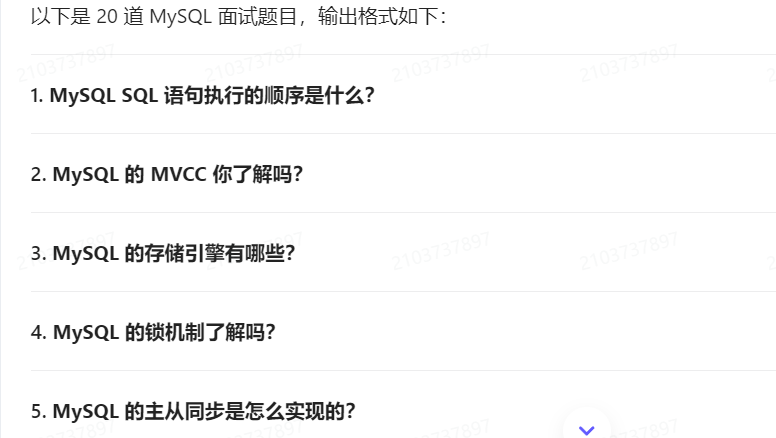


聊天框，其实也就是在页面调用了大模型的接口。

我们怎么在Java 程序种调用接口呢? 看官方文档。

在我们的程序种，先运行起来，AI模型。

[火山方舟大模型体验中心-火山引擎](https://www.volcengine.com/experience/ark)

```xml
<!--        AI 接入 火山引擎 Deepseek https://www.volcengine.com/experience/ark-->
        <dependency>
            <groupId>com.volcengine</groupId>
            <artifactId>volcengine-java-sdk-ark-runtime</artifactId>
            <version>0.1.153</version>
        </dependency>

```

版本： https://central.sonatype.com/artifact/com.volcengine/volcengine-java-sdk-ark-runtime

使用以下，代码用自己的APIKEY

```java

import com.volcengine.ark.runtime.model.completion.chat.ChatCompletionRequest;
import com.volcengine.ark.runtime.model.completion.chat.ChatMessage;
import com.volcengine.ark.runtime.model.completion.chat.ChatMessageRole;
import com.volcengine.ark.runtime.service.ArkService;
import okhttp3.ConnectionPool;
import okhttp3.Dispatcher;
import org.springframework.stereotype.Component;

import java.util.ArrayList;
import java.util.List;
import java.util.concurrent.TimeUnit;


@Component
public class AI {

//    static String apiKey = System.getenv("ARK_API_KEY");
    static String apiKey = AIConfig.API_KEY;

    static ConnectionPool connectionPool = new ConnectionPool(5, 1, TimeUnit.SECONDS);
    static Dispatcher dispatcher = new Dispatcher();
    static ArkService service = ArkService.builder()
            .dispatcher(dispatcher)
            .connectionPool(connectionPool)
            .baseUrl("https://ark.cn-beijing.volces.com/api/v3")
            .apiKey(apiKey).build();

    public static void main(String[] args) {
        System.out.println("\n----- standard request -----");
        final List<ChatMessage> messages = new ArrayList<>();
        final ChatMessage systemMessage = ChatMessage.builder().role(ChatMessageRole.SYSTEM).content("你是程序员助手").build();
        final ChatMessage userMessage = ChatMessage.builder().role(ChatMessageRole.USER).content("生成 10 道 Java 题目").build();
        messages.add(systemMessage);
        messages.add(userMessage);

        ChatCompletionRequest chatCompletionRequest = ChatCompletionRequest.builder()
                .model("deepseek-v3-241226")
                .messages(messages)
                .build();

        service.createChatCompletion(chatCompletionRequest)
                .getChoices()
                .forEach(choice -> System.out.println(choice.getMessage().getContent()));


        // 流式请求
//        System.out.println("\n----- streaming request -----");
//        final List<ChatMessage> streamMessages = new ArrayList<>();
//        final ChatMessage streamSystemMessage = ChatMessage.builder().role(ChatMessageRole.SYSTEM).content("你是人工智能助手").build();
//        final ChatMessage streamUserMessage = ChatMessage.builder().role(ChatMessageRole.USER).content("常见的十字花科植物有哪些？").build();
//        streamMessages.add(streamSystemMessage);
//        streamMessages.add(streamUserMessage);
//
//        ChatCompletionRequest streamChatCompletionRequest = ChatCompletionRequest.builder()
//                .model("deepseek-v3-241226")
//                .messages(streamMessages)
//                .build();
//
//        service.streamChatCompletion(streamChatCompletionRequest)
//                .doOnError(Throwable::printStackTrace)
//                .blockingForEach(
//                        choice -> {
//                            if (choice.getChoices().size() > 0) {
//                                System.out.print(choice.getChoices().get(0).getMessage().getContent());
//                            }
//                        }
//                );

        // shutdown service after all requests is finished
        service.shutdownExecutor();
    }
}

```

项目中跑通

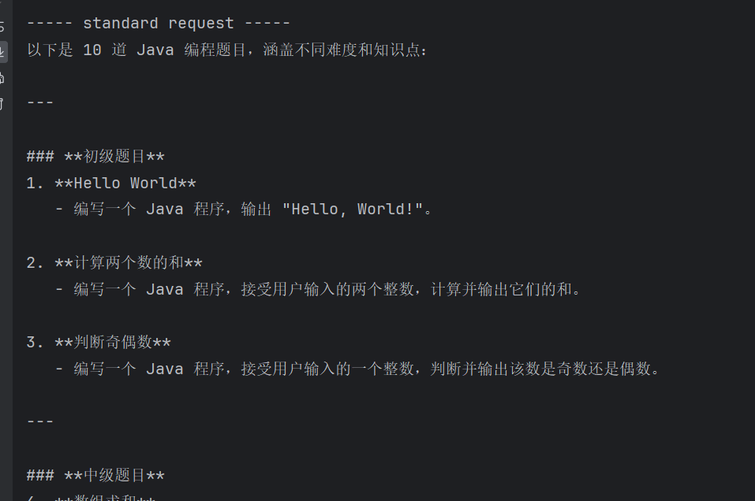

##### 2. 封装AI 工具类

如何封装？ 上述代码的核心就是

1. 获取AI请求的服务
2. 构造消息
3. 用AI的请求服务，根据消息发送请求，并返回结果。

那我们就可以，先写一个AI的配置类，获取AI的请求服务。然后在编写工具类（传入消息，发送请求获取结果）。


1. AI的请求服务配置类

```java
@Configuration
@ConfigurationProperties(prefix = "ai")
@Data
public class AIConfig {

    // apiKey 自动从配置文件获取 可以选择local.yaml
    private String apiKey;

    /**
     * AI 请求服务
     * @return
     */
    @Bean
    public ArkService AIService(){
        //
        ConnectionPool connectionPool = new ConnectionPool(5, 1, TimeUnit.SECONDS);
        Dispatcher dispatcher = new Dispatcher();
        ArkService service = ArkService.builder()
                .dispatcher(dispatcher)
                .connectionPool(connectionPool)
                .baseUrl("https://ark.cn-beijing.volces.com/api/v3")
                .apiKey(apiKey).build();

        return service;
    }

}

```

2. 编写AI 工具类

```java
@Component
public class AIManger {

    @Resource
    private ArkService arkService;

    private final String Default_Model= "deepseek-v3-241226";

    /**
     *
     * @param systemPrompt 系统身份提示词
     * @param userPrompt   用户提示词
     * @param aiModel       AI模型
     * @return
     */
    public String doChat(String systemPrompt,String userPrompt,String aiModel) {


        // 构造请求消息
        System.out.println("\n----- standard request -----");
        final List<ChatMessage> messages = new ArrayList<>();
        final ChatMessage systemMessage = ChatMessage.builder().role(ChatMessageRole.SYSTEM).content(systemPrompt).build();
        final ChatMessage userMessage = ChatMessage.builder().role(ChatMessageRole.USER).content(userPrompt).build();
        messages.add(systemMessage);
        messages.add(userMessage);

        ChatCompletionRequest chatCompletionRequest = ChatCompletionRequest.builder()
                .model(aiModel)
                .messages(messages)
                .build();

        // 发起请求 并获得数据
//        arkService.createChatCompletion(chatCompletionRequest)
//                .getChoices()
//                .forEach(choice -> System.out.println(choice.getMessage().getContent()));


        List<ChatCompletionChoice> choices = arkService.createChatCompletion(chatCompletionRequest)
                .getChoices();

        // 检查 choices 是否为空
        if (choices == null || choices.isEmpty()) {
            throw new BusinessException(ErrorCode.OPERATION_ERROR);
        }

        // 将每个 choice 的 content 提取出来，拼接成一个 String
        StringBuilder result = new StringBuilder();
        for (ChatCompletionChoice choice : choices) {
            result.append(choice.getMessage().getContent()).append("\n");
        }

        // 返回拼接后的结果
        return result.toString();
    }


    /**
     *
     * @param systemPrompt 系统提示词
     * @param userPrompt   用户提示词
     * @return
     */
    public String doChat(String systemPrompt,String userPrompt) {


        // 构造请求消息
        System.out.println("\n----- standard request -----");
        final List<ChatMessage> messages = new ArrayList<>();
        final ChatMessage systemMessage = ChatMessage.builder().role(ChatMessageRole.SYSTEM).content(systemPrompt).build();
        final ChatMessage userMessage = ChatMessage.builder().role(ChatMessageRole.USER).content(userPrompt).build();
        messages.add(systemMessage);
        messages.add(userMessage);

        ChatCompletionRequest chatCompletionRequest = ChatCompletionRequest.builder()
                .model(Default_Model)
                .messages(messages)
                .build();

        // 发起请求 并获得数据
//        arkService.createChatCompletion(chatCompletionRequest)
//                .getChoices()
//                .forEach(choice -> System.out.println(choice.getMessage().getContent()));


        List<ChatCompletionChoice> choices = arkService.createChatCompletion(chatCompletionRequest)
                .getChoices();

        // 检查 choices 是否为空
        if (choices == null || choices.isEmpty()) {
            throw new BusinessException(ErrorCode.OPERATION_ERROR);
        }

        // 将每个 choice 的 content 提取出来，拼接成一个 String
        StringBuilder result = new StringBuilder();
        for (ChatCompletionChoice choice : choices) {
            result.append(choice.getMessage().getContent()).append("\n");
        }

        // 返回拼接后的结果
        return result.toString();
    }

    public String doChat(String userPrompt) {


        // 构造请求消息
        System.out.println("\n----- standard request -----");
        final List<ChatMessage> messages = new ArrayList<>();
        final ChatMessage systemMessage = ChatMessage.builder().role(ChatMessageRole.SYSTEM).content("").build();
        final ChatMessage userMessage = ChatMessage.builder().role(ChatMessageRole.USER).content(userPrompt).build();
        messages.add(systemMessage);
        messages.add(userMessage);

        ChatCompletionRequest chatCompletionRequest = ChatCompletionRequest.builder()
                .model(Default_Model)
                .messages(messages)
                .build();

        // 发起请求 并获得数据
//        arkService.createChatCompletion(chatCompletionRequest)
//                .getChoices()
//                .forEach(choice -> System.out.println(choice.getMessage().getContent()));


        List<ChatCompletionChoice> choices = arkService.createChatCompletion(chatCompletionRequest)
                .getChoices();

        // 检查 choices 是否为空
        if (choices == null || choices.isEmpty()) {
            throw new BusinessException(ErrorCode.OPERATION_ERROR);
        }

        // 将每个 choice 的 content 提取出来，拼接成一个 String
        StringBuilder result = new StringBuilder();
        for (ChatCompletionChoice choice : choices) {
            result.append(choice.getMessage().getContent()).append("\n");
        }

        // 返回拼接后的结果
        return result.toString();
    }
}
```

测试

```java
@SpringBootTest
class AIMangerTest {

    @Resource
    private AIManger aiManger;
    @Test
    void doChat() {
        String string = aiManger.doChat("生成 3 道 Mysql 的面试题，只生成题目");
        System.out.println(string);

    }

    @Test
    void testDoChat() {
        String string = aiManger.doChat("当用户输入你好，你输出服务器繁忙","你好");
        System.out.println(string);
    }
}
```

测试结果

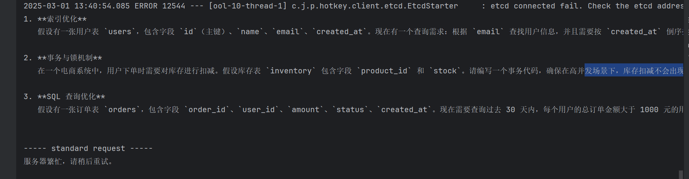


tips：  我们将api-key 保存在其他的配置文件中，并且忽略掉。在启动的时候选择配置文件。避免我们开源项目时api泄露

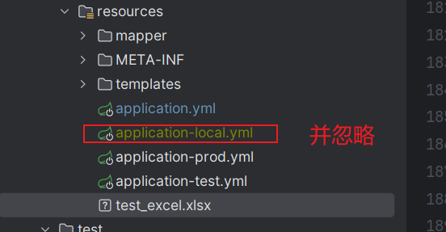

在启动的时候，选择配置文件

```shell
--spring.profiles.active=local
```

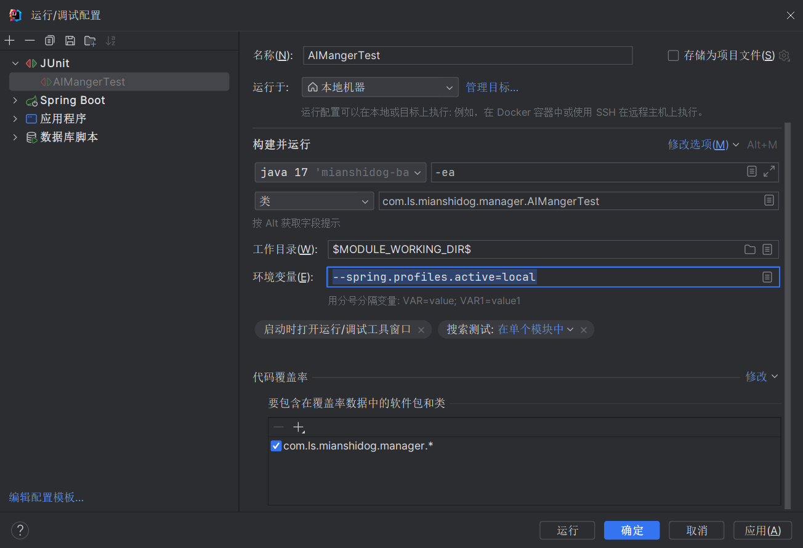

##### 3.  AI 生成题目

直接根据参数，调用AI,就会出现上述测试的代码那样，不符合我们的要求。

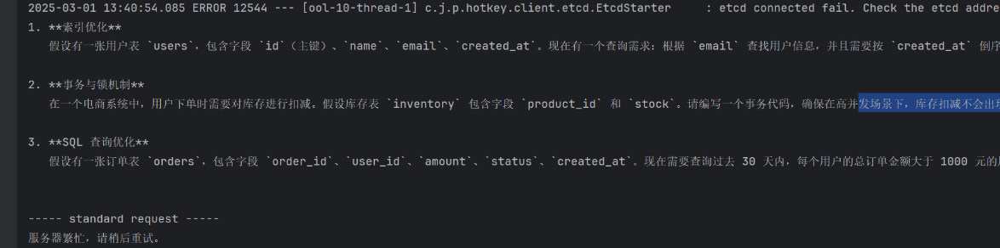

我们应该优化我们的输入，使其稳定的输出我们想要的内容，我们仅仅就想要个题目。不要让AI做多余的操作。

使用AI 的最佳实践，就是

1. 明确输入，给出输入的实例
2. 明确输出，给出输出的示例
3. 表达清楚处理的业务。

以下例子

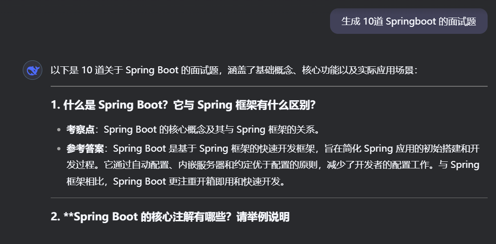

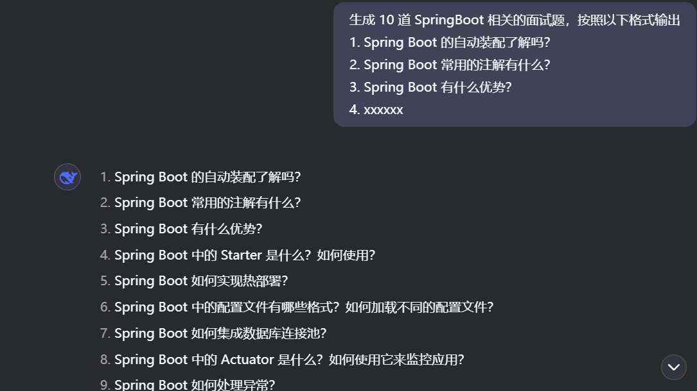

我们可以预设promt，只让用户填部分动态参数，根据我们预设的promt，生成符合要求的题目。

```text
生成 10 道 SpringBoot 的面试题，按照以下格式输出
1. Spring Boot 的自动装配了解吗？
2. Spring Boot 常用的注解有什么？
3. Spring Boot 有什么优势？
4. xxxxxx
```

启动  生成 {数量}道 {类型} 的面试题。是动态的，也就是用户输入的。


开发

开发接口

```java
/**
     * AI生成题目
     * @param num
     * @param questionType
     * @param user
     * @return
     */

    boolean AIGeneratorQuestionList(int num, String questionType,User user);
```

实现类

```java
 /**
     * AI 生成题目
     * @param num
     * @param questionType
     * @param user
     * @return
     */
    @Override
    public boolean AIGeneratorQuestionList(int num, String questionType, User user) {

        // 参数校验
        ThrowUtils.throwIf(num <= 0, ErrorCode.PARAMS_ERROR, "题目数量必须大于0");
        ThrowUtils.throwIf(StringUtils.isBlank(questionType), ErrorCode.PARAMS_ERROR, "题目类型不能为空");
        ThrowUtils.throwIf(user == null, ErrorCode.NOT_LOGIN_ERROR);

        // 定义系统prompt
        String systemPrompt ="你是专业的程序员面试官" +"帮我生成 {数量} 道 {类型} 的面试题，按照以下格式输出\n" +
                "1. Spring Boot 的自动装配了解吗？\n" +
                "2. Spring Boot 常用的注解有什么？\n" +
                "3. Spring Boot 有什么优势？\n" +
                "4. xxxxxx";

        // 用户prompt
        String userPrompt = String.format("题目数量：%d,题目类型：%s", num, questionType);

        // 调用AI服务

        String resultString = aiManger.doChat(systemPrompt,userPrompt);

        // 处理结果

             // 使用 Hutool 的 StrUtil.split 方法按行拆分
        List<String> lines = StrUtil.split(resultString, '\n');

             // 过滤掉空行，并收集为 List<String>
        List<String> resultList = lines.stream()
                .filter(StrUtil::isNotBlank) // 过滤空行
                .map(line -> line.substring(3)) // 去除前面序号
                .collect(Collectors.toList());

        List<Question> questionList = new ArrayList<>();
        // 插入数据库（补充字段）
        for (String string : resultList) {
            Question question = new Question();
            question.setTitle(string);
            question.setUserId(user.getId());
            ArrayList<String> taglist = new ArrayList<>();
            taglist.add(questionType);
            taglist.add("AI");
            String tagsJson = JSONUtil.toJsonStr(taglist);
            question.setTags(tagsJson);
            questionList.add(question);
        }

        boolean save = this.saveBatch(questionList);
        if (!save) {
            throw new BusinessException(ErrorCode.OPERATION_ERROR, "AI生成题目失败");
        }
        return true;
    }
```

接口

```java
    @PutMapping("add/AI")
    @AuthCheck(mustRole = UserConstant.ADMIN_ROLE)
    public BaseResponse<Boolean> addAIQuestion(@RequestBody QuestionAddAIRequest questionAddAIRequest,HttpServletRequest request){

        //参数校验
        ThrowUtils.throwIf(questionAddAIRequest == null, ErrorCode.PARAMS_ERROR);
        int num = questionAddAIRequest.getNum();
        String questionType = questionAddAIRequest.getQuestionType();
        ThrowUtils.throwIf(num <= 0, ErrorCode.PARAMS_ERROR);
        ThrowUtils.throwIf(StringUtils.isBlank(questionType), ErrorCode.PARAMS_ERROR);
        //获取用户
        User loginUser = userService.getLoginUser(request);
        ThrowUtils.throwIf(loginUser == null, ErrorCode.NOT_LOGIN_ERROR);

        boolean b = questionService.AIGeneratorQuestionList(num, questionType, loginUser);
        if(!b){
            return ResultUtils.error(ErrorCode.SYSTEM_ERROR.getCode(), "生成失败");
        }
        return ResultUtils.success(b);

    }
```


测试:

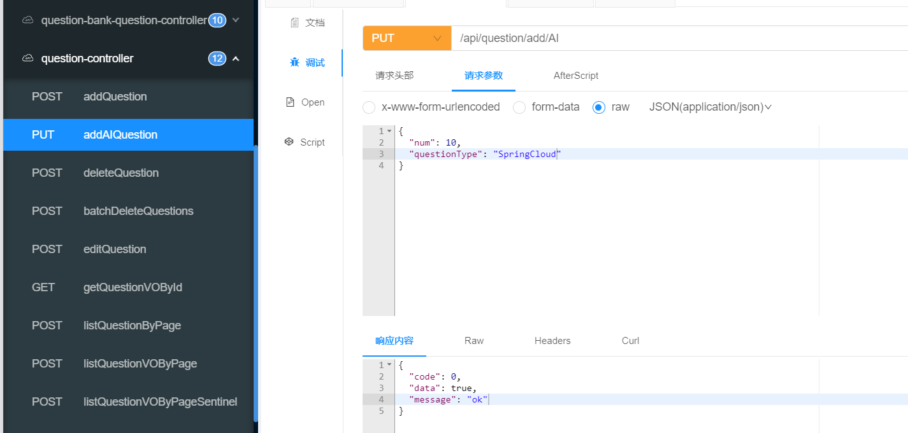

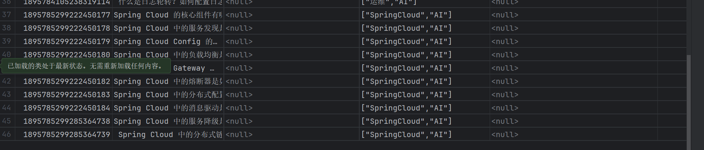


##### 4. AI 生成答案

上述我们只生成了标题，现在做生成内容。

生成的内容要求 使用markdown语法。

我们可以预设系统提示词

systemPrompt

```text
你是专业的程序员，我会给你一些问题，请你解答。
要求
1. 使用markdown格式
2. 先总结在详细论述。
3. 按需给出Java实现demo
4. 仅仅返回给我题目的回答，不要回答多余的信息。
```


测试花了 3分钟，是真的慢（可以优化成并行）。

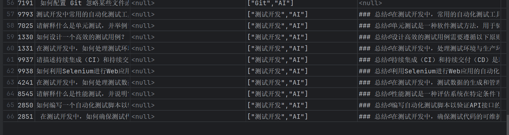

看下显示效果，还不错。

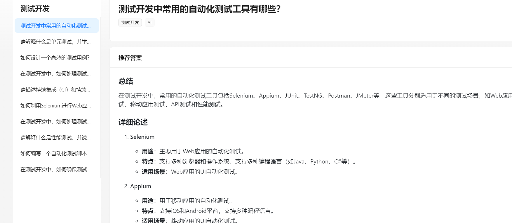

##### 5 .可考虑的优化

1. 性能优化， 并发生成题目和题解。
2. 可观测性优化，监控+日志+警告+异常处理
3. 成本优化
4. 稳定性优化
5. 响应时延优化， 异步化
6. 代码优化， 设计模式
7. 安全性优化，用户


20：15  30s 


17:30 -21:00   150s -->20s


25:40

性能优化

上述代码中，我们是穿行，执行生成题目，生成答案的。一题一题的生成的。可以利用多线程来优化，将每次生成一道题目作为一个任务，然后异步执行，等到全部执行完毕后在插入数据库。

```java
/**
     * AI 生成题目
     * @param num
     * @param questionType
     * @param user
     * @return
     */
    @Override
    public boolean AIGeneratorQuestionList(int num, String questionType, User user) {

        // 参数校验
        ThrowUtils.throwIf(num <= 0, ErrorCode.PARAMS_ERROR, "题目数量必须大于0");
        ThrowUtils.throwIf(StringUtils.isBlank(questionType), ErrorCode.PARAMS_ERROR, "题目类型不能为空");
        ThrowUtils.throwIf(user == null, ErrorCode.NOT_LOGIN_ERROR);

        // 定义系统prompt
        String systemPrompt ="你是专业的程序员面试官" +"帮我生成 {数量} 道 {类型} 的面试题，按照以下格式输出\n" +
                "1. Spring Boot 的自动装配了解吗？\n" +
                "2. Spring Boot 常用的注解有什么？\n" +
                "3. Spring Boot 有什么优势？\n" +
                "4. xxxxxx";

        // 用户prompt
        String userPrompt = String.format("题目数量：%d,题目类型：%s", num, questionType);

        // 调用AI服务

        String resultString = aiManger.doChat(systemPrompt,userPrompt);

        // 处理结果

             // 使用 Hutool 的 StrUtil.split 方法按行拆分
        List<String> lines = StrUtil.split(resultString, '\n');

             // 过滤掉空行，并收集为 List<String>
        List<String> resultList = lines.stream()
                .filter(StrUtil::isNotBlank) // 过滤空行
                .map(line -> line.substring(3)) // 去除前面序号
                .collect(Collectors.toList());

        ////         插入数据库（补充字段）old 不是并发执行
//        List<Question> questionList = new ArrayList<>();
//        for (String title : resultList) {
//            Question question = new Question();
//            question.setTitle(title);
//            question.setUserId(user.getId());
//            ArrayList<String> taglist = new ArrayList<>();
//            taglist.add(questionType);
//            taglist.add("AI");
//            String tagsJson = JSONUtil.toJsonStr(taglist);
//            question.setTags(tagsJson);
//
//            // 调用AI生成题目答案
//            String answer = AIGeneratorQuestionAnswer(title);
//
//            question.setAnswer(answer);
//            questionList.add(question);
//        }

        // 创建线程池
        ExecutorService executorService = Executors.newFixedThreadPool(20);

        // 并发生成题目和答案
        List<CompletableFuture<Question>> futures = resultList.stream()
                .map(title -> CompletableFuture.supplyAsync(() -> {
                    Question question = new Question();
                    question.setTitle(title);
                    question.setUserId(user.getId());
                    ArrayList<String> taglist = new ArrayList<>();
                    taglist.add(questionType);
                    taglist.add("AI");
                    String tagsJson = JSONUtil.toJsonStr(taglist);
                    question.setTags(tagsJson);

                    // 调用AI生成题目答案
                    String answer = AIGeneratorQuestionAnswer(title);
                    question.setAnswer(answer);

                    return question;
                }, executorService))
                .collect(Collectors.toList());

        // 等待所有任务完成
        CompletableFuture<Void> allFutures = CompletableFuture.allOf(futures.toArray(new CompletableFuture[0]));

        // 获取结果并保存
        List<Question> questionList = allFutures.thenApply(v -> futures.stream()
                .map(CompletableFuture::join)
                .collect(Collectors.toList())).join();

        // 关闭线程池
        executorService.shutdown();

        boolean save = this.saveBatch(questionList);
        if (!save) {
            throw new BusinessException(ErrorCode.OPERATION_ERROR, "AI生成题目失败");
        }
        return true;
    }

    /**
     * AI生成题目答案
     * 根据题目标题生成答案
     * @param questionTitle
     * @return
     */
    public String AIGeneratorQuestionAnswer(String questionTitle) {
        // 参数校验
        ThrowUtils.throwIf(StringUtils.isBlank(questionTitle), ErrorCode.PARAMS_ERROR, "题目不能为空");
        // 定义系统prompt
        String systemPrompt ="你是专业的程序员，我会给你一些问题，请你解答。\n" +
                "要求\n" +
                "1. 使用markdown格式\n" +
                "2. 先总结在详细论述。\n" +
                "3. 仅仅返回给我题目的回答，不要回答多余的信息。";

        // 用户prompt
        String userPrompt = String.format("题目：%s", questionTitle);

        // 调用AI服务
        String resultString = aiManger.doChat(systemPrompt,userPrompt);
        return resultString;

    }
```


### Cannel

了解Cannel。明天实操一下。


### 总结

AI接入项目，引入sdk，自己在封装一下（核心也就是，AI服务请求，prompt，根据prompt发送请求，处理响应的结果）。

多线程优化。

Cannel，原理，伪装成Mysql 的从库，获取binlog文件，解析binlog文件。其实还是主从同步的原理，主从同步的原理，是主库数据发生变化时,会推送binlog文件给从库，从库解析binlog文件生成中继文件，然后执行中级文件，保证数据一致。

binlog,文件的格式

1.statement,记录的是，sql语句，优点占用空间少，缺点可能导致数据不一致，（在sql语句 执行时具有随机性或则时序性， uuid, new date(),或则由于事务的隔离级别低（RU,RC），可能会出现这莫一种情况，先开始的事务后提交，但是binlog记录的是最先提交的数据，举个例子，事务1：开启事务 delete  from A where a < 10 还未提交事务， 然后事务2： 开启事务 执行 insert into A value(5),提交事务。事务2提交事务后，事务一才提交事务，那么binlog记录的就是  insert into A value(5)  ，然后是 delete  from A where a < 10），从库获得到这个binlog，重放就会导致数据不一致。

2.ROW, 记录是数据库所有的变化，假如一条sql update 更新了 1w行数据，那么row 记录的就是1w条数据的变化，相比statement只记录一条sql，占用的空间还是很大的。优点就是能做到数据完全一致。

3.MIXed ,上述两者的混合，在sql有不确定因素（uuid,date）就使用row形式记录，否则就是用statement记录（RR级别才能避免数据不一致）