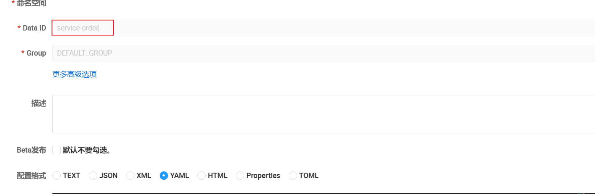
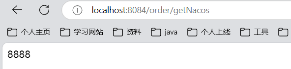

## Day 13

没看八股。

> 今日任务

Nacos 配置中心 （1.5h） OpenFeign (2h)  八股（上午1h，下午1h, 晚上1h） 每日一题（1h）。  优惠卷秒杀乐观锁，一人一单（1h） 

投满简历。


### 配置中心

作为同一的配置管理中心，不仅提供控制台管理，可以实现不停机，修改配置文件，还支持版本控制。

如何使用呢？

1. 导入nacos 配置依赖

```xml
<!--        nacos 配置中心依赖-->
        <dependency>
            <groupId>com.alibaba.cloud</groupId>
            <artifactId>spring-cloud-starter-alibaba-nacos-config</artifactId>
        </dependency>
```

2. 启动nacos 编写配置文件


3. 配置文件

```yaml
spring:
  application:
    name: service-order

#这个弄了半个小时， 在配置中导入Nacos配置中心文件， 该config是spring下的，不是nacos下的
  config:
    import: nacos:service-order.yaml

  cloud:
    nacos:
      config:
        server-addr: 127.0.0.1:8848  # nacos 地址

server:
  port: 8082
```

4. 启动一下，没问题。编写测试类，如何拿到Nacos的配置类

不知道为什么，在测试类中，使用@Value注解拿不到配置文件的信息

```java
@SpringBootTest
public class NacosTest {


    @Value("${blackIpList}")
    private String blackIpList;

    @Test
    public  void nacosTest() {
        // nacos 配置文件的  参数  blackIpList
        System.out.println(blackIpList);

    }
}

```

鼓捣了半小时，一开始老是注入不了blackIpList。我就想，在本地写blackIpList。发现还是注入不了，最后发现是本地拼写有误.

测试可以在本地获取到。

但是还是获取不到远程的nacos的配置。？？？？

害，终于发现了哪里错误了

我在nacos配置中心，配置文件的名称是也就是Data ID是：order-service   

但是我在springboot 项目中绑定的是： order-service.yaml


这就导致其实是没绑定上，配置文件的，但是也没报错，我随便写这个导入nacos的这个都不报错


我要是不写 import标签，他提示我要指定导入naocs文件，不能为null。我指定了，他也不检查我给的位置是不是存在。真的太坑了。

回想一下：这一个半小时的排错

首先：导入失败的问题，因为我使用了nacos的配置中心（引入了依赖），他需要我指定nacos中配置的位置。也就是需要import 导入，我一开始以为是在nacao.config.import 导入，发现报错。最好发现是spring.config.import。

之后，就是获取远程nacos配置的错误，首先我们应该在nacos中编写配置文件以Data ID为标识，其次在本地导入nacos的位置。他一定要和Data ID一直。之前我配置Data ID的时候




绑定的时候

看起来真的没问题，但是要和Data ID完全一致才行。我Data ID就是service-order.那我导入的时候也只能写service-order（而不能写service-order.yaml,）

所以说：之后我的Data ID 的标准格式最好也写个后缀名，仅仅用用作标识名字，例如service-order-dev.yaml。

自动刷新nacos的配置文件。就是我们nacos配置发生变化，主机可以感知到。

我们写个接口，用来获取nacos配置的文件信息。

比如  nacos  配置 orderTimeout : 1000


接口

```java
 @Value("${orderTimeout}")
    private String orderTimeout;

// /order/getNacos    
@GetMapping("/getNacos")
    public String getNacos() {
        
        return orderTimeout;
    }


```

测试


现在我们修改nacos配置的值为8888并发布。

不重启我们的服务，在测试，发现nacos修改后，我们服务器不知道他修改了。


可以开启自动刷新 `@RefreshScope`

在使用nacos的配置的接口上添加

```java
@RestController
@RequestMapping("/order")
@RefreshScope
public class OrderController {

    @Value("${orderTimeout}")
    private String orderTimeout;


    @GetMapping("/getNacos")
    public String getNacos() {

        return orderTimeout;
    }


}

```

重启服务测试



然后我们修改nacos的 orderTimeout 为9999并发布

再次测试，发现确实可以不停机的刷新配置。


总结以下自动nacos自动刷新，首先@Value绑定，其次在接口上开启**@RefereshScope**。


如果配置很多，都需要绑定，还以可以提取成一个属性类。

```java
/**
 * nacos 配置的读取
 */

@ConfigurationProperties()
@Component
@Data
public class OrderProperties {

    private String orderTimeout;
}

```

这样就不用使用@Value注入，也不用使用@RefreashScope注解。

测试一下：注意：去除之前@RefreashScope 和@Value 注解，避免印象本次测试。

```java
@RestController
@RequestMapping("/order")
public class OrderController {


    @Autowired
    private OrderService orderService;

    @Autowired
    private OrderProperties orderProperties;

    @GetMapping("/getNacos")
    public String getNacos() {

        return orderProperties.getOrderTimeout();
    }

}
```

测试确实可以动态刷新nacos的值。就不贴图了。


此外，nacos 还提供了监听器监听配置变化，可以根据配置变化做出一些动作，比如发邮件。

Nacos 的监听器（Listener）是 Nacos 客户端提供的一种机制，用于监听配置或服务实例的变化。当 Nacos 中的配置或服务实例发生变化时，监听器会触发回调，应用程序可以基于这些变化执行相应的逻辑。

我们需要在spring boot项目启动的时候添加监听器以下是使用监听器的demo

----

Fuck(坑)

```java
@Slf4j
@Component
public class NacosListener implements ApplicationRunner {

//    @NacosInjected // 尼玛的注入失败
//    private ConfigService configService;

    @Autowired
    private NacosConfigManager nacosConfigManager; // 去获取 nacosConfigManager.getConfigService


    @Value("${spring.cloud.nacos.config.data-id}")
    private String dataId;

    @Value("${spring.cloud.nacos.config.group}")
    private String group;


    @Override
    public void run(ApplicationArguments args) throws Exception {
        log.info("nacos config dataId:{},group:{}", dataId, group);
        nacosConfigManager.getConfigService().addListener(dataId, group, new Listener() {

            @Override
            public Executor getExecutor() {
                return Executors.newFixedThreadPool(5);
            }

            @Override
            public void receiveConfigInfo(String s) {
                log.error("receiveConfigInfo:{}", s);
                System.out.println("niahdia;sd ");
                log.info("receiveConfigInfo:{}", s);
            }
        });
    }
}

```

这个监听器启动成功，并成功监听了，nacos修改后，在后端控制台确实提示了nacos修改，但是为什么不走`receiveConfigInfo()`函数

弄了两个小时，还是没弄出来，

第一个坑，就是 

``` java
@NacosInjected // 尼玛的注入失败
private ConfigService configService;
```

看来github 好像就是bug,官方的包有问题。

解决就是不用这个，换种方法获得ConfigService,比如从NacosConfigManager 获取如下

```java
 @Autowired
    private NacosConfigManager nacosConfigManager; // 去获取 nacosConfigManager.getConfigService

nacosConfigManager.getConfigService()
```

关于不执行receiveConfigInfo。还是没有解决。我前几天用nacos的监听器，一模一样的逻辑，在这里还是不行。（坑，算了之后在解决）


### 投简历

投简历

保持良好的心态，已读不会没关系的😀XXXXXXXXXXXXXX.

80+


### 八股文

Java 基础 Java集合 JUC 都过了一边，感觉还可以。


### 每日一题

感觉现在还是不总结的好，总结太花费时间了，先把整体的过熟练（操作系统，计算机网络，JVM还都不熟悉），再去针对的去做总结。


### 总结

看视频和自己动手完全是两回事，自己先做，再看视频，虽然慢但是总要自己踩坑的。感觉不能这样学习组件的使用和配置，太慢了。

现在主要还是放在八股文+项目问题上。学新知识，新组件，每天不要花费那么多时间了。


要考虑一下：是否要刷算法hot 100,还有就是简历上没有微服务的项目或则AI应用的项目。


> 明日任务

找工作 提升 ： 复习秒杀下单分布式锁（3h） 八股文（上午1，下午1，晚上1）。 投简历（1h）。

自我提升：OpenFeign(2小时，尽可能快速的总结，实战)。

或许刷算法hot 100 ,还是新开一个项目学习？


