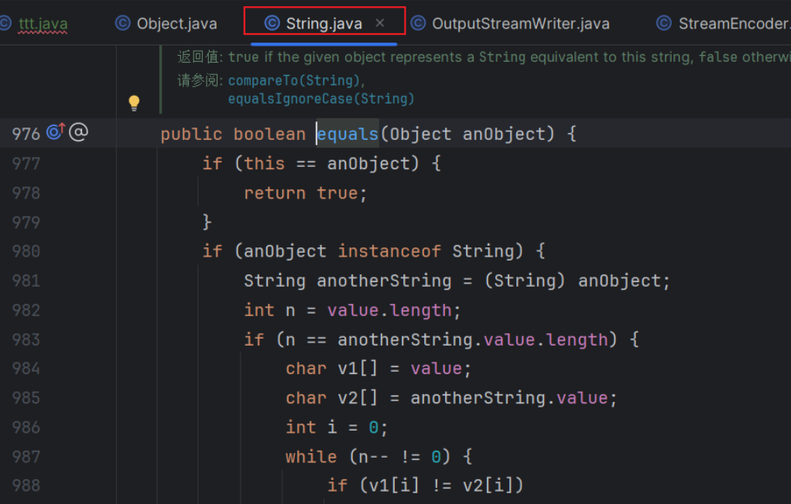

### Day 20

> 今日任务

Sql，项目，Vue, 优化简历，八股，面试。

### sql

9：30-10：00

分组[1581. 进店却未进行过交易的顾客 - 力扣（LeetCode）](https://leetcode.cn/problems/customer-who-visited-but-did-not-make-any-transactions/?envType=study-plan-v2&envId=sql-free-50)

group by  字段 分组， count(*) 计算分组后根据分组字段的个数。


### 八股

11：00-12:00

### 项目

12:30-13:10

#### 对接口整体限流

1. 引入依赖

```xml
<dependency>
    <groupId>com.alibaba.csp</groupId>
    <artifactId>sentinel-core</artifactId>
    <version>1.8.6</version>
</dependency>
```

2. 项目与sentinel通信


启动sentinel ```java -Dserver.port=8131 -jar sentinel-dashboard-1.8.6.jar```

+ 客户端需要引入 Transport 模块来与 Sentinel 控制台进行通信。您可以通过 `pom.xml` 引入 JAR 包:

引入通信包

```xml
<dependency>
    <groupId>com.alibaba.csp</groupId>
    <artifactId>sentinel-transport-simple-http</artifactId>
    <version>1.8.6</version>
</dependency>
```

+ 启动时加入 JVM 参数 `-Dcsp.sentinel.dashboard.server=consoleIp:port` 指定控制台地址和端口。更多的参数参见 [启动参数文档](https://sentinelguard.io/zh-cn/docs/startup-configuration.html)。
+ 
+ 确保应用端有访问量.（发出一次请求，才能感知到监控）


资源：listQuestionBankVOByPage 接口

目的：限制经常访问的接口的请求频率，防止过多请求导致系统过载。

限流规则：

+ 策略：整个接口每秒钟不超过 10 次请求
+ 阻塞操作：提示“系统压力过大，请耐心等待”

熔断规则：

+ 熔断条件：如果接口异常率超过 10%，或者慢调用（响应时长 > 3 秒）的比例大于 20%，触发 60 秒熔断。
+ 熔断操作：直接返回本地数据（缓存或空数据）


实战编写

```java
 
 /**
     * 分页获取题库列表（封装类）
     *
     * @param questionBankQueryRequest
     * @param request
     * @return
     */
    @PostMapping("/list/page/vo")
    @SentinelResource(value = "listQuestionBankVOByPage",blockHandler = "questionBankQpsSentinel",fallback = "questionBankFallback")
    public BaseResponse<Page<QuestionBankVO>> listQuestionBankVOByPage(@RequestBody QuestionBankQueryRequest questionBankQueryRequest,
                                                               HttpServletRequest request) {
        long current = questionBankQueryRequest.getCurrent();
        long size = questionBankQueryRequest.getPageSize();
        // 限制爬虫
        ThrowUtils.throwIf(size > 200, ErrorCode.PARAMS_ERROR);
        // 查询数据库
        Page<QuestionBank> questionBankPage = questionBankService.page(new Page<>(current, size),
                questionBankService.getQueryWrapper(questionBankQueryRequest));
        // 获取封装类
        return ResultUtils.success(questionBankService.getQuestionBankVOPage(questionBankPage, request));
    }

// 限流

    /**
     *  查询题库列表限流 处理
     * @param questionBankQueryRequest
     * @param request
     * @param ex
     * @return
     */
    public static BaseResponse<Page<QuestionBankVO>> questionBankQpsSentinel(@RequestBody QuestionBankQueryRequest questionBankQueryRequest,
                                                                       HttpServletRequest request, BlockException ex){
        return ResultUtils.error(ErrorCode.SYSTEM_ERROR.getCode(), "限流系统压力过大，请耐心等待");


    }

    // 熔断

    public static BaseResponse<Page<QuestionBankVO>> questionBankFallback(@RequestBody QuestionBankQueryRequest questionBankQueryRequest,
                                                                      HttpServletRequest request, Throwable ex){
        return ResultUtils.error(ErrorCode.SYSTEM_ERROR.getCode(), "查询题库列表熔断");

    }
```

#### 对单ip限流

资源：listQuestionVoByPage 接口

限流规则：

+ 策略：每个 IP 地址每分钟允许查看题目列表的次数不能超过 60 次。
+ 阻塞操作：提示“访问过于频繁，请稍后再试”

熔断规则：

+ 熔断条件：如果接口异常率超过 10%，或者慢调用（响应时长 > 3 秒）的比例大于 20%，触发 60 秒熔断。
+ 熔断操作：直接返回本地数据（缓存或空数据）

由于需要针对每个用户进一步精细化限流，而不是整体接口限流，可以采用 [热点参数限流机制](https://sentinelguard.io/zh-cn/docs/parameter-flow-control.html)，允许根据参数控制限流触发条件。

参考demo

/**
   * 分页获取题目列表（封装类） 限流


```java
/**
     * 分页获取题目列表（封装类） 限流
     *
     * @param questionQueryRequest
     * @param request
     * @return
     */
    @PostMapping("/list/page/vo1")
    public BaseResponse<Page<QuestionVO>> listQuestionVOByPageSentinel(@RequestBody QuestionQueryRequest questionQueryRequest,
                                                               HttpServletRequest request) {
        long current = questionQueryRequest.getCurrent();
        long size = questionQueryRequest.getPageSize();
        // 限制爬虫
        ThrowUtils.throwIf(size > 20, ErrorCode.PARAMS_ERROR);

        String remoteAddr = request.getRemoteAddr();
        Entry entry = null;

        try{
            // 注册资源
            entry = SphU.entry("listQuestionVOByPage", EntryType.IN, 1, remoteAddr);

            // 被保护的资源
            Page<Question> questionPage = questionService.page(new Page<>(current, size),
                    questionService.getQueryWrapper(questionQueryRequest));
            // 获取封装类
            return ResultUtils.success(questionService.getQuestionVOPage(questionPage, request));
        }
        catch (Throwable ex){
            //如果是业务报错
            if (!BlockException.isBlockException(ex)) {
                //上报 用于统计异常数
                Tracer.trace(ex);
                return ResultUtils.error(ErrorCode.SYSTEM_ERROR.getCode(), "系统异常");
            }
            //降级操作
            if (ex instanceof DegradeException){
                return ResultUtils.error(ErrorCode.SYSTEM_ERROR,"服务熔断 null");
            }
            // 限流操作
            return ResultUtils.error(ErrorCode.SYSTEM_ERROR, "访问过于频繁，请稍后再试");
        }finally {
            if (entry != null) {
                entry.exit(1, remoteAddr);
            }
        }
    }
```
由于每次重启服务，在控制台都要编写规则，我们可以使用java代码指定规则。

```java
/**
 *  限流 熔断规则
 */
@Component
public class SentinelRulesManager {

    @PostConstruct
    public void initRules() {
        initFlowRules();
        initDegradeRules();
    }

    // 限流规则
    public void initFlowRules() {
        // 单 IP 查看题目列表限流规则
        ParamFlowRule rule = new ParamFlowRule("listQuestionVOByPage")
                .setParamIdx(0) // 对第 0 个参数限流，即 IP 地址
                .setCount(20) // 每分钟最多 60 次
                .setDurationInSec(60); // 规则的统计周期为 60 秒
        ParamFlowRuleManager.loadRules(Collections.singletonList(rule));
    }

    // 降级规则
    public void initDegradeRules() {
        // 单 IP 查看题目列表熔断规则
        DegradeRule slowCallRule = new DegradeRule("listQuestionVOByPage")
                .setGrade(CircuitBreakerStrategy.SLOW_REQUEST_RATIO.getType())
                .setCount(0.2) // 慢调用比例大于 20%
                .setTimeWindow(60) // 熔断持续时间 60 秒
                .setStatIntervalMs(30 * 1000) // 统计时长 30 秒
                .setMinRequestAmount(10) // 最小请求数
                .setSlowRatioThreshold(3); // 响应时间超过 3 秒

        DegradeRule errorRateRule = new DegradeRule("listQuestionVOByPage")
                .setGrade(CircuitBreakerStrategy.ERROR_RATIO.getType())
                .setCount(0.1) // 异常率大于 10%
                .setTimeWindow(60) // 熔断持续时间 60 秒
                .setStatIntervalMs(30 * 1000) // 统计时长 30 秒
                .setMinRequestAmount(10); // 最小请求数

        // 加载规则
        DegradeRuleManager.loadRules(Arrays.asList(slowCallRule, errorRateRule));
    }
}
```

### 面试

1. 项目遇到的bug，怎么解决的

我举的例子，sentinel，限流异常包括降级异常。

2. java 的特点
3. 继承和多态
4. 定义接口默认的修饰词
5. final的修饰词的作用
6. 构造方法的作用
7. 构造方法的特性
   答：与类同名 2. 没有返回类型 3.支持重载
8. ==和equals的区别

* `==` 

  * 比较对象时，比较对象的地址是否相同 
  * 比较基本类型时，比较值是否相同

* `equals` 方法

  * 继承子Object类，也就是只有对象才有该方法

  * 默认是比较对象的地址是否相同

  * 比较对象的内容是否相同，通常如果我们自定义的对象，要想将对象的内容一样看相同，要重写equals方法

  * 有的Java对象也提供了equals的重写，比如String

    * ```java
      	String s1 = new String("hello world");
             String s2 = new String("hello world");
             System.out.println(s1 == s2); //false
             System.out.println(s1.equals(s2));//true
       
             String s3 = "hello";
             String s4 = "hello";
             System.out.println(s3 == s4); //true
             System.out.println(s3.equals(s4)); //true
      ```

    * 为什么 s1 == s2  flase， 因为地址不一样

    * 为什么s1.equals（s2）true, 不是说equals默认比较地址是否相同吗？明明地址不一样为啥还是相同呢？这是因为String已经重写了equals()方法

    * 

    * 为什么 s3 == s4 是true。难道说他俩地址相同？确实是这样。因为字符串常量池的存在，在创建字符串时，先判断缓冲池中是否有一样的字符串，如果有就直接将其地址赋值到要创建的变量上，避免字符串额外的创建。如果使用new 方式来创建的话，即使常量池中存在也会创建一个新的对象。


10. 线程的状态

11. SpringCloud的特点

12. 怎么远程调用

13. Spring AOP的理解

    什么是AOP:AOP是一种面向切面编程的思想，具体来说就是将与具体业务无关但影响多个对象的公用的逻辑的代码抽取并封装一个可重用的代码块。来减少代码的冗余。具体的应用来说就是 权限校验，日志，事务。

    权限校验

    ----

    权限校验怎么使用AOP,我们通过自定义注解，定义用户的身份，通过反射拿到注解的对象，判断其身份。 这是个公用的逻辑，然后我们将判断用户身份封装成一个AOP对象来用，代码如下

    首先定义权限注解

    ```java
    @Target(ElementType.METHOD)
    @Retention(RetentionPolicy.RUNTIME)
    public @interface AuthCheck {
    
        /**
         * 必须有某个角色
         *
         * @return
         */
        String mustRole() default "";
    
    }
    ```

    使用的话，一下例子，管理员可以对用户信息进行修改（封禁）

    ```java
     /**
         * 更新用户
         *
         * @param userUpdateRequest
         * @param request
         * @return
         */
        @PostMapping("/update")
        @AuthCheck(mustRole = UserConstant.ADMIN_ROLE)
        public BaseResponse<Boolean> updateUser(@RequestBody UserUpdateRequest userUpdateRequest,
                HttpServletRequest request) {
            if (userUpdateRequest == null || userUpdateRequest.getId() == null) {
                throw new BusinessException(ErrorCode.PARAMS_ERROR);
            }
            User user = new User();
            BeanUtils.copyProperties(userUpdateRequest, user);
            boolean result = userService.updateById(user);
            ThrowUtils.throwIf(!result, ErrorCode.OPERATION_ERROR);
            return ResultUtils.success(true);
        }
    
    ```

    通过AOP 来对使用@AuthCheck注解的方法进行代理，所代理的增强方法就是用户权限的校验。

    ```java
    @Aspect
    @Component
    public class AuthInterceptor {
    
        @Resource
        private UserService userService;
    
        /**
         * 执行拦截
         *
         * @param joinPoint
         * @param authCheck
         * @return
         */
        @Around("@annotation(authCheck)")
        public Object doInterceptor(ProceedingJoinPoint joinPoint, AuthCheck authCheck) throws Throwable {
            String mustRole = authCheck.mustRole();
            RequestAttributes requestAttributes = RequestContextHolder.currentRequestAttributes();
            HttpServletRequest request = ((ServletRequestAttributes) requestAttributes).getRequest();
            // 当前登录用户
            User loginUser = userService.getLoginUser(request);
            UserRoleEnum mustRoleEnum = UserRoleEnum.getEnumByValue(mustRole);
            // 不需要权限，放行
            if (mustRoleEnum == null) {
                return joinPoint.proceed();
            }
            // 必须有该权限才通过
            UserRoleEnum userRoleEnum = UserRoleEnum.getEnumByValue(loginUser.getUserRole());
            if (userRoleEnum == null) {
                throw new BusinessException(ErrorCode.NO_AUTH_ERROR);
            }
            // 如果被封号，直接拒绝
            if (UserRoleEnum.BAN.equals(userRoleEnum)) {
                throw new BusinessException(ErrorCode.NO_AUTH_ERROR);
            }
            // 必须有管理员权限
            if (UserRoleEnum.ADMIN.equals(mustRoleEnum)) {
                // 用户没有管理员权限，拒绝
                if (!UserRoleEnum.ADMIN.equals(userRoleEnum)) {
                    throw new BusinessException(ErrorCode.NO_AUTH_ERROR);
                }
            }
            // 通过权限校验，放行
            return joinPoint.proceed();
        }
    }
    ```

    tips:` @Around("@annotation(authCheck)")  和 @Around("@annotation(AuthCheck)")`的区别

    @Around("@annotation(authCheck)"),Spring AOP 自动将方法上的 `@AuthCheck` 注解注入到 `doInterceptor authCheck` 参数中。

    ```java
    @Around("@annotation(authCheck)")
        public Object doInterceptor(ProceedingJoinPoint joinPoint, AuthCheck authCheck) throws Throwable {
                String mustRole = authCheck.mustRole();
        }
    ```

    @Around("@annotation(AuthCheck)")`就需要我们使用joinPoint 自己去获得注解的内容

    ```java
    @Around("@annotation(AuthCheck)")
        public Object doInterceptor(ProceedingJoinPoint joinPoint, AuthCheck authCheck) throws Throwable {
            
                String mustRole = authCheck.mustRole();
            	// 获取方法签名
    			MethodSignature signature = (MethodSignature) joinPoint.getSignature();
    			// 获取方法对象
    			Method method = signature.getMethod();
    			// 获取方法上的 AuthCheck 注解
    			AuthCheck authCheck = method.getAnnotation(AuthCheck.class);
        }
    ```

    以上就是权限校验使用AOP的全过程.

    ---

    

14. Tcp/IP协议

15. 项目能支持多少QPS

16. ES,hot-key的实现

17. 分布式锁怎么用的

18. 排序算法，快排，归并排序

19. 反问  该职位是做什么，具体的业务是什么，技术栈是什么。


### 总结

投递 100+ 自动投递质量不高，还要选好合适的参数。

sentinel的使用实战，Sql 分组操作 去重操作，以及执行顺序（from join where groupby having select  distinct  orderby  limit）

线下面试经验：简历上的一定要都会。