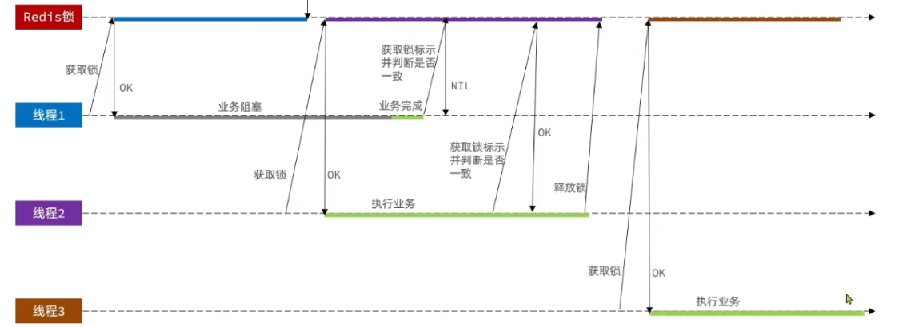

## Day 21

### sql

10：00-10：10 

表的自连接，应用场景就是，我们想要使用表内的数据和表内的数据进行比较，而不是我们传一个参数和表比较，就可以将这个表，看作两个表，根据条件进行连接（比如说第几天和第几天相关联），在去根据条件比较

[197. 上升的温度 - 力扣（LeetCode）](https://leetcode.cn/problems/rising-temperature/submissions/602885864/?envType=study-plan-v2&envId=sql-free-50)

```sql
select A.id
    from Weather A
    join Weather B 
    on  A.recordDate = Date_add(B.recordDate,interval 1 Day)
    where A.temperature > B.temperature;
```

10:10-10:40

保留小数，round(xxx,3)

[1661. 每台机器的进程平均运行时间 - 力扣（LeetCode）](https://leetcode.cn/problems/average-time-of-process-per-machine/?envType=study-plan-v2&envId=sql-free-50)

```sql
select A.machine_id as machine_id, round(avg(B.timestamp - A.timestamp), 3) processing_time
    from Activity A
    join Activity B
    on A.machine_id = B.machine_id and A.process_id=B.process_id and A.activity_type!=B.activity_type and A.timestamp < B.timestamp
    group by machine_id

```

对于复杂sql，慢慢拆分。

10：40 - 11：20

[1280. 学生们参加各科测试的次数 - 力扣（LeetCode）](https://leetcode.cn/problems/students-and-examinations/description/?envType=study-plan-v2&envId=sql-free-50)

### 项目

#### 一人一单功能的实现

11：23 -  11：44

```java
   /**
     * 秒杀优惠卷下单
     *
     * @param voucherId
     * @return
     */
    @Override
    //两表开启事务
    @Transactional
    public Result seckillVoucher(Long voucherId) {
        SeckillVoucher seckillVoucher = seckillVoucherService.getById(voucherId);
        LocalDateTime beginTime = seckillVoucher.getBeginTime();
        LocalDateTime endTime = seckillVoucher.getEndTime();
        LocalDateTime now = LocalDateTime.now();
        //下单时间，不在优惠卷使用时间
        if (beginTime.isAfter(now)) {
            return Result.fail("秒杀还未开始");
        }
        if (endTime.isBefore(now)) {
            return Result.fail("秒杀已经结束");
        }
        //判断库存是否充足---》
        int stock = seckillVoucher.getStock();

        if (stock <= 0) {
            return Result.fail("库存不足");
        }
        /**下单库存减一 解决超卖问题使用乐观锁,
         * 但是以上这种方式通过测试发现会有很多失败的情况，
         * 失败的原因在于：在使用乐观锁过程中假设100个线程同时都拿到了100的库存，
         * 然后大家一起去进行扣减，但是100个人中只有1个人能扣减成功，
         * 其他的人在处理时，他们在扣减时，库存已经被修改过了，
         * 所以此时其他线程都会失败.
         */
//        boolean success = seckillVoucherService.update().
//                setSql("stock = stock - 1")
//                .eq("voucher_id", voucherId)
//                .eq("stock",stock)
//                .update();


        //todo : 一人一单的判断

        int count = seckillVoucherService.query()
                .eq("user_id", UserHolder.getUser().getId())
                .eq("voucher_id", voucherId)
                .count();

        if (count > 0 ){
            return Result.fail("用户已经达到购买上限");
        }


        //更新数据库 下单

        /**
         * 乐观锁的改造
         */
        boolean success = seckillVoucherService.update().
                setSql("stock = stock - 1")
                .eq("voucher_id", voucherId)
                .gt("stock", 0)
                .update();
        if (!success) {
            return Result.fail("库存不足");
        }
        //创建订单
        VoucherOrder voucherOrder = new VoucherOrder();
        long nextId = redisIdWorker.nextId("order");

        voucherOrder.setId(nextId);
        voucherOrder.setUserId(UserHolder.getUser().getId());
        voucherOrder.setVoucherId(voucherId);

        voucherOrderService.save(voucherOrder);

        return Result.ok(nextId);
    }
}

```

结果测试，发现还是下了多单

分析： 有多个线程同时进入一人一单的判断，加入10个线程同时进入了一人一单的判断，这10个线程都是正数据库查的数据都是没有下过单，然后这10个线程就下单了，怎么解决呢？乐观锁？不可以，乐观锁的核心判断之前的数据是否有修改。这个只是查询、怎么办呢？使用锁


```java
/**
     * 秒杀优惠卷下单
     *
     * @param voucherId
     * @return
     */
    @Override
    //两表开启事务
    public Result seckillVoucher(Long voucherId) {
        SeckillVoucher seckillVoucher = seckillVoucherService.getById(voucherId);
        LocalDateTime beginTime = seckillVoucher.getBeginTime();
        LocalDateTime endTime = seckillVoucher.getEndTime();
        LocalDateTime now = LocalDateTime.now();
        //下单时间，不在优惠卷使用时间
        if (beginTime.isAfter(now)) {
            return Result.fail("秒杀还未开始");
        }
        if (endTime.isBefore(now)) {
            return Result.fail("秒杀已经结束");
        }
        //判断库存是否充足---》
        int stock = seckillVoucher.getStock();

        if (stock <= 0) {
            return Result.fail("库存不足");
        }
        /**下单库存减一 解决超卖问题使用乐观锁,
         * 但是以上这种方式通过测试发现会有很多失败的情况，
         * 失败的原因在于：在使用乐观锁过程中假设100个线程同时都拿到了100的库存，
         * 然后大家一起去进行扣减，但是100个人中只有1个人能扣减成功，
         * 其他的人在处理时，他们在扣减时，库存已经被修改过了，
         * 所以此时其他线程都会失败.
         */
//        boolean success = seckillVoucherService.update().
//                setSql("stock = stock - 1")
//                .eq("voucher_id", voucherId)
//                .eq("stock",stock)
//                .update();

        synchronized (UserHolder.getUser().getId().toString().intern()){
            //解决事务不生效问题原因就是下面的方法是this.而不是sprig代理的方法
            IVoucherOrderService proxy = (IVoucherOrderService) AopContext.currentProxy();
            return proxy.createVoucherOrder(voucherId);
        }

    }


    @Transactional
    public  Result createVoucherOrder(Long voucherId) {
//        synchronized (UserHolder.getUser().getId().toString().intern()) { 此处加锁，是先释放锁在提交事务，假如还未提交又有新的进程进来就有问题

            //todo : 一人一单的判断
            int count = seckillVoucherService.query()
                    .eq("user_id", UserHolder.getUser().getId())
                    .eq("voucher_id", voucherId)
                    .count();

            if (count > 0) {
                return Result.fail("用户已经达到购买上限");
            }


            //更新数据库 下单

            /**
             * 乐观锁的改造
             */
            boolean success = seckillVoucherService.update().
                    setSql("stock = stock - 1")
                    .eq("voucher_id", voucherId)
                    .gt("stock", 0)
                    .update();
            if (!success) {
                return Result.fail("库存不足");
            }
            //创建订单
            VoucherOrder voucherOrder = new VoucherOrder();
            long nextId = redisIdWorker.nextId("order");

            voucherOrder.setId(nextId);
            voucherOrder.setUserId(UserHolder.getUser().getId());
            voucherOrder.setVoucherId(voucherId);

            voucherOrderService.save(voucherOrder);

            return Result.ok(nextId);
        }
//    }
}
```

使用AOP

```xml
   <dependency>
            <groupId>org.aspectj</groupId>
            <artifactId>aspectjweaver</artifactId>
        </dependency>
```

启动类

```java
@EnableAspectJAutoProxy(exposeProxy = true)
```

需要注意的点

1. 事务注解不生效问题，@Transactional,是spring提功能的注解，但是我们在同个类方法调用的时候是this调用而不是代理spring代理调用，所以在使用该方法时要使用代理

   ```java
   //解决事务不生效问题原因就是下面的方法是this.而不是sprig代理的方法
               IVoucherOrderService proxy = (IVoucherOrderService) AopContext.currentProxy();
               return proxy.createVoucherOrder(voucherId);
   ```

2. synchronized 的范围，越小越好.

   为什么不能所在方法里而是方法外，因为如果所在方法里，方法执行万，就解锁，然年提交事务，但是在提交事务的过程中，锁已经释放，其他线程查询数据库，就会得到老的数据。

   所以逻辑应该时方法完成后，事务提交，释放锁

3. 锁对象的选择

   一人一单，应该以用户id的值为锁对象，是比较合理的。

   需要注意的是

   ` synchronized (UserHolder.getUser().getId().toString().intern())`

   `   Long id = UserHolder.getUser().getId();`Long是包装类，即使用户id相同但是Long不同

   所以用intern()

   `intern()`是`String`类的一个方法，它的作用是检查字符串常量池中是否存在等于此`String`对象的字符串；如果存在，则返回代表池中这个字符串的`String`对象的引用；如果不存在，则将此`String`对象包含的字符串添加到池中，并返回此`String`对象的引用。简而言之，`intern()`方法用于确保所有相等的字符串字面量都引用同一个`String`对象。


#### 分布式锁的使用

11：50- 12:35

使用 Redis 实现分布式锁

* 获取锁

  ```shell
  set lock thread1 nx ex 30
  ```

* 释放锁

  ```shell
  del lock
  ```

需要注意的的是：

1. 获取锁能不能不加过期时间或者单独设置过期时间

   ​	不能，首先需要设置过期时间，防止业务服务执行过程中宕机，导致无法释放锁。

   ​	其次也不能 setnx lock  set lock ttl  因为我们需要确保他们是原子性的操作，如果不是原子性操作，在获取锁后，还未设置过期时间，业务服务就宕机。也会导致无法释放锁。


在utils 新增接口

```java
public interface ILock {


    /**
     * 尝试获取锁
     * @param timeoutSec
     * @return
     */
    boolean tryLock(long timeoutSec);

    /**
     * 释放锁
     */
    void unlock();
}
```

在utils下实现

```java
public class SimplerRedisLock implements  ILock{

    private StringRedisTemplate stringRedisTemplate;

    //业务名称
    private String name;
    //redis 中key 的前缀
    private  static  final String KEY_PREFIX ="lock:";

    public SimplerRedisLock(StringRedisTemplate stringRedisTemplate, String name) {
        this.stringRedisTemplate = stringRedisTemplate;
        this.name = name;
    }

    /**
     * 获取锁
     * @param timeoutSec
     * @return
     */
    @Override
    public boolean tryLock(long timeoutSec) {

        long ThreadId = Thread.currentThread().getId();
        Boolean aBoolean = stringRedisTemplate.opsForValue().setIfAbsent(KEY_PREFIX + name, ThreadId+"", timeoutSec, TimeUnit.SECONDS);

        return Boolean.TRUE.equals(aBoolean);
    }

    /**
     * 释放锁
     */
    @Override
    public void unlock() {
        stringRedisTemplate.delete(KEY_PREFIX+name);

    }
}

```

需要注意的是：

` Boolean aBoolean = stringRedisTemplate.opsForValue().setIfAbsent(KEY_PREFIX + name, ThreadId+"", timeoutSec, TimeUnit.SECONDS);`

做了包装可能会null，所以返回结果拆箱；

修改秒杀下单逻辑：

核心就是修改锁

```java
    /**
     * 秒杀优惠卷下单
     *
     * @param voucherId
     * @return
     */
    @Override
    //两表开启事务
    public Result seckillVoucher(Long voucherId) {
        SeckillVoucher seckillVoucher = seckillVoucherService.getById(voucherId);
        LocalDateTime beginTime = seckillVoucher.getBeginTime();
        LocalDateTime endTime = seckillVoucher.getEndTime();
        LocalDateTime now = LocalDateTime.now();
        //下单时间，不在优惠卷使用时间
        if (beginTime.isAfter(now)) {
            return Result.fail("秒杀还未开始");
        }
        if (endTime.isBefore(now)) {
            return Result.fail("秒杀已经结束");
        }
        //判断库存是否充足---》
        int stock = seckillVoucher.getStock();

        if (stock <= 0) {
            return Result.fail("库存不足");
        }
        /**下单库存减一 解决超卖问题使用乐观锁,
         * 但是以上这种方式通过测试发现会有很多失败的情况，
         * 失败的原因在于：在使用乐观锁过程中假设100个线程同时都拿到了100的库存，
         * 然后大家一起去进行扣减，但是100个人中只有1个人能扣减成功，
         * 其他的人在处理时，他们在扣减时，库存已经被修改过了，
         * 所以此时其他线程都会失败.
         */
//        boolean success = seckillVoucherService.update().
//                setSql("stock = stock - 1")
//                .eq("voucher_id", voucherId)
//                .eq("stock",stock)
//                .update();


        /**
         * sync锁
         *
         */

//        synchronized (UserHolder.getUser().getId().toString().intern()){
//            //解决事务不生效问题原因就是下面的方法是this.而不是sprig代理的方法
//            IVoucherOrderService proxy = (IVoucherOrderService) AopContext.currentProxy();
//            return proxy.createVoucherOrder(voucherId);
//        }


        //分布式锁 redis  锁定范围下单的用户id

        //创建工具
        SimplerRedisLock lock = new SimplerRedisLock(new StringRedisTemplate(), "order:"+UserHolder.getUser().getId());

        //尝试获取锁
        boolean isLock = lock.tryLock(5);

        if (!isLock) {
            //获取锁失败。返回错误信息
            return Result.fail("只能下一单");

        }
        //获取锁成功

        try {
            IVoucherOrderService proxy = (IVoucherOrderService) AopContext.currentProxy();
            return proxy.createVoucherOrder(voucherId);
        } finally {
            //释放锁
            lock.unlock();
        }

    }
```

可能有分布式锁误删的问题，这种情况出现的原因和导致的影响如下



> 怎么处理在每个线程释放锁的时候，判断一下当前这把锁是否属于自己?

我们在存锁的时候存value 是线程id，那么解锁的时候，只需要判断当前线程和redis中取出的value是否一直不就可以了。

其实在单体项目是可以的，但是在集群模式下不可以，原因是线程的id是由jvm来自增管理的，每个集群都有自己的jvm。所以可能会出现，在不同服务下线程id可能相等的情况。这样也会导致删除。

所以我们不能使用线程id来标识，我们使用UUID来生成 + id拼接\

改造方法

```java
private  static  final String ID_PREFIX = UUID.fastUUID().toString(true);
  
/**
     * 获取锁
     * @param timeoutSec
     * @return
     */
    @Override
    public boolean tryLock(long timeoutSec) {

        //获取线程标识
        String ThreadValue = ID_PREFIX +Thread.currentThread().getId();
        Boolean aBoolean = stringRedisTemplate.opsForValue().setIfAbsent(KEY_PREFIX + name, ThreadValue, timeoutSec, TimeUnit.SECONDS);

        return Boolean.TRUE.equals(aBoolean);
    }

    /**
     * 释放锁
     */
    @Override
    public void unlock() {

        //判断一下是不是当钱线程的锁防止别的线程删除
        //获取线程标识
        String ThreadValue = ID_PREFIX +Thread.currentThread().getId();
        //获取锁标识
        String stringId = stringRedisTemplate.opsForValue().get(KEY_PREFIX + name);
        if (ThreadValue.equals(stringId)) {
            stringRedisTemplate.delete(KEY_PREFIX + name);
        }
    }
}

```


休息 12：36


### 面试

只有hr面，没有技术面，java实习，我录音都没打开。

13：30 - 15：30 - 18：00-20：00-22：00。

只有HR面，做个自我介绍，简单了解一下情况，问了我我所介绍的知识都掌握了吗，我说可以问问。她说她不懂技术，然后就有意让我入职，公司是做医疗器械，以及his系统的。有人带，大概10+个开发人员，目前还在招人。大概5月份公司有大合同，开发会多。

疑惑，公司地方挺大，但是都是空的位置，大概在公司一个小时，一共看到3个人，一个hr,一个前台，一个路人。

实习 1天100。我感觉这个工作，最近不忙，主要还是以学习为主，开发任务不多。

想问问这个工作靠不靠谱，签实习合同要注意什么，因为想边干边继续投递简历，随时做好跑路的准备（能不能随时跑路，有什么影响）。


### 八股

#### 计算机网络

##### 1. Http和Https的区别

Http:是互联网上应用最广泛的一种网络通信协议（约定）。基于TCP，可以使浏览器工作更高效，减少网络请求。

Https: 是Http的加强版，可以认为是HTTP +SSL（Secure Socket Layer）,在Http的基础上增加了一些列的安全机制，一方面保证数据在网络传输过程中是安全的，另一方面对访问者增加了验证机制。是目前架构下最为安全的解决方案。

主要区别：

1. HTTP的连接时无状态的，HTTPS的数据传输时证书加密的，安全性更高。
2. HTTP是免费的，而Https需要申请证书，而证书是收费的。
3. 传输协议不同，所以使用的端口不懂，HTTP默认80，HTTPS默认443。

HTTPS 的缺点：

1. HTTPS的握手协议比较费时，会影响服务的相应速度以及吞吐量。
2. HTTPS也并不是完全安全的。他的证书体系其实并不是完全安全的。并且HTTPS在面对DDOS几乎不起作用。
3. 证书费钱，功能越强大证书费用更高。

##### 2. Session和Cookie 有什么区别？

当tomcat，第一次接收到客户端的请求，会开辟一个session空间，建立一个session对象，表明这一次会话，同时生成session id,通过响应头的方式保存在客户端浏览器的Cookie中，以后客户端的每次请求都会在请求头带上sessionid,可以根据session id 对应服务端保存的session对象里一些相关信息，比如说用户的登录信息。


当应用，从单体到集群，分布式架构下，Cookie + session 的这种机制怎么扩展？

1. session黏贴：在集群模式下，通过一个机制（nginx IP轮询）保证同一客户端的所有请求都会转发到tomcat实例中。问题：该实列挂了。
2. session 复制：当一个tomcat上存了session信息，主动复制到集群中的其他实例。问题：复制需要时间，浪费空间
3. session 共享：将服务端的session信息保存在第三方中，比如redis   


### 总结

SQl自连接，round(x,3)保留小数，以及发杂sql一步一步的连接拆分。

一人一单怎么实现的，在下单的时候判断是否下过单（假如有10个线程并发去判断是否下过单，还是会一个下多单），就加锁，锁的粒度，不应该对这个方法所有的请求都加锁，而是仅仅对相同的用户执行去加锁，怎么实现？可以将锁对象视为userID，不过需要注意的是，sync锁是对象锁，也就是userid会被包装成Long对象，每次请求即使userid相同，但是Long 对象是不懂的，所以可以使用Long.toString().intern(),来保证userid项目就能锁到。

分布式锁的使用场景:sync锁是jvm锁，由jvm锁监视器来判断是否可以获得锁，但是多态实例下，jvm不同，锁监视器不同，所以不能保证互斥。这就是分布式锁的使用场景，可以用Redis实现，用setnxex ,并确保这二者原子操作`set lock nx ex 1000`，删除锁通过del 操作。需要注意的是，分布式锁的误删问题。可以在添加锁的时候，将线程（uuid + 线程id）（因为不同集群线程id可能是相同的）加进去，在删除锁的时候在判断是不是该线程获取的锁。

