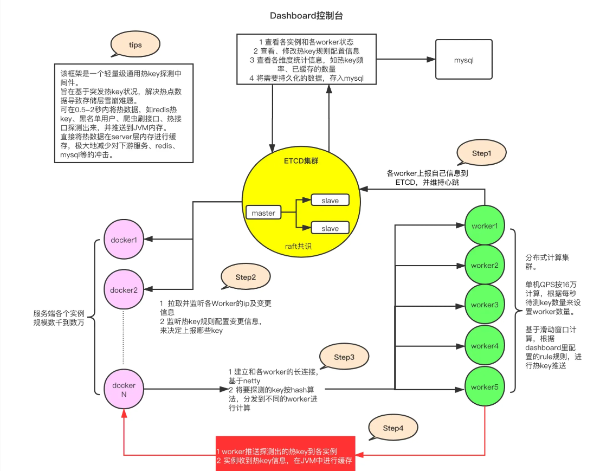

## Day 7

> 明日计划

HotKey（2h） JUC 八股（3h） 模板编写（2h） 其他八股（1h）。 

### 自动缓存热点

#### 缓存的使用

缓存的使用。在访问情况高的情况下，会使用缓存来解决mysql性能的局限性。

使用缓存的架构： 是在用户请求数据库中间加了一层缓存（Redis）。

具体流程请求流程是这样的，用户发出请求，首先在缓存中查询是否有数据，如果缓存中有数据，直接返回请求的数据。如果缓存中没有数据，才会请求到数据库，并将查到的数据加入到缓存中。这样的优点大大减少了对数据库的访问。缓存（Redis）是基于内存的数据库所以有更好的性能。

那么问题来了？

为什么不直接使用redis来代替mysql的使用？
 1. **数据持久性**

+ **Redis** 主要是内存数据库，虽然提供了 RDB（快照）和 AOF（追加日志）两种持久化方式，但仍然不如 MySQL 这样的关系型数据库在数据持久性方面可靠。
+ **MySQL** 是磁盘存储的关系数据库，天生适合需要强一致性和高可靠性的业务场景。

 2. **存储成本**

+ Redis 将数据存储在内存中，而内存的成本远高于磁盘。对大规模数据存储来说，直接用 Redis 可能会导致极高的服务器成本。
+ MySQL 主要存储在磁盘上，适用于大规模数据存储，成本更低。

4. **事务支持**

+ Redis 提供的事务功能（MULTI/EXEC）较为简单，缺少回滚能力，不支持完整的 ACID 事务。
+ MySQL 提供完善的事务管理（如 InnoDB 引擎支持 ACID），适用于金融、电商等需要严格数据一致性的场景。

所以常用的就是 Mysql + Redis 配合来使用。

Mysql作为主要的数据库所有的数据都存在mysql中，保证数据的可靠性。**Redis 作为缓存**，存储**热点数据**，减少 MySQL 访问，提高系统性能

**使用缓存的问题：缓存穿透，缓存击穿，缓存雪崩，数据一致性，集群方案的可用性，数据的持久化，缓存的删除策略。（之后总结一下）**

上面我们提到 Redis作为缓存，存储**热点数据**。

那么怎么判定是热点数据呢？

1. 监控数据库：查看经常访问的数据，将经常访问但是一致性要求不高的数据加入缓存。
2. 人为预测 ： 广告投流。
3. 网站的核心业务
4. 对于无法预测的爆火的业务，如何解决呢？比如说双十一购物，一个不是预测的热点商品火爆了，怎么办？本次重点所在：使用**HotKey**自定义热点规则，满足了热点规则就自动加入到缓存中。

> 使用缓存的建议

✅ **优先缓存** 访问频繁、不经常变化、计算复杂的数据，如：商品详情、排行榜、热门文章。
✅ **避免缓存** 频繁变更、超大集合、强一致性要求的数据，如：账户余额、订单状态、完整日志。
✅ **合理使用** LRU 机制、TTL 过期时间、定期刷新策略，确保缓存高效运行！

#### HotKey

自动缓存热门题库需要以下五个步骤：

1、记录访问：用户每访问一次题库，统计次数 +1

2、访问统计：统计一段时间内题库的访问次数。**这是最难实现的一部分。**

3、阈值判断：访问频率超过一定的阈值，变为热点数据。

4、缓存数据：缓存热点数据

5、获取数据：后续访问时，从缓存中获取数据

当然，还有很多注意事项，比如热点数据如何更新？如何恢复为正常数据等等。

直接使用 HOT-Key。

[hotkey: 京东App后台中间件，毫秒级探测热点数据，毫秒级推送至服务器集群内存，大幅降低热key对数据层查询压力](https://gitee.com/jd-platform-opensource/hotkey)

hot-key 核心问题也就是上述那样。

它的主要核心组件如下：

**Etcd 集群**：作为高性能的配置中心，Etcd 用于存储规则配置、各 Worker 的 IP 地址，以及探测出的热 Key 和手动添加的热 Key 等信息。

**Client 端（客户端）**：这是服务中引入的 Jar 包，负责：

+ 采集 Key 的访问情况，并上报给 Worker 端。
+ 接收 Worker 端推送的热 Key，并将其存入本地缓存（如 JVM 内存）。
+ 提供 API，供业务代码查询某个 Key 是否为热 Key。

**Worker 端集群**：独立部署的 Java 程序，主要职责包括：

+ 从 Etcd 获取规则配置，并定期上报自身 IP 信息。
+ 接收并处理各 Client 发送的待检测 Key，进行累加计算。
+ 当某个 Key 达到预设的阈值时，将其标记为热 Key，并推送至所有相关的 Client。

**Dashboard 控制台**：提供可视化界面，功能包括：

+ 设置各个应用的 Key 规则，例如定义在特定时间窗口内某个 Key 的访问次数阈值。
+ 监控和管理探测到的热 Key，支持手动添加或删除热 Key。
+ 展示 Worker 和 Client 的状态信息，便于运维和监控。

核心原理

**数据采集（Client 端）**

+ Client 端采集 Key 访问情况，并以 **采样方式** 异步上报给 Worker 端。

**统计计算（Worker 端）**

+ Worker 端对上报的 Key 进行 **滑动窗口统计**，计算 Key 在特定时间窗口内的访问频率。
+ 访问频率超过阈值的 Key 被标记为 **热点 Key**。

**推送热点 Key（Worker → Client）**

+ **Worker 端不会将热点 Key 存入 Etcd**，而是**直接将识别出的热点 Key 推送给 Client 端**。
+ Client 端收到后，存入 **本地缓存（JVM L1 缓存）**，避免 Redis 或数据库访问。

**本地缓存优化 & 限流降级（Client 端）**

+ **本地缓存（L1）**：热点 Key 数据直接从 JVM 缓存返回，**避免 Redis 访问**。
+ **Redis 缓存（L2）**：部分热点 Key 仍存入 Redis，减少数据库压力。
+ **限流 & 降级**：对超热点 Key 进行 **流量控制**，防止后端数据库过载。

### 每日精选

无

## 今日总结

今日完成度太低了，有点事情耽误了，但还是自己学习的效率不高，老是看个大概或则学个80%，剩下一点尾巴不做，去休息然后在下一次学习的时候再去做这一点小尾巴，感觉这样效率不高。

上午学习了，但是总体注意力不集中，稍微松懈一点，这个状态就一直延后。要锻炼了，不想学习的时候就锻炼锻炼，尽量养成放松的时候就刷面试题。

> 明天任务 

 Sentinel(3h)  Springboot八股（2h） 每日一题（1h） 模板开发（2h）

逆水行舟，不进则退！

早点睡觉！

