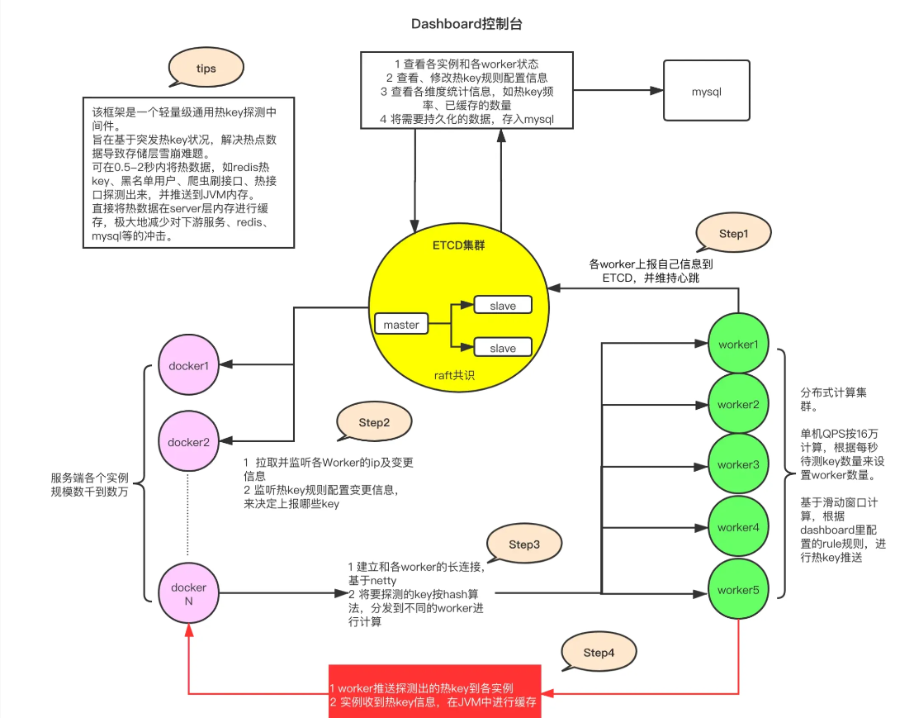

找工作的计划


# 10天准备好面试
## 第一天记录
复习了集合，具体来说就是Collection中List和Set子类的使用特点以及原理。ArrayList，LinkedList,HashSet,LinkedHashSet,TreeSet.
看了八股 java基础 Java 集合。

反思： 对于八股，没有自己记录下来。仅仅是看以及脑海预设回答。最好还是用文档记录下来。


## 第9天记录

没有学习，今天才开始学习。学习了java集合Collections工具类，Map集合，Stream流，Sql练习8道。投了20+简历。

Collections常用的静态方法，addALL,sort，同步集合。 

反思：之前没有学习，还是不能有一丝懈怠，一次懈怠，就会无数次懈怠，允许自己学一点点甚至只是记录，不允许自己摆烂。

没完全准备好，但是也要投简历了，今天还是少数公司上班，明天应该很多了。虽然还没准备完全，但是一定要投。


## 第10天

项目前端改错浪费了时间。前端还是不能耽误太长时间。投了50份简历。

明天：项目从头梳理一遍，投50份简历，八股（Mysql）。

反思：早上起的太晚。上午基本没学习。


## 第11天

主题逻辑不要搞混，老是想修改前端（前端太薄弱了，一定要补），先搞清楚主次。先准备好后端的面试，之后在补前端。

Mysql八股，智能知识库项目（通用框架复习）。

明天：P0智能知识库项目（个人签到，ES库，批量同步，HotKey）

P0 Spring 笔记 + 面试题。

P1 投50份简历

P1补充Java集合，Mysql面试题。

任务还是挺重的。

>  反思

早上起不来。最近睡的太晚了。晚上熬夜学习，不如白天早起来学习。

对于项目的学习应该抓住重点。任务重就在拆分。

对于八股的学习，虽然看的多也理解，但是写的比较少。应该对于于不理解的就查资料学习写下来。对于已经理解的，语音转文字记录下来。 

下午也要投简历。

## 第3天

编写开发模板，看spring笔记以及面试题。knife4j的使用踩坑。投30份简历。

反思： 没复习项目，一觉睡到中午12点。

明天任务：复习智能知识库项目（ES,批量同步，HotKey） 编写开发模板 springmvc笔记以及八股。补充Spring,Mysql,Java集合八股。

## 第4天

编写开发模板，复习了一遍spring和 springmvc以及其八股，补充了java集合八股。mybatis踩坑。

反思：起的太晚了！没复习项目！ 在学习过程中有些知识不会，搜索后大概懂了但是没有记录下来。明天在学习的时候新建一个文档记录下当天学习过程中所遇到的问题（不要求排版什么的，乱七八糟的先总体记录下来）。

明天： ES 批量同步。 编写开发模板。补充java集合，spring八股。

早点睡觉。


## Day 5 

今日目标 全文分词搜索 模板开发  spring八股

### 全文模糊搜索 

为了实现全文模糊搜索功能，需要使用ElasticSearch 搜索引擎。

> mysql 也支持全文搜索为什么不使用？

>1. **数据库自带全文搜索**

适用于小型或中型项目，直接利用数据库的全文索引功能。

+ **MySQL**: `FULLTEXT` 索引，适用于 `MyISAM` 和 `InnoDB` 引擎。
+ **PostgreSQL**: 提供强大的 `tsvector` 和 `tsquery` 搜索功能。
+ **MongoDB**: `text` 索引支持全文搜索。

> **示例（MySQL）：**
>
> ## **1. 创建数据库和表**
>
> ```sql
> CREATE DATABASE fulltext_search_demo;
> USE fulltext_search_demo;
> 
> CREATE TABLE articles (
>  id INT AUTO_INCREMENT PRIMARY KEY,
>  title VARCHAR(255),
>  content TEXT,
>  FULLTEXT(title, content)  -- 创建全文索引
> );
> ```
>
> ------
>
> ## **2. 插入测试数据**
>
> ```sql
> INSERT INTO articles (title, content) VALUES
> ('Elasticsearch 教程', 'Elasticsearch 是一个开源的全文搜索引擎。'),
> ('MySQL 全文搜索', 'MySQL 提供 FULLTEXT 索引用于全文检索。'),
> ('Python 搜索库 Whoosh', 'Whoosh 是一个轻量级的全文搜索库，适用于 Python 应用。'),
> ('全文搜索介绍', '全文搜索是一种高效的信息检索技术。');
> ```
>
> ------
>
> ## **3. 执行全文搜索**
>
> ```sql
> SELECT * FROM articles WHERE MATCH(title, content) AGAINST('全文搜索');
> ```
>
> + `MATCH(title, content) AGAINST('关键词')` 用于在 `title` 和 `content` 字段中执行全文搜索。
>
> + 例如，搜索 **"全文搜索"**，会返回与该关键词匹配的文章。
>
> + MySQL **默认不支持中文分词**
>
> + 如果你使用 **MySQL 5.7+ 或 MySQL 8.0**，可以启用 **Ngram 分词插件**，让 MySQL 支持中文分词。
>
> + ```sql
>   ALTER TABLE articles ADD FULLTEXT(title, content) WITH PARSER ngram;
>   ```
>
> + 然后你可以使用 `MATCH() AGAINST()` 进行搜索：
>
>   ```sql
>   SELECT * FROM articles WHERE MATCH(title, content) AGAINST('全文搜索');
>   ```
>
>   **注意**: Ngram 分词默认会把每 2 个字符作为一个 "词"，对于中文搜索的效果比默认好，但不如专业搜索引擎（如 Elasticsearch）。
>
>   以上仅仅实现全文搜索的功能，并没有实现全文的模糊搜索功能。
>
>   如果只是想实现简单的**模糊匹配**，可以使用 `LIKE`：
>
>   ```sql
>   SELECT * FROM articles WHERE content LIKE '%全文搜索%';
>   
>   LIKE '%关键词%' 无法利用索引，查询速度较慢。
>   当数据量较大时，性能会明显下降。
>   不能提供相关性排序。
>   ```
>
>   可以先用 `FULLTEXT` 进行搜索，找出相关性较高的结果，再用 `LIKE` 进一步筛选。
>
>   ```sql
>   SELECT * FROM articles 
>   WHERE MATCH(title, content) AGAINST('全文搜索') 
>   AND content LIKE '%全文搜索%';
>   
>   # 这样可以提高查询的精确度，但性能仍然不如专业搜索引擎。
>   ```
>
>   设用场景：
>
>   小规模数据（几万到百万条数据）。
>
>   **适合博客、新闻网站等** 需要基本全文搜索的应用。
>
>   性能远远不如专业的搜索引擎。


### ELasticSearch

Elasticsearch 是一个分布式、开源的搜索引擎,广泛用于 **全文检索、日志分析、监控数据分析** 等场景。

[Elasticsearch 指南 [8.17\] | 弹性的](https://www.elastic.co/guide/en/elasticsearch/reference/current/index.html)

Elastic Stack（也称为 ELK Stack）由以下几部分组成：

+ Elasticsearch：核心搜索引擎，负责存储、索引和搜索数据。
+ Kibana：可视化平台，用于查询、分析和展示 Elasticsearch 中的数据。
+ Logstash：数据处理管道，负责数据收集、过滤、增强和传输到 Elasticsearch。
+ Beats：轻量级的数据传输工具，收集和发送数据到 Logstash 或 Elasticsearch。

### ES数据的存放形式

[What is Elasticsearch? | Elasticsearch Guide [7.17\] | Elastic](https://www.elastic.co/guide/en/elasticsearch/reference/7.17/elasticsearch-intro.html)

Elasticsearch 不是将信息存储为列式数据行，而是存储已序列化的复杂数据结构作为 JSON 文档。

Elasticsearch 使用一种称为倒排索引的数据结构，它支持非常快速的全文搜索。**倒排索引**列出任何文档中出现的每个唯一单词，并标识所有每个单词出现的文档。

索引可以看作是文档的优化集合，每个document 都是字段的集合，这些字段是包含数据的键值对。默认情况下，Elasticsearch 会为每个字段中的所有数据编制索引，并且每个索引的字段都有一个专用的、优化的数据结构。例如，文本字段是存储在倒排索引中，而数字和地理字段存储在 BKD 树中。使用每个字段的数据结构来组合和返回搜索结果的能力是 Elasticsearch 如此快速的原因。

与mysql进行类比

**索引（Index）**：类似于关系型数据库中的表

**文档（Document）**：索引中的每条记录，类似于数据库中的行。文档以 JSON 格式存储。

**字段（Field）**：文档中的每个键值对，类似于数据库中的列。

**映射（Mapping）**：用于定义 Elasticsearch 索引中文档字段的数据类型及其处理方式，类似于关系型数据库中的 Schema 表结构，帮助控制字段的存储、索引和查询行为。

集群（Cluster）：多个节点组成的群集，用于存储数据并提供搜索功能。集群中的每个节点都可以处理数据。

分片（Shard）：为了实现横向扩展，ES 将索引拆分成多个分片，每个分片可以分布在不同节点上。

副本（Replica）：分片的复制品，用于提高可用性和容错性。

### 快速使用

[快速入门 |Elasticsearch 指南 [7.17\] | 弹性的](https://www.elastic.co/guide/en/elasticsearch/reference/7.17/getting-started.html#send-requests-to-elasticsearch)

widow 下安装

1.下载解压即可：https://artifacts.elastic.co/downloads/elasticsearch/elasticsearch-7.17.27-windows-x86_64.zip4

2.启动 bin/elasticsearch.bat    查看是否成功[localhost:9200](http://localhost:9200/)

3.一般不需要配置，配置的话看[配置 Elasticsearch |Elasticsearch 指南 [7.17\] | 弹性的 ](https://www.elastic.co/guide/en/elasticsearch/reference/7.17/settings.html)


> 查询语法DSL

```json
{
  "query": {
    "match": {
      "message": "Elasticsearch 是强大的"
    }
  }
}
```

match方法是全文分词查询。这会对 `message` 字段进行分词，并查找包含 "Elasticsearch" 和 "强大" 词条的文档。


| **查询条件**   | **介绍**                                                     | **示例**                                                     | **用途**                                           |
| -------------- | ------------------------------------------------------------ | ------------------------------------------------------------ | -------------------------------------------------- |
| `match`        | 用于全文检索，将查询字符串进行分词并匹配文档中对应的字段。   | `{ "match": { "content": "鱼皮是帅小伙" } }`                 | 适用于全文检索，分词后匹配文档内容。               |
| `term`         | 精确匹配查询，不进行分词。通常用于结构化数据的精确匹配，如数字、日期、关键词等。 | `{ "term": { "status": "active" } }`                         | 适用于字段的精确匹配，如状态、ID、布尔值等。       |
| `terms`        | 匹配多个值中的任意一个，相当于多个 `term` 查询的组合。       | `{ "terms": { "status": ["active", "pending"] } }`           | 适用于多值匹配的场景。                             |
| `range`        | 范围查询，常用于数字、日期字段，支持大于、小于、区间等查询。 | `{ "range": { "age": { "gte": 18, "lte": 30 } } }`           | 适用于数值或日期的范围查询。                       |
| `bool`         | 组合查询，通过 `must`、`should`、`must_not` 等组合多个查询条件。 | `{ "bool": { "must": [ { "term": { "status": "active" } }, { "range": { "age": { "gte": 18 } } } ] } }` | 适用于复杂的多条件查询，可以灵活组合。             |
| `wildcard`     | 通配符查询，支持 `*` 和 `?`，前者匹配任意字符，后者匹配单个字符。 | `{ "wildcard": { "name": "鱼*" } }`                          | 适用于部分匹配的查询，如模糊搜索。                 |
| `prefix`       | 前缀查询，匹配以指定前缀开头的字段内容。                     | `{ "prefix": { "name": "鱼" } }`                             | 适用于查找以指定字符串开头的内容。                 |
| `fuzzy`        | 模糊查询，允许指定程度的拼写错误或字符替换。                 | `{ "fuzzy": { "name": "yupi~2" } }`                          | 适用于处理拼写错误或不完全匹配的查询。             |
| `exists`       | 查询某字段是否存在。                                         | `{ "exists": { "field": "name" } }`                          | 适用于查找字段存在或缺失的文档。                   |
| `match_phrase` | 短语匹配查询，要求查询的词语按顺序完全匹配。                 | `{ "match_phrase": { "content": "鱼皮 帅小伙" } }`           | 适用于严格的短语匹配，词语顺序和距离都严格控制。   |
| `match_all`    | 匹配所有文档。                                               | `{ "match_all": {} }`                                        | 适用于查询所有文档，通常与分页配合使用。           |
| `ids`          | 基于文档 ID 查询，支持查询特定 ID 的文档。                   | `{ "ids": { "values": ["1", "2", "3"] } }`                   | 适用于根据文档 ID 查找特定文档。                   |
| `geo_distance` | 地理位置查询，基于地理坐标和指定距离查询。                   | `{ "geo_distance": { "distance": "12km", "location": { "lat": 40.73, "lon": -74.1 } } }` | 适用于根据距离计算查找地理位置附近的文档。         |
| `aggregations` | 聚合查询，用于统计、计算和分组查询，类似 SQL 中的 `GROUP BY`。 | `{ "aggs": { "age_stats": { "stats": { "field": "age" } } } }` | 适用于统计和分析数据，比如求和、平均值、最大值等。 |

> 中文分词器

```json
POST /_analyze
{
  "analyzer": "standard", 
  "text": "hnsqls非常喜欢编程"
}
```

在 Elasticsearch 中使用 `_analyze` API 时，并不需要在库中已有数据，它只是用于分析指定的文本，查看它在指定分析器下的分词结果。你可以直接调用该 API，不必担心是否有索引或数据。

standard 分词器只会分英文，我们需要下载中午分词器插件

开源地址：https://github.com/medcl/elasticsearch-analysis-ik

进入 ES目录/pluglin 安装

```shell
.\bin\elasticsearch-plugin.bat install https://release.infinilabs.com/analysis-ik/stable/elasticsearch-analysis-ik-7.17.23.zip
```

重启ES

IK 分词器插件提供了两个分词器：`ik_smart` 和 `ik_max_word`。

+ ik_smart 是智能分词，尽量选择最像一个词的拆分方式，比如“好学生”会被识别为一个词， **搜索分词**
+ ik_max_word 尽可能地分词，可以包括组合词，比如“好学生”会被识别为 3 个词：好学生、好学、学生，**底层索引分词**


> 设计索引

text（长文本，需要分词的），keyword（不需要分词），long（长整数）

**字段类型**：定义每个字段的数据类型。常见类型包括：

+ `text`：用于全文搜索的字符串类型，会进行分词。
+ `keyword`：用于精确匹配的字符串类型，不进行分词。
+ `date`：日期类型，支持各种日期格式。
+ `integer`, `long`, `float`, `double`：数值类型。
+ `boolean`：布尔值类型。
+ `object`：对象类型，适合嵌套复杂结构。

**分词器**（Analyzers）：控制字段在索引时如何被分词。如果字段需要全文搜索，通常会使用分词器来把文本切分为单词。

**索引设置**（Index Settings）：定义一些全局的索引设置，如分片数、副本数等。

参考如下

```json
{
  "mappings": {
    "properties": {
      "title": {
        "type": "text",
        "analyzer": "ik_max_word",
        "search_analyzer": "ik_smart",
        "fields": {
          "keyword": {
            "type": "keyword",
            "ignore_above": 256
          }
        }
      },
      "content": {
        "type": "text",
        "analyzer": "ik_max_word",
        "search_analyzer": "ik_smart"
      },
      "tags": {
        "type": "keyword"
      },
      "answer": {
        "type": "text",
        "analyzer": "ik_max_word",
        "search_analyzer": "ik_smart"
      },
      "userId": {
        "type": "long"
      },
      "editTime": {
        "type": "date",
        "format": "yyyy-MM-dd HH:mm:ss"
      },
      "createTime": {
        "type": "date",
        "format": "yyyy-MM-dd HH:mm:ss"
      },
      "updateTime": {
        "type": "date",
        "format": "yyyy-MM-dd HH:mm:ss"
      },
      "isDelete": {
        "type": "keyword"
      }
    }
  }
}

```

创建索引

```json
PUT /question_v1
{
  "mappings": {
    "properties": {
      ...
    }
  }
}
```

不过一般添加别名创建

* 零停机切换索引：在更新索引或重新索引数据时，你可以创建一个新索引并使用 alias 切换到新索引，而不需要修改客户端查询代码，避免停机或中断服务。
* 简化查询：通过 alias，可以使用一个统一的名称进行查询，而不需要记住具体的索引名称（尤其当索引有版本号或时间戳时）。
* 索引分组：alias 可以指向多个索引，方便对多个索引进行联合查询，例如用于跨时间段的日志查询或数据归档。

> 如何实现零停机切换。

例如一个索引 `products`，创建别名 `current_products`，并将其指向 `products_v1`。

当需要对 `products_v1` 进行更新时，你可以创建一个新的索引 `products_v2`，然后将别名 `current_products` 指向 `products_v2`。此时，应用程序只需要访问 `current_products`，而不必修改代码或配置。

```json
PUT /products_v1
{
  "settings": {
    "number_of_shards": 1,
    "number_of_replicas": 1
  },
  "mappings": {
    "properties": {
      "name": { "type": "text" },
      "price": { "type": "float" }
    }
  }
}

# 创建别名
POST /_aliases
{
  "actions": [
    {
      "add": {
        "index": "products_v1",  // 指定索引
        "alias": "current_products"  // 为索引添加别名
      }
    }
  ]
}

```

当你需要切换索引时，可以直接操作别名来实现无缝切换。

假设你创建了一个新的索引 `products_v2`，并希望将别名 `current_products` 从 `products_v1` 切换到 `products_v2`。

```json
POST /_aliases
{
  "actions": [
    {
      "remove": {
        "index": "products_v1",
        "alias": "current_products"
      }
    },
    {
      "add": {
        "index": "products_v2",
        "alias": "current_products"
      }
    }
  ]
}
```


> springboot 集成操作

https://spring.io/projects/spring-data-elasticsearch/

1. 引入依赖

```xml
<!-- elasticsearch-->
<dependency>
    <groupId>org.springframework.boot</groupId>
    <artifactId>spring-boot-starter-data-elasticsearch</artifactId>
</dependency>

```

2. 配置文件

```yaml
spring:
  elasticsearch:
    uris: http://xxx:9200
    username: elastic
    password: elastic

```

3. 使用

可以想mybatis 那样使用

1. 实体和ES库映射

model.dto.question

```java
@Document(indexName = "question")
@Data
public class QuestionEsDTO implements Serializable {

    private static final String DATE_TIME_PATTERN = "yyyy-MM-dd HH:mm:ss";

    /**
     * id
     */
    @Id
    private Long id;

    /**
     * 标题
     */
    private String title;

    /**
     * 内容
     */
    private String content;

    /**
     * 答案
     */
    private String answer;

    /**
     * 标签列表
     */
    private List<String> tags;

    /**
     * 创建用户 id
     */
    private Long userId;

    /**
     * 创建时间
     */
    @Field(type = FieldType.Date, format = {}, pattern = DATE_TIME_PATTERN)
    private Date createTime;

    /**
     * 更新时间
     */
    @Field(type = FieldType.Date, format = {}, pattern = DATE_TIME_PATTERN)
    private Date updateTime;

    /**
     * 是否删除
     */
    private Integer isDelete;

    private static final long serialVersionUID = 1L;

    /**
     * 对象转包装类
     *
     * @param question
     * @return
     */
    public static QuestionEsDTO objToDto(Question question) {
        if (question == null) {
            return null;
        }
        QuestionEsDTO questionEsDTO = new QuestionEsDTO();
        BeanUtils.copyProperties(question, questionEsDTO);
        String tagsStr = question.getTags();
        if (StringUtils.isNotBlank(tagsStr)) {
            questionEsDTO.setTags(JSONUtil.toList(tagsStr, String.class));
        }
        return questionEsDTO;
    }

    /**
     * 包装类转对象
     *
     * @param questionEsDTO
     * @return
     */
    public static Question dtoToObj(QuestionEsDTO questionEsDTO) {
        if (questionEsDTO == null) {
            return null;
        }
        Question question = new Question();
        BeanUtils.copyProperties(questionEsDTO, question);
        List<String> tagList = questionEsDTO.getTags();
        if (CollUtil.isNotEmpty(tagList)) {
            question.setTags(JSONUtil.toJsonStr(tagList));
        }
        return question;
    }
}

```

2. 接口继承 ElasticsearchRepository

```java
public interface QuestionEsDao 
    extends ElasticsearchRepository<QuestionEsDTO, Long> {

}
```

里面有常用的方法。

>  数据写入到ES

CommandLineRunner 实现这个接口的类，在类启动的时候会自动执行一次。所以说执行一次这个方法就行了，不执行在去掉注释，也就是不要让Springg感知到

```java
// todo 取消注释开启任务
@Component
@Slf4j
public class FullSyncQuestionToEs implements CommandLineRunner {

    @Resource
    private QuestionService questionService;

    @Resource
    private QuestionEsDao questionEsDao;

    @Override
    public void run(String... args) {
        // 全量获取题目（数据量不大的情况下使用）
        List<Question> questionList = questionService.list();
        if (CollUtil.isEmpty(questionList)) {
            return;
        }
        // 转为 ES 实体类
        List<QuestionEsDTO> questionEsDTOList = questionList.stream()
                .map(QuestionEsDTO::objToDto)
                .collect(Collectors.toList());
        // 分页批量插入到 ES
        final int pageSize = 500;
        int total = questionEsDTOList.size();
        log.info("FullSyncQuestionToEs start, total {}", total);
        for (int i = 0; i < total; i += pageSize) {
            // 注意同步的数据下标不能超过总数据量
            int end = Math.min(i + pageSize, total);
            log.info("sync from {} to {}", i, end);
            questionEsDao.saveAll(questionEsDTOList.subList(i, end));
        }
        log.info("FullSyncQuestionToEs end, total {}", total);
    }
}

```


> ES 全文分词搜索

接口 QuestionService

```java
/**
 * 从 ES 查询题目
 *
 * @param questionQueryRequest
 * @return
 */
Page<Question> searchFromEs(QuestionQueryRequest questionQueryRequest);

```

实现类

```java
@Override
public Page<Question> searchFromEs(QuestionQueryRequest questionQueryRequest) {
    // 获取参数
    Long id = questionQueryRequest.getId();
    Long notId = questionQueryRequest.getNotId();
    String searchText = questionQueryRequest.getSearchText();
    List<String> tags = questionQueryRequest.getTags();
    Long questionBankId = questionQueryRequest.getQuestionBankId();
    Long userId = questionQueryRequest.getUserId();
    // 注意，ES 的起始页为 0
    int current = questionQueryRequest.getCurrent() - 1;
    int pageSize = questionQueryRequest.getPageSize();
    String sortField = questionQueryRequest.getSortField();
    String sortOrder = questionQueryRequest.getSortOrder();

    // 构造查询条件
    BoolQueryBuilder boolQueryBuilder = QueryBuilders.boolQuery();
    // 过滤
    boolQueryBuilder.filter(QueryBuilders.termQuery("isDelete", 0));
    if (id != null) {
        boolQueryBuilder.filter(QueryBuilders.termQuery("id", id));
    }
    if (notId != null) {
        boolQueryBuilder.mustNot(QueryBuilders.termQuery("id", notId));
    }
    if (userId != null) {
        boolQueryBuilder.filter(QueryBuilders.termQuery("userId", userId));
    }
    if (questionBankId != null) {
        boolQueryBuilder.filter(QueryBuilders.termQuery("questionBankId", questionBankId));
    }
    // 必须包含所有标签
    if (CollUtil.isNotEmpty(tags)) {
        for (String tag : tags) {
            boolQueryBuilder.filter(QueryBuilders.termQuery("tags", tag));
        }
    }
    // 按关键词检索
    if (StringUtils.isNotBlank(searchText)) {
        boolQueryBuilder.should(QueryBuilders.matchQuery("title", searchText));
        boolQueryBuilder.should(QueryBuilders.matchQuery("content", searchText));
        boolQueryBuilder.should(QueryBuilders.matchQuery("answer", searchText));
        boolQueryBuilder.minimumShouldMatch(1);
    }
    // 排序
    SortBuilder<?> sortBuilder = SortBuilders.scoreSort();
    if (StringUtils.isNotBlank(sortField)) {
        sortBuilder = SortBuilders.fieldSort(sortField);
        sortBuilder.order(CommonConstant.SORT_ORDER_ASC.equals(sortOrder) ? SortOrder.ASC : SortOrder.DESC);
    }
    // 分页
    PageRequest pageRequest = PageRequest.of(current, pageSize);
    // 构造查询
    NativeSearchQuery searchQuery = new NativeSearchQueryBuilder()
            .withQuery(boolQueryBuilder)
            .withPageable(pageRequest)
            .withSorts(sortBuilder)
            .build();
    SearchHits<QuestionEsDTO> searchHits = elasticsearchRestTemplate.search(searchQuery, QuestionEsDTO.class);
    // 复用 MySQL 的分页对象，封装返回结果
    Page<Question> page = new Page<>();
    page.setTotal(searchHits.getTotalHits());
    List<Question> resourceList = new ArrayList<>();
    if (searchHits.hasSearchHits()) {
        List<SearchHit<QuestionEsDTO>> searchHitList = searchHits.getSearchHits();
        for (SearchHit<QuestionEsDTO> questionEsDTOSearchHit : searchHitList) {
            resourceList.add(QuestionEsDTO.dtoToObj(questionEsDTOSearchHit.getContent()));
        }
    }
    page.setRecords(resourceList);
    return page;
}

```

> 数据一致性

在上述代码中我们只是一次将数据库加入到ES 库中。后续如果有新增的数据或者修改原有的数据，就出现数据库不一致的问题。

解决方案

​	方案1： 双写，写数据库的同时，写ES 库。代码耦合度太高了，而且影响主任务。

​	方案2： 定时任务，没分钟执行一次，搜索近5分钟修改和创建的题目。加入到ES库。

​	方案3： 使用Canal监听binlog。


使用方案2：

注意，如果使用 MyBatis Plus 提供的 mapper 方法，查询时会默认过滤掉 isDelete = 1（逻辑已删除）的数据，而我们的需求是让 ES 和 MySQL 完全同步，所以需要在 QuestionMapper 中编写一个能查询出 isDelete = 1 数据的方法。

```java
public interface QuestionMapper extends BaseMapper<Question> {

    /**
     * 查询题目列表（包括已被删除的数据）
     */
    @Select("select * from question where updateTime >= #{minUpdateTime}")
    List<Question> listQuestionWithDelete(Date minUpdateTime);
}
```


```java
// todo 取消注释开启任务
//@Component
@Slf4j
public class IncSyncQuestionToEs {

    @Resource
    private QuestionMapper questionMapper;

    @Resource
    private QuestionEsDao questionEsDao;

    /**
     * 每分钟执行一次
     */
    @Scheduled(fixedRate = 60 * 1000)
    public void run() {
        // 查询近 5 分钟内的数据
        long FIVE_MINUTES = 5 * 60 * 1000L;
        Date fiveMinutesAgoDate = new Date(new Date().getTime() - FIVE_MINUTES);
        List<Question> questionList = questionMapper.listQuestionWithDelete(fiveMinutesAgoDate);
        if (CollUtil.isEmpty(questionList)) {
            log.info("no inc question");
            return;
        }
        List<QuestionEsDTO> questionEsDTOList = questionList.stream()
                .map(QuestionEsDTO::objToDto)
                .collect(Collectors.toList());
        final int pageSize = 500;
        int total = questionEsDTOList.size();
        log.info("IncSyncQuestionToEs start, total {}", total);
        for (int i = 0; i < total; i += pageSize) {
            int end = Math.min(i + pageSize, total);
            log.info("sync from {} to {}", i, end);
            questionEsDao.saveAll(questionEsDTOList.subList(i, end));
        }
        log.info("IncSyncQuestionToEs end, total {}", total);
    }
}

```


### 其他

#### 1. 什么是倒排索引

1. **倒排索引（Inverted Index）** 是搜索引擎中用于实现高效全文搜索的核心数据结构。它的主要作用是将文档中的内容（通常是文本）转换为一种易于快速查找的形式，从而支持快速检索包含特定关键词的文档。、

   倒排索引是一种将词条（Term）映射到文档的数据结构。与传统的“正排索引”（文档到词条的映射）不同，倒排索引是从词条到文档的映射。

倒排索引通常由两部分组成：

1. **词条词典（Term Dictionary）**：

+ 存储所有唯一的词条。
  + 通常按字典序排序，方便快速查找。

2. **倒排列表（Posting List）**：

+ 存储每个词条对应的文档列表。

2.**倒排索引的构建过程**

   倒排索引的构建通常包括以下步骤：

      1. **分词（Tokenization）**：
         + 将文档中的文本分割成单独的词条。
         + 例如：`"Elasticsearch is fast"` -> `["Elasticsearch", "is", "fast"]`。
      2. **去除停用词（Stop Words Removal）**：
         + 去除无意义的词条（如“的”、“是”等）。
      3. **词条规范化（Normalization）**：
         + 将词条转换为统一形式（如小写化、词干提取等）。
         + 例如：`"running"` -> `"run"`。
      4. **构建倒排索引**：
         + 将词条映射到文档列表。
         + 例如：`"fast"` -> `[文档1]`。

 2.**倒排索引的查询过程**

当用户输入查询时，搜索引擎会使用倒排索引快速找到包含查询词条的文档。查询过程通常包括以下步骤：

1. **分词**：
   + 将查询字符串分割成词条。
   + 例如：`"fast search"` -> `["fast", "search"]`。
2. **查找倒排列表**：
   + 在倒排索引中查找每个词条对应的文档列表。
   + 例如：`"fast"` -> `[文档1]`，`"search"` -> `[文档2]`。
3. **合并结果**：
   + 根据查询逻辑（如 AND、OR）合并文档列表。
   + 例如：`"fast AND search"` -> 取 `[文档1]` 和 `[文档2]` 的交集。

 4. **倒排索引的优势**

    1. **高效检索**：
       + 通过词条直接定位文档，避免了全表扫描。
    2. **支持复杂查询**：
       + 支持布尔查询（AND、OR、NOT）、短语查询、范围查询等。
    3. **可扩展性**：
       + 适合处理大规模文本数据。
    4. **支持相关性排序**：
       + 可以结合词频（TF）、逆文档频率（IDF）等算法计算文档的相关性评分。


> 反思

ES库设计，同步，全文模糊搜索。

计划的八股没看。每天把计划要看的八股挑选一题对我不完全熟悉的写出来。

看文档的时间比写代码的时间长。还是要多实操，coding。

学习时间太少了。中午直接睡过去。下午学俩小时就不想学了。晚上开始学习的时间又太晚。

希望明天上午学俩小时（学一点也行。起太晚了）。继续记录

> 明日计划

批处理。 开发模板编写。 JUC八股。 java基础八股 java集合，mysql、spring。


## Day 6

> 今日计划

批处理。 开发模板编写。 JUC八股。 java基础八股 java集合，mysql、spring。

### 批量处理

**批处理（Batch Processing）** 是指一次性处理**大量数据**的操作方式，通常用于 **插入、更新、删除、迁移、导出** 等大规模数据操作。 

解决的问题就是**性能问题**(save 和savebatch).

批处理可能出现的问题：

* **长事务的问题**。解决对操作进行合适的分批+多线程。
* OOM问题。 解决就是分批。

> 批处理解决性能问题


 **1. 批处理 vs. 逐条处理**

| 描述                                                      | 处理方式     | 优势                       | 劣势                 |
| --------------------------------------------------------- | ------------ | -------------------------- | -------------------- |
| 每次执行一条 SQL 语句                                     | **逐条处理** | **逻辑简单**，适合小数据量 | **慢**，数据库压力大 |
| 一次性处理多条数据（例如 `INSERT INTO ... VALUES (...)`） | **批处理**   | **效率高，减少数据库交互** | 适用于**大数据量**   |

 **示例**

+ 逐条插入（慢）

  ```java
  for (Order order : orderList) {
      orderService.save(order); // 每次都执行一次 SQL
  }
  ```

+ 批量插入（快）

  ```java
  orderService.saveBatch(orderList, 1000); // 每次插入 1000 条
  ```

------

 **2. 批处理的优势**
✅ **减少网络开销**：一次性提交多个 SQL 语句，减少数据库与应用之间的通信时间。

✅**减少数据库磁盘 I/O 开销**：一次性处理多条数据，减少 SQL 语句执行次数。

> 长事务问题

批量操作中，一次性处理过多数据会导致事务过长，影响数据库性能。可以通过 分批处理 来避免长事务问题，确保部分数据异常不会影响整个批次的数据保存。

假设操作 10w 条数据，其中有 1 条数据操作异常，如果是长事务，那么修改的 10w 条数据都需要回滚，而分批事务仅需回滚一批既可，降低长事务带来的资源消耗，同时也提升了稳定性。

 **资源占用高**：数据库**长时间占用锁、连接、CPU、内存**，影响并发性能。
**❌ 数据库死锁**：多个长事务同时执行，可能造成**锁等待或死锁**，导致数据库崩溃。
**❌ 回滚成本高**：事务持续时间越长，回滚代价越高，**影响数据库响应速度**。
**❌ 影响数据库吞吐量**：长事务会阻塞其他请求，**降低数据库吞吐能力**。

> OOM问题

一次性加载大量数据，可能导致**内存溢出（Out of Memory，OOM）**。

例如：一次性查询 1000 万条数据进行计算，导致 JVM 堆内存不足。

> 如何实现一个批量添加题目向题库的接口

单个处理

题库 id   题目id     题库题目关系

向题库中添加题目，就是添加一条题库题目关系。所以参数就是（questionBankId, List<Long>questionid）

直接对questionIdList for循环，每次生成一个题目题库关系加入到数据库中。

```java
    for (Long questionId : QuestionIdList) {
        QuestionBankQuestion questionBankQuestion = new QuestionBankQuestion();
        questionBankQuestion.setQuestionBankId(questionBankId);
        questionBankQuestion.setQuestionId(questionId);
        questionBankQuestion.setUserId(loginUser.getId());
        boolean result = this.save(questionBankQuestion);
        if (!result) {
            throw new BusinessException(ErrorCode.OPERATION_ERROR, "向题库添加题目失败");
        }
    }
```

单个处理的问题就是。每次执行sql只能插入一条数据，但是每次都会发网络请求连接mysql数据库，以及每次操作都对数据库IO操作。新性能低。

批量处理

```java
// 组装数据
  List<QuestionBankQuestion> questionBankQuestions = questionidList.stream().map(questionId -> {
        QuestionBankQuestion questionBankQuestion = new QuestionBankQuestion();
        questionBankQuestion.setQuestionBankId(questionBankId);
        questionBankQuestion.setQuestionId(questionId);
        return questionBankQuestion;
    }).collect(Collectors.toList());
 boolean result = this.saveBatch(questionBankQuestions);
        //如果失败
        if (!result) {
            throw new BusinessException(ErrorCode.OPERATION_ERROR, "向题库添加题目失败");
        }
```

可能出现的问题： OOM 和长事务问题。

分批操作

```java
// 分批处理避免长事务，假设每次处理 1000 条数据
int batchSize = 1000;
int totalQuestionListSize = validQuestionIdList.size();
for (int i = 0; i < totalQuestionListSize; i += batchSize) {
    // 生成每批次的数据
    List<Long> subList = validQuestionIdList.subList(i, Math.min(i + batchSize, totalQuestionListSize));
    List<QuestionBankQuestion> questionBankQuestions = subList.stream().map(questionId -> {
        QuestionBankQuestion questionBankQuestion = new QuestionBankQuestion();
        questionBankQuestion.setQuestionBankId(questionBankId);
        questionBankQuestion.setQuestionId(questionId);
        questionBankQuestion.setUserId(loginUser.getId());
        return questionBankQuestion;
    }).collect(Collectors.toList());
    // 使用事务处理每批数据
    QuestionBankQuestionService questionBankQuestionService = (QuestionBankQuestionServiceImpl) AopContext.currentProxy();
    questionBankQuestionService.batchAddQuestionsToBankInner(questionBankQuestions);
}

```

整体的参考demo

```java
/**
     * 批量向题库添加题目
     * @param questionBankQuestionBatchAddRequest
     * @param request
     * @return
     */
    @PostMapping("/add/batch")
    public BaseResponse<Boolean> addQuestionToBankByIdList(@RequestBody QuestionBankQuestionBatchAddRequest questionBankQuestionBatchAddRequest, HttpServletRequest request) {
        ThrowUtils.throwIf(questionBankQuestionBatchAddRequest == null, ErrorCode.PARAMS_ERROR);

        Long questionBankId = questionBankQuestionBatchAddRequest.getQuestionBankId();
        List<Long> questionIdList = questionBankQuestionBatchAddRequest.getQuestionIdList();
        User loginUser = userService.getLoginUser(request);

        //校验
        ThrowUtils.throwIf(loginUser == null, ErrorCode.NOT_LOGIN_ERROR);

        questionBankQuestionService.addQuestionToQuestionBankByIdList(questionIdList, questionBankId, loginUser);
        return ResultUtils.success(true);
    }


 /**
     * 通过题目id集合批量加入到题库
     * @param questionIdList
     * @param questionBankId
     * @param user
     */
    void addQuestionToQuestionBankByIdList(List<Long> questionIdList, long questionBankId, User user);

 /**
     * 通过题目id集合批量加入到题库
     *
     * @param questionIdList
     * @param questionBankId
     * @param user
     */
    @Override
    @Transactional(rollbackFor = Exception.class)
    public void addQuestionToQuestionBankByIdList(List<Long> questionIdList, long questionBankId, User user) {
        // 逻辑校验参数
        ThrowUtils.throwIf(questionIdList == null, ErrorCode.NOT_FOUND_ERROR, "题目id集合不能为空");
        ThrowUtils.throwIf(questionBankId <= 0, ErrorCode.NOT_FOUND_ERROR, "题库id不能为空");
        ThrowUtils.throwIf(user == null, ErrorCode.NOT_FOUND_ERROR, "用户不能为空");

        // 业务校验参数
        //校验题目id集合
//        List<Question> questions = questionService.listByIds(questionIdList); --->优化sql
        //合法的题目id列表
//        List<Long> idList = questions.stream()
//                .map(Question::getId)
//                .collect(Collectors.toList());

        //优化sql
        LambdaQueryWrapper<Question> queryWrapper = Wrappers.lambdaQuery(Question.class)
                .select(Question::getId)
                .in(Question::getId, questionIdList);
        List<Long> idList = questionService.listObjs(queryWrapper, obj -> (Long) obj);


        ThrowUtils.throwIf(idList.isEmpty(), ErrorCode.NOT_FOUND_ERROR, "题目id集合不能为空");

        //校验题库id
        QuestionBank questionBank = questionBankService.getById(questionBankId);
        ThrowUtils.throwIf(questionBank == null, ErrorCode.NOT_FOUND_ERROR, "题库不存在");

        //校验题目id集合是否在题库中-->取出来不在题库中的id,避免重复插入
        LambdaQueryWrapper<QuestionBankQuestion> queryWrapper1 = new LambdaQueryWrapper<>();
        queryWrapper1.in(QuestionBankQuestion::getQuestionId, idList)
                .eq(QuestionBankQuestion::getQuestionBankId, questionBankId)
                .select(QuestionBankQuestion::getQuestionId);
        //查询已经题库中的题目
        List<Long> existQuestionIdList = this.listObjs(queryWrapper1, obj -> (Long) obj);
        // 未存在的的关系，插入
        List<Long> validQuestionIdList = idList.stream()
                .filter(questionId -> {
                    return !existQuestionIdList.contains(questionId);
                }).collect(Collectors.toList());

        ThrowUtils.throwIf(validQuestionIdList.isEmpty(), ErrorCode.NOT_FOUND_ERROR, "已经全部添加到题库中");


        //线程池
        ThreadPoolExecutor customExecutor = new ThreadPoolExecutor(
                20,// 核心线程数
                30,// 最大线程数
                60,// 线程空闲时间
                TimeUnit.SECONDS,
                new ArrayBlockingQueue<>(1000),  // 阻塞队列容量
                new ThreadPoolExecutor.CallerRunsPolicy()//拒绝策略：由调用线程处理任务
        );

        // 保存所有批次的CompletableFuture
        List<CompletableFuture<Void>> futures = new ArrayList<>();


        //批量插入---》分批--->>多线程处理
        //    假如1000数据为一批
        int batchSize = 2;
        int totalSize = validQuestionIdList.size();
        for (int i = 0; i < validQuestionIdList.size(); i += batchSize) {
            int endIndex = Math.min(i + batchSize, totalSize);
            //分批
            List<Long> subList = validQuestionIdList.subList(i, endIndex);
            //调用内部方法：事务会失效---》AOPContex拿到代理
            QuestionBankQuestionService questionBankQuestionService = (QuestionBankQuestionServiceImpl) AopContext.currentProxy();
            //多线程处理
            CompletableFuture<Void> future = CompletableFuture.runAsync(() -> {

                questionBankQuestionService.batchAddQuestionToQuestionBankInner(subList, questionBankId, user);
            },customExecutor).exceptionally(ex ->{
                log.error("批量添加题目到题库异常", ex);
                return null;
            });
            futures.add(future);
        }

        // 等待所有任务完成
        CompletableFuture.allOf(futures.toArray(new CompletableFuture[0])).join();
        //关闭线程池
        customExecutor.shutdown();

////        批量插入
//        for (Long questionId : validQuestionIdList) {
//            QuestionBankQuestion questionBankQuestion = new QuestionBankQuestion();
//            questionBankQuestion.setQuestionBankId(questionBankId);
//            questionBankQuestion.setQuestionId(questionId);
//            questionBankQuestion.setUserId(user.getId());
//                boolean result = this.save(questionBankQuestion);
//                //如果失败
//                if (!result) {
//                    throw  new BusinessException(ErrorCode.OPERATION_ERROR,"向题库添加题目失败");
//                }
//            }


    }

    /**
     * 通过题目id集合批量加入-->内部调用  事务
     *
     * @param questionIdList
     * @param questionBankId
     * @param user
     */

    @Override
    @Transactional(rollbackFor = Exception.class)
    public void batchAddQuestionToQuestionBankInner(List<Long> questionIdList, long questionBankId, User user) {


        ArrayList<QuestionBankQuestion> questionBankQuestions = new ArrayList<>();
        //批量插入
        for (Long questionId : questionIdList) {
            QuestionBankQuestion questionBankQuestion = new QuestionBankQuestion();
            questionBankQuestion.setQuestionBankId(questionBankId);
            questionBankQuestion.setQuestionId(questionId);
            questionBankQuestion.setUserId(user.getId());
            questionBankQuestions.add(questionBankQuestion);
        }
        boolean result = this.saveBatch(questionBankQuestions);
        //如果失败
        if (!result) {
            throw new BusinessException(ErrorCode.OPERATION_ERROR, "向题库添加题目失败");
        }
    }


```

注意，使用 `AopContext.currentProxy()` 方法时必须要在启动类添加下面的注解开启切面自动代理：

```java
@EnableAspectJAutoProxy(proxyTargetClass = true, exposeProxy = true)
```


### JUC


### 每日挑选


### Druid

数据库连接池（Database Connection Pool）是为了提高数据库访问效率而使用的一种技术。它通过**预先创建一定数量的数据库连接，并将它们维护在池中，避免每次进行数据库操作时都要创建和销毁连接**。这样可以显著提高性能，减少连接建立和销毁的开销，优化系统资源的使用。

常见的数据库连接池有 2 种：

* **HikariCP**
* **Druid**

 **1. 性能**

+ **HikariCP**：
  + **高性能**是 HikariCP 的最大特点。它是目前性能表现最好的连接池之一，尤其适用于对性能要求较高的应用场景（如高并发、低延迟的系统）。
  + 它的设计精简、内存占用小，通过优化连接池管理、减少不必要的开销，保证了高效的连接管理。
  + 在 **大并发、高负载** 场景下，HikariCP 的性能优势尤其明显。
+ **Druid**：
  + Druid 相较于 HikariCP 具有更多的功能，但在性能上略逊色一些。它在功能性和灵活性上有所侧重，因此性能可能略低于 HikariCP，尤其在 **超高并发** 环境下。
  + Druid 适用于 **对监控和扩展性** 有较高需求的场景。

**总结**：如果你的应用场景对性能要求非常高，特别是在高并发时，**HikariCP** 会是更好的选择。Druid 在一些场景下性能可能不如 HikariCP，但它提供了更多的功能和灵活性。

------

**2. 功能**

+ **HikariCP**：
  + HikariCP 的设计理念是“简单、快速”，它聚焦于连接池的基础功能，提供了最基本的连接池管理功能，如最大连接数、最小空闲连接数、连接超时等配置。
  + HikariCP 并没有很多高级的功能，诸如监控、统计等都比较简洁。
+ **Druid**：
  + Druid 提供了更丰富的功能，特别是在 **监控、统计** 和 **扩展性** 方面。Druid 内置了非常强大的监控功能，可以非常方便地查看连接池的健康状况、数据库访问的情况。
  + 支持 **SQL 执行日志** 和 **慢查询日志**，可以实时查看数据库执行情况。
  + 还支持一些高级的功能，比如 **防止 SQL 注入、连接泄漏检测** 等。

**总结**：如果你的应用需要更丰富的监控、统计功能，或者需要对连接池的运行状态进行详细的追踪和分析，**Druid** 更适合。如果你的需求仅仅是快速、稳定的连接池管理，**HikariCP** 更轻便高效。

------

 **3. 配置简便性**

+ **HikariCP**：
  + 配置相对简单、直接。只需要设置一些核心参数，如 `maximumPoolSize`（最大连接数）、`minimumIdle`（最小空闲连接数）、`connectionTimeout`（连接超时）等。
  + 由于它的功能聚焦，因此配置项不复杂，能够快速上手。
+ **Druid**：
  + 配置较为复杂，支持更多的自定义项，尤其是在连接池监控、日志记录和防止连接泄漏等方面提供了许多参数。需要根据具体需求来调整相关配置。
  + 对于复杂的系统，可能需要更多的配置和调优。

**总结**：如果你需要简单、直观的配置，**HikariCP** 更加适合；如果你需要更多的功能和调优选项，**Druid** 会更灵活一些。

------

1）HikariCP：被认为是市场上最快的数据库连接池之一，具有非常低的延迟和高效的性能。它以其轻量级和简洁的设计闻名，占用较少的内存和 CPU 资源。

Spring Boot 2.x 版本及以上默认使用 HikariCP 作为数据库连接池。默认 HikariCP 连接池大小是 10

2）[Druid](https://github.com/alibaba/druid)：由阿里巴巴开发的开源数据库连接池，提供了**丰富的监控和管理功能**，包括 SQL 分析、性能监控和慢查询日志等。适合需要深度定制和监控的企业级应用。

**4.使用**

1）**HikariCP**

Spring Boot 默认使用 HikariCP 作为数据库连接池实现。只要你配置好数据库连接信息，Spring Boot 会自动集成 HikariCP。

1. 依赖引入

需要引入HiKariCP依赖，和数据库驱动依赖。

HiKariCP依赖，一般orm框架都有。比如mybtis。

```java
<dependencies>
    
    <!-- Spring Boot Starter Data JPA, 包含了 HikariCP -->
    <!--        <dependency>-->
<!--            <groupId>org.springframework.boot</groupId>-->
<!--            <artifactId>spring-boot-starter-data-jpa</artifactId>-->
<!--        </dependency>-->
    
        <!-- Spring Boot Starter JDBC (用于数据库访问) -->
<!--        <dependency>-->
<!--            <groupId>org.springframework.boot</groupId>-->
<!--            <artifactId>spring-boot-starter-jdbc</artifactId>-->
<!--        </dependency>-->
    
    
     <!-- mybtis-plus 包含了 HikariCP -->
    <dependency>
    <groupId>com.baomidou</groupId>
    <artifactId>mybatis-plus-boot-starter</artifactId>
</dependency>

    <!-- MySQL 驱动 -->
    <dependency>
        <groupId>mysql</groupId>
        <artifactId>mysql-connector-java</artifactId>
    </dependency>
</dependencies>

```

2. 配置

只需要编写配置，即可自动创建. 配置比较简单。核心的也就是线程池核心的参数。

```yaml
spring:
  datasource:
    url: jdbc:mysql://localhost:3306/mydb
    username: root
    password: password
    driver-class-name: com.mysql.cj.jdbc.Driver

    hikari:
      maximum-pool-size: 10            # 最大连接数 默认
      minimum-idle: 5                  # 最小空闲连接数
      idle-timeout: 30000              # 连接最大空闲时间（毫秒）
      connection-timeout: 30000        # 获取连接的最大等待时间（毫秒）
      max-lifetime: 1800000            # 连接的最大生命周期（毫秒）
      pool-name: HikariPool            # 连接池名称
      validation-timeout: 5000         # 连接验证超时时间（毫秒）
      leak-detection-threshold: 2000   # 连接泄漏检测阈值（毫秒）

```

其实不配置hikari也行。 有默认参数。最大线程数默认是10。

2）**Druid**

提供了更丰富的功能，比如监控。可以查看慢sql，以及线程执行的情况。

1. 引入依赖

```xml
<dependencies>
    <!-- Spring Boot Starter JDBC (用于数据库访问) -->
    <!-- 大多数情况下不用单独引入，因为通常引入mybatis 就包含这个了-->
<!--        <dependency>-->
<!--            <groupId>org.springframework.boot</groupId>-->
<!--            <artifactId>spring-boot-starter-jdbc</artifactId>-->
<!--        </dependency>-->

    <!-- Druid 连接池依赖 -->
    <dependency>
        <groupId>com.alibaba</groupId>
        <artifactId>druid-spring-boot-starter</artifactId>
    </dependency>
    
      <!-- MySQL 驱动 -->
    <dependency>
        <groupId>mysql</groupId>
        <artifactId>mysql-connector-java</artifactId>
    </dependency>
</dependencies>

```

2. 配置

```yaml
spring:
  # 数据源配置
  datasource:
    driver-class-name: com.mysql.cj.jdbc.Driver
    url: jdbc:mysql://localhost:3306/mianshiya
    username: root
    password: 123456
    # 指定数据源类型
    type: com.alibaba.druid.pool.DruidDataSource
    # Druid 配置
    # 访问 localhost:8080/api/druid    账号：root  密码：123
    # 访问 ip:port/{项目上下文}/druid    账号：root  密码：123
    druid:
      # 配置初始化大小、最小、最大
      initial-size: 10
      minIdle: 10
      max-active: 10
      # 配置获取连接等待超时的时间(单位：毫秒)
      max-wait: 60000
      # 配置间隔多久才进行一次检测，检测需要关闭的空闲连接，单位是毫秒
      time-between-eviction-runs-millis: 2000
      # 配置一个连接在池中最小生存的时间，单位是毫秒
      min-evictable-idle-time-millis: 600000
      max-evictable-idle-time-millis: 900000
      # 用来测试连接是否可用的SQL语句,默认值每种数据库都不相同,这是mysql
      validationQuery: select 1
      # 应用向连接池申请连接，并且testOnBorrow为false时，连接池将会判断连接是否处于空闲状态，如果是，则验证这条连接是否可用
      testWhileIdle: true
      # 如果为true，默认是false，应用向连接池申请连接时，连接池会判断这条连接是否是可用的
      testOnBorrow: false
      # 如果为true（默认false），当应用使用完连接，连接池回收连接的时候会判断该连接是否还可用
      testOnReturn: false
      # 是否缓存preparedStatement，也就是PSCache。PSCache对支持游标的数据库性能提升巨大，比如说oracle
      poolPreparedStatements: true
      # 要启用PSCache，必须配置大于0，当大于0时， poolPreparedStatements自动触发修改为true，
      # 在Druid中，不会存在Oracle下PSCache占用内存过多的问题，
      # 可以把这个数值配置大一些，比如说100
      maxOpenPreparedStatements: 20
      # 连接池中的minIdle数量以内的连接，空闲时间超过minEvictableIdleTimeMillis，则会执行keepAlive操作
      keepAlive: true
      # Spring 监控，利用aop 对指定接口的执行时间，jdbc数进行记录
      aop-patterns: "com.springboot.template.dao.*"
      ########### 启用内置过滤器（第一个 stat 必须，否则监控不到SQL）##########
      filters: stat,wall,log4j2
      # 自己配置监控统计拦截的filter
      filter:
        # 开启druiddatasource的状态监控
        stat:
          enabled: true
          db-type: mysql
          # 开启慢sql监控，超过2s 就认为是慢sql，记录到日志中
          log-slow-sql: true
          slow-sql-millis: 2000
        # 日志监控，使用slf4j 进行日志输出
        slf4j:
          enabled: true
          statement-log-error-enabled: true
          statement-create-after-log-enabled: false
          statement-close-after-log-enabled: false
          result-set-open-after-log-enabled: false
          result-set-close-after-log-enabled: false
      ########## 配置WebStatFilter，用于采集web关联监控的数据 ##########
      web-stat-filter:
        enabled: true                   # 启动 StatFilter
        url-pattern: /* # 过滤所有url
        exclusions: "*.js,*.gif,*.jpg,*.png,*.css,*.ico,/druid/*" # 排除一些不必要的url
        session-stat-enable: true       # 开启session统计功能
        session-stat-max-count: 1000 # session的最大个数,默认100
      ########## 配置StatViewServlet（监控页面），用于展示Druid的统计信息 ##########
      stat-view-servlet:
        enabled: true                   # 启用StatViewServlet
        url-pattern: /druid/* # 访问内置监控页面的路径，内置监控页面的首页是/druid/index.html
        reset-enable: false              # 不允许清空统计数据,重新计算
        login-username: root # 配置监控页面访问密码
        login-password: 123
        allow: 127.0.0.1 # 允许访问的地址，如果allow没有配置或者为空，则允许所有访问
        deny: # 拒绝访问的地址，deny优先于allow，如果在deny列表中，就算在allow列表中，也会被拒绝
```

tips： 引入了Druid依赖。还引入了**HikariCP**(可能通过 `spring-boot-starter-jdbc` 或 `spring-boot-starter-data-jpa` 引入)依赖。springboot 是默认使用**HikariCP**依赖的怎么办？

1. 显示的指出来使用的数据池类型,即可

```yaml
# 指定数据源类型
    type: com.alibaba.druid.pool.DruidDataSource
```

2. 也可以排除依赖,  mybatis 包含spring-jdbc包含HikariCP。

```xml
 <dependency>
            <groupId>org.mybatis.spring.boot</groupId>
            <artifactId>mybatis-spring-boot-starter</artifactId>
            <version>2.2.2</version>
            <exclusions>
                <exclusion>
                        <groupId>com.zaxxer</groupId>
                        <artifactId>HikariCP</artifactId>
                </exclusion>
            </exclusions>
</dependency>
     
```

3. 启动测试

    # 访问 localhost:8080/api/druid    账号：root  密码：123
    # 访问 ip:port/{项目上下文}/druid    账号：root  密码：123


### 代办

简历优化： 多线程词条------> 分批处理解并提升性能。 OOM问题


### 反思

JUC八股看了一小部分，其他八股文没怎么看，明确要求自己为了督促自己看八股，挑选一个题自己写出来也没完成。

不过上午学习了大概一个小时，还可以。希望明天上午可以学习两个小时。

晚上时间没利用好，一学习就困，主要还是八股看困了，就玩玩手机。不行，之后尽量晚上写代码。不要学看不懂的八股。

八股文大部分看着会。但是真要回答虽然也能答出来，感觉回答的不系统不清晰。真的不能仅仅是看和思考。要整理并且口述出来。具体怎么执行呢？大部分一定要自己口述出来，对于自己口述没有逻辑主次的，记录下来形成有逻辑的文档。每天一个类型只挑选一个。


> 明日计划

HotKey（2h） JUC 八股（3h） 模板编写（2h） 其他八股（1h）。


 


## Day 7

> 明日计划

HotKey（2h） JUC 八股（3h） 模板编写（2h） 其他八股（1h）。 


### 自动缓存热点

#### 缓存的使用

缓存的使用。在访问情况高的情况下，会使用缓存来解决mysql性能的局限性。

使用缓存的架构： 是在用户请求数据库中间加了一层缓存（Redis）。

具体流程请求流程是这样的，用户发出请求，首先在缓存中查询是否有数据，如果缓存中有数据，直接返回请求的数据。如果缓存中没有数据，才会请求到数据库，并将查到的数据加入到缓存中。这样的优点大大减少了对数据库的访问。缓存（Redis）是基于内存的数据库所以有更好的性能。

那么问题来了？

为什么不直接使用redis来代替mysql的使用？

  1. **数据持久性**

+ **Redis** 主要是内存数据库，虽然提供了 RDB（快照）和 AOF（追加日志）两种持久化方式，但仍然不如 MySQL 这样的关系型数据库在数据持久性方面可靠。
+ **MySQL** 是磁盘存储的关系数据库，天生适合需要强一致性和高可靠性的业务场景。

  2. **存储成本**

+ Redis 将数据存储在内存中，而内存的成本远高于磁盘。对大规模数据存储来说，直接用 Redis 可能会导致极高的服务器成本。
+ MySQL 主要存储在磁盘上，适用于大规模数据存储，成本更低。


4. **事务支持**

+ Redis 提供的事务功能（MULTI/EXEC）较为简单，缺少回滚能力，不支持完整的 ACID 事务。
+ MySQL 提供完善的事务管理（如 InnoDB 引擎支持 ACID），适用于金融、电商等需要严格数据一致性的场景。


所以常用的就是 Mysql + Redis 配合来使用。

Mysql作为主要的数据库所有的数据都存在mysql中，保证数据的可靠性。**Redis 作为缓存**，存储**热点数据**，减少 MySQL 访问，提高系统性能

**使用缓存的问题：缓存穿透，缓存击穿，缓存雪崩，数据一致性，集群方案的可用性，数据的持久化，缓存的删除策略。（之后总结一下）**

上面我们提到 Redis作为缓存，存储**热点数据**。

那么怎么判定是热点数据呢？

1. 监控数据库：查看经常访问的数据，将经常访问但是一致性要求不高的数据加入缓存。
2. 人为预测 ： 广告投流。
3. 网站的核心业务
4. 对于无法预测的爆火的业务，如何解决呢？比如说双十一购物，一个不是预测的热点商品火爆了，怎么办？本次重点所在：使用**HotKey**自定义热点规则，满足了热点规则就自动加入到缓存中。


> 使用缓存的建议

✅ **优先缓存** 访问频繁、不经常变化、计算复杂的数据，如：商品详情、排行榜、热门文章。
✅ **避免缓存** 频繁变更、超大集合、强一致性要求的数据，如：账户余额、订单状态、完整日志。
✅ **合理使用** LRU 机制、TTL 过期时间、定期刷新策略，确保缓存高效运行！

#### HotKey

自动缓存热门题库需要以下五个步骤：

1、记录访问：用户每访问一次题库，统计次数 +1

2、访问统计：统计一段时间内题库的访问次数。**这是最难实现的一部分。**

3、阈值判断：访问频率超过一定的阈值，变为热点数据。

4、缓存数据：缓存热点数据

5、获取数据：后续访问时，从缓存中获取数据

当然，还有很多注意事项，比如热点数据如何更新？如何恢复为正常数据等等。

直接使用 HOT-Key。

[hotkey: 京东App后台中间件，毫秒级探测热点数据，毫秒级推送至服务器集群内存，大幅降低热key对数据层查询压力](https://gitee.com/jd-platform-opensource/hotkey)

hot-key 核心问题也就是上述那样。



它的主要核心组件如下：

**Etcd 集群**：作为高性能的配置中心，Etcd 用于存储规则配置、各 Worker 的 IP 地址，以及探测出的热 Key 和手动添加的热 Key 等信息。

**Client 端（客户端）**：这是服务中引入的 Jar 包，负责：

+ 采集 Key 的访问情况，并上报给 Worker 端。
+ 接收 Worker 端推送的热 Key，并将其存入本地缓存（如 JVM 内存）。
+ 提供 API，供业务代码查询某个 Key 是否为热 Key。

**Worker 端集群**：独立部署的 Java 程序，主要职责包括：

+ 从 Etcd 获取规则配置，并定期上报自身 IP 信息。
+ 接收并处理各 Client 发送的待检测 Key，进行累加计算。
+ 当某个 Key 达到预设的阈值时，将其标记为热 Key，并推送至所有相关的 Client。

**Dashboard 控制台**：提供可视化界面，功能包括：

+ 设置各个应用的 Key 规则，例如定义在特定时间窗口内某个 Key 的访问次数阈值。
+ 监控和管理探测到的热 Key，支持手动添加或删除热 Key。
+ 展示 Worker 和 Client 的状态信息，便于运维和监控。

核心原理

**数据采集（Client 端）**

+ Client 端采集 Key 访问情况，并以 **采样方式** 异步上报给 Worker 端。

**统计计算（Worker 端）**

+ Worker 端对上报的 Key 进行 **滑动窗口统计**，计算 Key 在特定时间窗口内的访问频率。
+ 访问频率超过阈值的 Key 被标记为 **热点 Key**。

**推送热点 Key（Worker → Client）**

+ **Worker 端不会将热点 Key 存入 Etcd**，而是**直接将识别出的热点 Key 推送给 Client 端**。
+ Client 端收到后，存入 **本地缓存（JVM L1 缓存）**，避免 Redis 或数据库访问。

**本地缓存优化 & 限流降级（Client 端）**

+ **本地缓存（L1）**：热点 Key 数据直接从 JVM 缓存返回，**避免 Redis 访问**。
+ **Redis 缓存（L2）**：部分热点 Key 仍存入 Redis，减少数据库压力。
+ **限流 & 降级**：对超热点 Key 进行 **流量控制**，防止后端数据库过载。


### 每日精选

无


### 今日总结

今日完成度太低了，有点事情耽误了，但还是自己学习的效率不高，老是看个大概或则学个80%，剩下一点尾巴不做，去休息然后在下一次学习的时候再去做这一点小尾巴，感觉这样效率不高。

上午学习了，但是总体注意力不集中，稍微松懈一点，这个状态就一直延后。要锻炼了，不想学习的时候就锻炼锻炼，尽量养成放松的时候就刷面试题。


> 明天任务 

 Sentinel(3h)  Springboot八股（2h） 每日一题（1h） 模板开发（2h）

逆水行舟，不进则退！

早点睡觉！


