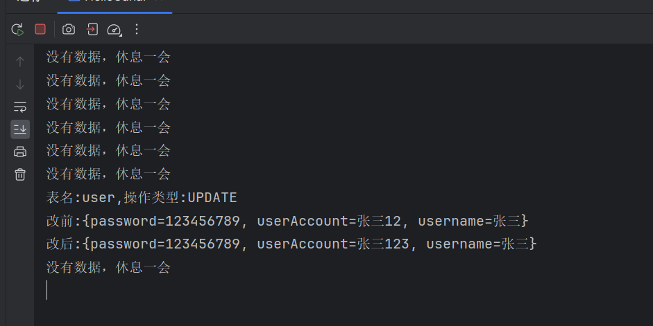
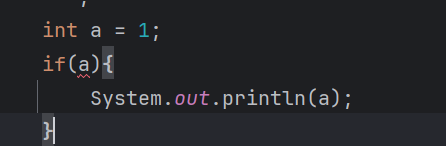
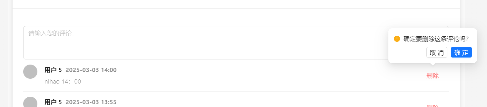

找工作的计划


# 10天准备好面试
## 第一天记录
复习了集合，具体来说就是Collection中List和Set子类的使用特点以及原理。ArrayList，LinkedList,HashSet,LinkedHashSet,TreeSet.
看了八股 java基础 Java 集合。

反思： 对于八股，没有自己记录下来。仅仅是看以及脑海预设回答。最好还是用文档记录下来。


## 第9天记录

没有学习，今天才开始学习。学习了java集合Collections工具类，Map集合，Stream流，Sql练习8道。投了20+简历。

Collections常用的静态方法，addALL,sort，同步集合。 

反思：之前没有学习，还是不能有一丝懈怠，一次懈怠，就会无数次懈怠，允许自己学一点点甚至只是记录，不允许自己摆烂。

没完全准备好，但是也要投简历了，今天还是少数公司上班，明天应该很多了。虽然还没准备完全，但是一定要投。


## 第10天

项目前端改错浪费了时间。前端还是不能耽误太长时间。投了50份简历。

明天：项目从头梳理一遍，投50份简历，八股（Mysql）。

反思：早上起的太晚。上午基本没学习。


## 第11天

主题逻辑不要搞混，老是想修改前端（前端太薄弱了，一定要补），先搞清楚主次。先准备好后端的面试，之后在补前端。

Mysql八股，智能知识库项目（通用框架复习）。

明天：P0智能知识库项目（个人签到，ES库，批量同步，HotKey）

P0 Spring 笔记 + 面试题。

P1 投50份简历

P1补充Java集合，Mysql面试题。

任务还是挺重的。

>  反思

早上起不来。最近睡的太晚了。晚上熬夜学习，不如白天早起来学习。

对于项目的学习应该抓住重点。任务重就在拆分。

对于八股的学习，虽然看的多也理解，但是写的比较少。应该对于于不理解的就查资料学习写下来。对于已经理解的，语音转文字记录下来。 

下午也要投简历。

## 第3天

编写开发模板，看spring笔记以及面试题。knife4j的使用踩坑。投30份简历。

反思： 没复习项目，一觉睡到中午12点。

明天任务：复习智能知识库项目（ES,批量同步，HotKey） 编写开发模板 springmvc笔记以及八股。补充Spring,Mysql,Java集合八股。

## 第4天

编写开发模板，复习了一遍spring和 springmvc以及其八股，补充了java集合八股。mybatis踩坑。

反思：起的太晚了！没复习项目！ 在学习过程中有些知识不会，搜索后大概懂了但是没有记录下来。明天在学习的时候新建一个文档记录下当天学习过程中所遇到的问题（不要求排版什么的，乱七八糟的先总体记录下来）。

明天： ES 批量同步。 编写开发模板。补充java集合，spring八股。

早点睡觉。


## Day 5 

今日目标 全文分词搜索 模板开发  spring八股

### 全文模糊搜索 

为了实现全文模糊搜索功能，需要使用ElasticSearch 搜索引擎。

> mysql 也支持全文搜索为什么不使用？

>1. **数据库自带全文搜索**

适用于小型或中型项目，直接利用数据库的全文索引功能。

+ **MySQL**: `FULLTEXT` 索引，适用于 `MyISAM` 和 `InnoDB` 引擎。
+ **PostgreSQL**: 提供强大的 `tsvector` 和 `tsquery` 搜索功能。
+ **MongoDB**: `text` 索引支持全文搜索。

> **示例（MySQL）：**
>
> ## **1. 创建数据库和表**
>
> ```sql
> CREATE DATABASE fulltext_search_demo;
> USE fulltext_search_demo;
> 
> CREATE TABLE articles (
>  id INT AUTO_INCREMENT PRIMARY KEY,
>  title VARCHAR(255),
>  content TEXT,
>  FULLTEXT(title, content)  -- 创建全文索引
> );
> ```
>
> ------
>
> ## **2. 插入测试数据**
>
> ```sql
> INSERT INTO articles (title, content) VALUES
> ('Elasticsearch 教程', 'Elasticsearch 是一个开源的全文搜索引擎。'),
> ('MySQL 全文搜索', 'MySQL 提供 FULLTEXT 索引用于全文检索。'),
> ('Python 搜索库 Whoosh', 'Whoosh 是一个轻量级的全文搜索库，适用于 Python 应用。'),
> ('全文搜索介绍', '全文搜索是一种高效的信息检索技术。');
> ```
>
> ------
>
> ## **3. 执行全文搜索**
>
> ```sql
> SELECT * FROM articles WHERE MATCH(title, content) AGAINST('全文搜索');
> ```
>
> + `MATCH(title, content) AGAINST('关键词')` 用于在 `title` 和 `content` 字段中执行全文搜索。
>
> + 例如，搜索 **"全文搜索"**，会返回与该关键词匹配的文章。
>
> + MySQL **默认不支持中文分词**
>
> + 如果你使用 **MySQL 5.7+ 或 MySQL 8.0**，可以启用 **Ngram 分词插件**，让 MySQL 支持中文分词。
>
> + ```sql
>   ALTER TABLE articles ADD FULLTEXT(title, content) WITH PARSER ngram;
>   ```
>
> + 然后你可以使用 `MATCH() AGAINST()` 进行搜索：
>
>   ```sql
>   SELECT * FROM articles WHERE MATCH(title, content) AGAINST('全文搜索');
>   ```
>
>   **注意**: Ngram 分词默认会把每 2 个字符作为一个 "词"，对于中文搜索的效果比默认好，但不如专业搜索引擎（如 Elasticsearch）。
>
>   以上仅仅实现全文搜索的功能，并没有实现全文的模糊搜索功能。
>
>   如果只是想实现简单的**模糊匹配**，可以使用 `LIKE`：
>
>   ```sql
>   SELECT * FROM articles WHERE content LIKE '%全文搜索%';
>   
>   LIKE '%关键词%' 无法利用索引，查询速度较慢。
>   当数据量较大时，性能会明显下降。
>   不能提供相关性排序。
>   ```
>
>   可以先用 `FULLTEXT` 进行搜索，找出相关性较高的结果，再用 `LIKE` 进一步筛选。
>
>   ```sql
>   SELECT * FROM articles 
>   WHERE MATCH(title, content) AGAINST('全文搜索') 
>   AND content LIKE '%全文搜索%';
>   
>   # 这样可以提高查询的精确度，但性能仍然不如专业搜索引擎。
>   ```
>
>   设用场景：
>
>   小规模数据（几万到百万条数据）。
>
>   **适合博客、新闻网站等** 需要基本全文搜索的应用。
>
>   性能远远不如专业的搜索引擎。


### ELasticSearch

Elasticsearch 是一个分布式、开源的搜索引擎,广泛用于 **全文检索、日志分析、监控数据分析** 等场景。

[Elasticsearch 指南 [8.17\] | 弹性的](https://www.elastic.co/guide/en/elasticsearch/reference/current/index.html)

Elastic Stack（也称为 ELK Stack）由以下几部分组成：

+ Elasticsearch：核心搜索引擎，负责存储、索引和搜索数据。
+ Kibana：可视化平台，用于查询、分析和展示 Elasticsearch 中的数据。
+ Logstash：数据处理管道，负责数据收集、过滤、增强和传输到 Elasticsearch。
+ Beats：轻量级的数据传输工具，收集和发送数据到 Logstash 或 Elasticsearch。

### ES数据的存放形式

[What is Elasticsearch? | Elasticsearch Guide [7.17\] | Elastic](https://www.elastic.co/guide/en/elasticsearch/reference/7.17/elasticsearch-intro.html)

Elasticsearch 不是将信息存储为列式数据行，而是存储已序列化的复杂数据结构作为 JSON 文档。

Elasticsearch 使用一种称为倒排索引的数据结构，它支持非常快速的全文搜索。**倒排索引**列出任何文档中出现的每个唯一单词，并标识所有每个单词出现的文档。

索引可以看作是文档的优化集合，每个document 都是字段的集合，这些字段是包含数据的键值对。默认情况下，Elasticsearch 会为每个字段中的所有数据编制索引，并且每个索引的字段都有一个专用的、优化的数据结构。例如，文本字段是存储在倒排索引中，而数字和地理字段存储在 BKD 树中。使用每个字段的数据结构来组合和返回搜索结果的能力是 Elasticsearch 如此快速的原因。

与mysql进行类比

**索引（Index）**：类似于关系型数据库中的表

**文档（Document）**：索引中的每条记录，类似于数据库中的行。文档以 JSON 格式存储。

**字段（Field）**：文档中的每个键值对，类似于数据库中的列。

**映射（Mapping）**：用于定义 Elasticsearch 索引中文档字段的数据类型及其处理方式，类似于关系型数据库中的 Schema 表结构，帮助控制字段的存储、索引和查询行为。

集群（Cluster）：多个节点组成的群集，用于存储数据并提供搜索功能。集群中的每个节点都可以处理数据。

分片（Shard）：为了实现横向扩展，ES 将索引拆分成多个分片，每个分片可以分布在不同节点上。

副本（Replica）：分片的复制品，用于提高可用性和容错性。

### 快速使用

[快速入门 |Elasticsearch 指南 [7.17\] | 弹性的](https://www.elastic.co/guide/en/elasticsearch/reference/7.17/getting-started.html#send-requests-to-elasticsearch)

widow 下安装

1.下载解压即可：https://artifacts.elastic.co/downloads/elasticsearch/elasticsearch-7.17.27-windows-x86_64.zip4

2.启动 bin/elasticsearch.bat    查看是否成功[localhost:9200](http://localhost:9200/)

3.一般不需要配置，配置的话看[配置 Elasticsearch |Elasticsearch 指南 [7.17\] | 弹性的 ](https://www.elastic.co/guide/en/elasticsearch/reference/7.17/settings.html)


> 查询语法DSL

```json
{
  "query": {
    "match": {
      "message": "Elasticsearch 是强大的"
    }
  }
}
```

match方法是全文分词查询。这会对 `message` 字段进行分词，并查找包含 "Elasticsearch" 和 "强大" 词条的文档。


| **查询条件**   | **介绍**                                                     | **示例**                                                     | **用途**                                           |
| -------------- | ------------------------------------------------------------ | ------------------------------------------------------------ | -------------------------------------------------- |
| `match`        | 用于全文检索，将查询字符串进行分词并匹配文档中对应的字段。   | `{ "match": { "content": "鱼皮是帅小伙" } }`                 | 适用于全文检索，分词后匹配文档内容。               |
| `term`         | 精确匹配查询，不进行分词。通常用于结构化数据的精确匹配，如数字、日期、关键词等。 | `{ "term": { "status": "active" } }`                         | 适用于字段的精确匹配，如状态、ID、布尔值等。       |
| `terms`        | 匹配多个值中的任意一个，相当于多个 `term` 查询的组合。       | `{ "terms": { "status": ["active", "pending"] } }`           | 适用于多值匹配的场景。                             |
| `range`        | 范围查询，常用于数字、日期字段，支持大于、小于、区间等查询。 | `{ "range": { "age": { "gte": 18, "lte": 30 } } }`           | 适用于数值或日期的范围查询。                       |
| `bool`         | 组合查询，通过 `must`、`should`、`must_not` 等组合多个查询条件。 | `{ "bool": { "must": [ { "term": { "status": "active" } }, { "range": { "age": { "gte": 18 } } } ] } }` | 适用于复杂的多条件查询，可以灵活组合。             |
| `wildcard`     | 通配符查询，支持 `*` 和 `?`，前者匹配任意字符，后者匹配单个字符。 | `{ "wildcard": { "name": "鱼*" } }`                          | 适用于部分匹配的查询，如模糊搜索。                 |
| `prefix`       | 前缀查询，匹配以指定前缀开头的字段内容。                     | `{ "prefix": { "name": "鱼" } }`                             | 适用于查找以指定字符串开头的内容。                 |
| `fuzzy`        | 模糊查询，允许指定程度的拼写错误或字符替换。                 | `{ "fuzzy": { "name": "yupi~2" } }`                          | 适用于处理拼写错误或不完全匹配的查询。             |
| `exists`       | 查询某字段是否存在。                                         | `{ "exists": { "field": "name" } }`                          | 适用于查找字段存在或缺失的文档。                   |
| `match_phrase` | 短语匹配查询，要求查询的词语按顺序完全匹配。                 | `{ "match_phrase": { "content": "鱼皮 帅小伙" } }`           | 适用于严格的短语匹配，词语顺序和距离都严格控制。   |
| `match_all`    | 匹配所有文档。                                               | `{ "match_all": {} }`                                        | 适用于查询所有文档，通常与分页配合使用。           |
| `ids`          | 基于文档 ID 查询，支持查询特定 ID 的文档。                   | `{ "ids": { "values": ["1", "2", "3"] } }`                   | 适用于根据文档 ID 查找特定文档。                   |
| `geo_distance` | 地理位置查询，基于地理坐标和指定距离查询。                   | `{ "geo_distance": { "distance": "12km", "location": { "lat": 40.73, "lon": -74.1 } } }` | 适用于根据距离计算查找地理位置附近的文档。         |
| `aggregations` | 聚合查询，用于统计、计算和分组查询，类似 SQL 中的 `GROUP BY`。 | `{ "aggs": { "age_stats": { "stats": { "field": "age" } } } }` | 适用于统计和分析数据，比如求和、平均值、最大值等。 |

> 中文分词器

```json
POST /_analyze
{
  "analyzer": "standard", 
  "text": "hnsqls非常喜欢编程"
}
```

在 Elasticsearch 中使用 `_analyze` API 时，并不需要在库中已有数据，它只是用于分析指定的文本，查看它在指定分析器下的分词结果。你可以直接调用该 API，不必担心是否有索引或数据。

standard 分词器只会分英文，我们需要下载中午分词器插件

开源地址：https://github.com/medcl/elasticsearch-analysis-ik

进入 ES目录/pluglin 安装

```shell
.\bin\elasticsearch-plugin.bat install https://release.infinilabs.com/analysis-ik/stable/elasticsearch-analysis-ik-7.17.23.zip
```

重启ES

IK 分词器插件提供了两个分词器：`ik_smart` 和 `ik_max_word`。

+ ik_smart 是智能分词，尽量选择最像一个词的拆分方式，比如“好学生”会被识别为一个词， **搜索分词**
+ ik_max_word 尽可能地分词，可以包括组合词，比如“好学生”会被识别为 3 个词：好学生、好学、学生，**底层索引分词**


> 设计索引

text（长文本，需要分词的），keyword（不需要分词），long（长整数）

**字段类型**：定义每个字段的数据类型。常见类型包括：

+ `text`：用于全文搜索的字符串类型，会进行分词。
+ `keyword`：用于精确匹配的字符串类型，不进行分词。
+ `date`：日期类型，支持各种日期格式。
+ `integer`, `long`, `float`, `double`：数值类型。
+ `boolean`：布尔值类型。
+ `object`：对象类型，适合嵌套复杂结构。

**分词器**（Analyzers）：控制字段在索引时如何被分词。如果字段需要全文搜索，通常会使用分词器来把文本切分为单词。

**索引设置**（Index Settings）：定义一些全局的索引设置，如分片数、副本数等。

参考如下

```json
{
  "mappings": {
    "properties": {
      "title": {
        "type": "text",
        "analyzer": "ik_max_word",
        "search_analyzer": "ik_smart",
        "fields": {
          "keyword": {
            "type": "keyword",
            "ignore_above": 256
          }
        }
      },
      "content": {
        "type": "text",
        "analyzer": "ik_max_word",
        "search_analyzer": "ik_smart"
      },
      "tags": {
        "type": "keyword"
      },
      "answer": {
        "type": "text",
        "analyzer": "ik_max_word",
        "search_analyzer": "ik_smart"
      },
      "userId": {
        "type": "long"
      },
      "editTime": {
        "type": "date",
        "format": "yyyy-MM-dd HH:mm:ss"
      },
      "createTime": {
        "type": "date",
        "format": "yyyy-MM-dd HH:mm:ss"
      },
      "updateTime": {
        "type": "date",
        "format": "yyyy-MM-dd HH:mm:ss"
      },
      "isDelete": {
        "type": "keyword"
      }
    }
  }
}

```

创建索引

```json
PUT /question_v1
{
  "mappings": {
    "properties": {
      ...
    }
  }
}
```

不过一般添加别名创建

* 零停机切换索引：在更新索引或重新索引数据时，你可以创建一个新索引并使用 alias 切换到新索引，而不需要修改客户端查询代码，避免停机或中断服务。
* 简化查询：通过 alias，可以使用一个统一的名称进行查询，而不需要记住具体的索引名称（尤其当索引有版本号或时间戳时）。
* 索引分组：alias 可以指向多个索引，方便对多个索引进行联合查询，例如用于跨时间段的日志查询或数据归档。

> 如何实现零停机切换。

例如一个索引 `products`，创建别名 `current_products`，并将其指向 `products_v1`。

当需要对 `products_v1` 进行更新时，你可以创建一个新的索引 `products_v2`，然后将别名 `current_products` 指向 `products_v2`。此时，应用程序只需要访问 `current_products`，而不必修改代码或配置。

```json
PUT /products_v1
{
  "settings": {
    "number_of_shards": 1,
    "number_of_replicas": 1
  },
  "mappings": {
    "properties": {
      "name": { "type": "text" },
      "price": { "type": "float" }
    }
  }
}

# 创建别名
POST /_aliases
{
  "actions": [
    {
      "add": {
        "index": "products_v1",  // 指定索引
        "alias": "current_products"  // 为索引添加别名
      }
    }
  ]
}

```

当你需要切换索引时，可以直接操作别名来实现无缝切换。

假设你创建了一个新的索引 `products_v2`，并希望将别名 `current_products` 从 `products_v1` 切换到 `products_v2`。

```json
POST /_aliases
{
  "actions": [
    {
      "remove": {
        "index": "products_v1",
        "alias": "current_products"
      }
    },
    {
      "add": {
        "index": "products_v2",
        "alias": "current_products"
      }
    }
  ]
}
```


> springboot 集成操作

https://spring.io/projects/spring-data-elasticsearch/

1. 引入依赖

```xml
<!-- elasticsearch-->
<dependency>
    <groupId>org.springframework.boot</groupId>
    <artifactId>spring-boot-starter-data-elasticsearch</artifactId>
</dependency>

```

2. 配置文件

```yaml
spring:
  elasticsearch:
    uris: http://xxx:9200
    username: elastic
    password: elastic

```

3. 使用

可以想mybatis 那样使用

1. 实体和ES库映射

model.dto.question

```java
@Document(indexName = "question")
@Data
public class QuestionEsDTO implements Serializable {

    private static final String DATE_TIME_PATTERN = "yyyy-MM-dd HH:mm:ss";

    /**
     * id
     */
    @Id
    private Long id;

    /**
     * 标题
     */
    private String title;

    /**
     * 内容
     */
    private String content;

    /**
     * 答案
     */
    private String answer;

    /**
     * 标签列表
     */
    private List<String> tags;

    /**
     * 创建用户 id
     */
    private Long userId;

    /**
     * 创建时间
     */
    @Field(type = FieldType.Date, format = {}, pattern = DATE_TIME_PATTERN)
    private Date createTime;

    /**
     * 更新时间
     */
    @Field(type = FieldType.Date, format = {}, pattern = DATE_TIME_PATTERN)
    private Date updateTime;

    /**
     * 是否删除
     */
    private Integer isDelete;

    private static final long serialVersionUID = 1L;

    /**
     * 对象转包装类
     *
     * @param question
     * @return
     */
    public static QuestionEsDTO objToDto(Question question) {
        if (question == null) {
            return null;
        }
        QuestionEsDTO questionEsDTO = new QuestionEsDTO();
        BeanUtils.copyProperties(question, questionEsDTO);
        String tagsStr = question.getTags();
        if (StringUtils.isNotBlank(tagsStr)) {
            questionEsDTO.setTags(JSONUtil.toList(tagsStr, String.class));
        }
        return questionEsDTO;
    }

    /**
     * 包装类转对象
     *
     * @param questionEsDTO
     * @return
     */
    public static Question dtoToObj(QuestionEsDTO questionEsDTO) {
        if (questionEsDTO == null) {
            return null;
        }
        Question question = new Question();
        BeanUtils.copyProperties(questionEsDTO, question);
        List<String> tagList = questionEsDTO.getTags();
        if (CollUtil.isNotEmpty(tagList)) {
            question.setTags(JSONUtil.toJsonStr(tagList));
        }
        return question;
    }
}

```

2. 接口继承 ElasticsearchRepository

```java
public interface QuestionEsDao 
    extends ElasticsearchRepository<QuestionEsDTO, Long> {

}
```

里面有常用的方法。

>  数据写入到ES

CommandLineRunner 实现这个接口的类，在类启动的时候会自动执行一次。所以说执行一次这个方法就行了，不执行在去掉注释，也就是不要让Springg感知到

```java
// todo 取消注释开启任务
@Component
@Slf4j
public class FullSyncQuestionToEs implements CommandLineRunner {

    @Resource
    private QuestionService questionService;

    @Resource
    private QuestionEsDao questionEsDao;

    @Override
    public void run(String... args) {
        // 全量获取题目（数据量不大的情况下使用）
        List<Question> questionList = questionService.list();
        if (CollUtil.isEmpty(questionList)) {
            return;
        }
        // 转为 ES 实体类
        List<QuestionEsDTO> questionEsDTOList = questionList.stream()
                .map(QuestionEsDTO::objToDto)
                .collect(Collectors.toList());
        // 分页批量插入到 ES
        final int pageSize = 500;
        int total = questionEsDTOList.size();
        log.info("FullSyncQuestionToEs start, total {}", total);
        for (int i = 0; i < total; i += pageSize) {
            // 注意同步的数据下标不能超过总数据量
            int end = Math.min(i + pageSize, total);
            log.info("sync from {} to {}", i, end);
            questionEsDao.saveAll(questionEsDTOList.subList(i, end));
        }
        log.info("FullSyncQuestionToEs end, total {}", total);
    }
}

```


> ES 全文分词搜索

接口 QuestionService

```java
/**
 * 从 ES 查询题目
 *
 * @param questionQueryRequest
 * @return
 */
Page<Question> searchFromEs(QuestionQueryRequest questionQueryRequest);

```

实现类

```java
@Override
public Page<Question> searchFromEs(QuestionQueryRequest questionQueryRequest) {
    // 获取参数
    Long id = questionQueryRequest.getId();
    Long notId = questionQueryRequest.getNotId();
    String searchText = questionQueryRequest.getSearchText();
    List<String> tags = questionQueryRequest.getTags();
    Long questionBankId = questionQueryRequest.getQuestionBankId();
    Long userId = questionQueryRequest.getUserId();
    // 注意，ES 的起始页为 0
    int current = questionQueryRequest.getCurrent() - 1;
    int pageSize = questionQueryRequest.getPageSize();
    String sortField = questionQueryRequest.getSortField();
    String sortOrder = questionQueryRequest.getSortOrder();

    // 构造查询条件
    BoolQueryBuilder boolQueryBuilder = QueryBuilders.boolQuery();
    // 过滤
    boolQueryBuilder.filter(QueryBuilders.termQuery("isDelete", 0));
    if (id != null) {
        boolQueryBuilder.filter(QueryBuilders.termQuery("id", id));
    }
    if (notId != null) {
        boolQueryBuilder.mustNot(QueryBuilders.termQuery("id", notId));
    }
    if (userId != null) {
        boolQueryBuilder.filter(QueryBuilders.termQuery("userId", userId));
    }
    if (questionBankId != null) {
        boolQueryBuilder.filter(QueryBuilders.termQuery("questionBankId", questionBankId));
    }
    // 必须包含所有标签
    if (CollUtil.isNotEmpty(tags)) {
        for (String tag : tags) {
            boolQueryBuilder.filter(QueryBuilders.termQuery("tags", tag));
        }
    }
    // 按关键词检索
    if (StringUtils.isNotBlank(searchText)) {
        boolQueryBuilder.should(QueryBuilders.matchQuery("title", searchText));
        boolQueryBuilder.should(QueryBuilders.matchQuery("content", searchText));
        boolQueryBuilder.should(QueryBuilders.matchQuery("answer", searchText));
        boolQueryBuilder.minimumShouldMatch(1);
    }
    // 排序
    SortBuilder<?> sortBuilder = SortBuilders.scoreSort();
    if (StringUtils.isNotBlank(sortField)) {
        sortBuilder = SortBuilders.fieldSort(sortField);
        sortBuilder.order(CommonConstant.SORT_ORDER_ASC.equals(sortOrder) ? SortOrder.ASC : SortOrder.DESC);
    }
    // 分页
    PageRequest pageRequest = PageRequest.of(current, pageSize);
    // 构造查询
    NativeSearchQuery searchQuery = new NativeSearchQueryBuilder()
            .withQuery(boolQueryBuilder)
            .withPageable(pageRequest)
            .withSorts(sortBuilder)
            .build();
    SearchHits<QuestionEsDTO> searchHits = elasticsearchRestTemplate.search(searchQuery, QuestionEsDTO.class);
    // 复用 MySQL 的分页对象，封装返回结果
    Page<Question> page = new Page<>();
    page.setTotal(searchHits.getTotalHits());
    List<Question> resourceList = new ArrayList<>();
    if (searchHits.hasSearchHits()) {
        List<SearchHit<QuestionEsDTO>> searchHitList = searchHits.getSearchHits();
        for (SearchHit<QuestionEsDTO> questionEsDTOSearchHit : searchHitList) {
            resourceList.add(QuestionEsDTO.dtoToObj(questionEsDTOSearchHit.getContent()));
        }
    }
    page.setRecords(resourceList);
    return page;
}

```

> 数据一致性

在上述代码中我们只是一次将数据库加入到ES 库中。后续如果有新增的数据或者修改原有的数据，就出现数据库不一致的问题。

解决方案

​	方案1： 双写，写数据库的同时，写ES 库。代码耦合度太高了，而且影响主任务。

​	方案2： 定时任务，没分钟执行一次，搜索近5分钟修改和创建的题目。加入到ES库。

​	方案3： 使用Canal监听binlog。


使用方案2：

注意，如果使用 MyBatis Plus 提供的 mapper 方法，查询时会默认过滤掉 isDelete = 1（逻辑已删除）的数据，而我们的需求是让 ES 和 MySQL 完全同步，所以需要在 QuestionMapper 中编写一个能查询出 isDelete = 1 数据的方法。

```java
public interface QuestionMapper extends BaseMapper<Question> {

    /**
     * 查询题目列表（包括已被删除的数据）
     */
    @Select("select * from question where updateTime >= #{minUpdateTime}")
    List<Question> listQuestionWithDelete(Date minUpdateTime);
}
```


```java
// todo 取消注释开启任务
//@Component
@Slf4j
public class IncSyncQuestionToEs {

    @Resource
    private QuestionMapper questionMapper;

    @Resource
    private QuestionEsDao questionEsDao;

    /**
     * 每分钟执行一次
     */
    @Scheduled(fixedRate = 60 * 1000)
    public void run() {
        // 查询近 5 分钟内的数据
        long FIVE_MINUTES = 5 * 60 * 1000L;
        Date fiveMinutesAgoDate = new Date(new Date().getTime() - FIVE_MINUTES);
        List<Question> questionList = questionMapper.listQuestionWithDelete(fiveMinutesAgoDate);
        if (CollUtil.isEmpty(questionList)) {
            log.info("no inc question");
            return;
        }
        List<QuestionEsDTO> questionEsDTOList = questionList.stream()
                .map(QuestionEsDTO::objToDto)
                .collect(Collectors.toList());
        final int pageSize = 500;
        int total = questionEsDTOList.size();
        log.info("IncSyncQuestionToEs start, total {}", total);
        for (int i = 0; i < total; i += pageSize) {
            int end = Math.min(i + pageSize, total);
            log.info("sync from {} to {}", i, end);
            questionEsDao.saveAll(questionEsDTOList.subList(i, end));
        }
        log.info("IncSyncQuestionToEs end, total {}", total);
    }
}

```


### 其他

#### 1. 什么是倒排索引

1. **倒排索引（Inverted Index）** 是搜索引擎中用于实现高效全文搜索的核心数据结构。它的主要作用是将文档中的内容（通常是文本）转换为一种易于快速查找的形式，从而支持快速检索包含特定关键词的文档。、

   倒排索引是一种将词条（Term）映射到文档的数据结构。与传统的“正排索引”（文档到词条的映射）不同，倒排索引是从词条到文档的映射。

倒排索引通常由两部分组成：

1. **词条词典（Term Dictionary）**：

+ 存储所有唯一的词条。
  + 通常按字典序排序，方便快速查找。

2. **倒排列表（Posting List）**：

+ 存储每个词条对应的文档列表。

2.**倒排索引的构建过程**

   倒排索引的构建通常包括以下步骤：

      1. **分词（Tokenization）**：
         + 将文档中的文本分割成单独的词条。
         + 例如：`"Elasticsearch is fast"` -> `["Elasticsearch", "is", "fast"]`。
      2. **去除停用词（Stop Words Removal）**：
         + 去除无意义的词条（如“的”、“是”等）。
      3. **词条规范化（Normalization）**：
         + 将词条转换为统一形式（如小写化、词干提取等）。
         + 例如：`"running"` -> `"run"`。
      4. **构建倒排索引**：
         + 将词条映射到文档列表。
         + 例如：`"fast"` -> `[文档1]`。

 2.**倒排索引的查询过程**

当用户输入查询时，搜索引擎会使用倒排索引快速找到包含查询词条的文档。查询过程通常包括以下步骤：

1. **分词**：
   + 将查询字符串分割成词条。
   + 例如：`"fast search"` -> `["fast", "search"]`。
2. **查找倒排列表**：
   + 在倒排索引中查找每个词条对应的文档列表。
   + 例如：`"fast"` -> `[文档1]`，`"search"` -> `[文档2]`。
3. **合并结果**：
   + 根据查询逻辑（如 AND、OR）合并文档列表。
   + 例如：`"fast AND search"` -> 取 `[文档1]` 和 `[文档2]` 的交集。

 4. **倒排索引的优势**

    1. **高效检索**：
       + 通过词条直接定位文档，避免了全表扫描。
    2. **支持复杂查询**：
       + 支持布尔查询（AND、OR、NOT）、短语查询、范围查询等。
    3. **可扩展性**：
       + 适合处理大规模文本数据。
    4. **支持相关性排序**：
       + 可以结合词频（TF）、逆文档频率（IDF）等算法计算文档的相关性评分。


> 反思

ES库设计，同步，全文模糊搜索。

计划的八股没看。每天把计划要看的八股挑选一题对我不完全熟悉的写出来。

看文档的时间比写代码的时间长。还是要多实操，coding。

学习时间太少了。中午直接睡过去。下午学俩小时就不想学了。晚上开始学习的时间又太晚。

希望明天上午学俩小时（学一点也行。起太晚了）。继续记录

> 明日计划

批处理。 开发模板编写。 JUC八股。 java基础八股 java集合，mysql、spring。


## Day 6

> 今日计划

批处理。 开发模板编写。 JUC八股。 java基础八股 java集合，mysql、spring。

### 批量处理

**批处理（Batch Processing）** 是指一次性处理**大量数据**的操作方式，通常用于 **插入、更新、删除、迁移、导出** 等大规模数据操作。 

解决的问题就是**性能问题**(save 和savebatch).

批处理可能出现的问题：

* **长事务的问题**。解决对操作进行合适的分批+多线程。
* OOM问题。 解决就是分批。

> 批处理解决性能问题


 **1. 批处理 vs. 逐条处理**

| 描述                                                      | 处理方式     | 优势                       | 劣势                 |
| --------------------------------------------------------- | ------------ | -------------------------- | -------------------- |
| 每次执行一条 SQL 语句                                     | **逐条处理** | **逻辑简单**，适合小数据量 | **慢**，数据库压力大 |
| 一次性处理多条数据（例如 `INSERT INTO ... VALUES (...)`） | **批处理**   | **效率高，减少数据库交互** | 适用于**大数据量**   |

 **示例**

+ 逐条插入（慢）

  ```java
  for (Order order : orderList) {
      orderService.save(order); // 每次都执行一次 SQL
  }
  ```

+ 批量插入（快）

  ```java
  orderService.saveBatch(orderList, 1000); // 每次插入 1000 条
  ```

------

 **2. 批处理的优势**
✅ **减少网络开销**：一次性提交多个 SQL 语句，减少数据库与应用之间的通信时间。

✅**减少数据库磁盘 I/O 开销**：一次性处理多条数据，减少 SQL 语句执行次数。

> 长事务问题

批量操作中，一次性处理过多数据会导致事务过长，影响数据库性能。可以通过 分批处理 来避免长事务问题，确保部分数据异常不会影响整个批次的数据保存。

假设操作 10w 条数据，其中有 1 条数据操作异常，如果是长事务，那么修改的 10w 条数据都需要回滚，而分批事务仅需回滚一批既可，降低长事务带来的资源消耗，同时也提升了稳定性。

 **资源占用高**：数据库**长时间占用锁、连接、CPU、内存**，影响并发性能。
**❌ 数据库死锁**：多个长事务同时执行，可能造成**锁等待或死锁**，导致数据库崩溃。
**❌ 回滚成本高**：事务持续时间越长，回滚代价越高，**影响数据库响应速度**。
**❌ 影响数据库吞吐量**：长事务会阻塞其他请求，**降低数据库吞吐能力**。

> OOM问题

一次性加载大量数据，可能导致**内存溢出（Out of Memory，OOM）**。

例如：一次性查询 1000 万条数据进行计算，导致 JVM 堆内存不足。

> 如何实现一个批量添加题目向题库的接口

单个处理

题库 id   题目id     题库题目关系

向题库中添加题目，就是添加一条题库题目关系。所以参数就是（questionBankId, List<Long>questionid）

直接对questionIdList for循环，每次生成一个题目题库关系加入到数据库中。

```java
    for (Long questionId : QuestionIdList) {
        QuestionBankQuestion questionBankQuestion = new QuestionBankQuestion();
        questionBankQuestion.setQuestionBankId(questionBankId);
        questionBankQuestion.setQuestionId(questionId);
        questionBankQuestion.setUserId(loginUser.getId());
        boolean result = this.save(questionBankQuestion);
        if (!result) {
            throw new BusinessException(ErrorCode.OPERATION_ERROR, "向题库添加题目失败");
        }
    }
```

单个处理的问题就是。每次执行sql只能插入一条数据，但是每次都会发网络请求连接mysql数据库，以及每次操作都对数据库IO操作。新性能低。

批量处理

```java
// 组装数据
  List<QuestionBankQuestion> questionBankQuestions = questionidList.stream().map(questionId -> {
        QuestionBankQuestion questionBankQuestion = new QuestionBankQuestion();
        questionBankQuestion.setQuestionBankId(questionBankId);
        questionBankQuestion.setQuestionId(questionId);
        return questionBankQuestion;
    }).collect(Collectors.toList());
 boolean result = this.saveBatch(questionBankQuestions);
        //如果失败
        if (!result) {
            throw new BusinessException(ErrorCode.OPERATION_ERROR, "向题库添加题目失败");
        }
```

可能出现的问题： OOM 和长事务问题。

分批操作

```java
// 分批处理避免长事务，假设每次处理 1000 条数据
int batchSize = 1000;
int totalQuestionListSize = validQuestionIdList.size();
for (int i = 0; i < totalQuestionListSize; i += batchSize) {
    // 生成每批次的数据
    List<Long> subList = validQuestionIdList.subList(i, Math.min(i + batchSize, totalQuestionListSize));
    List<QuestionBankQuestion> questionBankQuestions = subList.stream().map(questionId -> {
        QuestionBankQuestion questionBankQuestion = new QuestionBankQuestion();
        questionBankQuestion.setQuestionBankId(questionBankId);
        questionBankQuestion.setQuestionId(questionId);
        questionBankQuestion.setUserId(loginUser.getId());
        return questionBankQuestion;
    }).collect(Collectors.toList());
    // 使用事务处理每批数据
    QuestionBankQuestionService questionBankQuestionService = (QuestionBankQuestionServiceImpl) AopContext.currentProxy();
    questionBankQuestionService.batchAddQuestionsToBankInner(questionBankQuestions);
}

```

整体的参考demo

```java
/**
     * 批量向题库添加题目
     * @param questionBankQuestionBatchAddRequest
     * @param request
     * @return
     */
    @PostMapping("/add/batch")
    public BaseResponse<Boolean> addQuestionToBankByIdList(@RequestBody QuestionBankQuestionBatchAddRequest questionBankQuestionBatchAddRequest, HttpServletRequest request) {
        ThrowUtils.throwIf(questionBankQuestionBatchAddRequest == null, ErrorCode.PARAMS_ERROR);

        Long questionBankId = questionBankQuestionBatchAddRequest.getQuestionBankId();
        List<Long> questionIdList = questionBankQuestionBatchAddRequest.getQuestionIdList();
        User loginUser = userService.getLoginUser(request);

        //校验
        ThrowUtils.throwIf(loginUser == null, ErrorCode.NOT_LOGIN_ERROR);

        questionBankQuestionService.addQuestionToQuestionBankByIdList(questionIdList, questionBankId, loginUser);
        return ResultUtils.success(true);
    }


 /**
     * 通过题目id集合批量加入到题库
     * @param questionIdList
     * @param questionBankId
     * @param user
     */
    void addQuestionToQuestionBankByIdList(List<Long> questionIdList, long questionBankId, User user);

 /**
     * 通过题目id集合批量加入到题库
     *
     * @param questionIdList
     * @param questionBankId
     * @param user
     */
    @Override
    @Transactional(rollbackFor = Exception.class)
    public void addQuestionToQuestionBankByIdList(List<Long> questionIdList, long questionBankId, User user) {
        // 逻辑校验参数
        ThrowUtils.throwIf(questionIdList == null, ErrorCode.NOT_FOUND_ERROR, "题目id集合不能为空");
        ThrowUtils.throwIf(questionBankId <= 0, ErrorCode.NOT_FOUND_ERROR, "题库id不能为空");
        ThrowUtils.throwIf(user == null, ErrorCode.NOT_FOUND_ERROR, "用户不能为空");

        // 业务校验参数
        //校验题目id集合
//        List<Question> questions = questionService.listByIds(questionIdList); --->优化sql
        //合法的题目id列表
//        List<Long> idList = questions.stream()
//                .map(Question::getId)
//                .collect(Collectors.toList());

        //优化sql
        LambdaQueryWrapper<Question> queryWrapper = Wrappers.lambdaQuery(Question.class)
                .select(Question::getId)
                .in(Question::getId, questionIdList);
        List<Long> idList = questionService.listObjs(queryWrapper, obj -> (Long) obj);


        ThrowUtils.throwIf(idList.isEmpty(), ErrorCode.NOT_FOUND_ERROR, "题目id集合不能为空");

        //校验题库id
        QuestionBank questionBank = questionBankService.getById(questionBankId);
        ThrowUtils.throwIf(questionBank == null, ErrorCode.NOT_FOUND_ERROR, "题库不存在");

        //校验题目id集合是否在题库中-->取出来不在题库中的id,避免重复插入
        LambdaQueryWrapper<QuestionBankQuestion> queryWrapper1 = new LambdaQueryWrapper<>();
        queryWrapper1.in(QuestionBankQuestion::getQuestionId, idList)
                .eq(QuestionBankQuestion::getQuestionBankId, questionBankId)
                .select(QuestionBankQuestion::getQuestionId);
        //查询已经题库中的题目
        List<Long> existQuestionIdList = this.listObjs(queryWrapper1, obj -> (Long) obj);
        // 未存在的的关系，插入
        List<Long> validQuestionIdList = idList.stream()
                .filter(questionId -> {
                    return !existQuestionIdList.contains(questionId);
                }).collect(Collectors.toList());

        ThrowUtils.throwIf(validQuestionIdList.isEmpty(), ErrorCode.NOT_FOUND_ERROR, "已经全部添加到题库中");


        //线程池
        ThreadPoolExecutor customExecutor = new ThreadPoolExecutor(
                20,// 核心线程数
                30,// 最大线程数
                60,// 线程空闲时间
                TimeUnit.SECONDS,
                new ArrayBlockingQueue<>(1000),  // 阻塞队列容量
                new ThreadPoolExecutor.CallerRunsPolicy()//拒绝策略：由调用线程处理任务
        );

        // 保存所有批次的CompletableFuture
        List<CompletableFuture<Void>> futures = new ArrayList<>();


        //批量插入---》分批--->>多线程处理
        //    假如1000数据为一批
        int batchSize = 2;
        int totalSize = validQuestionIdList.size();
        for (int i = 0; i < validQuestionIdList.size(); i += batchSize) {
            int endIndex = Math.min(i + batchSize, totalSize);
            //分批
            List<Long> subList = validQuestionIdList.subList(i, endIndex);
            //调用内部方法：事务会失效---》AOPContex拿到代理
            QuestionBankQuestionService questionBankQuestionService = (QuestionBankQuestionServiceImpl) AopContext.currentProxy();
            //多线程处理
            CompletableFuture<Void> future = CompletableFuture.runAsync(() -> {

                questionBankQuestionService.batchAddQuestionToQuestionBankInner(subList, questionBankId, user);
            },customExecutor).exceptionally(ex ->{
                log.error("批量添加题目到题库异常", ex);
                return null;
            });
            futures.add(future);
        }

        // 等待所有任务完成
        CompletableFuture.allOf(futures.toArray(new CompletableFuture[0])).join();
        //关闭线程池
        customExecutor.shutdown();

////        批量插入
//        for (Long questionId : validQuestionIdList) {
//            QuestionBankQuestion questionBankQuestion = new QuestionBankQuestion();
//            questionBankQuestion.setQuestionBankId(questionBankId);
//            questionBankQuestion.setQuestionId(questionId);
//            questionBankQuestion.setUserId(user.getId());
//                boolean result = this.save(questionBankQuestion);
//                //如果失败
//                if (!result) {
//                    throw  new BusinessException(ErrorCode.OPERATION_ERROR,"向题库添加题目失败");
//                }
//            }


    }

    /**
     * 通过题目id集合批量加入-->内部调用  事务
     *
     * @param questionIdList
     * @param questionBankId
     * @param user
     */

    @Override
    @Transactional(rollbackFor = Exception.class)
    public void batchAddQuestionToQuestionBankInner(List<Long> questionIdList, long questionBankId, User user) {


        ArrayList<QuestionBankQuestion> questionBankQuestions = new ArrayList<>();
        //批量插入
        for (Long questionId : questionIdList) {
            QuestionBankQuestion questionBankQuestion = new QuestionBankQuestion();
            questionBankQuestion.setQuestionBankId(questionBankId);
            questionBankQuestion.setQuestionId(questionId);
            questionBankQuestion.setUserId(user.getId());
            questionBankQuestions.add(questionBankQuestion);
        }
        boolean result = this.saveBatch(questionBankQuestions);
        //如果失败
        if (!result) {
            throw new BusinessException(ErrorCode.OPERATION_ERROR, "向题库添加题目失败");
        }
    }


```

注意，使用 `AopContext.currentProxy()` 方法时必须要在启动类添加下面的注解开启切面自动代理：

```java
@EnableAspectJAutoProxy(proxyTargetClass = true, exposeProxy = true)
```


### JUC


### 每日挑选


### Druid

数据库连接池（Database Connection Pool）是为了提高数据库访问效率而使用的一种技术。它通过**预先创建一定数量的数据库连接，并将它们维护在池中，避免每次进行数据库操作时都要创建和销毁连接**。这样可以显著提高性能，减少连接建立和销毁的开销，优化系统资源的使用。

常见的数据库连接池有 2 种：

* **HikariCP**
* **Druid**

 **1. 性能**

+ **HikariCP**：
  + **高性能**是 HikariCP 的最大特点。它是目前性能表现最好的连接池之一，尤其适用于对性能要求较高的应用场景（如高并发、低延迟的系统）。
  + 它的设计精简、内存占用小，通过优化连接池管理、减少不必要的开销，保证了高效的连接管理。
  + 在 **大并发、高负载** 场景下，HikariCP 的性能优势尤其明显。
+ **Druid**：
  + Druid 相较于 HikariCP 具有更多的功能，但在性能上略逊色一些。它在功能性和灵活性上有所侧重，因此性能可能略低于 HikariCP，尤其在 **超高并发** 环境下。
  + Druid 适用于 **对监控和扩展性** 有较高需求的场景。

**总结**：如果你的应用场景对性能要求非常高，特别是在高并发时，**HikariCP** 会是更好的选择。Druid 在一些场景下性能可能不如 HikariCP，但它提供了更多的功能和灵活性。

------

**2. 功能**

+ **HikariCP**：
  + HikariCP 的设计理念是“简单、快速”，它聚焦于连接池的基础功能，提供了最基本的连接池管理功能，如最大连接数、最小空闲连接数、连接超时等配置。
  + HikariCP 并没有很多高级的功能，诸如监控、统计等都比较简洁。
+ **Druid**：
  + Druid 提供了更丰富的功能，特别是在 **监控、统计** 和 **扩展性** 方面。Druid 内置了非常强大的监控功能，可以非常方便地查看连接池的健康状况、数据库访问的情况。
  + 支持 **SQL 执行日志** 和 **慢查询日志**，可以实时查看数据库执行情况。
  + 还支持一些高级的功能，比如 **防止 SQL 注入、连接泄漏检测** 等。

**总结**：如果你的应用需要更丰富的监控、统计功能，或者需要对连接池的运行状态进行详细的追踪和分析，**Druid** 更适合。如果你的需求仅仅是快速、稳定的连接池管理，**HikariCP** 更轻便高效。

------

 **3. 配置简便性**

+ **HikariCP**：
  + 配置相对简单、直接。只需要设置一些核心参数，如 `maximumPoolSize`（最大连接数）、`minimumIdle`（最小空闲连接数）、`connectionTimeout`（连接超时）等。
  + 由于它的功能聚焦，因此配置项不复杂，能够快速上手。
+ **Druid**：
  + 配置较为复杂，支持更多的自定义项，尤其是在连接池监控、日志记录和防止连接泄漏等方面提供了许多参数。需要根据具体需求来调整相关配置。
  + 对于复杂的系统，可能需要更多的配置和调优。

**总结**：如果你需要简单、直观的配置，**HikariCP** 更加适合；如果你需要更多的功能和调优选项，**Druid** 会更灵活一些。

------

1）HikariCP：被认为是市场上最快的数据库连接池之一，具有非常低的延迟和高效的性能。它以其轻量级和简洁的设计闻名，占用较少的内存和 CPU 资源。

Spring Boot 2.x 版本及以上默认使用 HikariCP 作为数据库连接池。默认 HikariCP 连接池大小是 10

2）[Druid](https://github.com/alibaba/druid)：由阿里巴巴开发的开源数据库连接池，提供了**丰富的监控和管理功能**，包括 SQL 分析、性能监控和慢查询日志等。适合需要深度定制和监控的企业级应用。

**4.使用**

1）**HikariCP**

Spring Boot 默认使用 HikariCP 作为数据库连接池实现。只要你配置好数据库连接信息，Spring Boot 会自动集成 HikariCP。

1. 依赖引入

需要引入HiKariCP依赖，和数据库驱动依赖。

HiKariCP依赖，一般orm框架都有。比如mybtis。

```java
<dependencies>
    
    <!-- Spring Boot Starter Data JPA, 包含了 HikariCP -->
    <!--        <dependency>-->
<!--            <groupId>org.springframework.boot</groupId>-->
<!--            <artifactId>spring-boot-starter-data-jpa</artifactId>-->
<!--        </dependency>-->
    
        <!-- Spring Boot Starter JDBC (用于数据库访问) -->
<!--        <dependency>-->
<!--            <groupId>org.springframework.boot</groupId>-->
<!--            <artifactId>spring-boot-starter-jdbc</artifactId>-->
<!--        </dependency>-->
    
    
     <!-- mybtis-plus 包含了 HikariCP -->
    <dependency>
    <groupId>com.baomidou</groupId>
    <artifactId>mybatis-plus-boot-starter</artifactId>
</dependency>

    <!-- MySQL 驱动 -->
    <dependency>
        <groupId>mysql</groupId>
        <artifactId>mysql-connector-java</artifactId>
    </dependency>
</dependencies>

```

2. 配置

只需要编写配置，即可自动创建. 配置比较简单。核心的也就是线程池核心的参数。

```yaml
spring:
  datasource:
    url: jdbc:mysql://localhost:3306/mydb
    username: root
    password: password
    driver-class-name: com.mysql.cj.jdbc.Driver

    hikari:
      maximum-pool-size: 10            # 最大连接数 默认
      minimum-idle: 5                  # 最小空闲连接数
      idle-timeout: 30000              # 连接最大空闲时间（毫秒）
      connection-timeout: 30000        # 获取连接的最大等待时间（毫秒）
      max-lifetime: 1800000            # 连接的最大生命周期（毫秒）
      pool-name: HikariPool            # 连接池名称
      validation-timeout: 5000         # 连接验证超时时间（毫秒）
      leak-detection-threshold: 2000   # 连接泄漏检测阈值（毫秒）

```

其实不配置hikari也行。 有默认参数。最大线程数默认是10。

2）**Druid**

提供了更丰富的功能，比如监控。可以查看慢sql，以及线程执行的情况。

1. 引入依赖

```xml
<dependencies>
    <!-- Spring Boot Starter JDBC (用于数据库访问) -->
    <!-- 大多数情况下不用单独引入，因为通常引入mybatis 就包含这个了-->
<!--        <dependency>-->
<!--            <groupId>org.springframework.boot</groupId>-->
<!--            <artifactId>spring-boot-starter-jdbc</artifactId>-->
<!--        </dependency>-->

    <!-- Druid 连接池依赖 -->
    <dependency>
        <groupId>com.alibaba</groupId>
        <artifactId>druid-spring-boot-starter</artifactId>
    </dependency>
    
      <!-- MySQL 驱动 -->
    <dependency>
        <groupId>mysql</groupId>
        <artifactId>mysql-connector-java</artifactId>
    </dependency>
</dependencies>

```

2. 配置

```yaml
spring:
  # 数据源配置
  datasource:
    driver-class-name: com.mysql.cj.jdbc.Driver
    url: jdbc:mysql://localhost:3306/mianshiya
    username: root
    password: 123456
    # 指定数据源类型
    type: com.alibaba.druid.pool.DruidDataSource
    # Druid 配置
    # 访问 localhost:8080/api/druid    账号：root  密码：123
    # 访问 ip:port/{项目上下文}/druid    账号：root  密码：123
    druid:
      # 配置初始化大小、最小、最大
      initial-size: 10
      minIdle: 10
      max-active: 10
      # 配置获取连接等待超时的时间(单位：毫秒)
      max-wait: 60000
      # 配置间隔多久才进行一次检测，检测需要关闭的空闲连接，单位是毫秒
      time-between-eviction-runs-millis: 2000
      # 配置一个连接在池中最小生存的时间，单位是毫秒
      min-evictable-idle-time-millis: 600000
      max-evictable-idle-time-millis: 900000
      # 用来测试连接是否可用的SQL语句,默认值每种数据库都不相同,这是mysql
      validationQuery: select 1
      # 应用向连接池申请连接，并且testOnBorrow为false时，连接池将会判断连接是否处于空闲状态，如果是，则验证这条连接是否可用
      testWhileIdle: true
      # 如果为true，默认是false，应用向连接池申请连接时，连接池会判断这条连接是否是可用的
      testOnBorrow: false
      # 如果为true（默认false），当应用使用完连接，连接池回收连接的时候会判断该连接是否还可用
      testOnReturn: false
      # 是否缓存preparedStatement，也就是PSCache。PSCache对支持游标的数据库性能提升巨大，比如说oracle
      poolPreparedStatements: true
      # 要启用PSCache，必须配置大于0，当大于0时， poolPreparedStatements自动触发修改为true，
      # 在Druid中，不会存在Oracle下PSCache占用内存过多的问题，
      # 可以把这个数值配置大一些，比如说100
      maxOpenPreparedStatements: 20
      # 连接池中的minIdle数量以内的连接，空闲时间超过minEvictableIdleTimeMillis，则会执行keepAlive操作
      keepAlive: true
      # Spring 监控，利用aop 对指定接口的执行时间，jdbc数进行记录
      aop-patterns: "com.springboot.template.dao.*"
      ########### 启用内置过滤器（第一个 stat 必须，否则监控不到SQL）##########
      filters: stat,wall,log4j2
      # 自己配置监控统计拦截的filter
      filter:
        # 开启druiddatasource的状态监控
        stat:
          enabled: true
          db-type: mysql
          # 开启慢sql监控，超过2s 就认为是慢sql，记录到日志中
          log-slow-sql: true
          slow-sql-millis: 2000
        # 日志监控，使用slf4j 进行日志输出
        slf4j:
          enabled: true
          statement-log-error-enabled: true
          statement-create-after-log-enabled: false
          statement-close-after-log-enabled: false
          result-set-open-after-log-enabled: false
          result-set-close-after-log-enabled: false
      ########## 配置WebStatFilter，用于采集web关联监控的数据 ##########
      web-stat-filter:
        enabled: true                   # 启动 StatFilter
        url-pattern: /* # 过滤所有url
        exclusions: "*.js,*.gif,*.jpg,*.png,*.css,*.ico,/druid/*" # 排除一些不必要的url
        session-stat-enable: true       # 开启session统计功能
        session-stat-max-count: 1000 # session的最大个数,默认100
      ########## 配置StatViewServlet（监控页面），用于展示Druid的统计信息 ##########
      stat-view-servlet:
        enabled: true                   # 启用StatViewServlet
        url-pattern: /druid/* # 访问内置监控页面的路径，内置监控页面的首页是/druid/index.html
        reset-enable: false              # 不允许清空统计数据,重新计算
        login-username: root # 配置监控页面访问密码
        login-password: 123
        allow: 127.0.0.1 # 允许访问的地址，如果allow没有配置或者为空，则允许所有访问
        deny: # 拒绝访问的地址，deny优先于allow，如果在deny列表中，就算在allow列表中，也会被拒绝
```

tips： 引入了Druid依赖。还引入了**HikariCP**(可能通过 `spring-boot-starter-jdbc` 或 `spring-boot-starter-data-jpa` 引入)依赖。springboot 是默认使用**HikariCP**依赖的怎么办？

1. 显示的指出来使用的数据池类型,即可

```yaml
# 指定数据源类型
    type: com.alibaba.druid.pool.DruidDataSource
```

2. 也可以排除依赖,  mybatis 包含spring-jdbc包含HikariCP。

```xml
 <dependency>
            <groupId>org.mybatis.spring.boot</groupId>
            <artifactId>mybatis-spring-boot-starter</artifactId>
            <version>2.2.2</version>
            <exclusions>
                <exclusion>
                        <groupId>com.zaxxer</groupId>
                        <artifactId>HikariCP</artifactId>
                </exclusion>
            </exclusions>
</dependency>
     
```

3. 启动测试

    # 访问 localhost:8080/api/druid    账号：root  密码：123
    # 访问 ip:port/{项目上下文}/druid    账号：root  密码：123


### 代办

简历优化： 多线程词条------> 分批处理解并提升性能。 OOM问题


### 反思

JUC八股看了一小部分，其他八股文没怎么看，明确要求自己为了督促自己看八股，挑选一个题自己写出来也没完成。

不过上午学习了大概一个小时，还可以。希望明天上午可以学习两个小时。

晚上时间没利用好，一学习就困，主要还是八股看困了，就玩玩手机。不行，之后尽量晚上写代码。不要学看不懂的八股。

八股文大部分看着会。但是真要回答虽然也能答出来，感觉回答的不系统不清晰。真的不能仅仅是看和思考。要整理并且口述出来。具体怎么执行呢？大部分一定要自己口述出来，对于自己口述没有逻辑主次的，记录下来形成有逻辑的文档。每天一个类型只挑选一个。


> 明日计划

HotKey（2h） JUC 八股（3h） 模板编写（2h） 其他八股（1h）。


 


## Day 7

> 明日计划

HotKey（2h） JUC 八股（3h） 模板编写（2h） 其他八股（1h）。 


### 自动缓存热点

#### 缓存的使用

缓存的使用。在访问情况高的情况下，会使用缓存来解决mysql性能的局限性。

使用缓存的架构： 是在用户请求数据库中间加了一层缓存（Redis）。

具体流程请求流程是这样的，用户发出请求，首先在缓存中查询是否有数据，如果缓存中有数据，直接返回请求的数据。如果缓存中没有数据，才会请求到数据库，并将查到的数据加入到缓存中。这样的优点大大减少了对数据库的访问。缓存（Redis）是基于内存的数据库所以有更好的性能。

那么问题来了？

为什么不直接使用redis来代替mysql的使用？

  1. **数据持久性**

+ **Redis** 主要是内存数据库，虽然提供了 RDB（快照）和 AOF（追加日志）两种持久化方式，但仍然不如 MySQL 这样的关系型数据库在数据持久性方面可靠。
+ **MySQL** 是磁盘存储的关系数据库，天生适合需要强一致性和高可靠性的业务场景。

  2. **存储成本**

+ Redis 将数据存储在内存中，而内存的成本远高于磁盘。对大规模数据存储来说，直接用 Redis 可能会导致极高的服务器成本。
+ MySQL 主要存储在磁盘上，适用于大规模数据存储，成本更低。


4. **事务支持**

+ Redis 提供的事务功能（MULTI/EXEC）较为简单，缺少回滚能力，不支持完整的 ACID 事务。
+ MySQL 提供完善的事务管理（如 InnoDB 引擎支持 ACID），适用于金融、电商等需要严格数据一致性的场景。


所以常用的就是 Mysql + Redis 配合来使用。

Mysql作为主要的数据库所有的数据都存在mysql中，保证数据的可靠性。**Redis 作为缓存**，存储**热点数据**，减少 MySQL 访问，提高系统性能

**使用缓存的问题：缓存穿透，缓存击穿，缓存雪崩，数据一致性，集群方案的可用性，数据的持久化，缓存的删除策略。（之后总结一下）**

上面我们提到 Redis作为缓存，存储**热点数据**。

那么怎么判定是热点数据呢？

1. 监控数据库：查看经常访问的数据，将经常访问但是一致性要求不高的数据加入缓存。
2. 人为预测 ： 广告投流。
3. 网站的核心业务
4. 对于无法预测的爆火的业务，如何解决呢？比如说双十一购物，一个不是预测的热点商品火爆了，怎么办？本次重点所在：使用**HotKey**自定义热点规则，满足了热点规则就自动加入到缓存中。


> 使用缓存的建议

✅ **优先缓存** 访问频繁、不经常变化、计算复杂的数据，如：商品详情、排行榜、热门文章。
✅ **避免缓存** 频繁变更、超大集合、强一致性要求的数据，如：账户余额、订单状态、完整日志。
✅ **合理使用** LRU 机制、TTL 过期时间、定期刷新策略，确保缓存高效运行！

#### HotKey

自动缓存热门题库需要以下五个步骤：

1、记录访问：用户每访问一次题库，统计次数 +1

2、访问统计：统计一段时间内题库的访问次数。**这是最难实现的一部分。**

3、阈值判断：访问频率超过一定的阈值，变为热点数据。

4、缓存数据：缓存热点数据

5、获取数据：后续访问时，从缓存中获取数据

当然，还有很多注意事项，比如热点数据如何更新？如何恢复为正常数据等等。

直接使用 HOT-Key。

[hotkey: 京东App后台中间件，毫秒级探测热点数据，毫秒级推送至服务器集群内存，大幅降低热key对数据层查询压力](https://gitee.com/jd-platform-opensource/hotkey)

hot-key 核心问题也就是上述那样。


它的主要核心组件如下：

**Etcd 集群**：作为高性能的配置中心，Etcd 用于存储规则配置、各 Worker 的 IP 地址，以及探测出的热 Key 和手动添加的热 Key 等信息。

**Client 端（客户端）**：这是服务中引入的 Jar 包，负责：

+ 采集 Key 的访问情况，并上报给 Worker 端。
+ 接收 Worker 端推送的热 Key，并将其存入本地缓存（如 JVM 内存）。
+ 提供 API，供业务代码查询某个 Key 是否为热 Key。

**Worker 端集群**：独立部署的 Java 程序，主要职责包括：

+ 从 Etcd 获取规则配置，并定期上报自身 IP 信息。
+ 接收并处理各 Client 发送的待检测 Key，进行累加计算。
+ 当某个 Key 达到预设的阈值时，将其标记为热 Key，并推送至所有相关的 Client。

**Dashboard 控制台**：提供可视化界面，功能包括：

+ 设置各个应用的 Key 规则，例如定义在特定时间窗口内某个 Key 的访问次数阈值。
+ 监控和管理探测到的热 Key，支持手动添加或删除热 Key。
+ 展示 Worker 和 Client 的状态信息，便于运维和监控。

核心原理

**数据采集（Client 端）**

+ Client 端采集 Key 访问情况，并以 **采样方式** 异步上报给 Worker 端。

**统计计算（Worker 端）**

+ Worker 端对上报的 Key 进行 **滑动窗口统计**，计算 Key 在特定时间窗口内的访问频率。
+ 访问频率超过阈值的 Key 被标记为 **热点 Key**。

**推送热点 Key（Worker → Client）**

+ **Worker 端不会将热点 Key 存入 Etcd**，而是**直接将识别出的热点 Key 推送给 Client 端**。
+ Client 端收到后，存入 **本地缓存（JVM L1 缓存）**，避免 Redis 或数据库访问。

**本地缓存优化 & 限流降级（Client 端）**

+ **本地缓存（L1）**：热点 Key 数据直接从 JVM 缓存返回，**避免 Redis 访问**。
+ **Redis 缓存（L2）**：部分热点 Key 仍存入 Redis，减少数据库压力。
+ **限流 & 降级**：对超热点 Key 进行 **流量控制**，防止后端数据库过载。


### 每日精选

无


### 今日总结

今日完成度太低了，有点事情耽误了，但还是自己学习的效率不高，老是看个大概或则学个80%，剩下一点尾巴不做，去休息然后在下一次学习的时候再去做这一点小尾巴，感觉这样效率不高。

上午学习了，但是总体注意力不集中，稍微松懈一点，这个状态就一直延后。要锻炼了，不想学习的时候就锻炼锻炼，尽量养成放松的时候就刷面试题。


> 明天任务 

 Sentinel(3h)  Springboot八股（2h） 每日一题（1h） 模板开发（2h）

逆水行舟，不进则退！

早点睡觉！


## Day 8 

今日完成度太低了，有点事情耽误了，但还是自己学习的效率不高，老是看个大概或则学个80%，剩下一点尾巴不做，去休息然后在下一次学习的时候再去做这一点小尾巴，感觉这样效率不高。

上午学习了，但是总体注意力不集中，稍微松懈一点，这个状态就一直延后。要锻炼了，不想学习的时候就锻炼锻炼，尽量养成放松的时候就刷面试题。


> 今日任务 

 Sentinel(3h)  Springboot八股（2h） 每日一题（1h） 模板开发（2h）

逆水行舟，不进则退！

### Sentinel

引言：一旦出现促销活动，网站流量会变大，还可能会有各种爬虫和恶意攻击。为了避免系统崩溃和保护服务稳定性，我们需要对网站做一定的防护措施。

可以从流量进行入手，对流量控制，避免爬虫和恶意攻击。同时，如果正常的流量就是太大了，也可以进行限流**防止系统被过多的请求压垮**。

此外还可以配合**熔断机制 + 降级策略**，确保系统的可用性。

#### 流量控制

**流量控制**：限制系统进入的请求数量，防止过载导致资源枯竭，如 CPU 和内存耗尽。

流量控制的优点：

1. 防止过载：当瞬间涌入的请求量超出系统处理能力时，会导致资源枯竭，如 CPU 和内存耗尽。流量控制通过限制系统能处理的请求数，确保不会发生过载。
2. 避免雪崩效应：高负载下某个服务崩溃可能引发其他依赖服务的崩溃，形成连锁反应。流量控制可以有效预防这种连锁故障，避免系统雪崩。

常见的实现流量控制种

+ 限流：通过固定窗口、令牌桶或漏桶等算法限制单位时间内的请求数量。
+ 排队：当请求量超出处理能力时，部分请求进入等待队列，防止立即超载。
+ 黑名单ip

#### 熔断机制

参考[circuit-breaking | Sentinel](https://sentinelguard.io/zh-cn/docs/circuit-breaking.html)

熔断机制的目的是 **避免当下游服务发生异常时，整个系统继续耗费资源重复发起失败请求**，从而防止连锁故障。

它的核心思想是**在系统出现故障时快速失败并阻止进一步的操作**，以避免故障扩散和系统崩溃。

核心流程：

1. 监控服务健康状态：系统会实时监控服务的调用情况，例如请求成功率、响应时间等，判断服务的健康状况。
2. 进入熔断状态：当监控的服务的错误率达到设定阈值（如响应时间过长或出错率过高）时，系统会 **激活熔断器**，暂时停止对该服务的调用，避免消耗不必要的资源和让错误进一步扩散。
3. 快速失败：在熔断状态下，系统不会再等待超时，而是直接返回失败响应，减少系统资源占用，并避免因长时间等待导致用户体验的恶化。（也可以降级处理）
4. 熔断恢复机制：熔断并非永久状态。在一段时间后，熔断器会进入 **半开状态**，允许少量请求测试服务的健康情况。如果恢复正常，熔断器将关闭，恢复正常服务调用；如果仍有问题，则继续保持熔断。

#### 降级机制

目的是在某个服务的响应能力下降、或该服务不可用时，提供简化版的功能或返回默认值作为 **兜底**，保持系统的部分功能可用，确保用户体验的连续性，避免系统频繁报错。

降级机制的好处：

1. 优雅地处理故障：在降级状态下，系统不会直接返回错误信息，而是提供一个替代方案。例如，某个数据查询服务不可用时，系统可以返回缓存数据，确保用户看到的是有效信息，而非错误页面。
2. 降低服务压力：降级有助于减轻系统对非核心服务的依赖，确保核心功能的稳定运行。例如，当推荐系统或广告服务出现故障时，降级可以减少对这些服务的调用，保护系统的整体稳定性。

#### Sentinel 快速使用

[quick-start | Sentinel](https://sentinelguard.io/zh-cn/docs/quick-start.html)

1. 引入依赖

```xml
<dependency>
    <groupId>com.alibaba.csp</groupId>
    <artifactId>sentinel-core</artifactId>
    <version>1.8.6</version>
</dependency>
```

2. 定义资源

   ```java
   public static void main(String[] args) {
       // 配置规则.
       initFlowRules();
   
       while (true) {
           // 1.5.0 版本开始可以直接利用 try-with-resources 特性
           try (Entry entry = SphU.entry("HelloWorld")) {
               // 被保护的逻辑
               System.out.println("hello world");
   	} catch (BlockException ex) {
               // 处理被流控的逻辑
   	    System.out.println("blocked!");
   	}
       }
   }
   ```

   同时提供的 [注解支持模块](https://sentinelguard.io/zh-cn/docs/annotation-support.html)，来定义我们的资源，类似于下面的代码：

   ```java
   @SentinelResource("HelloWorld")
   public void helloWorld() {
       // 资源中的逻辑
       System.out.println("hello world");
   }
   ```

3. 定义规则

```java
private static void initFlowRules(){
    List<FlowRule> rules = new ArrayList<>();
    FlowRule rule = new FlowRule();
    rule.setResource("HelloWorld");
    rule.setGrade(RuleConstant.FLOW_GRADE_QPS);
    // Set limit QPS to 20.
    rule.setCount(20);
    rules.add(rule);
    FlowRuleManager.loadRules(rules);
}
```

完成上面 3 步，Sentinel 就能够正常工作了。更多的信息可以参考 [使用文档](https://sentinelguard.io/zh-cn/docs/basic-api-resource-rule.html)。

  4. 检查效果

Demo 运行之后，我们可以在日志 `~/logs/csp/${appName}-metrics.log.xxx` 里看到下面的输出:

日志 `~/logs/csp/${appName}-metrics.log.xxx` 启动~是用户根目录，比如C:\Users\26611

```
|--timestamp-|------date time----|--resource-|p |block|s |e|rt
1529998904000|2018-06-26 15:41:44|hello world|20|0    |20|0|0
1529998905000|2018-06-26 15:41:45|hello world|20|5579 |20|0|728
1529998906000|2018-06-26 15:41:46|hello world|20|15698|20|0|0
1529998907000|2018-06-26 15:41:47|hello world|20|19262|20|0|0
1529998908000|2018-06-26 15:41:48|hello world|20|19502|20|0|0
1529998909000|2018-06-26 15:41:49|hello world|20|18386|20|0|0
```

其中 `p` 代表通过的请求, `block` 代表被阻止的请求, `s` 代表成功执行完成的请求个数, `e` 代表用户自定义的异常, `rt` 代表平均响应时长。

我们可以查这个日志来观看程序的运行情况，不过sentinel提供了控制台可以更好的观测。

  5. 启动 Sentinel 控制台

Sentinel 开源控制台支持实时监控和规则管理。接入控制台的步骤如下：

（1）下载控制台 jar 包并在本地启动：可以参见 [此处文档](https://sentinelguard.io/zh-cn/docs/dashboard.html)。

			1. 下载对应版本的jar包，并运行

```shell
java -Dserver.port=8131 -jar sentinel-dashboard-1.8.6.jar
```

启动 Sentinel 控制台需要 JDK 版本为 1.8 及以上版本。

本地访问 http://localhost:8131/（你填的端口），即可访问控制台，**默认账号和密码都是 sentinel**

从 Sentinel 1.6.0 起，Sentinel 控制台引入基本的**登录**功能，默认用户名和密码都是 `sentinel`。可以参考 [鉴权模块文档](https://sentinelguard.io/zh-cn/docs/dashboard.html#鉴权) 配置用户名和密码。

登入成功

目前什么都没有，因为没有监控客户端。

（2）客户端接入控制台，需要：

+ 客户端需要引入 Transport 模块来与 Sentinel 控制台进行通信。您可以通过 `pom.xml` 引入 JAR 包:

```xml
<dependency>
    <groupId>com.alibaba.csp</groupId>
    <artifactId>sentinel-transport-simple-http</artifactId>
    <version>1.8.6</version>
</dependency>
```

+ 启动时加入 JVM 参数 `-Dcsp.sentinel.dashboard.server=consoleIp:port` 指定控制台地址和端口。更多的参数参见 [启动参数文档](https://sentinelguard.io/zh-cn/docs/startup-configuration.html)。
+ 
+ 确保应用端有访问量.（发出一次请求，才能感知到监控）

观看监控，就可以监控到流量的方法，也可以在这定义一些规则（不过不建议，因为这是基于内存的，加入我们在控制台定义好了规则，服务重启后（客户端），规则也会消失），**建议使用push模式**(后面会说)[dashboard | Sentinel](https://sentinelguard.io/zh-cn/docs/dashboard.html)


可以在控制台定义规则，如下例子


在java代码中我们定义了规则，在控制台中也定义了规则，优先使用控制台的规则，不过不建议在控制台中编写规则。因为在控制台编写规则后（规则是基于内存的），java项目关闭或者重启，之前在控制台中定义的规则就没有了。**建议使用push模式**(后面会说)[dashboard | Sentinel](https://sentinelguard.io/zh-cn/docs/dashboard.html)

以上就是sentinel的快速使用，总结一下就是资源注册，规则定义，监控的使用。

sentinel集成了多种框架以便更方便的使用。

[open-source-framework-integrations | Sentinel](https://sentinelguard.io/zh-cn/docs/open-source-framework-integrations.html)

比如上述普通的java项目，我们需要对资源进行定义。每个资源都进行定义有点臃肿（虽然可以直接使用注解）。对于一些框架，sentinel集成的使用更方便，比如springboot项目，只需要引入集成的依赖，就会自动的把每个接口都作为资源。

以集成springboot 项目为例使用

1. 引入依赖

   建议 [参考官方文档选择版本](https://github.com/alibaba/spring-cloud-alibaba/wiki/版本说明)。由于 Spring Boot 3.0，Spring Boot 2.7~2.4 和 2.4 以下版本之间变化较大，目前企业级客户老项目相关 Spring Boot 版本仍停留在 Spring Boot 2.4 以下，为了同时满足存量用户和新用户不同需求，社区以 Spring Boot 3.0 和 2.4 分别为分界线，同时维护 2022.x、2021.x、2.2.x 三个分支迭代。

```java
<dependency>
            <groupId>com.alibaba.cloud</groupId>
            <artifactId>spring-cloud-starter-alibaba-sentinel</artifactId>
            <version>2021.0.5.0</version>
        </dependency>
```

可以看到，该依赖自动整合了 Sentinel 的 core 包、客户端通讯包、注解开发包、webmvc 适配包、热点参数限流包等：


在spring boot 程序主入口 添加jvm 参数 主要是与sentinel进行通信。

```-Dcsp.sentinel.dashboard.server=localhost:8131```


#### Sentinel 核心概念

上述所述问题，对流量进行控制以及熔断保证系统的可用性。可以采用Sentinel。

[quick-start | Sentinel](https://sentinelguard.io/zh-cn/docs/quick-start.html)

Sentinel是一个流量控制，服务熔断，服务降级的组件，此外还提供监控效果。

**1.核心概念**

**1）资源**：表示java中的方法，或则代码块。

使用sentinel来进行资源保护的步骤。

1.定义资源

2.定义规则

3.检验规则是否生效

定义资源：对于主流的框架，提供适配，只需要按照适配中的说明配置，Sentinel 就会默认定义提供的服务，方法等为资源。

[basic-api-resource-rule | Sentinel](https://sentinelguard.io/zh-cn/docs/basic-api-resource-rule.html)

**2）规则**：Sentinel 使用规则来定义对资源的保护策略。

Sentinel 支持以下几种规则：**流量控制规则**、**熔断降级规则**、**系统保护规则**、**来源访问控制规则** 和 **热点参数规则**。

[basic-api-resource-rule | Sentinel](https://sentinelguard.io/zh-cn/docs/basic-api-resource-rule.html)

 流量规则的定义

重要属性：

|      Field      | 说明                                                         | 默认值                        |
| :-------------: | :----------------------------------------------------------- | :---------------------------- |
|    resource     | 资源名，资源名是限流规则的作用对象                           |                               |
|      count      | 限流阈值                                                     |                               |
|      grade      | 限流阈值类型，QPS 或线程数模式                               | QPS 模式                      |
|    limitApp     | 流控针对的调用来源                                           | `default`，代表不区分调用来源 |
|    strategy     | 调用关系限流策略：直接、链路、关联                           | 根据资源本身（直接）          |
| controlBehavior | 流控效果（直接拒绝 / 排队等待 / 慢启动模式），不支持按调用关系限流 | 直接拒绝                      |

参考：[basic-api-resource-rule | Sentinel](https://sentinelguard.io/zh-cn/docs/basic-api-resource-rule.html)

**3）控制台**：Sentinel 控制台是一个可视化的管理工具，主要用于监控、管理和配置 Sentinel 的流控规则、熔断规则等。它提供友好的界面提升可观测性

**4）客户端**：是指集成了 Sentinel 的应用程序，通常是通过引入 Sentinel 的依赖来接入。客户端负责在本地对资源进行监控、限流、熔断，并将 **数据上报** 给控制台。


#### Sentinel 开发模式

Sentinel 的开发主要包括定义资源和定义规则。

**1）定义资源**：支持通过代码、引入框架适配、[注解方式](https://sentinelguard.io/zh-cn/docs/annotation-support.html) 定义资源。

通过代码定义资源，臃肿不推荐。

```java
Entry entry = null;
// 务必保证finally会被执行
try {
  // 资源名可使用任意有业务语义的字符串
  entry = SphU.entry("自定义资源名");
  // 被保护的业务逻辑
  // do something...
} catch (BlockException e1) {
  // 资源访问阻止，被限流或被降级
  // 进行相应的处理操作
} finally {
  if (entry != null) {
    entry.exit();
  }
}
```

通过注解定义资源，更快捷可读：

```java
public class TestService {

    // 对应的 `handleException` 函数需要位于 `ExceptionUtil` 类中，并且必须为 static 函数.
    @SentinelResource(value = "test", blockHandler = "handleException", blockHandlerClass = {ExceptionUtil.class})
    public void test() {
        System.out.println("Test");
    }

    // 原函数
    //value 资源名称
    //blockHandler 触发限流执行的方法
    // fallback 执行熔断执行的方法
    @SentinelResource(value = "hello", blockHandler = "exceptionHandler", fallback = "helloFallback")
    public String hello(long s) {
        return String.format("Hello at %d", s);
    }

    // Block 异常处理函数，参数最后多一个 BlockException，其余与原函数一致.
    public String exceptionHandler(long s, BlockException ex) {
        // Do some log here.
        ex.printStackTrace();
        return "Oops, error occurred at " + s;
    }
    
    
    
    // Fallback 函数，函数签名与原函数一致或加一个 Throwable 类型的参数.
    public String helloFallback(long s) {
        return String.format("Halooooo %d", s);
    }
}
```

`@SentinelResource` 注解的配置优先于自动识别的配置。这意味着，如果注解中定义了特定的限流或熔断策略，这些策略将覆盖默认的或自动识别的配置。

**@SentinelResource 注解用于定义资源，并提供可选的异常处理和 fallback 配置。 **

+ `value`：资源名称，必需项（不能为空）

+ `entryType`：entry 类型，可选项（默认为 `EntryType.OUT`）

+ `blockHandler` / `blockHandlerClass`: `blockHandler` 对应处理 `BlockException` 的函数名称，可选项。blockHandler 函数访问范围需要是 `public`，返回类型需要与原方法相匹配，参数类型需要和原方法相匹配并且最后加一个额外的参数，类型为 `BlockException`。blockHandler 函数默认需要和原方法在同一个类中。若希望使用其他类的函数，则可以指定 `blockHandlerClass` 为对应的类的 `Class` 对象，注意对应的函数必需为 static 函数，否则无法解析。

+ fallback：fallback 函数名称，可选项，用于在抛出异常的时候提供 fallback 处理逻辑。fallback 函数可以针对所有类型的异常（除了exceptionsToIgnore里面排除掉的异常类型）进行处理。

  + fallback 函数签名和位置要求：+ 返回值类型必须与原函数返回值类型一致；
  + 方法参数列表需要和原函数一致，或者可以额外多一个 `Throwable` 类型的参数用于接收对应的异常。
  + fallback 函数默认需要和原方法在同一个类中。若希望使用其他类的函数，则可以指定 `fallbackClass` 为对应的类的 `Class` 对象，注意对应的函数必需为 static 函数，否则无法解析。

  

推荐开发模式：优先使用适配包来自动识别资源，然后能运用注解尽量运用注解，最后再选择主动编码定义资源。

**2）定义规则：**支持通过代码、控制台（推荐）、配置文件来定义规则。

比如通过代码定义一个限流规则，更灵活：

```java
▼private static void initFlowQpsRule() {
    List<FlowRule> rules = new ArrayList<>();
    FlowRule rule1 = new FlowRule();
    rule1.setResource(resource);
    // Set max qps to 20
    rule1.setCount(20);
    rule1.setGrade(RuleConstant.FLOW_GRADE_QPS);
    rule1.setLimitApp("default");
    rules.add(rule1);
    FlowRuleManager.loadRules(rules);
}
```

通过控制台配置，更高效：


一般推荐使用控制台来配置规则，但如果希望开发者更快启动和学习项目，可以通过编码定义规则，这样不用搭建控制台、而且每次启动项目都会确保规则被创建。


#### Sentinel 实战

##### 1、查看题库列表接口限流熔断

资源：listQuestionBankVOByPage 接口

目的：限制经常访问的接口的请求频率，防止过多请求导致系统过载。

限流规则：

+ 策略：整个接口每秒钟不超过 10 次请求
+ 阻塞操作：提示“系统压力过大，请耐心等待”

熔断规则：

+ 熔断条件：如果接口异常率超过 10%，或者慢调用（响应时长 > 3 秒）的比例大于 20%，触发 60 秒熔断。
+ 熔断操作：直接返回本地数据（缓存或空数据）


实战编写


```java
 
 /**
     * 分页获取题库列表（封装类）
     *
     * @param questionBankQueryRequest
     * @param request
     * @return
     */
    @PostMapping("/list/page/vo")
    @SentinelResource(value = "listQuestionBankVOByPage",blockHandler = "questionBankQpsSentinel",fallback = "questionBankFallback")
    public BaseResponse<Page<QuestionBankVO>> listQuestionBankVOByPage(@RequestBody QuestionBankQueryRequest questionBankQueryRequest,
                                                               HttpServletRequest request) {
        long current = questionBankQueryRequest.getCurrent();
        long size = questionBankQueryRequest.getPageSize();
        // 限制爬虫
        ThrowUtils.throwIf(size > 200, ErrorCode.PARAMS_ERROR);
        // 查询数据库
        Page<QuestionBank> questionBankPage = questionBankService.page(new Page<>(current, size),
                questionBankService.getQueryWrapper(questionBankQueryRequest));
        // 获取封装类
        return ResultUtils.success(questionBankService.getQuestionBankVOPage(questionBankPage, request));
    }

// 限流

    /**
     *  查询题库列表限流 处理
     * @param questionBankQueryRequest
     * @param request
     * @param ex
     * @return
     */
    public static BaseResponse<Page<QuestionBankVO>> questionBankQpsSentinel(@RequestBody QuestionBankQueryRequest questionBankQueryRequest,
                                                                       HttpServletRequest request, BlockException ex){
        return ResultUtils.error(ErrorCode.SYSTEM_ERROR.getCode(), "限流系统压力过大，请耐心等待");


    }

    // 熔断

    public static BaseResponse<Page<QuestionBankVO>> questionBankFallback(@RequestBody QuestionBankQueryRequest questionBankQueryRequest,
                                                                      HttpServletRequest request, Throwable ex){
        return ResultUtils.error(ErrorCode.SYSTEM_ERROR.getCode(), "查询题库列表熔断");

    }
```

在控制台编写限流以及熔断规则

限流规则  QPS 2   

熔断规则 如果接口异常率超过 10%，或者慢调用（响应时长 > 3 秒）的比例大于 20%，触发 60 秒熔断。

限流测试


熔断测试

注意异常降级**仅针对业务异常**，对 Sentinel 限流降级本身的异常（`BlockException`）不生效


但是在发生熔断的过程中，我们设置了熔断时间60s, 在这熔断时间内，即使是正常的请求还是会报熔断的错。

但是测试发现不是这样的，在熔断时间内，我们发送正确的请求。

报限流的错误。


发现 blockHandler  不仅仅处理限流的异常，还处理降低的异常。 就是说当超过QPS规则时调用这个方法，当抛出业务降级时也还会调用这个方法（业务发生错误--->熔断降级--->调用熔断的逻辑，此后在熔断时间内都是业务降级异常，而这个异常又会被blockHandler捕获，从而执行限流的方法）

解决方法： 在限流的方法中判断是否时是降级的异常，如果是就调用熔断降级方法。

```java
   /**
     *  查询题库列表限流 处理
     * @param questionBankQueryRequest
     * @param request
     * @param ex
     * @return
     */
    public static BaseResponse<Page<QuestionBankVO>> questionBankQpsSentinel(@RequestBody QuestionBankQueryRequest questionBankQueryRequest,
                                                                       HttpServletRequest request, BlockException ex){

        if (ex instanceof DegradeException){
            return questionBankFallback(questionBankQueryRequest,request,ex);
        }
        return ResultUtils.error(ErrorCode.SYSTEM_ERROR.getCode(), "限流系统压力过大，请耐心等待");
    }

    // 熔断

    public static BaseResponse<Page<QuestionBankVO>> questionBankFallback(@RequestBody QuestionBankQueryRequest questionBankQueryRequest,
                                                                      HttpServletRequest request, Throwable ex){
        return ResultUtils.error(ErrorCode.SYSTEM_ERROR.getCode(), "查询题库列表熔断");

    }


```

##### **2、单 IP 查看题目列表限流熔断**

资源：listQuestionVoByPage 接口

限流规则：

+ 策略：每个 IP 地址每分钟允许查看题目列表的次数不能超过 60 次。
+ 阻塞操作：提示“访问过于频繁，请稍后再试”

熔断规则：

+ 熔断条件：如果接口异常率超过 10%，或者慢调用（响应时长 > 3 秒）的比例大于 20%，触发 60 秒熔断。
+ 熔断操作：直接返回本地数据（缓存或空数据）

由于需要针对每个用户进一步精细化限流，而不是整体接口限流，可以采用 [热点参数限流机制](https://sentinelguard.io/zh-cn/docs/parameter-flow-control.html)，允许根据参数控制限流触发条件。

参考demo

```java
/**
     * 分页获取题目列表（封装类） 限流
     *
     * @param questionQueryRequest
     * @param request
     * @return
     */
    @PostMapping("/list/page/vo1")
    public BaseResponse<Page<QuestionVO>> listQuestionVOByPageSentinel(@RequestBody QuestionQueryRequest questionQueryRequest,
                                                               HttpServletRequest request) {
        long current = questionQueryRequest.getCurrent();
        long size = questionQueryRequest.getPageSize();
        // 限制爬虫
        ThrowUtils.throwIf(size > 20, ErrorCode.PARAMS_ERROR);

        String remoteAddr = request.getRemoteAddr();
        Entry entry = null;

        try{
            // 注册资源
            entry = SphU.entry("listQuestionVOByPage", EntryType.IN, 1, remoteAddr);

            // 被保护的资源
            Page<Question> questionPage = questionService.page(new Page<>(current, size),
                    questionService.getQueryWrapper(questionQueryRequest));
            // 获取封装类
            return ResultUtils.success(questionService.getQuestionVOPage(questionPage, request));
        }
        catch (Throwable ex){
            //如果是业务报错
            if (!BlockException.isBlockException(ex)) {
                //上报 用于统计异常数
                Tracer.trace(ex);
                return ResultUtils.error(ErrorCode.SYSTEM_ERROR.getCode(), "系统异常");
            }
            //降级操作
            if (ex instanceof DegradeException){
                return ResultUtils.error(ErrorCode.SYSTEM_ERROR,"服务熔断 null");
            }
            // 限流操作
            return ResultUtils.error(ErrorCode.SYSTEM_ERROR, "访问过于频繁，请稍后再试");
        }finally {
            if (entry != null) {
                entry.exit(1, remoteAddr);
            }
        }
    }
```

由于每次重启服务，在控制台都要编写规则，我们可以使用java代码指定规则。

```java
/**
 *  限流 熔断规则
 */
@Component
public class SentinelRulesManager {

    @PostConstruct
    public void initRules() {
        initFlowRules();
        initDegradeRules();
    }

    // 限流规则
    public void initFlowRules() {
        // 单 IP 查看题目列表限流规则
        ParamFlowRule rule = new ParamFlowRule("listQuestionVOByPage")
                .setParamIdx(0) // 对第 0 个参数限流，即 IP 地址
                .setCount(20) // 每分钟最多 60 次
                .setDurationInSec(60); // 规则的统计周期为 60 秒
        ParamFlowRuleManager.loadRules(Collections.singletonList(rule));
    }

    // 降级规则
    public void initDegradeRules() {
        // 单 IP 查看题目列表熔断规则
        DegradeRule slowCallRule = new DegradeRule("listQuestionVOByPage")
                .setGrade(CircuitBreakerStrategy.SLOW_REQUEST_RATIO.getType())
                .setCount(0.2) // 慢调用比例大于 20%
                .setTimeWindow(60) // 熔断持续时间 60 秒
                .setStatIntervalMs(30 * 1000) // 统计时长 30 秒
                .setMinRequestAmount(10) // 最小请求数
                .setSlowRatioThreshold(3); // 响应时间超过 3 秒

        DegradeRule errorRateRule = new DegradeRule("listQuestionVOByPage")
                .setGrade(CircuitBreakerStrategy.ERROR_RATIO.getType())
                .setCount(0.1) // 异常率大于 10%
                .setTimeWindow(60) // 熔断持续时间 60 秒
                .setStatIntervalMs(30 * 1000) // 统计时长 30 秒
                .setMinRequestAmount(10); // 最小请求数

        // 加载规则
        DegradeRuleManager.loadRules(Arrays.asList(slowCallRule, errorRateRule));
    }
}
```


### 每日一题

1. Java 中 == ， equals，hashCode 有什么区别？

他们都是用于比较对象的常用方法。

区别

* `==` 

  * 比较对象时，比较对象的地址是否相同 
  * 比较基本类型时，比较值是否相同

* `equals` 方法

  * 继承子Object类，也就是只有对象才有该方法

  * 默认是比较对象的地址是否相同

    * 

  * 比较对象的内容是否相同，通常如果我们自定义的对象，要想将对象的内容一样看相同，要重写equals方法

  * 有的Java对象也提供了equals的重写，比如String

    * ```java
      		String s1 = new String("hello world");
              String s2 = new String("hello world");
              System.out.println(s1 == s2); //false
              System.out.println(s1.equals(s2));//true
        
              String s3 = "hello";
              String s4 = "hello";
              System.out.println(s3 == s4); //true
              System.out.println(s3.equals(s4)); //true
      ```

      * 为什么 s1 == s2  flase， 因为地址不一样
      * 为什么s1.equals（s2）true, 不是说equals默认比较地址是否相同吗？明明地址不一样为啥还是相同呢？这是因为String已经重写了equals()方法
      * 为什么 s3 == s4 是true。难道说他俩地址相同？确实是这样。因为字符串常量池的存在，在创建字符串时，先判断缓冲池中是否有一样的字符串，如果有就直接将其地址赋值到要创建的变量上，避免字符串额外的创建。如果使用new 方式来创建的话，即使常量池中存在也会创建一个新的对象。


2. Java 中 HashMap 和 HashTable 有什么区别？

二者都是存储key = value型的数据接口。在安全性以及性能有较大区别。

HashMap 多线程下不安全，HashTable 线程安全，因为每个方法都被`synchronized`修饰，也因性能比较差。

HashMap 可以存储null key 以及null 值。 HashTable 不允许存null key 以及 null 值。

+ 如果需要线程安全的哈希表，推荐使用 `ConcurrentHashMap` 而不是 `Hashtable`，因为 `ConcurrentHashMap` 的性能更好。


3. Mysql 中 text 字段可以存多少数据？

Mysql 中 text 时存储长文本类型的数据，其占用的字节数取决text 的类型。

* TINYTEXT ： 最大长度：255字节。适用于存储非常短的文本数据。
* TEXT ：最大长度：65,535字节（约64KB）。是最常用的TEXT类型，适用于存储中等长度的文本数据。
* MEDIUMTEXT ：最大长度：16,777,215字节（约16MB）。适用于需要存储较长文本数据的场景。
* LONGTEXT：最大长度：4,294,967,295字节（约4GB）。是能存储最多数据的TEXT类型，适用于需要存储大量文本数据的场景。

在 UTF-8 编码中，字符的存储长度是动态的，根据字符的 Unicode 码点范围，一个字符占用 **1 到 4 个字节**。大多数常用中文字符占用 **3 个字节**，但也有部分中文字符占用 **4 个字节**。

 也就是TEXT 类型大概可以存`64 KB / 3 ≈ 21,845` 个字符。


### 反思

今天状态还可以，不过还是起床晚（11点）。对于预测的任务不能按时完成。学个sentinel计划3h，实际用了6h。看文档以及总结文档耗时比较多，实际用sentinel需求也就1h. 耗时那么多的原因很大一部分是，想自己表达出来核心原理以及概念。能够有的说。但是耗时太久了，现在回想起来，感觉根本用不了那么所时间。大概了解一下概念，知道官方文档说的是啥就行。之后在去复习概念会好一点。

下次在学习新技术，首先了解一下概念，先不着急自己总结整理概念（理解不深，总结也没用），然后快速的实现demo。参考最佳开发模式。进行实战或则参考别人的实战，自己大概会用了之后，在总结概念文档。

八股文的话，看了一个多小时（还是刚刚看的），感觉没看多少，也只挑选出了3道题。我本意是一个类一个的，但是只看3个题库的部分就用了一个多小时。感觉看题的状态还挺好，就不纠结速度了。

模板开发：我已经2天没写了。XXXXXXXXXXXXXXXXXX，明天一定要写。

> 明日任务

动态黑名单（3h） 模板开发（2h） JUC八股（2h）每日一题（2h）

早点睡觉~


## Day 9

今天状态还可以，不过还是起床晚（11点）。对于预测的任务不能按时完成。学个sentinel计划3h，实际用了6h。看文档以及总结文档耗时比较多，实际用sentinel需求也就1h. 耗时那么多的原因很大一部分是，想自己表达出来核心原理以及概念。能够有的说。但是耗时太久了，现在回想起来，感觉根本用不了那么所时间。大概了解一下概念，知道官方文档说的是啥就行。之后在去复习概念会好一点。

下次在学习新技术，首先了解一下概念，先不着急自己总结整理概念（理解不深，总结也没用），然后快速的实现demo。参考最佳开发模式。进行实战或则参考别人的实战，自己大概会用了之后，在总结概念文档。

八股文的话，看了一个多小时（还是刚刚看的），感觉没看多少，也只挑选出了3道题。我本意是一个类一个的，但是只看3个题库的部分就用了一个多小时。感觉看题的状态还挺好，就不纠结速度了。

模板开发：我已经2天没写了。XXXXXXXXXXXXXXXXXX，明天一定要写。

> 明日任务

动态黑名单（3h） 模板开发（2h） JUC八股（2h）每日一题（2h）

早点睡觉~


### 动态黑名单实现

限流和熔断，主要目的是保护系统的稳定性，防止服务器压力过大导致崩溃。主要是对全部用户（正常用户和恶意用户）的限制。

但是发现恶意用户访问，怎么办呢？当然限流可以限制，更好的解决应该是不让该ip访问应用。

我们可以唯一一个黑名单，在黑名单内的ip不能访问我们的应用。

如何实现？考虑一下问题

1. 黑名单保存在哪里
2. 如何方便的管理黑名单
3. 如何过滤黑名单

从问题入手，思考如何实现

黑名单的保存，直接用java代码set保存，数据库保存，配置文件保存。这些都可以。

如何方便的管理黑名单？ 在代码中编写黑名单不建议，管理不好管理，数据库也一样不好管理（并且判断是否是黑ip还要请求数据库的资源）。最方便就是在配置文件里管理。

如何实现黑名单的过滤，若ip 不多，用HashSet集合接收ip,然后用判断ip是否在这个集合中也行。但是数据量大了之后占用内存太多了。可以考虑使用布隆过滤器，根据黑名单ip 和布隆过滤器 来快速的判断请求的ip是否存在黑ip集合中。

在配置文件里保在nocas，因为黑名单可能是一直增长的，在本地的配置文件记录的化，要一段时间添加黑名单，要重启服务才能生效。但是使用nocas可以不用重启服务。而且nacos提供了对配置的监听，我们客服端可以对nacos的配置文件进行监听，监听到nacos的文件发生变化，就通过布隆过滤器重新加载以下黑名单。


最佳实践：就是 nocas存黑名单， 然后使用nacos的监听器，监听nacos配置的变化，当配置文件发生变化，我们执行黑名单对布隆过滤器的映射。在全局过滤器或者拦截器中编写拦截判断是否是黑名单。

拦截的时机，当然是越早越好：黑名单应该对所有请求生效（不止是 Controller 的接口），所以基于 WebFilter 实现而不是 AOP 切面。WebFilter 的优先级高于 @Aspect 切面，因为它在整个 Web 请求生命周期中更早进行处理。

请求进入时的顺序：

+ WebFilter：首先，WebFilter 拦截 HTTP 请求，并可以根据逻辑决定是否继续执行请求。
+ Spring AOP 切面（@Aspect）：如果请求经过过滤器并进入 Spring 管理的 Bean（例如 Controller 层），此时切面生效，对匹配的 Bean 方法进行拦截。
+ Controller 层：如果 @Aspect 没有阻止执行，最终请求到达 @Controller 或 @RestController 的方法。

所以使用WebFilter 拦截

#### Nacos

nacos 是一个配置，注册中心。作为配置中心的好处，可以统一管理配置文件（微服务中，当配置文件多了之后，每个业务的配置中心）包括版本控制，实时更新等等。（只考配置中心）

参考文档：[Nacos 快速开始 | Nacos 官网](https://nacos.io/docs/latest/quickstart/quick-start/?spm=5238cd80.2ef5001f.0.0.3f613b7cKZKWRs)

1.下载： [发布历史 | Nacos 官网](https://nacos.io/download/release-history/)

在 nacos/bin 目录下启动    注意选择启动方式： standalone单机

```shell
startup.cmd -m standalone
```

2. 地址：http://127.0.0.1:8848/nacos  默认用户名密码 都是 nacos


3. 在控制台中添加配置

·


4. 引入依赖

可以直接使用 Spring Boot Starter 快速引入 Nacos，[参考文档](https://nacos.io/zh-cn/docs/quick-start-spring-boot.html)。

```xml
<dependency>
    <groupId>com.alibaba.boot</groupId>
    <artifactId>nacos-config-spring-boot-starter</artifactId>
    <version>0.2.12</version>
</dependency>
```

5. 配置

```yaml
# 配置中心
nacos:
  config:
    server-addr: 127.0.0.1:8848  # nacos 地址
    bootstrap:
      enable: true  # 预加载
    data-id: mianshidog # 控制台填写的 Data ID
    group: DEFAULT_GROUP # 控制台填写的 group
    type: yaml  # 选择的文件格式
    auto-refresh: true # 开启自动刷新

```

6. 创建黑名单过滤工具

以下是使用的是HuTool工具库 ， 如果是分布式，还可以考虑 Redisson。

```java
@Slf4j
public class BlackIpUtils {

    private static BitMapBloomFilter bloomFilter;

    // 判断 ip 是否在黑名单内
    public static boolean isBlackIp(String ip) {
        return bloomFilter.contains(ip);
    }

    // 重建 ip 黑名单----> 加入到布隆过滤器中
    public static void rebuildBlackIp(String configInfo) {
        if (StrUtil.isBlank(configInfo)) {
            configInfo = "{}";
        }
        // 解析 yaml 文件
        Yaml yaml = new Yaml();
        Map map = yaml.loadAs(configInfo, Map.class);
        // 获取 ip 黑名单
        List<String> blackIpList = (List<String>) map.get("blackIpList");
        // 加锁防止并发
        synchronized (BlackIpUtils.class) {
            if (CollectionUtil.isNotEmpty(blackIpList)) {
                // 注意构造参数的设置
                BitMapBloomFilter bitMapBloomFilter = new BitMapBloomFilter(958506);
                for (String ip : blackIpList) {
                    bitMapBloomFilter.add(ip);
                }
                bloomFilter = bitMapBloomFilter;
            } else {
                bloomFilter = new BitMapBloomFilter(100);
            }
        }
    }
}

```

7.  创建 Nacos 配置监听类

可以直接通过 Nacos 控制台获取示例代码：

项目初始化的时候，执行一次监听器代码，和ip黑名单加载布隆过滤器。

当监听到变化的时候 执行receiveConfigInfo方法（）。方法的内容是我们处理的逻辑

```java
@Slf4j
@Component
public class NacosListener implements InitializingBean {

    @NacosInjected
    private ConfigService configService;

    @Value("${nacos.config.data-id}")
    private String dataId;

    @Value("${nacos.config.group}")
    private String group;

    @Override
    public void afterPropertiesSet() throws Exception {
        log.info("nacos 监听器启动");

        String config = configService.getConfigAndSignListener(dataId, group, 3000L, new Listener() {
            final ThreadFactory threadFactory = new ThreadFactory() {
                private final AtomicInteger poolNumber = new AtomicInteger(1);
                @Override
                public Thread newThread(@NotNull Runnable r) {
                    Thread thread = new Thread(r);
                    thread.setName("refresh-ThreadPool" + poolNumber.getAndIncrement());
                    return thread;
                }
            };
            final ExecutorService executorService = Executors.newFixedThreadPool(1, threadFactory);

            // 通过线程池异步处理黑名单变化的逻辑
            @Override
            public Executor getExecutor() {
                return executorService;
            }

            // 监听后续黑名单变化
            @Override
            public void receiveConfigInfo(String configInfo) {
                log.info("监听到配置信息变化：{}", configInfo);
                BlackIpUtils.rebuildBlackIp(configInfo);
            }
        });
        // 初始化黑名单
        BlackIpUtils.rebuildBlackIp(config);
    }
}

```

8. 拦截所有的请求，判断是否是黑名单

可以使用  WebFilter,  在servlet 请求之前进行校验， 比较推荐，因为过滤给名单应该最早拦截。

注意是使用的原生SevletAPI  需要在启动类上添加 @ServletComponentScan

```java
/**
 * 全局ip 黑名单 过滤
 * 注意 在spring boot 中 需要配置 @ServletComponentScan 才能生效
 */
@WebFilter(urlPatterns = "/*", filterName = "blackIpFilter")
public class BlackIpFilter implements Filter {

    @Override
    public void doFilter(ServletRequest servletRequest, ServletResponse servletResponse, FilterChain filterChain) throws IOException, ServletException, IOException, ServletException {

        String ipAddress = NetUtils.getIpAddress((HttpServletRequest) servletRequest);
        if (BlackIpUtils.isBlackIp(ipAddress)) {
            System.out.println("黑名单IP，禁止访问：" + ipAddress);
            servletResponse.setContentType("text/json;charset=UTF-8");
            servletResponse.getWriter().write("{\"errorCode\":\"-1\",\"errorMsg\":\"黑名单IP，禁止访问\"}");
            return;
        }
        filterChain.doFilter(servletRequest, servletResponse);
    }

}
```

打断点测试 是否请求都先进入到过滤器中


发现本地确实进入了，并且本地ip是 "0:0:0:0:0:0:0:1"

将该ip加入到配置中心--------------->发布


在测试


接口文档也不能访问


完成黑名单过滤。 

补充，也可以使用拦截器进行拦截黑名单（二选一），不过拦截器是在过滤器之后执行的。

以下是拦截器的demo

```java
/**
 *  黑名单拦截器
 */
public class BlackIpInterceptor  implements HandlerInterceptor {

    @Override
    public boolean preHandle(HttpServletRequest request, HttpServletResponse response, Object handler) throws Exception {
        String remoteAddr = request.getRemoteAddr();
        if (BlackIpUtils.isBlackIp(remoteAddr)) {
            System.out.println("黑名单IP，禁止访问：" + remoteAddr);
            response.setContentType("text/json;charset=UTF-8");
            response.getWriter().write("{\"errorCode\":\"-1\",\"errorMsg\":\"黑名单IP，禁止访问\"}");
            return false;
        }
        return true;
    }

}
```

```java
/**springmvc 拦截器的配置
*/
@Configuration
public class WebMvcConfig implements WebMvcConfigurer {
   
    //登录拦截器
    @Override
    public void addInterceptors(InterceptorRegistry registry) {
        // 黑名单拦截器
         registry.addInterceptor(new BlackIpInterceptor());
    }
    
}

```


### 每日一题

1. Java 注解的原理

Java 注解（Annotation）是一种元数据，用于为代码提供额外的信息,不会直接影响代码的执行，但可以通过反射机制在运行时或编译时()被读取和处理。

1. 注解的定义

注解通过 `@interface` 关键字定义，类似于接口的定义。注解可以包含元素（类似于方法），这些元素可以有默认值。

通过元注解来规定注解使用的范围。元注解是用于定义其他注解的注解。Java 提供了以下几种元注解：

+ **`@Retention`**：指定注解的保留策略。
  + `RetentionPolicy.SOURCE`：注解仅在源码中保留，编译时丢弃。
  + `RetentionPolicy.CLASS`：注解在编译时保留，但运行时不可见（默认策略）。
  + `RetentionPolicy.RUNTIME`：注解在运行时保留，可以通过反射读取。
+ **`@Target`**：指定注解可以应用的目标元素。
  + `ElementType.TYPE`：类、接口、枚举。
  + `ElementType.METHOD`：方法。
  + `ElementType.FIELD`：字段。
  + `ElementType.PARAMETER`：参数。
  + 其他目标元素。
+ **`@Documented`**：指定注解是否包含在 Javadoc 中。
+ **`@Inherited`**：指定注解是否可以被继承。
+ **`@Repeatable`**：指定注解是否可以重复使用。

```java
@Retention(RetentionPolicy.RUNTIME)
@Target(ElementType.METHOD)
public @interface MyAnnotation {
    String value() default "";
    int count() default 0;
}
```

2. 注解的使用

```java
@MyAnnotation(value = "example", count = 10)
public class MyClass {
    @MyAnnotation(count = 5)
    public void myMethod() {
        // 方法体
    }
}
```

3. 注解的处理机制

* 编译时处理

  在编译阶段，通过注解处理器（Annotation Processor）读取和处理注解。注解处理器可以生成新的代码、资源文件，或者对代码进行静态检查。

* 运行时处理

  在程序运行时，通过**反射机制**读取注解信息，并根据注解的内容执行相应的逻辑。

  使用 Java 反射 API（如 `Class`、`Method`、`Field` 等）获取注解信息。

  ```java
  Class<?> clazz = MyClass.class;
  MyAnnotation annotation = clazz.getAnnotation(MyAnnotation.class);
  if (annotation != null) {
      System.out.println("Value: " + annotation.value());
      System.out.println("Count: " + annotation.count());
  }
  ```

  应用场景

  + 框架中的依赖注入（如 Spring 的 `@Autowired`）。
  + 动态代理（如 JDK 动态代理）。

  

**元数据**（Metadata）是“关于数据的数据”，即描述其他数据的信息。

### 反思

对于八股，看来一个多小时，也就挑选出一题，速度要快一点，自己深入总结确实有点慢。每次使用的时间都比预计的时间长2倍甚至。

晚上没学习，晚上八点想学习了，没有立刻去行动，然后就导致一直没有学直到现在。提高自己的执行力把。想就去做不要拖。本来我今天的总结反思都不想写了，很困了。但是真正写出来，我又有点进入学习状态了。马上开学习了，早点睡觉调整调整作息。

> 明日任务

黑马点评复习 （希望可以复习到分布式锁，希望） Redis八股（2h），后端模板编写（1h）。 每日一题（1h）。

早带睡觉


## Day 10

> 明日任务

黑马点评复习 （希望可以复习到分布式锁，希望） Redis八股（2h），后端模板编写（1h）。 每日一题（1h）。


### 黑马点评

Redist五种基本类型的操作  基于session验证码登录 注册 登录拦截器 隐藏敏感信息 解决session共享问题(Redis 方案)。（32P）


### Redis八股

没怎么看。老的记忆


### 每日一题

没怎么总结，但是看的比较多。应该多总结自己不是太熟悉的。

1.  Sql 执行的顺序

| 步骤 | 子句               | 作用                                                |
| :--- | :----------------- | :-------------------------------------------------- |
| 1    | **FROM**           | 确定数据来源（表、子查询、连接等）。                |
| 2    | **WHERE**          | 过滤行（基于条件，在分组前过滤）。                  |
| 3    | **GROUP BY**       | 将数据按指定列分组。                                |
| 4    | **HAVING**         | 过滤分组后的结果（基于聚合值，如 `SUM`, `COUNT`）。 |
| 5    | **SELECT**         | 选择最终输出的列，并计算表达式或聚合函数。          |
| 6    | **DISTINCT**       | 去重（移除重复行）。                                |
| 7    | **ORDER BY**       | 对结果排序。                                        |
| 8    | **LIMIT / OFFSET** | 限制返回的行数或跳过指定行（如分页）。              |

* JOIN(如果有　join　操作)　在FROM子句之后执行。

2. group By distinct 的区别

在 SQL 中，`GROUP BY` 和 `DISTINCT` 都可以用于去重。但它们的设计目的、使用场景和执行方式有显著区别。

设计目的

* **DISTINCT** 用于去除查询结果中完全重复的行，返回唯一的行组合。
* **GROUP BY** 用于将数据按指定列分组，通常与聚合函数（如 `SUM`、`COUNT`）一起使用。

使用场景

* **DISTINCT** 当只需要去除重复数据，而不需要对数据进行分组或聚合时使用。
* **GROUP BY** 当需要对数据进行分组，并对每组数据进行聚合计算（如求和、计数）时使用

 语法对比

```sql
SELECT DISTINCT column1, column2
FROM table_name;
```

```sql
SELECT column1, column2, COUNT(*)
FROM table_name
GROUP BY column1, column2;
```

### 模板编写

第4 天没写模板。 XXXXXXXXXX。


### 总结

今日学习时间比较少。起因是上午大概学了两个小时（1：00）收到了上个星期投递的面试邀约（大概从初8开始启~每天大概50投递了一个星期之后就没有投递简历了。觉得要好好准备再投，八股看完了在投，项目复习完了再投。甚至在做个项目在投.........当然我秋招的时候就是这个思想所以投递的简历比较少，而且还摆了一段时间。现在想想真是sb，包括这一周没投简历我还是sb，我原本是复习晚面试鸭项目和黑马点评项目再去投，也正好开学。 ）。这次面试是我预料之外的，八股文我还有没看过的不熟悉的。就赶紧快速的过一遍八股。大概两个小时java基础-java集合-JUC(很多不会的，假如我那天按照计划好的去学，也应该学会了，但是没有假如)-mysql-Redis（也要好好复习）。 其他 JVM Spring 设计模式 操作系统 计算机网络 消息队列 这些都没看。

面试详见：[北京X雁科技股份有限公司 java实习 - 编程导航 - 程序员编程学习交流社区](https://www.codefather.cn/post/1890418367217328129)

有面试以及面试通过这件事是我预料之外的，很兴奋。有种可以暂时休息的那种感觉。我秋招末尾的有家公司技术面过了，然后我第一次HR面我以为就是谈薪资就职什么的但是又没了。当时没有立刻出结果，我就以为可以入职，然后就没坚持继续学习，当时也有毕业开题和放假的事情就没保持学习。真的是学如逆水行舟，不进则退。即使这次收到offer，马上就3.4月了，还想冲击一下春招。一旦不保持学习八股和项目，那就还要重头再来。时刻提醒自己保持学习！

> 明日计划

缓冲三兄弟的实战解决  分布式全局唯一id  优惠卷秒杀方案   每日一题（2h） 模板编写（1h 一定要写） 总结redis八股（1h）

早点睡觉！明天八点起床。


## Day 11


> 明日计划

缓冲三兄弟的实战解决  分布式全局唯一id  优惠卷秒杀方案   每日一题（2h） 模板编写（1h 一定要写） 总结redis八股（1h）

早点睡觉！明天八点起床。

### 简历优化

把最近学的东西替换了以下。

然后去姥姥家了。

收到实习offer，反而有焦虑了起来，但是现在不焦虑了。干就完了！


### 缓存三兄弟的实战解决

缓存使用目的：在访问情况高的情况下，会使用缓存来解决mysql性能的局限性。

缓存的读写效率比较高，因为是基于内存的数据库。

使用缓存的架构：在用户请求mysql数据库中间插入一个Redis中间件，每次先差Redis,如果没有在查mysql数据库。

缓存的性能那么高，为啥不完全替代mysql的使用呢？1.持久性2.存储成本3.事务支持 所以通常就是Mysql + Redis 来配合使用。

使用过程中出现的问题。首先就是**如何操作缓存的使用**，**数据库一致性的问题**？**缓存穿透，击穿，雪崩问题**，再者就是**缓存服务的可用性问题，集群问题，内存满了怎么办，怎么删除内存**

首先解决使用的问题？

#### 如何使用缓存

在spring boot项目中直接引入Redis依赖，然后配置redis，即可通过springRedisTemplate 使用。

以下是demo，添加商户到缓存中 

****

1. 引入Redis依赖

```xml
<dependency>
            <groupId>org.springframework.boot</groupId>
            <artifactId>spring-boot-starter-data-redis</artifactId>
 </dependency>
```

2 配置Redis

```yaml
spring:
  data:
    redis:
      host: 192.168.231.130
      port: 6379
      lettuce:
        pool:
          max-active: 8 #最大连接
          max-idle: 8 #最大空闲连接
          min-idle: 0 #最小空闲连接
          max-wait: 1000ms #连接等待时间
```

3. 开发接口

```java
    /**
     * 根据id查询商铺信息
     * @param id 商铺id
     * @return 商铺详情数据
     */
    @GetMapping("/{id}")
    public Result queryShopById(@PathVariable("id") Long id) {
        return shopService.queryById(id);
    }


 Result queryById(Long id);

 @Override
    public Result queryById(Long id) {
        String shopKey = CACHE_SHOP_KEY+ id;

        // 1. 从redis中查询店铺缓存
        String shopJson = stringRedisTemplate.opsForValue().get(shopKey);

        //2.判断是否命中缓存
        if(StrUtil.isNotBlank(shopJson )){
            // 3.若命中则返回信息
            Shop shop = JSONUtil.toBean(shopJson, Shop.class);
            return Result.ok(shop);
        }
        //4.没有命中缓存，查数据库
        Shop shop = super.getById(id);
        //5. 数据库为空，返回错误
        if (shop == null){
            return Result.fail("没有该商户信息");
        }
        //6. 数据库不为空，返回查询的结果并加入缓存
        stringRedisTemplate.opsForValue().set(CACHE_SHOP_KEY+ id, JSONUtil.toJsonStr(shop));
        return Result.ok(shop);
    }
```

以上是使用缓存的demo

_____


#### 缓存的数据一致性问题

使用缓存就要考虑数据一致性问题：

数据库和缓存两个库，假如我们更新了数据库，但是旧的数据还在缓存里，此时用户请求还是到缓存里查数据，就会导致业务问题。

解决方法： 1.设置超时时间。 2. 双写（在写数据库的时候，同时写缓存，不过一般都是操作数据库的同时，去删除缓存里对应的数据。原因是：用户没有查询该数据，我们一直对数据库修改，缓存也跟着修改，这些修改是无意义的，因为用户没有查该数据。所以就是先删除缓存，等到用户下次来请求了之后在重新查数据库，在写入缓存。）

顺便提一下缓存的更新策略

1. **内存淘汰：**redis自动进行，当redis内存达到设定的max-memery的时候，会自动触发淘汰机制，淘汰掉一些不重要的数据(可以自己设置策略方式)----（面试：内存淘汰策略有那些）
2. **超时剔除：**当我们给redis设置了过期时间ttl之后，redis会将超时的数据进行删除。
3. **主动更新：**我们可以手动调用方法把缓存删掉，通常用于解决缓存和数据库不一致问题。

根据业务来说： 低一致性：就设置合理TTL。

​							高一致性： 那就主动更新（双写）+ TTL作为兜底方案。

双写方案考虑点：1.在数据库更新时，缓存是更新还是删除？    删除，避免无效的写操作。

​							   2.怎么确保数据库更新，缓存也更新（删除） 加事务。

​							   3.先操作缓存还是先操作数据库？	先操作数据库，再删除缓存。

解释以下第三条：我们应当是先操作数据库，再删除缓存，原因在于，如果先删除缓存，在两个线程并发来访问时，假设线程1先来，他先把缓存删了，此时线程2过来，他查询缓存数据并不存在，此时他写入缓存，当他写入缓存后，线程1再执行更新动作时，实际上写入的就是旧的数据，新的数据被旧数据覆盖了。


一下是数据一致性的实现demo

 以商户缓存为例， 主要两点：在加入缓存的时候（查询商户时候）设置TTL.  2 .在更新商户信息的时候，同时删除缓存中的信息，同时加上事务。

-----

```java
    /**
     * 根据id查询商铺信息
     * @param id 商铺id
     * @return 商铺详情数据
     */
    @GetMapping("/{id}")
    public Result queryShopById(@PathVariable("id") Long id) {
        return shopService.queryById(id);
    }
/**
     * 更新商铺信息
     * @param shop 商铺数据
     * @return 无
     */
    @PutMapping()
    public Result updateShop(@RequestBody Shop shop) {
        // 写入数据库

        return  shopService.update(shop);
    }


//imp

 @Override
    public Result queryById(Long id) {
        String shopKey = CACHE_SHOP_KEY+ id;

        // 1. 从redis中查询店铺缓存
        String shopJson = stringRedisTemplate.opsForValue().get(shopKey);

        //2.判断是否命中缓存
        if(StrUtil.isNotBlank(shopJson )){
            // 3.若命中则返回信息
            Shop shop = JSONUtil.toBean(shopJson, Shop.class);
            return Result.ok(shop);
        }
        //4.没有命中缓存，查数据库
        Shop shop = super.getById(id);
        //5. 数据库为空，返回错误
        if (shop == null){
            return Result.fail("没有该商户信息");
        }
        //6. 数据库不为空，返回查询的结果并加入缓存
        stringRedisTemplate.opsForValue().set(CACHE_SHOP_KEY+ id, JSONUtil.toJsonStr(shop),20, TimeUnit.SECONDS);
        return Result.ok(shop);
    }

/**
     * 更新商户信息
     * @param shop
     * @return
     */
    @Override
    @Transactional
    public Result update(Shop shop) {
        Long id = shop.getId();
        if (id == null){
            return Result.fail("商户id不存在");
        }
        //1. 更新数据库
        this.updateById(shop);
        //2. 删除缓存
        stringRedisTemplate.delete(CACHE_SHOP_KEY+ id);
        return Result.ok();
    }
```

#### 缓存穿透问题

缓存穿透：当请求的数据在缓存和数据库中不存在时，该请求就跳出我们之前缓存的架构，因为这个数据缓存中永远也不会存在。导致后续所有的这个请求（被恶意的人发现后）都会直接请求数据库。恶意用户一直发送该请求会导致数据库服务宕机。

常见的解决方案有两种：

* 缓存空对象
  * 优点：实现简单，维护方便
  * 缺点：
    * 额外的内存消耗
    * 可能造成短期的不一致


使用缓存空对象demo

----

```java
  /**
     * 查询商户信息
     * @param id
     * @return
     */
    @Override
    public Result queryById(Long id) {
        //查询缓存
        String string = stringRedisTemplate.opsForValue().get(CACHE_SHOP_KEY+id);
        //hutool 工具类 符合条件“adc" 不符合条件“”，null, "/t/n"
        if (StrUtil.isNotBlank(string)){
            Shop shop = JSONUtil.toBean(string, Shop.class);
            return Result.ok(shop);
        }
        //若是 " " 上面已经判断了不是“” 不是null ,
        if(string != null){
            return Result.fail("商户不存在");
        }

        // 缓存不存在 查数据库
        Shop shop = getById(id);
        if (shop ==null) {
            //将空值写入缓存
            stringRedisTemplate.opsForValue().set(CACHE_SHOP_KEY + id, "", CACHE_NULL_TTL, TimeUnit.MINUTES);
            return Result.fail("商户不存在");
        }

        //写入缓存
        stringRedisTemplate.opsForValue().set(CACHE_SHOP_KEY+ id, JSONUtil.toJsonStr(shop), CACHE_SHOP_TTL, TimeUnit.MINUTES);

        return Result.ok(shop);
```


* 布隆过滤
  * 优点：内存占用较少，没有多余key
  * 缺点：
    * 实现复杂
    * 存在误判可能
  * demo(坑)

此外，还应该做好数据的校验，对于一些不符合业务逻辑数据的请求直接拦截掉，不在请求数据库。

还可以采用对接口进行限流。甚至黑名单封禁。


#### 缓存雪崩问题

缓存雪崩是指在同一时段大量的缓存key同时失效或者Redis服务宕机，导致大量请求到达数据库，带来巨大压力。

解决方案：

* 给不同的Key的TTL添加随机值
* 利用Redis集群提高服务的可用性
* 给缓存业务添加降级限流策略。比如说，在5秒内有10个请求在缓存中查找都为null,就给业务限流，并降级直接返回null。
* 给业务添加多级缓存


#### 缓存击穿问题

缓存击穿问题也叫热点Key问题，就是一个被高并发访问并且缓存重建业务较复杂的key突然失效了，无数的请求访问会在瞬间给数据库带来巨大的冲击。

常见的解决方案有两种：

* 互斥锁
* 逻辑过期


解决方案一、使用锁来解决：

因为锁能实现互斥性。假设线程过来，只能一个人一个人的来访问数据库，从而避免对于数据库访问压力过大，但这也会影响查询的性能，因为此时会让查询的性能从并行变成了串行，我们可以采用tryLock方法 + double check来解决这样的问题。

假设现在线程1过来访问，他查询缓存没有命中，但是此时他获得到了锁的资源，那么线程1就会一个人去执行逻辑，假设现在线程2过来，线程2在执行过程中，并没有获得到锁，那么线程2就可以进行到休眠，直到线程1把锁释放后，线程2获得到锁，然后再来执行逻辑，此时就能够从缓存中拿到数据了。


以下是使用分布式锁：

解释一下java的锁，比如synicezed和Renntlock.是基于JVM的。但是在分布式系统或则集群系统下。JVM是不同的所以锁有可能多个线程拿到锁。而是用redis 的特性。1. 共享内存。2.setnx。

示例demo

---

```java
private boolean tryLock(String key) {
    Boolean flag = stringRedisTemplate.opsForValue().setIfAbsent(key, "1", 10, TimeUnit.SECONDS);
    return BooleanUtil.isTrue(flag);
}

private void unlock(String key) {
    stringRedisTemplate.delete(key);
}
```


```java
 public Shop queryWithMutex(Long id)  {
        String key = CACHE_SHOP_KEY + id;
        // 1、从redis中查询商铺缓存
        String shopJson = stringRedisTemplate.opsForValue().get("key");
        // 2、判断是否存在
        if (StrUtil.isNotBlank(shopJson)) {
            // 存在,直接返回
            return JSONUtil.toBean(shopJson, Shop.class);
        }
        //判断命中的值是否是空值
        if (shopJson != null) {
            //返回一个错误信息
            return null;
        }
        // 4.实现缓存重构
        //4.1 获取互斥锁
        String lockKey = "lock:shop:" + id;
        Shop shop = null;
        try {
            boolean isLock = tryLock(lockKey);
            // 4.2 判断否获取成功
            // todo: 是否可以double check
            if(!isLock){
                //4.3 失败，则休眠重试
                Thread.sleep(50);
                return queryWithMutex(id);
            }
            //4.4 成功，根据id查询数据库
             shop = getById(id);
            // 5.不存在，返回错误
            if(shop == null){
                 //将空值写入redis
                stringRedisTemplate.opsForValue().set(key,"",CACHE_NULL_TTL,TimeUnit.MINUTES);
                //返回错误信息
                return null;
            }
            //6.写入redis
            stringRedisTemplate.opsForValue().set(key,JSONUtil.toJsonStr(shop),CACHE_NULL_TTL,TimeUnit.MINUTES);

        }catch (Exception e){
            throw new RuntimeException(e);
        }
        finally {
            //7.释放互斥锁
            unlock(lockKey);
        }
        return shop;
    }
```


解决方案二、逻辑过期方案

方案分析：我们之所以会出现这个缓存击穿问题，主要原因是在于我们对key设置了过期时间，假设我们不设置过期时间，其实就不会有缓存击穿的问题，但是不设置过期时间，这样数据不就一直占用我们内存了吗，我们可以采用逻辑过期方案。

我们把过期时间设置在 redis的value中，注意：这个过期时间并不会直接作用于redis，而是我们后续通过逻辑去处理。假设线程1去查询缓存，然后从value中判断出来当前的数据已经过期了，此时线程1去获得互斥锁，那么其他线程会进行阻塞，获得了锁的线程他会开启一个 线程去进行 以前的重构数据的逻辑，直到新开的线程完成这个逻辑后，才释放锁， 而线程1直接进行返回，假设现在线程3过来访问，由于线程线程2持有着锁，所以线程3无法获得锁，线程3也直接返回数据，只有等到新开的线程2把重建数据构建完后，其他线程才能走返回正确的数据。

这种方案巧妙在于，异步的构建缓存，缺点在于在构建完缓存之前，返回的都是脏数据。

实例demo

-----


新建一个实体类，对原来代码没有侵入性。

```
@Data
public class RedisData {
    private LocalDateTime expireTime;
    private Object data;
}
```

```java
private static final ExecutorService CACHE_REBUILD_EXECUTOR = Executors.newFixedThreadPool(10);
public Shop queryWithLogicalExpire( Long id ) {
    String key = CACHE_SHOP_KEY + id;
    // 1.从redis查询商铺缓存
    String json = stringRedisTemplate.opsForValue().get(key);
    // 2.判断是否存在
    if (StrUtil.isBlank(json)) {
        // 3.存在，直接返回
        return null;
    }
    // 4.命中，需要先把json反序列化为对象
    RedisData redisData = JSONUtil.toBean(json, RedisData.class);
    Shop shop = JSONUtil.toBean((JSONObject) redisData.getData(), Shop.class);
    LocalDateTime expireTime = redisData.getExpireTime();
    // 5.判断是否过期
    if(expireTime.isAfter(LocalDateTime.now())) {
        // 5.1.未过期，直接返回店铺信息
        return shop;
    }
    // 5.2.已过期，需要缓存重建
    // 6.缓存重建
    // 6.1.获取互斥锁
    String lockKey = LOCK_SHOP_KEY + id;
    boolean isLock = tryLock(lockKey);
    // 6.2.判断是否获取锁成功
    if (isLock){
        CACHE_REBUILD_EXECUTOR.submit( ()->{

            try{
                //重建缓存
                this.saveShop2Redis(id,20L);
            }catch (Exception e){
                throw new RuntimeException(e);
            }finally {
                unlock(lockKey);
            }
        });
    }
    // 6.4.返回过期的商铺信息
    return shop;
}
```


xx 现在23:16,和家人沟通了下,还是不去北京那个实习了. 下周一正式在上海找工作.还没线下面试过.加油吧!

今日学习时间比较少,在纠结讨论北京银行外包实习能不能去,我一开始想是干一两个月,有个实习经历,春招再投简历更有机会．想了想自己还没线下面试过,还是尽量在上海找,最好是实习转正这条路.加油吧!

 写写模板睡觉


### 分布式全局唯一id

### 优惠卷秒杀方案

### 模板编写

### 每日一题


### Redis八股


### 总结

今天学习了Redis的使用以及出现问题的解决. 不去北京的工作的.去上海找吧.

多看面试题.先大题快速看懂.之后在考虑回答的有深度.

感觉最近编码能力下降了.要多敲.

> 明日任务

 用户中心项目的登录注册,拦截校验逻辑自己实现一遍(3h)  看八股文(2h)    分布式全局唯一id(0.5h)   想学一个MQ(5h).  每日一题(1h)

## Day 12


> 今日任务

 用户中心项目的登录注册,拦截校验逻辑自己实现一遍(3h)  看八股文(2h)    分布式全局唯一id(0.5h)   想学一个MQ(5h).  每日一题(1h)


### Rabbit MQ

RabbitMQ 是一个开源的**消息代理**（Message Broker），用于在分布式系统中实现应用程序之间的异步通信。它基于 **AMQP（高级消息队列协议）**，并支持多种消息协议（如 MQTT、STOMP 等），广泛应用于解耦系统、异步任务处理、负载均衡等场景。

xxxx 感觉还是学一下微服务通下来。 不太深入理解MQ 的作用


### SpringCloud 

#### 分布式概念

1. 单体


1. 集群

为例解决单体服务性能的局限性。我们可以复制多个单体项目（副本）多部署几台服务器。这样就有一个问题，怎么根据我们的域名 找到我们的服务，因为我们有多台服务器。可以引入网关Nginx,完成请求的路由，负载均衡的算法，均摊给服务器。当然并发多了，数据库也要复制副本，集群搭建。

1. 分布式

模板化升级导致牵一发动全身，比如订单模块 如果经常更新 v1 v2 v3 ， 只修改了这一个模块，还要导致全部模块重启服务。

多语言的模块话合作    C++直播模块。

按照业务功能模块拆分。 拆分成的模块，叫做微服务。 数据库也可以拆分，按照业务的边界，这样就每个业务就连接自己的数据库。


由于不在一个服务器上，需要用其他请求，就可以远程调用（ RPC）


假如我的一个微服务模块宕机了（避免单体故障，应该将微服务的副本多方在不同的服务器上。）怎么知道他的副本在哪？ 可以使用  服务发现 服务注册， 也就是nacos。 每一个微服务模块和他的副本要告知nacos,自己的服务名，和地址。  其他微服务模块需要远程调用其他微服务模块，就可以通过nacos 发现服务的地址，同时如果发现多个服务器都提供该功能，可以负载均衡分发。

配置中心： 同一管理 所有的配置（版本控制），并且配置发生改变会push到服务端， 我们的服务就可以不停机的修改。


百万用户的请求： 一个微服务的卡顿，导致整个调用链的卡顿，请求的堆积导致服务器资源的耗尽，导致服务雪崩。引入服务熔断机制。 在远程调用期间，发现服务出错了（配置熔断的规则）， 直接返回null或则其他缓存，快速失败。


现在每个服务器都不是完整的应用请求，域名绑定那里呢？之前集群模式下，用Ngnix随便给那个服务都可以。但是现在不能随便分发，要配置路由规则，也就是假如请求 /order，就转发到order服务器上（Nginx去nacos中发现服务），处理期间，连接上属于自己的数据库，而在业务层面，数据库需要交互， 下订单 ---->用户加积分。 要保持数据的一致性。要解决分布式事务(seata)。


#### 分布式实战

****

[版本发布说明-阿里云Spring Cloud Alibaba官网](https://sca.aliyun.com/docs/2022/overview/version-explain/?spm=7145af80.1ef41eac.0.0.1fa12d5b5SFXD1)

示例demo


## Nacos

nacos 是一个配置中心，服务注册，服务发现。作为配置中心的好处，可以统一管理配置文件（微服务中，当配置文件多了之后，每个业务的配置中心）包括版本控制，实时更新等等。（只考配置中心）。

服务注册，服务发现。是分布式系统下的核心， 我们将单机项目拆分成微服务，并且保证其单点故障性，会有很多的服务器上有微服务的副本，我们只要是微服务我们都可以将其注册到nacos中， 等到之后RPC调用，也是通nacos找到调用的服务。

参考文档：[Nacos 快速开始 | Nacos 官网](https://nacos.io/docs/latest/quickstart/quick-start/?spm=5238cd80.2ef5001f.0.0.3f613b7cKZKWRs)

1.下载： [发布历史 | Nacos 官网](https://nacos.io/download/release-history/)

在 nacos/bin 目录下启动    注意选择启动方式： standalone单机

```shell
startup.cmd -m standalone
```

2. 地址：http://127.0.0.1:8848/nacos  默认用户名密码 都是 nacos


### 服务注册

---


服务注册，主要是对分布式架构下微服务来说的。

1. 初始化微服务 引入依赖

```xml
<dependencies>
            <dependency>
                <groupId>org.springframework.boot</groupId>
                <artifactId>spring-boot-starter-web</artifactId>
            </dependency>
    <!--        nacos 服务注册与发现-->
        <dependency>
            <groupId>com.alibaba.cloud</groupId>
            <artifactId>spring-cloud-starter-alibaba-nacos-discovery </artifactId>
        </dependency>
    
</dependencies>
```

2. 编写配置

主要就是配置nacos的地址

```java
spring:
  application:
    name: service-order

  cloud:
    nacos:
      config:
        server-addr: 127.0.0.1:8848  # nacos 地址

server:
  port: 8082
```

编写启动类测试


服务就注册成功了！

为了演示微服务下的模式，我们可以多启动结果不同端口的演示


添加参数 --server.port = 8083

会在未启动的列表


启动测试


以上就是服务注册。


### 服务发现

开启服务发现的功能 ： **@EnableDiscoveryClient**

在微服务项目启动类开启

```java
@EnableDiscoveryClient
@SpringBootApplication
public class OrderMainApplication {
    public static void main(String[] args) {
        SpringApplication.run(OrderMainApplication.class,args);
    }
}

```

测试 服务发现API

**DiscoveryClient**和 **NacosDiscoveryClient**

两者的区别，就是前者是标准Spring提供的。后者式nacos提供的。

```java
@SpringBootTest
public class DiscoveryTest {


    @Autowired
     DiscoveryClient discoveryClient;

    @Resource
    NacosDiscoveryClient nacosDiscoveryClient;

    @Test
    public void DiscoveryClientTest() {

        //获得服务名
        List<String> services = discoveryClient.getServices();
        for (String service : services) {
            System.out.println(service);
            //根据服务名 获得服务实例信息
            List<ServiceInstance> instances = discoveryClient.getInstances(service);
            for (ServiceInstance instance : instances) {
                System.out.println(instance.getHost());
                System.out.println(instance.getPort());
            }
        }

    }


    @Test
    public void NacosDiscoveryClientTest() {
        List<String> services = nacosDiscoveryClient.getServices();
        for (String service : services) {
            System.out.println(service);
            nacosDiscoveryClient.getInstances(service).forEach(instance -> {
                System.out.println(instance.getHost());
                System.out.println(instance.getPort());
            });
        }
    }


}
```


我们正常使用的时候，开启@EnableDiscoveryClient 就行。确保开启服务发现。后续使用的时候，我们不用单独的用服务发现的API去获取服务，而是集成好了。


### RestTemplate 远程调用

由于我们是微服务项目， product 项目和 order项目是分开的。

处理这样的一个业务逻辑，生成订单的时候，需要product的数据。该怎么办，像是单体项目，我们直接在order 中引入productService去解决。但是现在两个业务时分开的怎么办？

答案就是我们在创建订单的时候，去远程调用product 获取商品信息的接口。 怎么调用？可以使用RestTemplate。

我们写两个接口，商品接口和订单接口。


商品接口

----


```java
@RestController
@RequestMapping("/product")
public class ProductController {

    @Autowired
    private ProductService productService;

    @GetMapping("/{productId}")
    public  Product getProduct(@PathVariable long productId){

        return  productService.getProduct(productId);

    }

}
```

```java
@Service
public class ProductServiceImpl implements ProductService {


    @Override
    public Product getProduct(long productId) {
        Product product = new Product();

        product.setId(productId);
        product.setPrice(BigDecimal.valueOf(100));
        product.setProductName("小苹果");
        product.setNum(5);

        return product;
    }
}
```

测试


同时其他副本下也可以


----


订单接口

```java
@RestController
@RequestMapping("/order")
public class OrderController {


    @Autowired
    private OrderService orderService;

    /**
     * 创建订单
     * @param userId
     * @param productId
     * @return
     */
    @GetMapping("/create")
    public Order createOrder(@RequestParam("userId") Long userId, @RequestParam("productId") Long productId) {

        return orderService.getOrder(userId,productId);
    }


}
```


```java
@Service
@Slf4j
public class OrderServiceImpl implements OrderService {


    @Autowired
    private RestTemplate restTemplate;

    @Autowired
    private DiscoveryClient   discoveryClient;
    @Override
    public Order getOrder(Long userId, Long productId) {


        Order order = new Order();
        order.setId(2025L);
        order.setUserId(userId);

        order.setUsername("hnsqls");

        order.setAddr("河南商丘");


//  todo 调用商品表计算
        Product product = getProductFromRemote(productId);
        int num = product.getNum();
        BigDecimal price = product.getPrice();
        BigDecimal money = new BigDecimal(num).multiply(price);
        order.setTotalPrice(money);
        List<Product> products = new ArrayList<>();
        products.add(product);
        order.setProducts(products);
        return order;
    }


    //远程调用
    public Product getProductFromRemote(Long productId){
       

        List<ServiceInstance> instances = discoveryClient.getInstances("service-product");
            ServiceInstance serviceInstance = instances.get(0);
        String url = "http://"+serviceInstance.getHost()+":"+serviceInstance.getPort()+"/product/"+productId;
              log.info("远程调用商品服务，获取商品信息，url:{}",url);


        return restTemplate.getForObject(url, Product.class);

    }
}
```

注意 要配置RestTemplate (建议使用配置类来管理)

```java
@Configuration
public class RestTemplateConfig {

    @Bean
    public RestTemplate restTemplate(){
        return new RestTemplate();
    }


}
```


测试


但是通过日志，发现一个问题，就是我们的调用的远程服务，永远都是一个，


因为我们在代码中写死了都是永远调用存活实例的第一个。

```java
 ServiceInstance serviceInstance = instances.get(0);
```


我们想要负载均衡的调用远程服务怎么办？

我们可以自己实现负载均衡的算法。或者使用 **LoadBalancerClient**

#### LoadBalancerClient

`LoadBalancerClient` 是 Spring Cloud 提供的一个接口，用于在客户端实现负载均衡。它是 Spring Cloud 负载均衡机制的核心组件之一，允许开发者从服务注册中心（如 Eureka、Consul 等）获取服务实例，并根据负载均衡策略选择一个实例进行调用。


`LoadBalancerClient`  但是并没有提供实例, 需要引入依赖

1. 引入依赖

```xml
<dependency>
    <groupId>org.springframework.cloud</groupId>
    <artifactId>spring-cloud-starter-loadbalancer</artifactId>
</dependency>
```

2. 测试类

```java
@SpringBootTest
public class LoadBalanceTest {

    @Autowired
    private LoadBalancerClient loadBalancerClient;

    @Test
    public void testLoadBalance() {

        //choose(serviceId) 只选择一个实例
        for (int i = 0; i < 10; i++) {
            ServiceInstance choose = loadBalancerClient.choose("service-product");
//        System.out.println(choose.getHost() + choose.getPort());
            System.out.println(choose.getUri());
        }
        
    }
}
```


可以看出完成了负载均衡。 主要是通过其提供的choose方法，随机的获取一个实例。

3. 改造业务

上述测试代码，完成负载均衡，就是使用了LoadBalanceClinet.choose方法，代替我们之前的Discovery.getInstance(serviceId).get(0)的方法。

需要注意的是，引入spring-cloud-starter-loadbalancer 依赖。才能获得到LoadBalanceClinet的实现类。

以下是改造后的代码

```java
  //2.远程调用
    public Product getProductFromRemoteWithLoadBalance(Long productId){


//        List<ServiceInstance> instances = discoveryClient.getInstances("service-product");
//
//        ServiceInstance serviceInstance = instances.get(0);
//        String url = "http://"+serviceInstance.getHost()+":"+serviceInstance.getPort()+"/product/"+productId;

        ServiceInstance instance = loadBalancerClient.choose("service-product");
        String url = "http://"+instance.getHost()+":"+instance.getPort()+"/product/"+productId;


        log.info("远程调用商品服务，获取商品信息，url:{}",url);
        return restTemplate.getForObject(url, Product.class);

    }
```


测试： 成功的完成了负载均衡


#### 基于注解 @LoadBalanced

`@LoadBalanced` 默认使用 **轮询（Round Robin）** 策略来选择服务实例。如果你需要自定义负载均衡策略，可以通过配置实现。

当然还是要引入 spring-cloud-starter-loadbalancer 依赖。

注解的作用范围实在，RedisTemplate上。我们RestTempalte默认是没有负载均衡的策略的，但是可以在添加该注解在上边。

```java
@Configuration
public class RestTemplateConfig {
    @Bean
    @LoadBalanced //注解会为 RestTemplate 添加一个拦截器（LoadBalancerInterceptor），使其具备负载均衡的能力。
    public RestTemplate restTemplate(){
        return new RestTemplate();
    }
}

```

使用上的区别

我们之前` restTemplate.getForObject(url,Product.class);`。 其中url，是已经拼接好的地址

现在我们直接可以用service-product 来代替 ip:post

代码实例

```java
 //3. @LoadBalanced远程调用

    public Product getProductFromRemoteAnnotationLoadBalance(Long productId){


//        List<ServiceInstance> instances = discoveryClient.getInstances("service-product");
//
//        ServiceInstance serviceInstance = instances.get(0);
//        String url = "http://"+serviceInstance.getHost()+":"+serviceInstance.getPort()+"/product/"+productId;
        String url = "http://service-product/product/"+productId;

        log.info("远程调用商品服务，获取商品信息，url:{}",url);


        return restTemplate.getForObject(url,Product.class);

    }

}

```

#### Nacos宕机服务还能远程调用成功吗？

说一下，远程调用的流程。首先会请求到nacos，从nacos获取请求的远程地址，然后根据这个地址去调用请求。这样每次发送远程调用都是两个请求，性能比较低，这里远程调用有优化，会把从nacos查到的数据，缓存到内存中，只有第一次发送nacos请求，之后缓存到本地，就不用再次找nacos发现服务。同时对本地的缓存和nacos服务绑定，可以检测到nacos的变化，变化后要重启去请求naocs。

回到问题：nacos宕机服务还能远程调用吗？ 如果是第一次请求，那就不行。 如果不是第一次请求，有缓存，还是可以调用成功的。


### 分布式全局唯一id

 典型的业务应用，订单id。订单的数据量很大的时候，数据库要分表，那订单id还能依赖数据库自增吗？显然不能，会有冲突问题。

随着我们商城规模越来越大，mysql的单表的容量不宜超过500W，数据量过大之后，我们要进行拆库拆表，但拆分表了之后，他们从逻辑上讲他们是同一张表，所以他们的id是不能一样的， 于是乎我们需要保证id的唯一性。 

全局唯一ID生成器， 是在分布式系统下用来生成全局唯一ID的工具，一般要满足以下特性

1. **唯一性**：ID 必须在全局范围内唯一。
2. **高性能**：生成 ID 的速度要快，不能成为系统瓶颈。
3. **高可用**：ID 生成服务必须高可用，避免单点故障。
4. **趋势递增**：ID 最好是有序的，便于数据库索引和排序。
5. **可扩展性**：能够支持大规模分布式系统。


技术选型：

**uuid** ：实现简单能确保唯一性，高可用性，但是不能保证顺序性，ID过长会导致存储和索引效率低下。

+ **工作原理**：UUID是通过一系列算法生成的128位数字，通常基于时间戳、计算机硬件标识符、随机数等元素。
+ **优点**：实现简单，无需网络交互，保证了ID的全球唯一性。
+ **缺点**：通常不能保证顺序性，ID较长，可能导致存储和索引效率低下。同时，基于MAC地址生成UUID的算法可能会造成MAC地址泄露。

**机器号+数据库自增**：不能满足高并发需求。

+ **工作原理**：

1. **机器号分配**：每台参与分布式系统的机器都会分配到一个唯一的机器号。这个机器号可以是基于机器的硬件信息（如MAC地址）生成的哈希值，或者是某个事先分配好的唯一编号。机器号的作用是确保在同一时间点上，不同机器生成的ID不会因自增部分而冲突。
2. **数据库自增**
3. **ID生成**：生成ID时，将机器号和当前数据库自增的数值组合起来。通常，机器号会作为ID的前缀，而数据库自增的数值则作为ID的后缀。

+ **优点**：实现简单，无需网络交互，保证了ID的全局唯一性，且顺序性。
+ **缺点**：在高并发场景下，数据库可能成为性能瓶颈。**单点故障风险**：如果数据库成为系统的单点故障，那么ID的生成也会受到影响。

**redis生成**：INCRBy生成自增。能保证顺序性，唯一性，高性能，高可用，但是占用带宽。

+ **工作原理**：利用Redis的原子操作（如INCR和INCRBY）来生成唯一的递增数值。
+ **优点**：快速、简单且易于扩展；支持高并发环境；不依赖于数据库。
+ **缺点**：依赖于外部服务（Redis），需要管理和维护额外的基础设施。同时，每次生成ID都需要向Redis进行请求，占用带宽。

**Snowflake（雪花算法）**：

1. + **工作原理**：Twitter开发的一种生成64位ID的服务，基于时间戳、节点ID和序列号。时间戳保证了ID的唯一性和顺序性，节点ID保证了在多机环境下的唯一性。

   1. **时间戳部分**：雪花算法中的ID包含了一个41位的时间戳部分（精确到毫秒级），这使得算法能够支持长达69年的唯一性。由于时间戳是递增的，因此生成的ID在整体上也会按照时间顺序递增。
   2. **序列号部分**：在同一毫秒内，如果有多个ID生成请求，雪花算法会通过序列号部分来区分这些ID。序列号是一个12位的计数顺序号，支持每个节点每毫秒产生4096个唯一的ID序号。这确保了即使在同一毫秒内，生成的ID也是唯一的，并且由于时间戳的递增性，这些ID在整体上仍然保持自增排序。

   + **优点**：ID有时间顺序，长度适中，生成速度快。
   + **缺点**：对系统时钟有依赖，时钟回拨会导致ID冲突。

因为我们是订单，首先要满足的就是高可用，高性能，然后就是id是自增的为了数据库存储索引以及查询的效率。那么满足条件的就是雪花算法和redis生成。

参考雪花算法利用redis 生成。

为了增加ID的安全性，我们可以不直接使用Redis自增的数值，而是拼接一些其它信息：


头部分：符号位：1bit，永远为0

时间戳：31bit，以秒为单位，可以使用69年

序列号：32bit，秒内的计数器，支持每秒产生2^32个不同ID


序列号：需要注意的是，redis的自增是64位，但是只能存下32位

所以我们不能只使用一个key，然后一直让他自增，可能会超过上限

我们通常使用天来拼接key，一天一个key，这样不仅解决了超上限的问题，也方便统计。

实现demo

----

```java
/**
 * 生成全局唯一id
 *
 */
@Component
public class RedisIdWorker {
    //初始时间戳
    private  static final long BEGIN_TIMESTAMP = 1722470400L;

    /**
     * 序列号的位数
     */

    private static final int COUNT_BITS = 32;
    @Resource
    private StringRedisTemplate stringRedisTemplate;

    /**
     * 创建全局唯一id
     * @param keyPrefix
     * @return
     */
    public long nextId(String keyPrefix){

        //生成时间戳
        LocalDateTime now = LocalDateTime.now();
        long nowSecond = now.toEpochSecond(ZoneOffset.UTC);
        long timestamp = nowSecond - BEGIN_TIMESTAMP;

        //生成序列号
        String date = now.format(DateTimeFormatter.ofPattern("yyyy:MM:dd"));
        long count = stringRedisTemplate.opsForValue().increment("icr:" + keyPrefix + ":" + date);

        //拼接并返回
        return timestamp<<COUNT_BITS |count;

    }

    /**
     * 获取初始时间 秒
     * @param args
     */
//    public static void main(String[] args) {
//        LocalDateTime localDateTime = LocalDateTime.of(2024, 8, 1, 0, 0, 0);
//
//        long second = localDateTime.toEpochSecond(ZoneOffset.UTC);
//        System.out.println("second = " + second);
//
//
//    }

}

```


### 总结

MQ没学，不太清楚那个课程。（有没有MQ推荐的课程）

写总结速度有点慢了。看着代码挺简单，自己做起来就很慢，还有各种问题，多写吧，提升熟练度。

没看八股。

> 明日任务

Nacos 配置中心 （1.5h） OpenFeign (2h)  八股（上午1h，下午1h, 晚上1h） 每日一题（1h）。  优惠卷秒杀乐观锁，一人一单（1h） 

投满简历。冲冲冲！

早点睡觉。


## Day 13

没看八股。

> 今日任务

Nacos 配置中心 （1.5h） OpenFeign (2h)  八股（上午1h，下午1h, 晚上1h） 每日一题（1h）。  优惠卷秒杀乐观锁，一人一单（1h） 

投满简历。


### 配置中心

作为同一的配置管理中心，不仅提供控制台管理，可以实现不停机，修改配置文件，还支持版本控制。

如何使用呢？

1. 导入nacos 配置依赖

```xml
<!--        nacos 配置中心依赖-->
        <dependency>
            <groupId>com.alibaba.cloud</groupId>
            <artifactId>spring-cloud-starter-alibaba-nacos-config</artifactId>
        </dependency>
```

2. 启动nacos 编写配置文件


3. 配置文件

```yaml
spring:
  application:
    name: service-order

#这个弄了半个小时， 在配置中导入Nacos配置中心文件， 该config是spring下的，不是nacos下的
  config:
    import: nacos:service-order.yaml

  cloud:
    nacos:
      config:
        server-addr: 127.0.0.1:8848  # nacos 地址

server:
  port: 8082
```

4. 启动一下，没问题。编写测试类，如何拿到Nacos的配置类

不知道为什么，在测试类中，使用@Value注解拿不到配置文件的信息

```java
@SpringBootTest
public class NacosTest {


    @Value("${blackIpList}")
    private String blackIpList;

    @Test
    public  void nacosTest() {
        // nacos 配置文件的  参数  blackIpList
        System.out.println(blackIpList);

    }
}

```

鼓捣了半小时，一开始老是注入不了blackIpList。我就想，在本地写blackIpList。发现还是注入不了，最后发现是本地拼写有误.

测试可以在本地获取到。

但是还是获取不到远程的nacos的配置。？？？？

害，终于发现了哪里错误了

我在nacos配置中心，配置文件的名称是也就是Data ID是：order-service   

但是我在springboot 项目中绑定的是： order-service.yaml


这就导致其实是没绑定上，配置文件的，但是也没报错，我随便写这个导入nacos的这个都不报错


我要是不写 import标签，他提示我要指定导入naocs文件，不能为null。我指定了，他也不检查我给的位置是不是存在。真的太坑了。

回想一下：这一个半小时的排错

首先：导入失败的问题，因为我使用了nacos的配置中心（引入了依赖），他需要我指定nacos中配置的位置。也就是需要import 导入，我一开始以为是在nacao.config.import 导入，发现报错。最好发现是spring.config.import。

之后，就是获取远程nacos配置的错误，首先我们应该在nacos中编写配置文件以Data ID为标识，其次在本地导入nacos的位置。他一定要和Data ID一直。之前我配置Data ID的时候


绑定的时候

看起来真的没问题，但是要和Data ID完全一致才行。我Data ID就是service-order.那我导入的时候也只能写service-order（而不能写service-order.yaml,）

所以说：之后我的Data ID 的标准格式最好也写个后缀名，仅仅用用作标识名字，例如service-order-dev.yaml。

自动刷新nacos的配置文件。就是我们nacos配置发生变化，主机可以感知到。

我们写个接口，用来获取nacos配置的文件信息。

比如  nacos  配置 orderTimeout : 1000


接口

```java
 @Value("${orderTimeout}")
    private String orderTimeout;

// /order/getNacos    
@GetMapping("/getNacos")
    public String getNacos() {
        
        return orderTimeout;
    }


```

测试


现在我们修改nacos配置的值为8888并发布。

不重启我们的服务，在测试，发现nacos修改后，我们服务器不知道他修改了。


可以开启自动刷新 `@RefreshScope`

在使用nacos的配置的接口上添加

```java
@RestController
@RequestMapping("/order")
@RefreshScope
public class OrderController {

    @Value("${orderTimeout}")
    private String orderTimeout;


    @GetMapping("/getNacos")
    public String getNacos() {

        return orderTimeout;
    }


}

```

重启服务测试


然后我们修改nacos的 orderTimeout 为9999并发布

再次测试，发现确实可以不停机的刷新配置。


总结以下自动nacos自动刷新，首先@Value绑定，其次在接口上开启**@RefereshScope**。


如果配置很多，都需要绑定，还以可以提取成一个属性类。

```java
/**
 * nacos 配置的读取
 */

@ConfigurationProperties()
@Component
@Data
public class OrderProperties {

    private String orderTimeout;
}

```

这样就不用使用@Value注入，也不用使用@RefreashScope注解。

测试一下：注意：去除之前@RefreashScope 和@Value 注解，避免印象本次测试。

```java
@RestController
@RequestMapping("/order")
public class OrderController {


    @Autowired
    private OrderService orderService;

    @Autowired
    private OrderProperties orderProperties;

    @GetMapping("/getNacos")
    public String getNacos() {

        return orderProperties.getOrderTimeout();
    }

}
```

测试确实可以动态刷新nacos的值。就不贴图了。


此外，nacos 还提供了监听器监听配置变化，可以根据配置变化做出一些动作，比如发邮件。

Nacos 的监听器（Listener）是 Nacos 客户端提供的一种机制，用于监听配置或服务实例的变化。当 Nacos 中的配置或服务实例发生变化时，监听器会触发回调，应用程序可以基于这些变化执行相应的逻辑。

我们需要在spring boot项目启动的时候添加监听器以下是使用监听器的demo

----

Fuck(坑)

```java
@Slf4j
@Component
public class NacosListener implements ApplicationRunner {

//    @NacosInjected // 尼玛的注入失败
//    private ConfigService configService;

    @Autowired
    private NacosConfigManager nacosConfigManager; // 去获取 nacosConfigManager.getConfigService


    @Value("${spring.cloud.nacos.config.data-id}")
    private String dataId;

    @Value("${spring.cloud.nacos.config.group}")
    private String group;


    @Override
    public void run(ApplicationArguments args) throws Exception {
        log.info("nacos config dataId:{},group:{}", dataId, group);
        nacosConfigManager.getConfigService().addListener(dataId, group, new Listener() {

            @Override
            public Executor getExecutor() {
                return Executors.newFixedThreadPool(5);
            }

            @Override
            public void receiveConfigInfo(String s) {
                log.error("receiveConfigInfo:{}", s);
                System.out.println("niahdia;sd ");
                log.info("receiveConfigInfo:{}", s);
            }
        });
    }
}

```

这个监听器启动成功，并成功监听了，nacos修改后，在后端控制台确实提示了nacos修改，但是为什么不走`receiveConfigInfo()`函数

弄了两个小时，还是没弄出来，

第一个坑，就是 

``` java
@NacosInjected // 尼玛的注入失败
private ConfigService configService;
```

看来github 好像就是bug,官方的包有问题。

解决就是不用这个，换种方法获得ConfigService,比如从NacosConfigManager 获取如下

```java
 @Autowired
    private NacosConfigManager nacosConfigManager; // 去获取 nacosConfigManager.getConfigService

nacosConfigManager.getConfigService()
```

关于不执行receiveConfigInfo。还是没有解决。我前几天用nacos的监听器，一模一样的逻辑，在这里还是不行。（坑，算了之后在解决）


### 投简历

投简历

保持良好的心态，已读不会没关系的😀XXXXXXXXXXXXXX.

80+


### 八股文

Java 基础 Java集合 JUC 都过了一边，感觉还可以。


### 每日一题

感觉现在还是不总结的好，总结太花费时间了，先把整体的过熟练（操作系统，计算机网络，JVM还都不熟悉），再去针对的去做总结。


### 总结

看视频和自己动手完全是两回事，自己先做，再看视频，虽然慢但是总要自己踩坑的。感觉不能这样学习组件的使用和配置，太慢了。

现在主要还是放在八股文+项目问题上。学新知识，新组件，每天不要花费那么多时间了。


要考虑一下：是否要刷算法hot 100,还有就是简历上没有微服务的项目或则AI应用的项目。


> 明日任务

找工作 提升 ： 复习秒杀下单分布式锁（3h） 八股文（上午1，下午1，晚上1）。 投简历（1h）。

自我提升：OpenFeign(2小时，尽可能快速的总结，实战)。

或许刷算法hot 100 ,还是新开一个项目学习？


## Day 14

> 今日任务

找工作 提升 ： 复习秒杀下单分布式锁（3h） 八股文（上午1，下午1，晚上1）。 投简历（1h）。

自我提升：OpenFeign(2小时，尽可能快速的总结，实战)。

或许刷算法hot 100 ,还是新开一个项目学习？

### 八股文

Mysql 

### 算法

不行，真刷不下去，没有心气。。


### 投简历

910-974


### 总结

Mysql八股看算爽了,今天因为一些事情导致只上午学习了.投简历60+,下次尽量多投. 算法真的没有心气刷,想要10K还真得要刷慢慢来把.

没复习项目. 

下次分配好时间,无论什么情况都要每天看看项目,复习核心功能的实现,或则开发新功能,保持coding.

明天7点半起床.

> 明日任务

面试  : 项目(超买0.5h + 分布式锁(2 h))   八股(Redis(1.5), Spring(1.5))  算法1道(0.5h)  简历优化(0.5h)  投递100(1h)

自我提升: openFeign(2h)尽量快速的总结实现.

## Day 15

> 今日任务

面试  : 项目(超买0.5h + 分布式锁(2 h))   八股(Redis(1.5), Spring(1.5))  算法1道(0.5h)  简历优化(0.5h)  投递100(1h)

自我提升: openFeign(2h)尽量快速的总结实现.


### 投递

974 - 1003   10：30 - 11：20

1003 -  1012     15：30-16：20  上海小公司感觉都要求会前端。


### 八股

### Redis   11：30  - 12：55

1. Redis 事务与关系型数据库事务的区别


### Spring 面试题

还可以都可以答上来。


### 学习vue

22:00 - 1:20


### 总结

Redis ✅   Spring  ✅   超卖  ✅    Vue ✅ 

投递38/100 ❌ 投的太少了，明天创建一个新号。

分布式锁 ❌

openFeign ❌

没复习项目，早上尽量早起床，看八股，复习点项目（尽量8：00-10：00）

没投递达标，创个新号，然后到10：00-11：00投简历.杭州也投

感觉先用学cloud了。把vue学一下，做个用户中心的项目。

>  明日任务

面试 ： 

* 八股（1h + 1h + 1h）SpringBoot(40min) SpringCloud(1h)  操作系统（1h）
* 项目 （智能知识库0.5h + 分布式锁 2h）
* 投递 100（2h）

提升： Vue

明天起床先把分布式锁学了。

早点睡觉！


## Day 16


>  今日任务

面试 ： 

* 八股（1h + 1h + 1h）SpringBoot(40min) SpringCloud(1h)  操作系统（1h）
* 项目 （智能知识库0.5h + 分布式锁 2h）
* 投递 100（2h）

提升： Vue


### 总结

面试总结

vue 路由的使用

八股文

投递：90 +

投递优点消耗我的心态了，导致感觉没学多少东西。

还是要以学习为主，优先把简历上的知识弄明白。项目亮点的设计与实现整体思路和具体代码都应该非常熟悉，今天的面试都篇具体的操作。

对于每日学习的记录还是不能光泛泛的记录做了什么，还是要向之前一样，学了什么，实现的思路以及具体的代码也要记录下来。不然面试的时候自己的逻辑不清晰。


## Day17

### AOP 的使用

什么是AOP:AOP是一种面向切面编程的思想，具体来说就是将与具体业务无关但影响多个对象的公用的逻辑的代码抽取并封装一个可重用的代码块。来减少代码的冗余。具体的应用来说就是 权限校验，日志，事务。

#### 权限校验

权限校验

----

权限校验怎么使用AOP,我们通过自定义注解，定义用户的身份，通过反射拿到注解的对象，判断其身份。 这是个公用的逻辑，然后我们将判断用户身份封装成一个AOP对象来用，代码如下

首先定义权限注解

```java
@Target(ElementType.METHOD)
@Retention(RetentionPolicy.RUNTIME)
public @interface AuthCheck {

    /**
     * 必须有某个角色
     *
     * @return
     */
    String mustRole() default "";

}
```

使用的话，一下例子，管理员可以对用户信息进行修改（封禁）

```java
 /**
     * 更新用户
     *
     * @param userUpdateRequest
     * @param request
     * @return
     */
    @PostMapping("/update")
    @AuthCheck(mustRole = UserConstant.ADMIN_ROLE)
    public BaseResponse<Boolean> updateUser(@RequestBody UserUpdateRequest userUpdateRequest,
            HttpServletRequest request) {
        if (userUpdateRequest == null || userUpdateRequest.getId() == null) {
            throw new BusinessException(ErrorCode.PARAMS_ERROR);
        }
        User user = new User();
        BeanUtils.copyProperties(userUpdateRequest, user);
        boolean result = userService.updateById(user);
        ThrowUtils.throwIf(!result, ErrorCode.OPERATION_ERROR);
        return ResultUtils.success(true);
    }

```

通过AOP 来对使用@AuthCheck注解的方法进行代理，所代理的增强方法就是用户权限的校验。

```java
@Aspect
@Component
public class AuthInterceptor {

    @Resource
    private UserService userService;

    /**
     * 执行拦截
     *
     * @param joinPoint
     * @param authCheck
     * @return
     */
    @Around("@annotation(authCheck)")
    public Object doInterceptor(ProceedingJoinPoint joinPoint, AuthCheck authCheck) throws Throwable {
        String mustRole = authCheck.mustRole();
        RequestAttributes requestAttributes = RequestContextHolder.currentRequestAttributes();
        HttpServletRequest request = ((ServletRequestAttributes) requestAttributes).getRequest();
        // 当前登录用户
        User loginUser = userService.getLoginUser(request);
        UserRoleEnum mustRoleEnum = UserRoleEnum.getEnumByValue(mustRole);
        // 不需要权限，放行
        if (mustRoleEnum == null) {
            return joinPoint.proceed();
        }
        // 必须有该权限才通过
        UserRoleEnum userRoleEnum = UserRoleEnum.getEnumByValue(loginUser.getUserRole());
        if (userRoleEnum == null) {
            throw new BusinessException(ErrorCode.NO_AUTH_ERROR);
        }
        // 如果被封号，直接拒绝
        if (UserRoleEnum.BAN.equals(userRoleEnum)) {
            throw new BusinessException(ErrorCode.NO_AUTH_ERROR);
        }
        // 必须有管理员权限
        if (UserRoleEnum.ADMIN.equals(mustRoleEnum)) {
            // 用户没有管理员权限，拒绝
            if (!UserRoleEnum.ADMIN.equals(userRoleEnum)) {
                throw new BusinessException(ErrorCode.NO_AUTH_ERROR);
            }
        }
        // 通过权限校验，放行
        return joinPoint.proceed();
    }
}
```

tips:` @Around("@annotation(authCheck)")  和 @Around("@annotation(AuthCheck)")`的区别

@Around("@annotation(authCheck)"),Spring AOP 自动将方法上的 `@AuthCheck` 注解注入到 `doInterceptor authCheck` 参数中。

```java
@Around("@annotation(authCheck)")
    public Object doInterceptor(ProceedingJoinPoint joinPoint, AuthCheck authCheck) throws Throwable {
            String mustRole = authCheck.mustRole();
    }
```

@Around("@annotation(AuthCheck)")`就需要我们使用joinPoint 自己去获得注解的内容

```java
@Around("@annotation(AuthCheck)")
    public Object doInterceptor(ProceedingJoinPoint joinPoint, AuthCheck authCheck) throws Throwable {
        
            String mustRole = authCheck.mustRole();
        	// 获取方法签名
			MethodSignature signature = (MethodSignature) joinPoint.getSignature();
			// 获取方法对象
			Method method = signature.getMethod();
			// 获取方法上的 AuthCheck 注解
			AuthCheck authCheck = method.getAnnotation(AuthCheck.class);
    }
```

以上就是权限校验使用AOP的全过程

-----


#### 日志管理

日志也是属于，不印象具体的业务逻辑，但又是公共处理的逻辑。可以抽取并封装一个模块，来减少代码的耦合。

```java
/**
 * 请求响应日志 AOP

 **/
@Aspect
@Component
@Slf4j
public class LogInterceptor {

    /**
     * 执行拦截
     */
    @Around("execution(* com.ls.mianshidog.controller.*.*(..))")
    public Object doInterceptor(ProceedingJoinPoint point) throws Throwable {
        // 计时
        StopWatch stopWatch = new StopWatch();
        stopWatch.start();
        // 获取请求路径
        RequestAttributes requestAttributes = RequestContextHolder.currentRequestAttributes();
        HttpServletRequest httpServletRequest = ((ServletRequestAttributes) requestAttributes).getRequest();
        // 生成请求唯一 id
        String requestId = UUID.randomUUID().toString();
        String url = httpServletRequest.getRequestURI();
        // 获取请求参数
        Object[] args = point.getArgs();
        String reqParam = "[" + StringUtils.join(args, ", ") + "]";
        // 输出请求日志
        log.info("request start，id: {}, path: {}, ip: {}, params: {}", requestId, url,
                httpServletRequest.getRemoteHost(), reqParam);
        // 执行原方法
        Object result = point.proceed();
        // 输出响应日志
        stopWatch.stop();
        long totalTimeMillis = stopWatch.getTotalTimeMillis();
        log.info("request end, id: {}, cost: {}ms", requestId, totalTimeMillis);
        return result;
    }
}
```

通过以上两个例子，可以说出对AOP的理解以及使用，还有自定义注解的使用。


### ElasticeSearch 的使用

由于我的项目是篇内容型的网站，为了提高查询的效率，以及可用性，想要实现全文分词搜索。

当然Mysql也可以实现全文分词搜索。

全文模糊搜索比如说like %text%，要包text含连续的字段。

```sql
SELECT * FROM articles WHERE content LIKE '%全文搜索%';

LIKE '%关键词%' 无法利用索引，查询速度较慢。
当数据量较大时，性能会明显下降。
不能提供相关性排序。
```

分词搜索呢？就是将text查分成词条，搜索。

可以使用 Mysql FULLTEXT索引。

```sql
CREATE DATABASE fulltext_search_demo;
USE fulltext_search_demo;

CREATE TABLE articles (
id INT AUTO_INCREMENT PRIMARY KEY,
title VARCHAR(255),
content TEXT,
FULLTEXT(title, content)  -- 创建全文索引
);

INSERT INTO articles (title, content) VALUES
('Elasticsearch 教程', 'Elasticsearch 是一个开源的全文搜索引擎。'),
('MySQL 全文搜索', 'MySQL 提供 FULLTEXT 索引用于全文检索。'),
('Python 搜索库 Whoosh', 'Whoosh 是一个轻量级的全文搜索库，适用于 Python 应用。'),
('全文搜索介绍', '全文搜索是一种高效的信息检索技术。');


SELECT * FROM articles WHERE MATCH(title, content) AGAINST('全文搜索');

```

但是mysql 不支持中文的分词 启用Ngram 插件。

如果你使用 **MySQL 5.7+ 或 MySQL 8.0**，可以启用 **Ngram 分词插件**，让 MySQL 支持中文分词。

```sql
ALTER TABLE articles ADD FULLTEXT(title, content) WITH PARSER ngram; 
```

**注意**: Ngram 分词默认会把每 2 个字符作为一个 "词"，对于中文搜索的效果比默认好，但不如专业搜索引擎（如 Elasticsearch）。

```sql
SELECT * FROM articles 
WHERE MATCH(title, content) AGAINST('全文搜索') 
AND content LIKE '%全文搜索%';

# 这样可以提高查询的精确度，但性能仍然不如专业搜索引擎。
```

#### 数据的存放格式

Elasticsearch 不是将信息存储为列式数据行，而是存储已序列化的复杂数据结构作为 JSON 文档。

Elasticsearch 使用一种称为倒排索引的数据结构，它支持非常快速的全文搜索。**倒排索引**列出任何文档中出现的每个唯一单词，并标识所有每个单词出现的文档。

**索引（Index）**：类似于关系型数据库中的表

**映射（Mapping）**：用于定义 Elasticsearch 索引中文档字段的数据类型及其处理方式，类似于关系型数据库中的 Schema 表结构，帮助控制字段的存储、索引和查询行为。

**文档（Document）**：索引中的每条记录，类似于数据库中的行。文档以 JSON 格式存储。

**字段（Field）**：文档中的每个键值对，类似于数据库中的列。

集群（Cluster）：多个节点组成的群集，用于存储数据并提供搜索功能。集群中的每个节点都可以处理数据。

分片（Shard）：为了实现横向扩展，ES 将索引拆分成多个分片，每个分片可以分布在不同节点上。

副本（Replica）：分片的复制品，用于提高可用性和容错性。


知道数据的存放格式，然后就是如何根据Mysql数据库，设计ES数据库，也就是怎么设计他的映射。

主要就是 ：text（长文本，需要分词的），keyword（不需要分词），long（长整数）。

**字段类型**：定义每个字段的数据类型。常见类型包括：

+ `text`：用于全文搜索的字符串类型，会进行分词。
+ `keyword`：用于精确匹配的字符串类型，不进行分词。
+ `date`：日期类型，支持各种日期格式。
+ `integer`, `long`, `float`, `double`：数值类型。
+ `boolean`：布尔值类型。
+ `object`：对象类型，适合嵌套复杂结构。

数据库如下

```sql
-- 题目表
create table if not exists question
(
    id         bigint auto_increment comment 'id' primary key,
    title      varchar(256)                       null comment '标题',
    content    text                               null comment '内容',
    tags       varchar(1024)                      null comment '标签列表（json 数组）',
    answer     text                               null comment '推荐答案',
    userId     bigint                             not null comment '创建用户 id',
    editTime   datetime default CURRENT_TIMESTAMP not null comment '编辑时间',
    createTime datetime default CURRENT_TIMESTAMP not null comment '创建时间',
    updateTime datetime default CURRENT_TIMESTAMP not null on update CURRENT_TIMESTAMP comment '更新时间',
    isDelete   tinyint  default 0                 not null comment '是否删除',
    index idx_title (title),
    index idx_userId (userId)
) comment '题目' collate = utf8mb4_unicode_ci;
```

ES mapping如下

```json
{
  "aliases": {
    "question": {}
  },
  "mappings": {
    "properties": {
      "title": {
        "type": "text",
        "analyzer": "ik_max_word",
        "search_analyzer": "ik_smart",
        "fields": {
          "keyword": {
            "type": "keyword",
            "ignore_above": 256
          }
        }
      },
      "content": {
        "type": "text",
        "analyzer": "ik_max_word",
        "search_analyzer": "ik_smart"
      },
      "tags": {
        "type": "keyword"
      },
      "answer": {
        "type": "text",
        "analyzer": "ik_max_word",
        "search_analyzer": "ik_smart"
      },
      "userId": {
        "type": "long"
      },
      "editTime": {
        "type": "date",
        "format": "yyyy-MM-dd HH:mm:ss"
      },
      "createTime": {
        "type": "date",
        "format": "yyyy-MM-dd HH:mm:ss"
      },
      "updateTime": {
        "type": "date",
        "format": "yyyy-MM-dd HH:mm:ss"
      },
      "isDelete": {
        "type": "keyword"
      }
    }
  }
}

```

* tips:  中文分词器 开源地址：https://github.com/medcl/elasticsearch-analysis-ik 进入 ES目录/pluglin 安装4

创建索引

```json
PUT /question_v1
{
  "mappings": {
    "properties": {
      ...
    }
  }
}
```

#### 操作ES库

> 查询语法DSL

```JAVA
{
  "query": {
    "match": {
      "message": "Elasticsearch 是强大的"
    }
  }
}
```

match方法是全文分词查询。这会对 `message` 字段进行分词，并查找包含 "Elasticsearch" 和 "强大" 词条的文档。


| **查询条件**   | **介绍**                                                     | **示例**                                                     | **用途**                                           |
| -------------- | ------------------------------------------------------------ | ------------------------------------------------------------ | -------------------------------------------------- |
| `match`        | 用于全文检索，将查询字符串进行分词并匹配文档中对应的字段。   | `{ "match": { "content": "学习ElasticSearch" } }`            | 适用于全文检索，分词后匹配文档内容。               |
| `term`         | 精确匹配查询，不进行分词。通常用于结构化数据的精确匹配，如数字、日期、关键词等。 | `{ "term": { "status": "active" } }`                         | 适用于字段的精确匹配，如状态、ID、布尔值等。       |
| `terms`        | 匹配多个值中的任意一个，相当于多个 `term` 查询的组合。       | `{ "terms": { "status": ["active", "pending"] } }`           | 适用于多值匹配的场景。                             |
| `range`        | 范围查询，常用于数字、日期字段，支持大于、小于、区间等查询。 | `{ "range": { "age": { "gte": 18, "lte": 30 } } }`           | 适用于数值或日期的范围查询。                       |
| `bool`         | 组合查询，通过 `must`、`should`、`must_not` 等组合多个查询条件。 | `{ "bool": { "must": [ { "term": { "status": "active" } }, { "range": { "age": { "gte": 18 } } } ] } }` | 适用于复杂的多条件查询，可以灵活组合。             |
| `wildcard`     | 通配符查询，支持 `*` 和 `?`，前者匹配任意字符，后者匹配单个字符。 | `{ "wildcard": { "name": "鱼*" } }`                          | 适用于部分匹配的查询，如模糊搜索。                 |
| `prefix`       | 前缀查询，匹配以指定前缀开头的字段内容。                     | `{ "prefix": { "name": "鱼" } }`                             | 适用于查找以指定字符串开头的内容。                 |
| `fuzzy`        | 模糊查询，允许指定程度的拼写错误或字符替换。                 | `{ "fuzzy": { "name": "yupi~2" } }`                          | 适用于处理拼写错误或不完全匹配的查询。             |
| `exists`       | 查询某字段是否存在。                                         | `{ "exists": { "field": "name" } }`                          | 适用于查找字段存在或缺失的文档。                   |
| `match_phrase` | 短语匹配查询，要求查询的词语按顺序完全匹配。                 | `{ "match_phrase": { "content": "鱼皮 帅小伙" } }`           | 适用于严格的短语匹配，词语顺序和距离都严格控制。   |
| `match_all`    | 匹配所有文档。                                               | `{ "match_all": {} }`                                        | 适用于查询所有文档，通常与分页配合使用。           |
| `ids`          | 基于文档 ID 查询，支持查询特定 ID 的文档。                   | `{ "ids": { "values": ["1", "2", "3"] } }`                   | 适用于根据文档 ID 查找特定文档。                   |
| `geo_distance` | 地理位置查询，基于地理坐标和指定距离查询。                   | `{ "geo_distance": { "distance": "12km", "location": { "lat": 40.73, "lon": -74.1 } } }` | 适用于根据距离计算查找地理位置附近的文档。         |
| `aggregations` | 聚合查询，用于统计、计算和分组查询，类似 SQL 中的 `GROUP BY`。 | `{ "aggs": { "age_stats": { "stats": { "field": "age" } } } }` | 适用于统计和分析数据，比如求和、平均值、最大值等。 |

java 操作ES 库

1. 引入依赖

```xml
<!-- elasticsearch-->
<dependency>
    <groupId>org.springframework.boot</groupId>
    <artifactId>spring-boot-starter-data-elasticsearch</artifactId>
</dependency>

```

2.编写配置

```yaml
spring:
  elasticsearch:
    uris: http://xxx:9200
    username: elastic
    password: elastic

```

3.实体和ES库映射

```java
@Document(indexName = "question")
@Data
public class QuestionEsDTO implements Serializable {

    private static final String DATE_TIME_PATTERN = "yyyy-MM-dd HH:mm:ss";

    /**
     * id
     */
    @Id
    private Long id;

    /**
     * 标题
     */
    private String title;

    /**
     * 内容
     */
    private String content;

    /**
     * 答案
     */
    private String answer;

    /**
     * 标签列表
     */
    private List<String> tags;

    /**
     * 创建用户 id
     */
    private Long userId;

    /**
     * 创建时间
     */
    @Field(type = FieldType.Date, format = {}, pattern = DATE_TIME_PATTERN)
    private Date createTime;

    /**
     * 更新时间
     */
    @Field(type = FieldType.Date, format = {}, pattern = DATE_TIME_PATTERN)
    private Date updateTime;

    /**
     * 是否删除
     */
    private Integer isDelete;

    private static final long serialVersionUID = 1L;

    /**
     * 对象转包装类
     *
     * @param question
     * @return
     */
    public static QuestionEsDTO objToDto(Question question) {
        if (question == null) {
            return null;
        }
        QuestionEsDTO questionEsDTO = new QuestionEsDTO();
        BeanUtils.copyProperties(question, questionEsDTO);
        String tagsStr = question.getTags();
        if (StringUtils.isNotBlank(tagsStr)) {
            questionEsDTO.setTags(JSONUtil.toList(tagsStr, String.class));
        }
        return questionEsDTO;
    }

    /**
     * 包装类转对象
     *
     * @param questionEsDTO
     * @return
     */
    public static Question dtoToObj(QuestionEsDTO questionEsDTO) {
        if (questionEsDTO == null) {
            return null;
        }
        Question question = new Question();
        BeanUtils.copyProperties(questionEsDTO, question);
        List<String> tagList = questionEsDTO.getTags();
        if (CollUtil.isNotEmpty(tagList)) {
            question.setTags(JSONUtil.toJsonStr(tagList));
        }
        return question;
    }
}

```

4.继承ElasticsearchRepository

```java
public interface QuestionEsDao 
    extends ElasticsearchRepository<QuestionEsDTO, Long> {

}
```

使用的例子

同步ES 库

```java
// todo 取消注释开启任务
@Component
@Slf4j
public class FullSyncQuestionToEs implements CommandLineRunner {

    @Resource
    private QuestionService questionService;

    @Resource
    private QuestionEsDao questionEsDao;

    @Override
    public void run(String... args) {
        // 全量获取题目（数据量不大的情况下使用）
        List<Question> questionList = questionService.list();
        if (CollUtil.isEmpty(questionList)) {
            return;
        }
        // 转为 ES 实体类
        List<QuestionEsDTO> questionEsDTOList = questionList.stream()
                .map(QuestionEsDTO::objToDto)
                .collect(Collectors.toList());
        // 分页批量插入到 ES
        final int pageSize = 500;
        int total = questionEsDTOList.size();
        log.info("FullSyncQuestionToEs start, total {}", total);
        for (int i = 0; i < total; i += pageSize) {
            // 注意同步的数据下标不能超过总数据量
            int end = Math.min(i + pageSize, total);
            log.info("sync from {} to {}", i, end);
            questionEsDao.saveAll(questionEsDTOList.subList(i, end));
        }
        log.info("FullSyncQuestionToEs end, total {}", total);
    }
}

```

全文搜索

```java
@Override
public Page<Question> searchFromEs(QuestionQueryRequest questionQueryRequest) {
    // 获取参数
    Long id = questionQueryRequest.getId();
    Long notId = questionQueryRequest.getNotId();
    String searchText = questionQueryRequest.getSearchText();
    List<String> tags = questionQueryRequest.getTags();
    Long questionBankId = questionQueryRequest.getQuestionBankId();
    Long userId = questionQueryRequest.getUserId();
    // 注意，ES 的起始页为 0
    int current = questionQueryRequest.getCurrent() - 1;
    int pageSize = questionQueryRequest.getPageSize();
    String sortField = questionQueryRequest.getSortField();
    String sortOrder = questionQueryRequest.getSortOrder();

    // 构造查询条件
    BoolQueryBuilder boolQueryBuilder = QueryBuilders.boolQuery();
    // 过滤
    boolQueryBuilder.filter(QueryBuilders.termQuery("isDelete", 0));
    if (id != null) {
        boolQueryBuilder.filter(QueryBuilders.termQuery("id", id));
    }
    if (notId != null) {
        boolQueryBuilder.mustNot(QueryBuilders.termQuery("id", notId));
    }
    if (userId != null) {
        boolQueryBuilder.filter(QueryBuilders.termQuery("userId", userId));
    }
    if (questionBankId != null) {
        boolQueryBuilder.filter(QueryBuilders.termQuery("questionBankId", questionBankId));
    }
    // 必须包含所有标签
    if (CollUtil.isNotEmpty(tags)) {
        for (String tag : tags) {
            boolQueryBuilder.filter(QueryBuilders.termQuery("tags", tag));
        }
    }
    // 按关键词检索
    if (StringUtils.isNotBlank(searchText)) {
        boolQueryBuilder.should(QueryBuilders.matchQuery("title", searchText));
        boolQueryBuilder.should(QueryBuilders.matchQuery("content", searchText));
        boolQueryBuilder.should(QueryBuilders.matchQuery("answer", searchText));
        boolQueryBuilder.minimumShouldMatch(1);
    }
    // 排序
    SortBuilder<?> sortBuilder = SortBuilders.scoreSort();
    if (StringUtils.isNotBlank(sortField)) {
        sortBuilder = SortBuilders.fieldSort(sortField);
        sortBuilder.order(CommonConstant.SORT_ORDER_ASC.equals(sortOrder) ? SortOrder.ASC : SortOrder.DESC);
    }
    // 分页
    PageRequest pageRequest = PageRequest.of(current, pageSize);
    // 构造查询
    NativeSearchQuery searchQuery = new NativeSearchQueryBuilder()
            .withQuery(boolQueryBuilder)
            .withPageable(pageRequest)
            .withSorts(sortBuilder)
            .build();
    SearchHits<QuestionEsDTO> searchHits = elasticsearchRestTemplate.search(searchQuery, QuestionEsDTO.class);
    // 复用 MySQL 的分页对象，封装返回结果
    Page<Question> page = new Page<>();
    page.setTotal(searchHits.getTotalHits());
    List<Question> resourceList = new ArrayList<>();
    if (searchHits.hasSearchHits()) {
        List<SearchHit<QuestionEsDTO>> searchHitList = searchHits.getSearchHits();
        for (SearchHit<QuestionEsDTO> questionEsDTOSearchHit : searchHitList) {
            resourceList.add(QuestionEsDTO.dtoToObj(questionEsDTOSearchHit.getContent()));
        }
    }
    page.setRecords(resourceList);
    return page;
}

```


### 总结

投递：50   (1039-1065    70-94)

项目八股 ES库的使用    

面试总结 考察无八股，纯手写业务增删改查。感觉写的不熟练，多练练手。

在学会Vue 就睡觉。


早上8点起床，明天收拾收拾东西去上海。

复习一下Sentinel 的使用，以及黑名单的实现（了解或者实现以下，pull配置的方式）（1h）

写几道Sql题。

八股文 2h

用户中心 登录注册，前后端都实现。


## Day 19


### SQL

20：13  - 20: 44

1. 对 NULL值的判断

不能  colume == null  或者 colume != null   而是 colume  IS NULL  或者  colume  IS NOT  NULL

```sql
select 
    name
        from Customer
              where referee_id != 2 or referee_id IS null;
```

2. sql 执行的顺序

以去重为例，复习一下Sql的执行顺序。

```sql
select 
    Distinct author_id as id
        from Views
            where author_id = Viewer_id
              order by author_id;
```

| 步骤 | 子句               | 作用                                                |
| :--- | :----------------- | :-------------------------------------------------- |
| 1    | **FROM** **JOIN**  | 确定数据来源（表、子查询、连接等）。                |
| 2    | **WHERE**          | 过滤行（基于条件，在分组前过滤）。                  |
| 3    | **GROUP BY**       | 将数据按指定列分组。                                |
| 4    | **HAVING**         | 过滤分组后的结果（基于聚合值，如 `SUM`, `COUNT`）。 |
| 5    | **SELECT**         | 选择最终输出的列，并计算表达式或聚合函数。          |
| 6    | **DISTINCT**       | 去重（移除重复行）。                                |
| 7    | **ORDER BY**       | 对结果排序。                                        |
| 8    | **LIMIT / OFFSET** | 限制返回的行数或跳过指定行（如分页）。              |

### BOSS 自动投递简历

20: 44 -21:42

[get_jobs: 💼【找工作最强助手】全平台自动投简历脚本：(boss、前程无忧、猎聘、拉勾、智联招聘)](https://gitee.com/lok666/get_jobs)

之后在搞一下AI打招呼。

### VUE

了解了一下Axios。


### 总结

做一天火车，很晚才学习，找到个自动投简历的工具，sql有点弱，每天写几道sql。看会八股睡觉。


> 明日任务

Sql，项目，Vue, 优化简历，八股，面试。


## Day 20

> 今日任务

Sql，项目，Vue, 优化简历，八股，面试。

### sql

9：30-10：00

分组[1581. 进店却未进行过交易的顾客 - 力扣（LeetCode）](https://leetcode.cn/problems/customer-who-visited-but-did-not-make-any-transactions/?envType=study-plan-v2&envId=sql-free-50)

group by  字段 分组， count(*) 计算分组后根据分组字段的个数。


### 八股

11：00-12:00

### 项目

12:30-13:10

#### 对接口整体限流

1. 引入依赖

```xml
<dependency>
    <groupId>com.alibaba.csp</groupId>
    <artifactId>sentinel-core</artifactId>
    <version>1.8.6</version>
</dependency>
```

2. 项目与sentinel通信


启动sentinel ```java -Dserver.port=8131 -jar sentinel-dashboard-1.8.6.jar```

+ 客户端需要引入 Transport 模块来与 Sentinel 控制台进行通信。您可以通过 `pom.xml` 引入 JAR 包:

引入通信包

```xml
<dependency>
    <groupId>com.alibaba.csp</groupId>
    <artifactId>sentinel-transport-simple-http</artifactId>
    <version>1.8.6</version>
</dependency>
```

+ 启动时加入 JVM 参数 `-Dcsp.sentinel.dashboard.server=consoleIp:port` 指定控制台地址和端口。更多的参数参见 [启动参数文档](https://sentinelguard.io/zh-cn/docs/startup-configuration.html)。
+ 
+ 确保应用端有访问量.（发出一次请求，才能感知到监控）


资源：listQuestionBankVOByPage 接口

目的：限制经常访问的接口的请求频率，防止过多请求导致系统过载。

限流规则：

+ 策略：整个接口每秒钟不超过 10 次请求
+ 阻塞操作：提示“系统压力过大，请耐心等待”

熔断规则：

+ 熔断条件：如果接口异常率超过 10%，或者慢调用（响应时长 > 3 秒）的比例大于 20%，触发 60 秒熔断。
+ 熔断操作：直接返回本地数据（缓存或空数据）


实战编写

```java
 
 /**
     * 分页获取题库列表（封装类）
     *
     * @param questionBankQueryRequest
     * @param request
     * @return
     */
    @PostMapping("/list/page/vo")
    @SentinelResource(value = "listQuestionBankVOByPage",blockHandler = "questionBankQpsSentinel",fallback = "questionBankFallback")
    public BaseResponse<Page<QuestionBankVO>> listQuestionBankVOByPage(@RequestBody QuestionBankQueryRequest questionBankQueryRequest,
                                                               HttpServletRequest request) {
        long current = questionBankQueryRequest.getCurrent();
        long size = questionBankQueryRequest.getPageSize();
        // 限制爬虫
        ThrowUtils.throwIf(size > 200, ErrorCode.PARAMS_ERROR);
        // 查询数据库
        Page<QuestionBank> questionBankPage = questionBankService.page(new Page<>(current, size),
                questionBankService.getQueryWrapper(questionBankQueryRequest));
        // 获取封装类
        return ResultUtils.success(questionBankService.getQuestionBankVOPage(questionBankPage, request));
    }

// 限流

    /**
     *  查询题库列表限流 处理
     * @param questionBankQueryRequest
     * @param request
     * @param ex
     * @return
     */
    public static BaseResponse<Page<QuestionBankVO>> questionBankQpsSentinel(@RequestBody QuestionBankQueryRequest questionBankQueryRequest,
                                                                       HttpServletRequest request, BlockException ex){
        return ResultUtils.error(ErrorCode.SYSTEM_ERROR.getCode(), "限流系统压力过大，请耐心等待");


    }

    // 熔断

    public static BaseResponse<Page<QuestionBankVO>> questionBankFallback(@RequestBody QuestionBankQueryRequest questionBankQueryRequest,
                                                                      HttpServletRequest request, Throwable ex){
        return ResultUtils.error(ErrorCode.SYSTEM_ERROR.getCode(), "查询题库列表熔断");

    }
```

#### 对单ip限流

资源：listQuestionVoByPage 接口

限流规则：

+ 策略：每个 IP 地址每分钟允许查看题目列表的次数不能超过 60 次。
+ 阻塞操作：提示“访问过于频繁，请稍后再试”

熔断规则：

+ 熔断条件：如果接口异常率超过 10%，或者慢调用（响应时长 > 3 秒）的比例大于 20%，触发 60 秒熔断。
+ 熔断操作：直接返回本地数据（缓存或空数据）

由于需要针对每个用户进一步精细化限流，而不是整体接口限流，可以采用 [热点参数限流机制](https://sentinelguard.io/zh-cn/docs/parameter-flow-control.html)，允许根据参数控制限流触发条件。

参考demo

/**

   * 分页获取题目列表（封装类） 限流


```java
/**
     * 分页获取题目列表（封装类） 限流
     *
     * @param questionQueryRequest
     * @param request
     * @return
     */
    @PostMapping("/list/page/vo1")
    public BaseResponse<Page<QuestionVO>> listQuestionVOByPageSentinel(@RequestBody QuestionQueryRequest questionQueryRequest,
                                                               HttpServletRequest request) {
        long current = questionQueryRequest.getCurrent();
        long size = questionQueryRequest.getPageSize();
        // 限制爬虫
        ThrowUtils.throwIf(size > 20, ErrorCode.PARAMS_ERROR);

        String remoteAddr = request.getRemoteAddr();
        Entry entry = null;

        try{
            // 注册资源
            entry = SphU.entry("listQuestionVOByPage", EntryType.IN, 1, remoteAddr);

            // 被保护的资源
            Page<Question> questionPage = questionService.page(new Page<>(current, size),
                    questionService.getQueryWrapper(questionQueryRequest));
            // 获取封装类
            return ResultUtils.success(questionService.getQuestionVOPage(questionPage, request));
        }
        catch (Throwable ex){
            //如果是业务报错
            if (!BlockException.isBlockException(ex)) {
                //上报 用于统计异常数
                Tracer.trace(ex);
                return ResultUtils.error(ErrorCode.SYSTEM_ERROR.getCode(), "系统异常");
            }
            //降级操作
            if (ex instanceof DegradeException){
                return ResultUtils.error(ErrorCode.SYSTEM_ERROR,"服务熔断 null");
            }
            // 限流操作
            return ResultUtils.error(ErrorCode.SYSTEM_ERROR, "访问过于频繁，请稍后再试");
        }finally {
            if (entry != null) {
                entry.exit(1, remoteAddr);
            }
        }
    }
```

由于每次重启服务，在控制台都要编写规则，我们可以使用java代码指定规则。

```java
/**
 *  限流 熔断规则
 */
@Component
public class SentinelRulesManager {

    @PostConstruct
    public void initRules() {
        initFlowRules();
        initDegradeRules();
    }

    // 限流规则
    public void initFlowRules() {
        // 单 IP 查看题目列表限流规则
        ParamFlowRule rule = new ParamFlowRule("listQuestionVOByPage")
                .setParamIdx(0) // 对第 0 个参数限流，即 IP 地址
                .setCount(20) // 每分钟最多 60 次
                .setDurationInSec(60); // 规则的统计周期为 60 秒
        ParamFlowRuleManager.loadRules(Collections.singletonList(rule));
    }

    // 降级规则
    public void initDegradeRules() {
        // 单 IP 查看题目列表熔断规则
        DegradeRule slowCallRule = new DegradeRule("listQuestionVOByPage")
                .setGrade(CircuitBreakerStrategy.SLOW_REQUEST_RATIO.getType())
                .setCount(0.2) // 慢调用比例大于 20%
                .setTimeWindow(60) // 熔断持续时间 60 秒
                .setStatIntervalMs(30 * 1000) // 统计时长 30 秒
                .setMinRequestAmount(10) // 最小请求数
                .setSlowRatioThreshold(3); // 响应时间超过 3 秒

        DegradeRule errorRateRule = new DegradeRule("listQuestionVOByPage")
                .setGrade(CircuitBreakerStrategy.ERROR_RATIO.getType())
                .setCount(0.1) // 异常率大于 10%
                .setTimeWindow(60) // 熔断持续时间 60 秒
                .setStatIntervalMs(30 * 1000) // 统计时长 30 秒
                .setMinRequestAmount(10); // 最小请求数

        // 加载规则
        DegradeRuleManager.loadRules(Arrays.asList(slowCallRule, errorRateRule));
    }
}
```

### 面试

1. 项目遇到的bug，怎么解决的

我举的例子，sentinel，限流异常包括降级异常。

2. java 的特点
3. 继承和多态
4. 定义接口默认的修饰词
5. final的修饰词的作用
6. 构造方法的作用
7. 构造方法的特性
   答：与类同名 2. 没有返回类型 3.支持重载
8. ==和equals的区别

* `==` 

  * 比较对象时，比较对象的地址是否相同 
  * 比较基本类型时，比较值是否相同

* `equals` 方法

  * 继承子Object类，也就是只有对象才有该方法

  * 默认是比较对象的地址是否相同

  * 比较对象的内容是否相同，通常如果我们自定义的对象，要想将对象的内容一样看相同，要重写equals方法

  * 有的Java对象也提供了equals的重写，比如String

    * ```java
      	String s1 = new String("hello world");
             String s2 = new String("hello world");
             System.out.println(s1 == s2); //false
             System.out.println(s1.equals(s2));//true
       
             String s3 = "hello";
             String s4 = "hello";
             System.out.println(s3 == s4); //true
             System.out.println(s3.equals(s4)); //true
      ```

    * 为什么 s1 == s2  flase， 因为地址不一样

    * 为什么s1.equals（s2）true, 不是说equals默认比较地址是否相同吗？明明地址不一样为啥还是相同呢？这是因为String已经重写了equals()方法

    * 

    * 为什么 s3 == s4 是true。难道说他俩地址相同？确实是这样。因为字符串常量池的存在，在创建字符串时，先判断缓冲池中是否有一样的字符串，如果有就直接将其地址赋值到要创建的变量上，避免字符串额外的创建。如果使用new 方式来创建的话，即使常量池中存在也会创建一个新的对象。


10. 线程的状态

11. SpringCloud的特点

12. 怎么远程调用

13. Spring AOP的理解

    什么是AOP:AOP是一种面向切面编程的思想，具体来说就是将与具体业务无关但影响多个对象的公用的逻辑的代码抽取并封装一个可重用的代码块。来减少代码的冗余。具体的应用来说就是 权限校验，日志，事务。

    权限校验

    ----

    权限校验怎么使用AOP,我们通过自定义注解，定义用户的身份，通过反射拿到注解的对象，判断其身份。 这是个公用的逻辑，然后我们将判断用户身份封装成一个AOP对象来用，代码如下

    首先定义权限注解

    ```java
    @Target(ElementType.METHOD)
    @Retention(RetentionPolicy.RUNTIME)
    public @interface AuthCheck {
    
        /**
         * 必须有某个角色
         *
         * @return
         */
        String mustRole() default "";
    
    }
    ```

    使用的话，一下例子，管理员可以对用户信息进行修改（封禁）

    ```java
     /**
         * 更新用户
         *
         * @param userUpdateRequest
         * @param request
         * @return
         */
        @PostMapping("/update")
        @AuthCheck(mustRole = UserConstant.ADMIN_ROLE)
        public BaseResponse<Boolean> updateUser(@RequestBody UserUpdateRequest userUpdateRequest,
                HttpServletRequest request) {
            if (userUpdateRequest == null || userUpdateRequest.getId() == null) {
                throw new BusinessException(ErrorCode.PARAMS_ERROR);
            }
            User user = new User();
            BeanUtils.copyProperties(userUpdateRequest, user);
            boolean result = userService.updateById(user);
            ThrowUtils.throwIf(!result, ErrorCode.OPERATION_ERROR);
            return ResultUtils.success(true);
        }
    
    ```

    通过AOP 来对使用@AuthCheck注解的方法进行代理，所代理的增强方法就是用户权限的校验。

    ```java
    @Aspect
    @Component
    public class AuthInterceptor {
    
        @Resource
        private UserService userService;
    
        /**
         * 执行拦截
         *
         * @param joinPoint
         * @param authCheck
         * @return
         */
        @Around("@annotation(authCheck)")
        public Object doInterceptor(ProceedingJoinPoint joinPoint, AuthCheck authCheck) throws Throwable {
            String mustRole = authCheck.mustRole();
            RequestAttributes requestAttributes = RequestContextHolder.currentRequestAttributes();
            HttpServletRequest request = ((ServletRequestAttributes) requestAttributes).getRequest();
            // 当前登录用户
            User loginUser = userService.getLoginUser(request);
            UserRoleEnum mustRoleEnum = UserRoleEnum.getEnumByValue(mustRole);
            // 不需要权限，放行
            if (mustRoleEnum == null) {
                return joinPoint.proceed();
            }
            // 必须有该权限才通过
            UserRoleEnum userRoleEnum = UserRoleEnum.getEnumByValue(loginUser.getUserRole());
            if (userRoleEnum == null) {
                throw new BusinessException(ErrorCode.NO_AUTH_ERROR);
            }
            // 如果被封号，直接拒绝
            if (UserRoleEnum.BAN.equals(userRoleEnum)) {
                throw new BusinessException(ErrorCode.NO_AUTH_ERROR);
            }
            // 必须有管理员权限
            if (UserRoleEnum.ADMIN.equals(mustRoleEnum)) {
                // 用户没有管理员权限，拒绝
                if (!UserRoleEnum.ADMIN.equals(userRoleEnum)) {
                    throw new BusinessException(ErrorCode.NO_AUTH_ERROR);
                }
            }
            // 通过权限校验，放行
            return joinPoint.proceed();
        }
    }
    ```

    tips:` @Around("@annotation(authCheck)")  和 @Around("@annotation(AuthCheck)")`的区别

    @Around("@annotation(authCheck)"),Spring AOP 自动将方法上的 `@AuthCheck` 注解注入到 `doInterceptor authCheck` 参数中。

    ```java
    @Around("@annotation(authCheck)")
        public Object doInterceptor(ProceedingJoinPoint joinPoint, AuthCheck authCheck) throws Throwable {
                String mustRole = authCheck.mustRole();
        }
    ```

    @Around("@annotation(AuthCheck)")`就需要我们使用joinPoint 自己去获得注解的内容

    ```java
    @Around("@annotation(AuthCheck)")
        public Object doInterceptor(ProceedingJoinPoint joinPoint, AuthCheck authCheck) throws Throwable {
            
                String mustRole = authCheck.mustRole();
            	// 获取方法签名
    			MethodSignature signature = (MethodSignature) joinPoint.getSignature();
    			// 获取方法对象
    			Method method = signature.getMethod();
    			// 获取方法上的 AuthCheck 注解
    			AuthCheck authCheck = method.getAnnotation(AuthCheck.class);
        }
    ```

    以上就是权限校验使用AOP的全过程.

    ---

    

14. Tcp/IP协议

15. 项目能支持多少QPS

16. ES,hot-key的实现

17. 分布式锁怎么用的

18. 排序算法，快排，归并排序

19. 反问  该职位是做什么，具体的业务是什么，技术栈是什么。


### 总结

投递 100+ 自动投递质量不高，还要选好合适的参数。

sentinel的使用实战，Sql 分组操作 去重操作，以及执行顺序（from join where groupby having select  distinct  orderby  limit）

线下面试经验：简历上的一定要都会。


## Day 21

### sql

10：00-10：10 

表的自连接，应用场景就是，我们想要使用表内的数据和表内的数据进行比较，而不是我们传一个参数和表比较，就可以将这个表，看作两个表，根据条件进行连接（比如说第几天和第几天相关联），在去根据条件比较

[197. 上升的温度 - 力扣（LeetCode）](https://leetcode.cn/problems/rising-temperature/submissions/602885864/?envType=study-plan-v2&envId=sql-free-50)

```sql
select A.id
    from Weather A
    join Weather B 
    on  A.recordDate = Date_add(B.recordDate,interval 1 Day)
    where A.temperature > B.temperature;
```

10:10-10:40

保留小数，round(xxx,3)

[1661. 每台机器的进程平均运行时间 - 力扣（LeetCode）](https://leetcode.cn/problems/average-time-of-process-per-machine/?envType=study-plan-v2&envId=sql-free-50)

```sql
select A.machine_id as machine_id, round(avg(B.timestamp - A.timestamp), 3) processing_time
    from Activity A
    join Activity B
    on A.machine_id = B.machine_id and A.process_id=B.process_id and A.activity_type!=B.activity_type and A.timestamp < B.timestamp
    group by machine_id

```

对于复杂sql，慢慢拆分。

10：40 - 11：20

[1280. 学生们参加各科测试的次数 - 力扣（LeetCode）](https://leetcode.cn/problems/students-and-examinations/description/?envType=study-plan-v2&envId=sql-free-50)

### 项目

#### 一人一单功能的实现

11：23 -  11：44

```java
   /**
     * 秒杀优惠卷下单
     *
     * @param voucherId
     * @return
     */
    @Override
    //两表开启事务
    @Transactional
    public Result seckillVoucher(Long voucherId) {
        SeckillVoucher seckillVoucher = seckillVoucherService.getById(voucherId);
        LocalDateTime beginTime = seckillVoucher.getBeginTime();
        LocalDateTime endTime = seckillVoucher.getEndTime();
        LocalDateTime now = LocalDateTime.now();
        //下单时间，不在优惠卷使用时间
        if (beginTime.isAfter(now)) {
            return Result.fail("秒杀还未开始");
        }
        if (endTime.isBefore(now)) {
            return Result.fail("秒杀已经结束");
        }
        //判断库存是否充足---》
        int stock = seckillVoucher.getStock();

        if (stock <= 0) {
            return Result.fail("库存不足");
        }
        /**下单库存减一 解决超卖问题使用乐观锁,
         * 但是以上这种方式通过测试发现会有很多失败的情况，
         * 失败的原因在于：在使用乐观锁过程中假设100个线程同时都拿到了100的库存，
         * 然后大家一起去进行扣减，但是100个人中只有1个人能扣减成功，
         * 其他的人在处理时，他们在扣减时，库存已经被修改过了，
         * 所以此时其他线程都会失败.
         */
//        boolean success = seckillVoucherService.update().
//                setSql("stock = stock - 1")
//                .eq("voucher_id", voucherId)
//                .eq("stock",stock)
//                .update();


        //todo : 一人一单的判断

        int count = seckillVoucherService.query()
                .eq("user_id", UserHolder.getUser().getId())
                .eq("voucher_id", voucherId)
                .count();

        if (count > 0 ){
            return Result.fail("用户已经达到购买上限");
        }


        //更新数据库 下单

        /**
         * 乐观锁的改造
         */
        boolean success = seckillVoucherService.update().
                setSql("stock = stock - 1")
                .eq("voucher_id", voucherId)
                .gt("stock", 0)
                .update();
        if (!success) {
            return Result.fail("库存不足");
        }
        //创建订单
        VoucherOrder voucherOrder = new VoucherOrder();
        long nextId = redisIdWorker.nextId("order");

        voucherOrder.setId(nextId);
        voucherOrder.setUserId(UserHolder.getUser().getId());
        voucherOrder.setVoucherId(voucherId);

        voucherOrderService.save(voucherOrder);

        return Result.ok(nextId);
    }
}

```

结果测试，发现还是下了多单

分析： 有多个线程同时进入一人一单的判断，加入10个线程同时进入了一人一单的判断，这10个线程都是正数据库查的数据都是没有下过单，然后这10个线程就下单了，怎么解决呢？乐观锁？不可以，乐观锁的核心判断之前的数据是否有修改。这个只是查询、怎么办呢？使用锁


```java
/**
     * 秒杀优惠卷下单
     *
     * @param voucherId
     * @return
     */
    @Override
    //两表开启事务
    public Result seckillVoucher(Long voucherId) {
        SeckillVoucher seckillVoucher = seckillVoucherService.getById(voucherId);
        LocalDateTime beginTime = seckillVoucher.getBeginTime();
        LocalDateTime endTime = seckillVoucher.getEndTime();
        LocalDateTime now = LocalDateTime.now();
        //下单时间，不在优惠卷使用时间
        if (beginTime.isAfter(now)) {
            return Result.fail("秒杀还未开始");
        }
        if (endTime.isBefore(now)) {
            return Result.fail("秒杀已经结束");
        }
        //判断库存是否充足---》
        int stock = seckillVoucher.getStock();

        if (stock <= 0) {
            return Result.fail("库存不足");
        }
        /**下单库存减一 解决超卖问题使用乐观锁,
         * 但是以上这种方式通过测试发现会有很多失败的情况，
         * 失败的原因在于：在使用乐观锁过程中假设100个线程同时都拿到了100的库存，
         * 然后大家一起去进行扣减，但是100个人中只有1个人能扣减成功，
         * 其他的人在处理时，他们在扣减时，库存已经被修改过了，
         * 所以此时其他线程都会失败.
         */
//        boolean success = seckillVoucherService.update().
//                setSql("stock = stock - 1")
//                .eq("voucher_id", voucherId)
//                .eq("stock",stock)
//                .update();

        synchronized (UserHolder.getUser().getId().toString().intern()){
            //解决事务不生效问题原因就是下面的方法是this.而不是sprig代理的方法
            IVoucherOrderService proxy = (IVoucherOrderService) AopContext.currentProxy();
            return proxy.createVoucherOrder(voucherId);
        }

    }


    @Transactional
    public  Result createVoucherOrder(Long voucherId) {
//        synchronized (UserHolder.getUser().getId().toString().intern()) { 此处加锁，是先释放锁在提交事务，假如还未提交又有新的进程进来就有问题

            //todo : 一人一单的判断
            int count = seckillVoucherService.query()
                    .eq("user_id", UserHolder.getUser().getId())
                    .eq("voucher_id", voucherId)
                    .count();

            if (count > 0) {
                return Result.fail("用户已经达到购买上限");
            }


            //更新数据库 下单

            /**
             * 乐观锁的改造
             */
            boolean success = seckillVoucherService.update().
                    setSql("stock = stock - 1")
                    .eq("voucher_id", voucherId)
                    .gt("stock", 0)
                    .update();
            if (!success) {
                return Result.fail("库存不足");
            }
            //创建订单
            VoucherOrder voucherOrder = new VoucherOrder();
            long nextId = redisIdWorker.nextId("order");

            voucherOrder.setId(nextId);
            voucherOrder.setUserId(UserHolder.getUser().getId());
            voucherOrder.setVoucherId(voucherId);

            voucherOrderService.save(voucherOrder);

            return Result.ok(nextId);
        }
//    }
}
```

使用AOP

```xml
   <dependency>
            <groupId>org.aspectj</groupId>
            <artifactId>aspectjweaver</artifactId>
        </dependency>
```

启动类

```java
@EnableAspectJAutoProxy(exposeProxy = true)
```

需要注意的点

1. 事务注解不生效问题，@Transactional,是spring提功能的注解，但是我们在同个类方法调用的时候是this调用而不是代理spring代理调用，所以在使用该方法时要使用代理

   ```java
   //解决事务不生效问题原因就是下面的方法是this.而不是sprig代理的方法
               IVoucherOrderService proxy = (IVoucherOrderService) AopContext.currentProxy();
               return proxy.createVoucherOrder(voucherId);
   ```

2. synchronized 的范围，越小越好.

   为什么不能所在方法里而是方法外，因为如果所在方法里，方法执行万，就解锁，然年提交事务，但是在提交事务的过程中，锁已经释放，其他线程查询数据库，就会得到老的数据。

   所以逻辑应该时方法完成后，事务提交，释放锁

3. 锁对象的选择

   一人一单，应该以用户id的值为锁对象，是比较合理的。

   需要注意的是

   ` synchronized (UserHolder.getUser().getId().toString().intern())`

   `   Long id = UserHolder.getUser().getId();`Long是包装类，即使用户id相同但是Long不同

   所以用intern()

   `intern()`是`String`类的一个方法，它的作用是检查字符串常量池中是否存在等于此`String`对象的字符串；如果存在，则返回代表池中这个字符串的`String`对象的引用；如果不存在，则将此`String`对象包含的字符串添加到池中，并返回此`String`对象的引用。简而言之，`intern()`方法用于确保所有相等的字符串字面量都引用同一个`String`对象。


#### 分布式锁的使用

11：50- 12:35

使用 Redis 实现分布式锁

* 获取锁

  ```shell
  set lock thread1 nx ex 30
  ```

* 释放锁

  ```shell
  del lock
  ```

需要注意的的是：

1. 获取锁能不能不加过期时间或者单独设置过期时间

   ​	不能，首先需要设置过期时间，防止业务服务执行过程中宕机，导致无法释放锁。

   ​	其次也不能 setnx lock  set lock ttl  因为我们需要确保他们是原子性的操作，如果不是原子性操作，在获取锁后，还未设置过期时间，业务服务就宕机。也会导致无法释放锁。


在utils 新增接口

```java
public interface ILock {


    /**
     * 尝试获取锁
     * @param timeoutSec
     * @return
     */
    boolean tryLock(long timeoutSec);

    /**
     * 释放锁
     */
    void unlock();
}
```

在utils下实现

```java
public class SimplerRedisLock implements  ILock{

    private StringRedisTemplate stringRedisTemplate;

    //业务名称
    private String name;
    //redis 中key 的前缀
    private  static  final String KEY_PREFIX ="lock:";

    public SimplerRedisLock(StringRedisTemplate stringRedisTemplate, String name) {
        this.stringRedisTemplate = stringRedisTemplate;
        this.name = name;
    }

    /**
     * 获取锁
     * @param timeoutSec
     * @return
     */
    @Override
    public boolean tryLock(long timeoutSec) {

        long ThreadId = Thread.currentThread().getId();
        Boolean aBoolean = stringRedisTemplate.opsForValue().setIfAbsent(KEY_PREFIX + name, ThreadId+"", timeoutSec, TimeUnit.SECONDS);

        return Boolean.TRUE.equals(aBoolean);
    }

    /**
     * 释放锁
     */
    @Override
    public void unlock() {
        stringRedisTemplate.delete(KEY_PREFIX+name);

    }
}

```

需要注意的是：

` Boolean aBoolean = stringRedisTemplate.opsForValue().setIfAbsent(KEY_PREFIX + name, ThreadId+"", timeoutSec, TimeUnit.SECONDS);`

做了包装可能会null，所以返回结果拆箱；

修改秒杀下单逻辑：

核心就是修改锁

```java
    /**
     * 秒杀优惠卷下单
     *
     * @param voucherId
     * @return
     */
    @Override
    //两表开启事务
    public Result seckillVoucher(Long voucherId) {
        SeckillVoucher seckillVoucher = seckillVoucherService.getById(voucherId);
        LocalDateTime beginTime = seckillVoucher.getBeginTime();
        LocalDateTime endTime = seckillVoucher.getEndTime();
        LocalDateTime now = LocalDateTime.now();
        //下单时间，不在优惠卷使用时间
        if (beginTime.isAfter(now)) {
            return Result.fail("秒杀还未开始");
        }
        if (endTime.isBefore(now)) {
            return Result.fail("秒杀已经结束");
        }
        //判断库存是否充足---》
        int stock = seckillVoucher.getStock();

        if (stock <= 0) {
            return Result.fail("库存不足");
        }
        /**下单库存减一 解决超卖问题使用乐观锁,
         * 但是以上这种方式通过测试发现会有很多失败的情况，
         * 失败的原因在于：在使用乐观锁过程中假设100个线程同时都拿到了100的库存，
         * 然后大家一起去进行扣减，但是100个人中只有1个人能扣减成功，
         * 其他的人在处理时，他们在扣减时，库存已经被修改过了，
         * 所以此时其他线程都会失败.
         */
//        boolean success = seckillVoucherService.update().
//                setSql("stock = stock - 1")
//                .eq("voucher_id", voucherId)
//                .eq("stock",stock)
//                .update();


        /**
         * sync锁
         *
         */

//        synchronized (UserHolder.getUser().getId().toString().intern()){
//            //解决事务不生效问题原因就是下面的方法是this.而不是sprig代理的方法
//            IVoucherOrderService proxy = (IVoucherOrderService) AopContext.currentProxy();
//            return proxy.createVoucherOrder(voucherId);
//        }


        //分布式锁 redis  锁定范围下单的用户id

        //创建工具
        SimplerRedisLock lock = new SimplerRedisLock(new StringRedisTemplate(), "order:"+UserHolder.getUser().getId());

        //尝试获取锁
        boolean isLock = lock.tryLock(5);

        if (!isLock) {
            //获取锁失败。返回错误信息
            return Result.fail("只能下一单");

        }
        //获取锁成功

        try {
            IVoucherOrderService proxy = (IVoucherOrderService) AopContext.currentProxy();
            return proxy.createVoucherOrder(voucherId);
        } finally {
            //释放锁
            lock.unlock();
        }

    }
```

可能有分布式锁误删的问题，这种情况出现的原因和导致的影响如下


> 怎么处理在每个线程释放锁的时候，判断一下当前这把锁是否属于自己?

我们在存锁的时候存value 是线程id，那么解锁的时候，只需要判断当前线程和redis中取出的value是否一直不就可以了。

其实在单体项目是可以的，但是在集群模式下不可以，原因是线程的id是由jvm来自增管理的，每个集群都有自己的jvm。所以可能会出现，在不同服务下线程id可能相等的情况。这样也会导致删除。

所以我们不能使用线程id来标识，我们使用UUID来生成 + id拼接\

改造方法

```java
private  static  final String ID_PREFIX = UUID.fastUUID().toString(true);
  
/**
     * 获取锁
     * @param timeoutSec
     * @return
     */
    @Override
    public boolean tryLock(long timeoutSec) {

        //获取线程标识
        String ThreadValue = ID_PREFIX +Thread.currentThread().getId();
        Boolean aBoolean = stringRedisTemplate.opsForValue().setIfAbsent(KEY_PREFIX + name, ThreadValue, timeoutSec, TimeUnit.SECONDS);

        return Boolean.TRUE.equals(aBoolean);
    }

    /**
     * 释放锁
     */
    @Override
    public void unlock() {

        //判断一下是不是当钱线程的锁防止别的线程删除
        //获取线程标识
        String ThreadValue = ID_PREFIX +Thread.currentThread().getId();
        //获取锁标识
        String stringId = stringRedisTemplate.opsForValue().get(KEY_PREFIX + name);
        if (ThreadValue.equals(stringId)) {
            stringRedisTemplate.delete(KEY_PREFIX + name);
        }
    }
}

```


休息 12：36


### 面试

只有hr面，没有技术面，java实习，我录音都没打开。

13：30 - 15：30 - 18：00-20：00-22：00。

只有HR面，做个自我介绍，简单了解一下情况，问了我我所介绍的知识都掌握了吗，我说可以问问。她说她不懂技术，然后就有意让我入职，公司是做医疗器械，以及his系统的。有人带，大概10+个开发人员，目前还在招人。大概5月份公司有大合同，开发会多。

疑惑，公司地方挺大，但是都是空的位置，大概在公司一个小时，一共看到3个人，一个hr,一个前台，一个路人。

实习 1天100。我感觉这个工作，最近不忙，主要还是以学习为主，开发任务不多。

想问问这个工作靠不靠谱，签实习合同要注意什么，因为想边干边继续投递简历，随时做好跑路的准备（能不能随时跑路，有什么影响）。


### 八股

#### 计算机网络

##### 1. Http和Https的区别

Http:是互联网上应用最广泛的一种网络通信协议（约定）。基于TCP，可以使浏览器工作更高效，减少网络请求。

Https: 是Http的加强版，可以认为是HTTP +SSL（Secure Socket Layer）,在Http的基础上增加了一些列的安全机制，一方面保证数据在网络传输过程中是安全的，另一方面对访问者增加了验证机制。是目前架构下最为安全的解决方案。

主要区别：

1. HTTP的连接时无状态的，HTTPS的数据传输时证书加密的，安全性更高。
2. HTTP是免费的，而Https需要申请证书，而证书是收费的。
3. 传输协议不同，所以使用的端口不懂，HTTP默认80，HTTPS默认443。

HTTPS 的缺点：

1. HTTPS的握手协议比较费时，会影响服务的相应速度以及吞吐量。
2. HTTPS也并不是完全安全的。他的证书体系其实并不是完全安全的。并且HTTPS在面对DDOS几乎不起作用。
3. 证书费钱，功能越强大证书费用更高。

##### 2. Session和Cookie 有什么区别？

当tomcat，第一次接收到客户端的请求，会开辟一个session空间，建立一个session对象，表明这一次会话，同时生成session id,通过响应头的方式保存在客户端浏览器的Cookie中，以后客户端的每次请求都会在请求头带上sessionid,可以根据session id 对应服务端保存的session对象里一些相关信息，比如说用户的登录信息。


当应用，从单体到集群，分布式架构下，Cookie + session 的这种机制怎么扩展？

1. session黏贴：在集群模式下，通过一个机制（nginx IP轮询）保证同一客户端的所有请求都会转发到tomcat实例中。问题：该实列挂了。
2. session 复制：当一个tomcat上存了session信息，主动复制到集群中的其他实例。问题：复制需要时间，浪费空间
3. session 共享：将服务端的session信息保存在第三方中，比如redis   


### 总结

SQl自连接，round(x,3)保留小数，以及发杂sql一步一步的连接拆分。

一人一单怎么实现的，在下单的时候判断是否下过单（假如有10个线程并发去判断是否下过单，还是会一个下多单），就加锁，锁的粒度，不应该对这个方法所有的请求都加锁，而是仅仅对相同的用户执行去加锁，怎么实现？可以将锁对象视为userID，不过需要注意的是，sync锁是对象锁，也就是userid会被包装成Long对象，每次请求即使userid相同，但是Long 对象是不懂的，所以可以使用Long.toString().intern(),来保证userid项目就能锁到。

分布式锁的使用场景:sync锁是jvm锁，由jvm锁监视器来判断是否可以获得锁，但是多态实例下，jvm不同，锁监视器不同，所以不能保证互斥。这就是分布式锁的使用场景，可以用Redis实现，用setnxex ,并确保这二者原子操作`set lock nx ex 1000`，删除锁通过del 操作。需要注意的是，分布式锁的误删问题。可以在添加锁的时候，将线程（uuid + 线程id）（因为不同集群线程id可能是相同的）加进去，在删除锁的时候在判断是不是该线程获取的锁。

## Day 22

> 今日计划

计网知识，项目，八股，sql，coding，投递？

### 计网

#### 1. TCP的三次握手和四次挥手 

TCP协议是在传输层的应用协议，是面向连接的可靠传输的协议。


+ 用户数据报协议 UDP（User Datagram Protocol）是无连接的，尽最大可能交付，没有拥塞控制，面向报文（对于应用程序传下来的报文不合并也不拆分，只是添加 UDP 首部），支持一对一、一对多、多对一和多对多的交互通信。
+ 传输控制协议 TCP（Transmission Control Protocol）是面向连接的，提供可靠交付，有流量控制，拥塞控制，提供全双工通信，面向字节流（把应用层传下来的报文看成字节流，把字节流组织成大小不等的数据块），每一条 TCP 连接只能是点对点的（一对一）。


**TCP三次握手**


第一次握手：客户端向服务器发送连接请求，确保该**客户端发送消息是正常的**，**服务器接收消息是正常的**。

第二次握手：服务器向客户端发送确认连接，保证了**服务器向客户端发送消息是正常的**，**客户端接收服务器的消息是正常的**。

第三次握手：客户端向服务器发送确认连接，两者连接成功。


tips: 两次握手已经解决了客户端和服务器之间相互收发消息是正常的，为什么还要进行三次握手。

+ 在网络中，数据包可能会延迟或重复到达。如果客户端发送的连接请求（SYN）在网络中滞留（但最终还是会到达服务器），客户端可能会重发SYN。如果没有三次握手，服务器可能会错误地建立多个连接。
+ 通过三次握手，客户端在收到服务器的SYN-ACK后，会发送一个确认（ACK），服务器只有在收到ACK后才会建立连接。这样可以避免旧的重复SYN包导致无效连接。


**TCP四次挥手**


TCP使用四次挥手来终止连接，确保双方都能安全地关闭连接并释放资源。四次挥手的设计是为了处理**双向通信的关闭**问题，因为TCP连接是全双工的，双方都需要独立关闭自己的发送和接收通道。

 **四次挥手的过程**

1. **第一次挥手（FIN）**：
   + 客户端决定关闭连接，发送一个FIN报文（FIN=1），并带上自己的序列号（seq=u）。
   + 发送方进入**FIN_WAIT_1**状态，表示自己不再发送数据，但仍可以接收数据。
2. **第二次挥手（ACK）**：
   + 服务器收到FIN报文后，发送一个ACK报文（ACK=1），确认号为u+1（ack=u+1），并带上自己的序列号（seq=v）。
   + 服务器进入**CLOSE_WAIT**状态，表示自己已经知道对方要关闭连接，关闭接收消息的通道，但仍可以发送数据。
   + 客户端收到ACK后，进入**FIN_WAIT_2**状态，等待接收方的FIN报文。
3. **第三次挥手（FIN）**：
   + 接收方完成数据发送后，发送一个FIN报文（FIN=1），确认号仍为u+1（ack=u+1），并带上自己的序列号（seq=w）。
   + 接收方进入**LAST_ACK**状态，等待发送方的最后一个ACK。
4. **第四次挥手（ACK）**：
   + 发送方收到FIN报文后，发送一个ACK报文（ACK=1），确认号为w+1（ack=w+1），并带上自己的序列号（seq=u+1）。
   + 发送方进入**TIME_WAIT**状态，等待2MSL（最大报文段生存时间）后关闭连接。
   + 接收方收到ACK后，立即关闭连接。


### Coding

#### Lombok失效

第一次用idea初始化模板生成，但是使用过程中显示没有Setter方法，我明明引入了lombok，并且ide也有lombok插件，在ide中也启用了注解处理

还是不生效，找不到set方法，看Class文件，还是没有生成set方法，

最后修改pom插件配置

```xml
 <build>
        <plugins>
            <plugin>
                <groupId>org.springframework.boot</groupId>
                <artifactId>spring-boot-maven-plugin</artifactId>
                <configuration>
                    <excludes>
                        <exclude>
                            <groupId>org.projectlombok</groupId>
                            <artifactId>lombok</artifactId>
                        </exclude>
                    </excludes>
                </configuration>
            </plugin>
        </plugins>
    </build>
```

之前的是

```xml
    <build>
        <plugins>
            <plugin>
                <groupId>org.apache.maven.plugins</groupId>
                <artifactId>maven-compiler-plugin</artifactId>
                <configuration>
                    <annotationProcessorPaths>
                        <path>
                            <groupId>org.springframework.boot</groupId>
                            <artifactId>spring-boot-configuration-processor</artifactId>
                        </path>
                        <path>
                            <groupId>org.projectlombok</groupId>
                            <artifactId>lombok</artifactId>
                        </path>
                    </annotationProcessorPaths>
                </configuration>
            </plugin>
```


第一次写测试覆盖率，多写测试用例，真能测出来漏洞百出的代码。还要努力啊。


### Sql


### 总结

TCP 三次握手每次握手的目的，为什么还要第三次握手，四次挥手的过程。

lombok失效排查，看class文件。

断言测试。

有offer,就没投递，不行，还是要投递。

做事情尽量快速。


## Day 23

复习了项目的整体架构，前端太薄弱。

### 评论模块的设计

表的设计

```sql
create table comments
(
    commentId  bigint auto_increment comment 'id'
        primary key,
    userId     bigint                             not null comment '用户id',
    questionId bigint                             not null comment '题目id',
    content    text                               not null comment '评论内容',
    createTime datetime default CURRENT_TIMESTAMP not null comment '创建时间',
    updateTime datetime default CURRENT_TIMESTAMP not null on update CURRENT_TIMESTAMP comment '更新时间',
    isDelete   tinyint  default 0                 not null comment '是否删除'
)
    comment '评论' collate = utf8mb4_unicode_ci;
```

#### 功能梳理

1. 添加评论

2. 删除评论（用户自己的评论，或者管理员删除任意的评论）

3. 修改评论 (修改自己的评论)

4. 查询某一题目下自己的评论

5. 分页查询某一题目下关联的评论并按照时间降序


#### 1.添加评论

接口

```java
    /**
     * 新增评论
     * @param commentsAddRequest
     */
    @PutMapping("/add")
    public BaseResponse<Long> addComment(@RequestBody CommentsAddRequest commentsAddRequest){

        return commentsService.addComments(commentsAddRequest);
    }
```

请求体

```java
/**
 * 创建评论请求
 */
@Data
public class CommentsAddRequest implements Serializable {


    /**
     * 题目id
     */
    private Long questionId;

    /**
     * 评论内容
     */
    private String content;


    private static final long serialVersionUID = 1L;
}
```

tips: 用户id可以在httpServletRequest中获取。


实现接口以及实现类

```java
   /**
     * 用户添加评论
     * @param comments
     * @return
     */
    BaseResponse<Long> addComments(CommentsAddRequest comments);


/**
     * 发表评论
     *
     * @param commentsAddRequest
     * @return
     */
    public BaseResponse<Long> addComments(CommentsAddRequest commentsAddRequest) {


        ThrowUtils.throwIf(commentsAddRequest == null, ErrorCode.PARAMS_ERROR);
        // 在此处将实体类和 DTO 进行转换
        Comments comments = new Comments();
        BeanUtils.copyProperties(commentsAddRequest, comments);

        // 数据填充 userId ,

        // todo 填充默认值
        User loginUser = userService.getLoginUser(request);
        comments.setUserId(loginUser.getId());
        // 写入数据库
        boolean result = this.save(comments);
        ThrowUtils.throwIf(!result, ErrorCode.OPERATION_ERROR);
        // 返回新写入的数据 id
        long newCommentId = comments.getCommentId();
        return ResultUtils.success(newCommentId);
    }
```

#### 2.删除评论

用户只能删除自己的评论，若是管理员的话也可以删除任意评论

接口

```java
  /**
     * 删除评论
     * @param commentsDeleteRequest
     */
    @DeleteMapping("/delete")
    public BaseResponse<Long> deleteComment(@RequestBody CommentsDeleteRequest commentsDeleteRequest){
        return commentsService.deleteComments(commentsDeleteRequest);
    }
```

请求体

```java
/**
 * 删除评论请求
 */
@Data
public class CommentsDeleteRequest implements  Serializable{
        
        /**
         * 评论id
         */
        private Long commentId;
        

        private static final long serialVersionUID = 1L;
}
```

多余，删除操作的请求，核心参数都是其id,感觉之后再写删除就不要单独写了。


实现接口以及实现类

```java
    /**
     * 用户删除自己的评论
     * 管理员删除任何评论
     * @param commentsDeleteRequest
     * @return
     */
    BaseResponse<Long> deleteComments(CommentsDeleteRequest commentsDeleteRequest);


/**
     * 用户删除自己的评论
     * 管理员删除评论
     *
     * @param commentsDeleteRequest
     * @return
     */
    @Override
    public BaseResponse<Long> deleteComments(CommentsDeleteRequest commentsDeleteRequest) {
        // 参数校验
        ThrowUtils.throwIf(commentsDeleteRequest == null, ErrorCode.PARAMS_ERROR);
        long commentId = commentsDeleteRequest.getCommentId();
        ThrowUtils.throwIf(commentId <= 0, ErrorCode.PARAMS_ERROR);

        // 该comment 是否存在
        Comments oldComments = this.getById(commentId);
        ThrowUtils.throwIf(oldComments == null, ErrorCode.NOT_FOUND_ERROR);

        // 判断是否是该用户的评论
        User loginUser = userService.getLoginUser(request);
        Long userId = loginUser.getId();

        // 不是自己并且不是管理员身份，不能删除
        ThrowUtils.throwIf(!oldComments.getUserId().equals(userId) && !UserRoleEnum.ADMIN.getValue().equals(loginUser.getUserRole()), ErrorCode.NO_AUTH_ERROR);

        // 删除评论
        boolean result = this.removeById(commentId);
        ThrowUtils.throwIf(!result, ErrorCode.OPERATION_ERROR);
        return ResultUtils.success(commentId);
    }
```


#### 3.修改评论

只能修改自己的评论


接口

```java
   /**
     * 更新自己的评论
     * @param commentsUpdateRequest
     * @return
     */
    @PutMapping("/update")
    public BaseResponse<Long> updateComment(@RequestBody CommentsUpdateRequest commentsUpdateRequest){


        return commentsService.updateComments(commentsUpdateRequest);
    }
```

请求体

```java
/**
 * 更新评论请求
 */
@Data
public class CommentsUpdateRequest implements Serializable {

    /**
     * 评论id
     */
    private Long commentId;


    /**
     * 评论内容
     */
    private String content;


    private static final long serialVersionUID = 1L;
}

```


接口以及实现类

```java
 /**
     * 用户更新自己的评论
     * @param commentsUpdateRequest
     * @return
     */
    BaseResponse<Long> updateComments(CommentsUpdateRequest commentsUpdateRequest);


/**
     * 更新自己的评论
     * @param commentsUpdateRequest
     * @return
     */
    @Override
    public BaseResponse<Long> updateComments(CommentsUpdateRequest commentsUpdateRequest) {
        // 参数校验
        ThrowUtils.throwIf(commentsUpdateRequest == null, ErrorCode.PARAMS_ERROR);

        long commentId = commentsUpdateRequest.getCommentId();
        ThrowUtils.throwIf(commentId <= 0, ErrorCode.PARAMS_ERROR);

        // 该comment 是否存在
        Comments oldComments = this.getById(commentId);
        ThrowUtils.throwIf(oldComments == null, ErrorCode.NOT_FOUND_ERROR);

        // 判断是否是该用户的评论
        User loginUser = userService.getLoginUser(request);
        Long userId = loginUser.getId();
        ThrowUtils.throwIf(!oldComments.getUserId().equals(userId), ErrorCode.NO_AUTH_ERROR);

        // 更新评论 老的评论属性复制
        Comments comments = new Comments();
        BeanUtil.copyProperties(oldComments, comments);
        // 补充字段 --> 评论内容
        comments.setContent(commentsUpdateRequest.getContent());

        //更新评论
        boolean result = updateById(comments);
        ThrowUtils.throwIf(!result, ErrorCode.OPERATION_ERROR);

        return ResultUtils.success(commentId);

    }
```


#### 4.查询某一题目下自己的评论

接口

```java
/**
     * 用户查看自己的某一题目下自己的评论
     * @param questionId
     * @return
     */
    @GetMapping("/{questionId}")
    public BaseResponse<List<Comments>> getCommentsByIdAndQuestionId(@PathVariable long questionId){

        return commentsService.getCommentsById(questionId);
    }

```


请求体 : 直接id 查了。


接口实现，实现类

```java
  /**
     * 用户查看自己的某一题目下的评论
     * @param questionId
     * @return
     */
    BaseResponse<List<Comments>> getCommentsById(long questionId);


/**
     * 用户查看某一题目下自己的评论
     * @param questionId
     * @return
     */
    @Override
    public BaseResponse<List<Comments>> getCommentsById(long questionId) {
        // 参数校验
        ThrowUtils.throwIf(questionId <= 0, ErrorCode.PARAMS_ERROR);

        //获取登录用户
        User loginUser = userService.getLoginUser(request);

        //校验用户
        ThrowUtils.throwIf(loginUser == null, ErrorCode.NOT_LOGIN_ERROR);

        Long userId = loginUser.getId();
        // 查询评论列表
        LambdaQueryWrapper<Comments> lambdaQueryWrapper = new LambdaQueryWrapper<>();
        lambdaQueryWrapper.eq(Comments::getQuestionId, questionId)
                .eq(Comments::getUserId, userId);
        List<Comments> list = this.list(lambdaQueryWrapper);
        return ResultUtils.success(list);
    }
```

#### 5.分页查询某一题目下关联的评论并按照时间降序.

接口

```java
 /**
     * 查询题目关联的评论列表（分页）
     * @param commentsQueryPageRequest
     * @return
     */
    @PutMapping("/list/page")
    public BaseResponse<Page<Comments>> listCommentByPage(@RequestBody CommentsQueryPageRequest commentsQueryPageRequest){

        return commentsService.queryCommentsByPage(commentsQueryPageRequest);
    }

```

请求体

```java
/**
 * 查询题库下的评论列表请求
 */

@Data
public class CommentsQueryPageRequest  implements Serializable {


    /**
     * 题库id
     */
    private Long questionId;


    /**
     * 当前页号
     */
    private int current = 1;

    /**
     * 页面大小
     */
    private int pageSize = 10;


    private static final long serialVersionUID = 1L;
}
```

实现类

```java
/**
     * 分页获取题库下相关联的评论并按照时间降序
     * @param commentsQueryPageRequest
     * @return
     */
    //分页获取
    BaseResponse<Page<Comments>> queryCommentsByPage(CommentsQueryPageRequest commentsQueryPageRequest);


 /**
     * 分页获取题库相关联的评论
     * @param commentsQueryPageRequest
     * @return
     */
    @Override
    public BaseResponse<Page<Comments>> queryCommentsByPage(CommentsQueryPageRequest commentsQueryPageRequest ) {

        // 参数校验
        ThrowUtils.throwIf(commentsQueryPageRequest == null, ErrorCode.PARAMS_ERROR);

        //获得参数
        Long questionId = commentsQueryPageRequest.getQuestionId();
        int current = commentsQueryPageRequest.getCurrent();
        int pageSize = commentsQueryPageRequest.getPageSize();


        //校验 题目id 是否存在
        ThrowUtils.throwIf(questionId <= 0, ErrorCode.PARAMS_ERROR);


        // 构造查询条件
        LambdaQueryWrapper<Comments> lambdaQueryWrapper = new LambdaQueryWrapper<>();
        lambdaQueryWrapper.eq(Comments::getQuestionId, questionId);

        // 构造分页
        Page<Comments> page = Page.of(current, pageSize);

        //分页排序
        page.addOrder(OrderItem.desc("updateTime"));


        // 分页查询
        page = this.page(page, lambdaQueryWrapper);
        // 获取分页结果
        List<Comments> records1 = page.getRecords();
        return ResultUtils.success(page);
    }

```

tips： 使用了Mybatis-Plus的分页插件

```java
**
 * MyBatis Plus 配置
 *
 */
@Configuration
@MapperScan("com.ls.mianshidog.mapper")
public class MyBatisPlusConfig {

    /**
     * 拦截器配置
     *
     * @return
     */
    @Bean
    public MybatisPlusInterceptor mybatisPlusInterceptor() {
        MybatisPlusInterceptor interceptor = new MybatisPlusInterceptor();
        // 分页插件
        interceptor.addInnerInterceptor(new PaginationInnerInterceptor(DbType.MYSQL));
        return interceptor;
    }
}
```


### Sql

[1251. 平均售价 - 力扣（LeetCode）](https://leetcode.cn/problems/average-selling-price/description/?envType=study-plan-v2&envId=sql-free-50)

```sql
select P.product_id,ifnull(round(sum(price * units) / sum(units),2),0) as average_price
     from Prices P
     	left join UnitsSold U
        	on P.product_id = U.product_id
       			 where purchase_date between start_date and end_date or purchase_date IS Null
          			  group by P.product_id;
```


```sql
select p.product_id, ifnull(round((sum(price * units) / sum(units)), 2), 0) average_price 
	from prices p 
		left join unitssold u 
			on p.product_id = u.product_id and purchase_date between start_date and end_date 
group by product_id;
```

上述两者代码都可以通过。

本来确实没什么难的，用round(x,2)保留小数

ifnull(X1，X2) 的意思是：if(x1 == null) 值为x2,if(x1 != null)  值为 x1。

要考虑 purchase_date 为null 的情况，在过滤条件添加 or purchase_date IS Null,保证能查到所有的id。

过滤条件放在on 后和 where后的区别。

[SQL语句连接筛选条件放在on和where后的区别（一篇足矣）_sql on后面跟两个等于条件-CSDN博客](https://blog.csdn.net/qq_42434318/article/details/112819267)

总的来说，on就是连接，遵循连接的特性，如左连接，就保留左表的所有字段，即使为null。where 就是正常的过滤。


[1633. 各赛事的用户注册率 - 力扣（LeetCode）](https://leetcode.cn/problems/percentage-of-users-attended-a-contest/submissions/604075464/?envType=study-plan-v2&envId=sql-free-50)

```sql
select contest_id,round(count(*) * 100 / (
    select count(*) from Users),2) as percentage
    from Users U
     join Register R
            on U.user_id = R.user_id
                group by contest_id
                    order by percentage desc,contest_id asc
```

子查询 + 多字段排序。


### 每日一题

#### 1. InnoDB和MyISAM的区别

主要的区别： 

1. **数据的存储结构不一样**

+ **InnoDB**：
  + 数据和索引存储在同一个文件中（`.ibd` 文件）。支持聚簇索引（Clustered Index），索引和值放在一起（二级索引是聚簇索引吗）。
+ **MyISAM**：
  + 数据（`.MYD` 文件）和索引（`.MYI` 文件）分开存储。不支持聚簇索引。


tips：数据的存储结构不一样，导致查询效率也不一样，**首先**，innoDB数据和索引在一个文件中，文件更大查询的较慢，MyISAM只存储索引，所以相同索引下，MyISAM使用的存储空间更少（页更少）,查的页数就少，所以MyISAM查的比InnoDB快；**其次** 聚簇索引的存储方式，可能会发生回表（使用二级索引），而MyISAM不会发生回表，因为他的索引（叶子节点存储的是指向这个数据的物理地址，所以可以一下获得全部的信息，而不用回表）

**2. 锁的级别不一样**

* InnoDB

  * 支持行锁，锁的粒度较低，所以并发能力高，同时行锁的性能开销更大。

* MyISAM

  * 支持表锁，锁的粒度较高，所以锁发能力低。

  

tips：对一行数据修改，InnoDB会使用行锁，MyISAM会使用表锁，表锁的管理简单，只需要维护一个锁对象（整个表）行锁的管理复杂，需要为每一行维护锁信息。

**3. 事务支持**

* InnoDB支持事务
  * redo log (持久性)， MVCC 和 锁（隔离性）， undo log(原子性）， 以上三种特性加上外键构成一致性。
* MyISAM 不支持事务
  * 不支持事务，反而没有那么多性能消耗，所以时候读多写少的情况。

总结: 

​	以上特性总结，InnoDB 支持行锁，事务，（外键），索引和数据存放在一起（.idb文件）（可能会回表），能够承受更多的并发，并且发生错误有回顾机制，更加安全。

​	MyISAM,支持表锁，不支持事务，索引和数据单独存放（.myd和.myi）,查询效率更高，但是不够安全。

#### 2. Spring的定时任务同时执行时穿行还是并行


在 **Spring** 中，定时任务的执行方式（串行或并行）取决于 **任务调度器（TaskScheduler）** 的配置以及任务本身的实现方式。

------

  1. **默认行为：串行执行**

+ **单线程任务调度器**：

  + 如果使用 Spring 默认的任务调度器（如 `ThreadPoolTaskScheduler` 未配置线程池），定时任务会在 **单线程** 中执行。
  + 这意味着多个定时任务会 **串行执行**，即使它们的触发时间重叠，也会依次排队执行。

+ **示例**：

  ```java
  @Scheduled(fixedRate = 1000)
  public void task1() {
      System.out.println("Task 1 - " + Thread.currentThread().getName());
  }
  
  @Scheduled(fixedRate = 1000)
  public void task2() {
      System.out.println("Task 2 - " + Thread.currentThread().getName());
  }
  ```

  + 如果未配置线程池，`task1` 和 `task2` 会在同一个线程中串行执行。

------

  2. **配置并行执行**

+ **多线程任务调度器**：

  + 通过配置 `ThreadPoolTaskScheduler` 或 `TaskExecutor`，可以为定时任务提供线程池支持，从而实现 **并行执行**。
  + 每个定时任务会在独立的线程中运行，互不干扰。

+ **配置示例**：

  ```java
  @Configuration
  @EnableScheduling
  public class SchedulerConfig implements SchedulingConfigurer {
  
      @Override
      public void configureTasks(ScheduledTaskRegistrar taskRegistrar) {
          ThreadPoolTaskScheduler taskScheduler = new ThreadPoolTaskScheduler();
          taskScheduler.setPoolSize(5); // 设置线程池大小
          taskScheduler.setThreadNamePrefix("ScheduledTask-");
          taskScheduler.initialize();
          taskRegistrar.setTaskScheduler(taskScheduler);
      }
  }
  ```

  + 配置后，`task1` 和 `task2` 会在不同的线程中并行执行。

------

  3. **异步任务支持**

+ **使用 `@Async`**：

  + 如果定时任务方法标记了 `@Async`，Spring 会使用异步任务执行器来运行任务，从而实现并行执行。
  + 需要确保在配置类中启用异步支持（`@EnableAsync`）。

+ **示例**：

  

  ```java
  @Configuration
  @EnableAsync
  @EnableScheduling
  public class AsyncConfig {
  }
  
  @Component
  public class ScheduledTasks {
  
      @Async
      @Scheduled(fixedRate = 1000)
      public void task1() {
          System.out.println("Task 1 - " + Thread.currentThread().getName());
      }
  
      @Async
      @Scheduled(fixedRate = 1000)
      public void task2() {
          System.out.println("Task 2 - " + Thread.currentThread().getName());
      }
  }
  ```

  + `task1` 和 `task2` 会在不同的线程中并行执行。

------

  4. **任务阻塞问题**

+ **单线程调度器的风险**：
  + 如果定时任务是阻塞的（如执行时间较长），且使用单线程调度器，会导致后续任务延迟执行。
+ **解决方案**：
  + 使用多线程调度器或异步任务支持，避免任务阻塞。

------

  5. **总结**

| 执行方式     | 配置方式                       | 特点                             |
| :----------- | :----------------------------- | :------------------------------- |
| **串行执行** | 默认行为，无需额外配置         | 任务依次执行，适合简单、短时任务 |
| **并行执行** | 配置 `ThreadPoolTaskScheduler` | 任务并行执行，适合复杂、长时任务 |
| **异步执行** | 使用 `@Async` + `@EnableAsync` | 任务异步执行，适合高并发场景     |

------

6. **最佳实践**

+ 如果定时任务执行时间较短且不频繁，可以使用默认的串行执行。
+ 如果任务执行时间较长或需要高并发，建议配置多线程调度器或使用异步任务支持。
+ 避免在单线程调度器中执行阻塞任务，以免影响其他任务的执行。


### 总结

​	实习第一天，公司常驻一个开发（明天出差），两个实习（一个我）开发，近一个月没需求，让自己在自己的项目上加功能。后端增删改查可以，前端不会，还要快速学前端。

​	带薪学习好还是不好，没人教，和自己学一样，只是有个人push着学。想着在这个公司边实习边面试呢？在公司也没投简历（虽然也没人管）。回家后用软件自动投递了会发现上海又有新的活跃招聘了，还不少，奇迹的22：00说明天线上面试，答应了，还不知道明天怎么面试。或许就拿着手机去楼下聊聊。

​	最好找工作的两月，最好找工作的俩月，八股看的少了，坚持投递，我只是小小的实习生，大不了不干也不能耽误面试。

## Day 24

### 前端学习React

[快速入门 – React 中文文档](https://zh-hans.react.dev/learn)

核心：React 以组件的形式组织，并且不允许返回多个标签，意思是我们只能返回一个<div></div> 父标签的文件

```app.js
function Component() {
  return (
    <div>
        <h1>关于</h1>
      <p>你好。<br />最近怎么样？</p>
    </div>
  );
}


export default function MyApp() {
  return (
    <div>
      <h1>欢迎使用React</h1>
      <Component />
    </div>
  );
}

```


取值，在{}取值

```jsx
const user = {
  name : 'hsnqls',
  imgUrl:"https://img.shetu66.com/2023/04/25/1682405982916194.png",
  imgSize: 50,
}

export default function Profile() {
  return (
    <>
      <h1>{user.name}</h1>
      
    </>
  );
}

```

tips: style={{}}，外层括号表示嵌入一个嵌入 JavaScript 表达式。 内层 `{}`：用于定义 JavaScript 对象,双花括号 `{{ }}` 是 JSX 中定义内联样式的标准写法


列表渲染

```jsx
const todoArray = [
  { title: 'java', isDo: true, id: 1 },
  { title: 'vue', isDo: false, id: 2 },
  { title: 'react', isDo: false, id: 3 }
];

export default function TodoList() {
  const todolist = todoArray.map(todo => {
    return (
      <li
        key={todo.id}
        style={{
          color: todo.isDo ? 'green' : 'red' // 根据 todo.isDo 的值设置颜色
        }}
      >
        {todo.title}
      </li>
    );
  });

  return <ul>{todolist}</ul>;
}
```


组件绑定响应事件

```jsx
import { useState } from 'react';

function MyClick1(){
  const [mycount,setMyCount] = useState(0);

  function handermyClick1(){
    setMyCount(mycount+1)
  }

  return (
    <button onClick={handermyClick1}
      style={{
         borderRadius: '10px'
      }}
      >
      点了 {mycount} 次
    </button>
  )
}


export default function MyApp() {
  return (
    <div>
      <h1>独立更新的计数器</h1>
      <MyClick1 />
      <MyClick1 />
    </div>
  );
}
```


.

### 新增前端评论模块

不会前端，我是怎么搞出来的，评论模块的。算是对我之前没有实现思路的总结。


首先，我了解，React是一组件的形式，来组织页面的。

我要想新添加一个页面，也就是编写一个组件，之后在所需要展示的地方引入组件就行。

**如何编写一个组件**

会React就能编写（.....），不会就用AI编写，如何用AI编写组件。

首先我们要想清楚我们想要编写组件的数据是什么样子的？

我是一个后端开发，我已经编写好了，后端的接口，比如说获得题库下相关的评论集合。


也就是

```json
const comments = [
  {
    commentId: '1',
    userId: '5',
    questionId: '1',
    content: '不够清晰',
    createTime: '2025-02-27T05:02:48.000+00:00',
    updateTime: '2025-02-27T05:02:48.000+00:00',
    isDelete: 0,
  },
  {
    commentId: '3',
    userId: '5',
    questionId: '1',
    content: '需要更多示例',
    createTime: '2025-02-27T05:42:02.000+00:00',
    updateTime: '2025-02-27T05:42:02.000+00:00',
    isDelete: 0,
  },
  {
    commentId: '4',
    userId: '6',
    questionId: '1',
    content: '已删除的评论',
    createTime: '2025-02-27T06:00:00.000+00:00',
    updateTime: '2025-02-27T06:00:00.000+00:00',
    isDelete: 1, // 已删除的评论
  },
];
```


交给AI 用React写一个XXX组件，展示的数据格式是如下。DeepSeek最好用。

```tsx
'use client';
import React from 'react';
import { List, Avatar, Typography, Card } from 'antd';
import dayjs from 'dayjs';

interface Comment {
  commentId: string;
  userId: string;
  questionId: string;
  content: string;
  createTime: string;
  updateTime: string;
  isDelete: number;
}

interface Props {
  comments: Comment[]; // 评论数据
}

const CommentList: React.FC<Props> = ({ comments }) => {
  // 过滤掉已删除的评论
  const validComments = comments.filter((comment) => comment.isDelete === 0);

  return (
    <Card
      title="评论" // 添加标题
      style={{
        border: '1px solid #e8e8e8', // 边框颜色
        borderRadius: '8px', // 圆角
        boxShadow: '0 2px 8px rgba(0, 0, 0, 0.1)', // 阴影
        
      }}
    >
      <List
        dataSource={validComments}
        renderItem={(comment) => (
          <List.Item>
            <List.Item.Meta
              avatar={<Avatar src={"https://vcg01.cfp.cn/creative/vcg/800/new/VCG211302657498.jpg"} />} // 用户头像
              title={
                <div>
                  <Typography.Text strong>用户 {comment.userId}</Typography.Text>
                  <Typography.Text type="secondary" style={{ marginLeft: 8 }}>
                    {dayjs(comment.createTime).format('YYYY-MM-DD HH:mm')}
                  </Typography.Text>
                </div>
              }
              description={comment.content} // 评论内容
            />
          </List.Item>
        )}
      />
    </Card>
  );
};

export default CommentList;
```


组件编写好，的第一件是就是，引入，看看组件到底能不能用。随便找一个页面，引入该组件，数据部分，就先用假数据，先不请求后端。看看能不能用。报错信息给AI. 直到组件可以使用。


下一步，在需要该组件的地方，引入该组件，可以使用<div style={{}}> <组件></div>>，对组件的布局进行调整。

现在还是假数据，我们需要从后端请求数据。真得学学Axios，Axios才是主要的前后端交互（页面算什么......）。

**不会，就尽快学。**

我确实不会，但是时间紧迫确实要开发，找一个项目种，最简单的一个GET请求的Axios,问AI是什么意思。了解了就仿照着写。

这里，重要的就是参数定义， 响应的数据接口，请求的地址，请求的方法。

如下例子

```ts
import request from '@/libs/request';

export async function getCommentsByQuestionIdUsingGet(
  questionId: number,
  options?: { [key: string]: any },
) {
  return request<API.CommentVO[]>(`/api/comments/list/${questionId}`, {
    method: 'GET',
    ...(options || {}),
  });
}
```

写完Axios请求， 就在我们使用组件的地方，用该方法获取数据。

怎么用这个Axios请求，看原来的方法怎么，获取的，大概模仿一下。

```ts
"use server";
import { message } from "antd";
import { getQuestionVoByIdUsingGet } from "@/api/questionController";
import QuestionCard from "@/components/QuestionCard";
import "./index.css";
import Comments from "@/components/Comments/Comments";
import { getCommentsByQuestionIdUsingGet } from "@/api/commentController";

/**
 * 题目详情页
 * @constructor
 */
export default async function QuestionPage({ params }) {
  const { questionId } = params;

  // 获取题目详情
  let question = undefined;
  try {
    const res = await getQuestionVoByIdUsingGet({
      id: questionId,
    });
    question = res.data;
  } catch (e) {
    message.error("获取题目详情失败，" + e.message);
  }
  // 错误处理
  if (!question) {
    return <div>获取题目详情失败，请刷新重试</div>;
  }
  
  // todo 获取评论详情
  let comments = undefined;
  try {
    const res = await getCommentsByQuestionIdUsingGet(questionId);
    comments = res.data;
  } catch (e) {
    message.error("获取评论详情失败，" + e.message);
  }
  // 错误处理
  if (!comments) {
    return <div>获取评论详情失败，请刷新重试</div>;
  }

  return (
    <>
    <div id="questionPage">
      <QuestionCard question={question} />
    </div>

    <div  
    style={{
      marginTop: '40px',
      padding: '10px',
     
      borderRadius: '8px',
      backgroundColor: '#f9f9f9',
    }
    }>
    <Comments comments={comments} />
    </div>

    </>
    
  );
}

```


这里出错了问AI,最好打开DeepSeek或者Kimi的深度思考，看他的思考过程，是如何排查错误的，我们也可以学到。

至此就可以开发一个新组件了。

总结一下：开发新页面的流程，第一步学一点点框架，直到项目用什么框架，框架的文件是怎么组织的。第二部，模块化的做最简单的页面（后续在更新，添加功能），最简单的基本上就是展示了。就先做展示。

做该模块的展示功能， 编写组件，引入组件，用假数据测试组件，<div style={{}}> <组件></div>>调整组件的格式。编写Axios请求。


#### 分页获取评论模块

上述已经完成了最简单的，评论模块，但是评论太多，我们应该分页查询。

那就分页请求数据，


还是找不出错误，不知道那里错了。.......................................

不知道那里错了，但是弄好了，原因是

```java
// 过滤掉已删除的评论
  const validComments = comments.filter((comment) => comment.isDelete === 0);
```

一开始说filter 不是函数，我就给删了，..........，不太明白。

我真服了


comment 可能不是数组。 服了。


### 总结

​	React大概了解，也能简单的新增页面了，不过还是很吃力。还要多做才能熟练。

​	看了Java集合的八股。

​	改了昨天的小bug。

​	没写sql。

周六日学点什么呢？把AI那块实现一下（后端），最好也一起跟着写前端。用户中心项目前端实现。

早点睡觉


## Day 25

打算接入AI.

### AI生成答案

#### 需求分析

* AI 解答题目 【P0】
* AI 生成题目  [P0]
* AI 模拟面试
* AI 解析答案（评价）

#### 调研

DeepSeek ,GPT, Kimi


#### 方案设计

技术选型： AI 的选型？DeepSeek

**DeepSeek 怎么接入到程序中呢？**推荐用火山引擎：快速、稳定、有赠送额度、有 SDK

##### 1、接入 AI

使用 SDK，封装自己的 AI 工具类（AiManager 便于项目统一调用）

##### 2、AI 生成题目【仅管理员可用】


##### 3、AI 生成题解【仅管理员可用】


##### 4、一些优化

#### 方案实现


##### 1.项目接入AI

用最简单的方式使用AI。也就是聊天框.

给AI 的提示词，输出格式要规定，才会返回我们符合要求的结果。

```text
生成 20 道 MySQL 的20道题目，输出格式如下
1. Mysql sql 语句执行的顺序是什么？
2. Mysql 的 MVCC你了解吗？
3. Mysql 的 存储引擎有哪些？
4. Mysql 的 锁机制了解吗？
5. Mysql 的 主从同步是怎么实现的？
```


聊天框，其实也就是在页面调用了大模型的接口。

我们怎么在Java 程序种调用接口呢? 看官方文档。

在我们的程序种，先运行起来，AI模型。

[火山方舟大模型体验中心-火山引擎](https://www.volcengine.com/experience/ark)

```xml
<!--        AI 接入 火山引擎 Deepseek https://www.volcengine.com/experience/ark-->
        <dependency>
            <groupId>com.volcengine</groupId>
            <artifactId>volcengine-java-sdk-ark-runtime</artifactId>
            <version>0.1.153</version>
        </dependency>

```

版本： https://central.sonatype.com/artifact/com.volcengine/volcengine-java-sdk-ark-runtime

使用以下，代码用自己的APIKEY

```java
import com.volcengine.ark.runtime.model.completion.chat.ChatCompletionRequest;
import com.volcengine.ark.runtime.model.completion.chat.ChatMessage;
import com.volcengine.ark.runtime.model.completion.chat.ChatMessageRole;
import com.volcengine.ark.runtime.service.ArkService;
import okhttp3.ConnectionPool;
import okhttp3.Dispatcher;
import org.springframework.stereotype.Component;

import java.util.ArrayList;
import java.util.List;
import java.util.concurrent.TimeUnit;


@Component
public class AI {

//    static String apiKey = System.getenv("ARK_API_KEY");
    static String apiKey = AIConfig.API_KEY;

    static ConnectionPool connectionPool = new ConnectionPool(5, 1, TimeUnit.SECONDS);
    static Dispatcher dispatcher = new Dispatcher();
    static ArkService service = ArkService.builder()
            .dispatcher(dispatcher)
            .connectionPool(connectionPool)
            .baseUrl("https://ark.cn-beijing.volces.com/api/v3")
            .apiKey(apiKey).build();

    public static void main(String[] args) {
        System.out.println("\n----- standard request -----");
        final List<ChatMessage> messages = new ArrayList<>();
        final ChatMessage systemMessage = ChatMessage.builder().role(ChatMessageRole.SYSTEM).content("你是程序员助手").build();
        final ChatMessage userMessage = ChatMessage.builder().role(ChatMessageRole.USER).content("生成 10 道 Java 题目").build();
        messages.add(systemMessage);
        messages.add(userMessage);

        ChatCompletionRequest chatCompletionRequest = ChatCompletionRequest.builder()
                .model("deepseek-v3-241226")
                .messages(messages)
                .build();

        service.createChatCompletion(chatCompletionRequest)
                .getChoices()
                .forEach(choice -> System.out.println(choice.getMessage().getContent()));


        // 流式请求
//        System.out.println("\n----- streaming request -----");
//        final List<ChatMessage> streamMessages = new ArrayList<>();
//        final ChatMessage streamSystemMessage = ChatMessage.builder().role(ChatMessageRole.SYSTEM).content("你是人工智能助手").build();
//        final ChatMessage streamUserMessage = ChatMessage.builder().role(ChatMessageRole.USER).content("常见的十字花科植物有哪些？").build();
//        streamMessages.add(streamSystemMessage);
//        streamMessages.add(streamUserMessage);
//
//        ChatCompletionRequest streamChatCompletionRequest = ChatCompletionRequest.builder()
//                .model("deepseek-v3-241226")
//                .messages(streamMessages)
//                .build();
//
//        service.streamChatCompletion(streamChatCompletionRequest)
//                .doOnError(Throwable::printStackTrace)
//                .blockingForEach(
//                        choice -> {
//                            if (choice.getChoices().size() > 0) {
//                                System.out.print(choice.getChoices().get(0).getMessage().getContent());
//                            }
//                        }
//                );

        // shutdown service after all requests is finished
        service.shutdownExecutor();
    }
}

```

项目中跑通


##### 2. 封装AI 工具类

如何封装？ 上述代码的核心就是

1. 获取AI请求的服务
2. 构造消息
3. 用AI的请求服务，根据消息发送请求，并返回结果。

那我们就可以，先写一个AI的配置类，获取AI的请求服务。然后在编写工具类（传入消息，发送请求获取结果）。


1. AI的请求服务配置类

```java
@Configuration
@ConfigurationProperties(prefix = "ai")
@Data
public class AIConfig {

    // apiKey 自动从配置文件获取 可以选择local.yaml
    private String apiKey;

    /**
     * AI 请求服务
     * @return
     */
    @Bean
    public ArkService AIService(){
        //
        ConnectionPool connectionPool = new ConnectionPool(5, 1, TimeUnit.SECONDS);
        Dispatcher dispatcher = new Dispatcher();
        ArkService service = ArkService.builder()
                .dispatcher(dispatcher)
                .connectionPool(connectionPool)
                .baseUrl("https://ark.cn-beijing.volces.com/api/v3")
                .apiKey(apiKey).build();

        return service;
    }

}

```

2. 编写AI 工具类

```java
@Component
public class AIManger {

    @Resource
    private ArkService arkService;

    private final String Default_Model= "deepseek-v3-241226";

    /**
     *
     * @param systemPrompt 系统身份提示词
     * @param userPrompt   用户提示词
     * @param aiModel       AI模型
     * @return
     */
    public String doChat(String systemPrompt,String userPrompt,String aiModel) {


        // 构造请求消息
        System.out.println("\n----- standard request -----");
        final List<ChatMessage> messages = new ArrayList<>();
        final ChatMessage systemMessage = ChatMessage.builder().role(ChatMessageRole.SYSTEM).content(systemPrompt).build();
        final ChatMessage userMessage = ChatMessage.builder().role(ChatMessageRole.USER).content(userPrompt).build();
        messages.add(systemMessage);
        messages.add(userMessage);

        ChatCompletionRequest chatCompletionRequest = ChatCompletionRequest.builder()
                .model(aiModel)
                .messages(messages)
                .build();

        // 发起请求 并获得数据
//        arkService.createChatCompletion(chatCompletionRequest)
//                .getChoices()
//                .forEach(choice -> System.out.println(choice.getMessage().getContent()));


        List<ChatCompletionChoice> choices = arkService.createChatCompletion(chatCompletionRequest)
                .getChoices();

        // 检查 choices 是否为空
        if (choices == null || choices.isEmpty()) {
            throw new BusinessException(ErrorCode.OPERATION_ERROR);
        }

        // 将每个 choice 的 content 提取出来，拼接成一个 String
        StringBuilder result = new StringBuilder();
        for (ChatCompletionChoice choice : choices) {
            result.append(choice.getMessage().getContent()).append("\n");
        }

        // 返回拼接后的结果
        return result.toString();
    }


    /**
     *
     * @param systemPrompt 系统提示词
     * @param userPrompt   用户提示词
     * @return
     */
    public String doChat(String systemPrompt,String userPrompt) {


        // 构造请求消息
        System.out.println("\n----- standard request -----");
        final List<ChatMessage> messages = new ArrayList<>();
        final ChatMessage systemMessage = ChatMessage.builder().role(ChatMessageRole.SYSTEM).content(systemPrompt).build();
        final ChatMessage userMessage = ChatMessage.builder().role(ChatMessageRole.USER).content(userPrompt).build();
        messages.add(systemMessage);
        messages.add(userMessage);

        ChatCompletionRequest chatCompletionRequest = ChatCompletionRequest.builder()
                .model(Default_Model)
                .messages(messages)
                .build();

        // 发起请求 并获得数据
//        arkService.createChatCompletion(chatCompletionRequest)
//                .getChoices()
//                .forEach(choice -> System.out.println(choice.getMessage().getContent()));


        List<ChatCompletionChoice> choices = arkService.createChatCompletion(chatCompletionRequest)
                .getChoices();

        // 检查 choices 是否为空
        if (choices == null || choices.isEmpty()) {
            throw new BusinessException(ErrorCode.OPERATION_ERROR);
        }

        // 将每个 choice 的 content 提取出来，拼接成一个 String
        StringBuilder result = new StringBuilder();
        for (ChatCompletionChoice choice : choices) {
            result.append(choice.getMessage().getContent()).append("\n");
        }

        // 返回拼接后的结果
        return result.toString();
    }

    public String doChat(String userPrompt) {


        // 构造请求消息
        System.out.println("\n----- standard request -----");
        final List<ChatMessage> messages = new ArrayList<>();
        final ChatMessage systemMessage = ChatMessage.builder().role(ChatMessageRole.SYSTEM).content("").build();
        final ChatMessage userMessage = ChatMessage.builder().role(ChatMessageRole.USER).content(userPrompt).build();
        messages.add(systemMessage);
        messages.add(userMessage);

        ChatCompletionRequest chatCompletionRequest = ChatCompletionRequest.builder()
                .model(Default_Model)
                .messages(messages)
                .build();

        // 发起请求 并获得数据
//        arkService.createChatCompletion(chatCompletionRequest)
//                .getChoices()
//                .forEach(choice -> System.out.println(choice.getMessage().getContent()));


        List<ChatCompletionChoice> choices = arkService.createChatCompletion(chatCompletionRequest)
                .getChoices();

        // 检查 choices 是否为空
        if (choices == null || choices.isEmpty()) {
            throw new BusinessException(ErrorCode.OPERATION_ERROR);
        }

        // 将每个 choice 的 content 提取出来，拼接成一个 String
        StringBuilder result = new StringBuilder();
        for (ChatCompletionChoice choice : choices) {
            result.append(choice.getMessage().getContent()).append("\n");
        }

        // 返回拼接后的结果
        return result.toString();
    }
}
```

测试

```java
@SpringBootTest
class AIMangerTest {

    @Resource
    private AIManger aiManger;
    @Test
    void doChat() {
        String string = aiManger.doChat("生成 3 道 Mysql 的面试题，只生成题目");
        System.out.println(string);

    }

    @Test
    void testDoChat() {
        String string = aiManger.doChat("当用户输入你好，你输出服务器繁忙","你好");
        System.out.println(string);
    }
}
```

测试结果


tips：  我们将api-key 保存在其他的配置文件中，并且忽略掉。在启动的时候选择配置文件。避免我们开源项目时api泄露


在启动的时候，选择配置文件

```shell
--spring.profiles.active=local
```


##### 3.  AI 生成题目

直接根据参数，调用AI,就会出现上述测试的代码那样，不符合我们的要求。


我们应该优化我们的输入，使其稳定的输出我们想要的内容，我们仅仅就想要个题目。不要让AI做多余的操作。

使用AI 的最佳实践，就是

1. 明确输入，给出输入的实例
2. 明确输出，给出输出的示例
3. 表达清楚处理的业务。

以下例子


我们可以预设promt，只让用户填部分动态参数，根据我们预设的promt，生成符合要求的题目。

```text
生成 10 道 SpringBoot 的面试题，按照以下格式输出
1. Spring Boot 的自动装配了解吗？
2. Spring Boot 常用的注解有什么？
3. Spring Boot 有什么优势？
4. xxxxxx
```

启动  生成 {数量}道 {类型} 的面试题。是动态的，也就是用户输入的。


开发

开发接口

```java
/**
     * AI生成题目
     * @param num
     * @param questionType
     * @param user
     * @return
     */

    boolean AIGeneratorQuestionList(int num, String questionType,User user);
```

实现类

```java
 /**
     * AI 生成题目
     * @param num
     * @param questionType
     * @param user
     * @return
     */
    @Override
    public boolean AIGeneratorQuestionList(int num, String questionType, User user) {

        // 参数校验
        ThrowUtils.throwIf(num <= 0, ErrorCode.PARAMS_ERROR, "题目数量必须大于0");
        ThrowUtils.throwIf(StringUtils.isBlank(questionType), ErrorCode.PARAMS_ERROR, "题目类型不能为空");
        ThrowUtils.throwIf(user == null, ErrorCode.NOT_LOGIN_ERROR);

        // 定义系统prompt
        String systemPrompt ="你是专业的程序员面试官" +"帮我生成 {数量} 道 {类型} 的面试题，按照以下格式输出\n" +
                "1. Spring Boot 的自动装配了解吗？\n" +
                "2. Spring Boot 常用的注解有什么？\n" +
                "3. Spring Boot 有什么优势？\n" +
                "4. xxxxxx";

        // 用户prompt
        String userPrompt = String.format("题目数量：%d,题目类型：%s", num, questionType);

        // 调用AI服务

        String resultString = aiManger.doChat(systemPrompt,userPrompt);

        // 处理结果

             // 使用 Hutool 的 StrUtil.split 方法按行拆分
        List<String> lines = StrUtil.split(resultString, '\n');

             // 过滤掉空行，并收集为 List<String>
        List<String> resultList = lines.stream()
                .filter(StrUtil::isNotBlank) // 过滤空行
                .map(line -> line.substring(3)) // 去除前面序号
                .collect(Collectors.toList());

        List<Question> questionList = new ArrayList<>();
        // 插入数据库（补充字段）
        for (String string : resultList) {
            Question question = new Question();
            question.setTitle(string);
            question.setUserId(user.getId());
            ArrayList<String> taglist = new ArrayList<>();
            taglist.add(questionType);
            taglist.add("AI");
            String tagsJson = JSONUtil.toJsonStr(taglist);
            question.setTags(tagsJson);
            questionList.add(question);
        }

        boolean save = this.saveBatch(questionList);
        if (!save) {
            throw new BusinessException(ErrorCode.OPERATION_ERROR, "AI生成题目失败");
        }
        return true;
    }
```

接口

```java
    @PutMapping("add/AI")
    @AuthCheck(mustRole = UserConstant.ADMIN_ROLE)
    public BaseResponse<Boolean> addAIQuestion(@RequestBody QuestionAddAIRequest questionAddAIRequest,HttpServletRequest request){

        //参数校验
        ThrowUtils.throwIf(questionAddAIRequest == null, ErrorCode.PARAMS_ERROR);
        int num = questionAddAIRequest.getNum();
        String questionType = questionAddAIRequest.getQuestionType();
        ThrowUtils.throwIf(num <= 0, ErrorCode.PARAMS_ERROR);
        ThrowUtils.throwIf(StringUtils.isBlank(questionType), ErrorCode.PARAMS_ERROR);
        //获取用户
        User loginUser = userService.getLoginUser(request);
        ThrowUtils.throwIf(loginUser == null, ErrorCode.NOT_LOGIN_ERROR);

        boolean b = questionService.AIGeneratorQuestionList(num, questionType, loginUser);
        if(!b){
            return ResultUtils.error(ErrorCode.SYSTEM_ERROR.getCode(), "生成失败");
        }
        return ResultUtils.success(b);

    }
```


测试:


##### 4. AI 生成答案

上述我们只生成了标题，现在做生成内容。

生成的内容要求 使用markdown语法。

我们可以预设系统提示词

systemPrompt

```text
你是专业的程序员，我会给你一些问题，请你解答。
要求
1. 使用markdown格式
2. 先总结在详细论述。
3. 按需给出Java实现demo
4. 仅仅返回给我题目的回答，不要回答多余的信息。
```


测试花了 3分钟，是真的慢（可以优化成并行）。


看下显示效果，还不错。


##### 5 .可考虑的优化

1. 性能优化， 并发生成题目和题解。
2. 可观测性优化，监控+日志+警告+异常处理
3. 成本优化
4. 稳定性优化
5. 响应时延优化， 异步化
6. 代码优化， 设计模式
7. 安全性优化，用户


20：15  30s 


17:30 -21:00   150s -->20s


25:40

性能优化

上述代码中，我们是穿行，执行生成题目，生成答案的。一题一题的生成的。可以利用多线程来优化，将每次生成一道题目作为一个任务，然后异步执行，等到全部执行完毕后在插入数据库。

```java
/**
     * AI 生成题目
     * @param num
     * @param questionType
     * @param user
     * @return
     */
    @Override
    public boolean AIGeneratorQuestionList(int num, String questionType, User user) {

        // 参数校验
        ThrowUtils.throwIf(num <= 0, ErrorCode.PARAMS_ERROR, "题目数量必须大于0");
        ThrowUtils.throwIf(StringUtils.isBlank(questionType), ErrorCode.PARAMS_ERROR, "题目类型不能为空");
        ThrowUtils.throwIf(user == null, ErrorCode.NOT_LOGIN_ERROR);

        // 定义系统prompt
        String systemPrompt ="你是专业的程序员面试官" +"帮我生成 {数量} 道 {类型} 的面试题，按照以下格式输出\n" +
                "1. Spring Boot 的自动装配了解吗？\n" +
                "2. Spring Boot 常用的注解有什么？\n" +
                "3. Spring Boot 有什么优势？\n" +
                "4. xxxxxx";

        // 用户prompt
        String userPrompt = String.format("题目数量：%d,题目类型：%s", num, questionType);

        // 调用AI服务

        String resultString = aiManger.doChat(systemPrompt,userPrompt);

        // 处理结果

             // 使用 Hutool 的 StrUtil.split 方法按行拆分
        List<String> lines = StrUtil.split(resultString, '\n');

             // 过滤掉空行，并收集为 List<String>
        List<String> resultList = lines.stream()
                .filter(StrUtil::isNotBlank) // 过滤空行
                .map(line -> line.substring(3)) // 去除前面序号
                .collect(Collectors.toList());

        ////         插入数据库（补充字段）old 不是并发执行
//        List<Question> questionList = new ArrayList<>();
//        for (String title : resultList) {
//            Question question = new Question();
//            question.setTitle(title);
//            question.setUserId(user.getId());
//            ArrayList<String> taglist = new ArrayList<>();
//            taglist.add(questionType);
//            taglist.add("AI");
//            String tagsJson = JSONUtil.toJsonStr(taglist);
//            question.setTags(tagsJson);
//
//            // 调用AI生成题目答案
//            String answer = AIGeneratorQuestionAnswer(title);
//
//            question.setAnswer(answer);
//            questionList.add(question);
//        }

        // 创建线程池
        ExecutorService executorService = Executors.newFixedThreadPool(20);

        // 并发生成题目和答案
        List<CompletableFuture<Question>> futures = resultList.stream()
                .map(title -> CompletableFuture.supplyAsync(() -> {
                    Question question = new Question();
                    question.setTitle(title);
                    question.setUserId(user.getId());
                    ArrayList<String> taglist = new ArrayList<>();
                    taglist.add(questionType);
                    taglist.add("AI");
                    String tagsJson = JSONUtil.toJsonStr(taglist);
                    question.setTags(tagsJson);

                    // 调用AI生成题目答案
                    String answer = AIGeneratorQuestionAnswer(title);
                    question.setAnswer(answer);

                    return question;
                }, executorService))
                .collect(Collectors.toList());

        // 等待所有任务完成
        CompletableFuture<Void> allFutures = CompletableFuture.allOf(futures.toArray(new CompletableFuture[0]));

        // 获取结果并保存
        List<Question> questionList = allFutures.thenApply(v -> futures.stream()
                .map(CompletableFuture::join)
                .collect(Collectors.toList())).join();

        // 关闭线程池
        executorService.shutdown();

        boolean save = this.saveBatch(questionList);
        if (!save) {
            throw new BusinessException(ErrorCode.OPERATION_ERROR, "AI生成题目失败");
        }
        return true;
    }

    /**
     * AI生成题目答案
     * 根据题目标题生成答案
     * @param questionTitle
     * @return
     */
    public String AIGeneratorQuestionAnswer(String questionTitle) {
        // 参数校验
        ThrowUtils.throwIf(StringUtils.isBlank(questionTitle), ErrorCode.PARAMS_ERROR, "题目不能为空");
        // 定义系统prompt
        String systemPrompt ="你是专业的程序员，我会给你一些问题，请你解答。\n" +
                "要求\n" +
                "1. 使用markdown格式\n" +
                "2. 先总结在详细论述。\n" +
                "3. 仅仅返回给我题目的回答，不要回答多余的信息。";

        // 用户prompt
        String userPrompt = String.format("题目：%s", questionTitle);

        // 调用AI服务
        String resultString = aiManger.doChat(systemPrompt,userPrompt);
        return resultString;

    }
```


### Cannel

了解Cannel。明天实操一下。


### 总结

AI接入项目，引入sdk，自己在封装一下（核心也就是，AI服务请求，prompt，根据prompt发送请求，处理响应的结果）。

多线程优化。

Cannel，原理，伪装成Mysql 的从库，获取binlog文件，解析binlog文件。其实还是主从同步的原理，主从同步的原理，是主库数据发生变化时,会推送binlog文件给从库，从库解析binlog文件生成中继文件，然后执行中级文件，保证数据一致。

binlog,文件的格式

1.statement,记录的是，sql语句，优点占用空间少，缺点可能导致数据不一致，（在sql语句 执行时具有随机性或则时序性， uuid, new date(),或则由于事务的隔离级别低（RU,RC），可能会出现这莫一种情况，先开始的事务后提交，但是binlog记录的是最先提交的数据，举个例子，事务1：开启事务 delete  from A where a < 10 还未提交事务， 然后事务2： 开启事务 执行 insert into A value(5),提交事务。事务2提交事务后，事务一才提交事务，那么binlog记录的就是  insert into A value(5)  ，然后是 delete  from A where a < 10），从库获得到这个binlog，重放就会导致数据不一致。

2.ROW, 记录是数据库所有的变化，假如一条sql update 更新了 1w行数据，那么row 记录的就是1w条数据的变化，相比statement只记录一条sql，占用的空间还是很大的。优点就是能做到数据完全一致。

3.MIXed ,上述两者的混合，在sql有不确定因素（uuid,date）就使用row形式记录，否则就是用statement记录（RR级别才能避免数据不一致）


## **day** 26

### Canal

[alibaba/canal: 阿里巴巴 MySQL binlog 增量订阅&消费组件](https://github.com/alibaba/canal)

Canal 组件是一个基于 MySQL 数据库增量日志解析，提供增量数据订阅和消费，支持将增量数据投递到下游消费者（如 Kafka、RocketMQ 等）或者存储（如 Elasticsearch、HBase 等）的组件。

总的来说，就是一个伪装更从库获取主库数据变动，将数据变动发送给下游的数据同步组件。


#### MySQL主从复制原理

1. 主库开启binlog 日志
2. 主库的增删改操作，都会记录到binlog日志中。
3. 从库感知主库binlog的binlog日志的变化，每当发生改变，启用一个IO线程去读取主库binlog文件，并记录下来存在 Relay log（中继文件）中。
4. 最后利用Relay log 重放主库的bin log，完成数据同步。


tips: 

 	1. `bin log` 日志怎么开启?  
 	2. 从库怎么感知主库的binlog 变化？
 	3. `bin log` 日志到底是什么，怎么能重放就能完成数据同步？


#### Bin log 日志 

MySQL 的Binlog，它记录了所有的 DDL 和 DML语句，也就是记录了数据库中数据的变化。

`bin log `的应用

+ 数据复制（主从同步）。
+ 数据恢复（误操作恢复、灾难恢复）。
+ 变更数据捕获（实时数据同步、数据异构）。
+ 审计和日志分析


1. **如何开启binlog 日志**

`MySQL 5. 7`默认情况下是不开启Binlog，因为记录Binlog日志需要消耗时间，官方给出的数据是有1%的性能损耗。最主要的是，早期阶段，那个时期往往是单机mysql。往往不需要进行数据复制，而且开启bin log 还要一些格外的配置

比如，设置 `server_id`：主从复制时，每个 MySQL 实例需要唯一的 `server_id`；选择 `binlog_format`：需要根据业务需求选择合适的 binlog 格式（STATEMENT、ROW 或 MIXED）。对于不熟悉 MySQL 的用户来说，这些配置可能会增加使用难度。

总的来说 `Mysql 5.7 `默认不开启`binlog `是因为以下三个方面

1. 往往是单机mysql。往往不需要进行数据复制。
2. 而且开启bin log 还要一些格外的配置，对不熟悉Mysql 的用户来说，会导致使用难度的增加。
3. 性能消耗（在现在来看微乎其微）


**MySQL 8.0 及以上版本**：binlog 默认是**开启**的。

可以通过sql 查看是否开启

```sql
SHOW VARIABLES LIKE 'log_bin';  
```

+ 如果返回结果为 `ON`，则表示 binlog 已开启。
+ 如果返回结果为 `OFF`，则表示 binlog 未开启。


如果 binlog 未开启，你可以通过以下步骤启用它：

**修改 MySQL 配置文件**

+ 找到 MySQL 的配置文件（通常是 `my.cnf` 或 `my.ini`）。

+ 在 `[mysqld]` 部分添加或修改以下配置：

  ```
  [mysqld]
  log_bin = /var/lib/mysql/mysql-bin.log  # binlog 文件路径
  server-id = 1                           # 服务器唯一 ID（主从复制时需要）
  binlog_format = ROW                    # 推荐使用 ROW 模式
  expire_logs_days = 7                   # 设置 binlog 过期时间（单位：天）
  ```

+ 配置说明：

  + `log_bin`：指定 binlog 文件的路径和名称。
  + `server_id`：每个 MySQL 实例需要唯一的 ID（主从复制时必需）。
  + `binlog_format`：binlog 的格式，推荐使用 `ROW` 模式（支持更精确的变更数据捕获）。
  + `expire_logs_days`：设置 binlog 文件的保留时间，避免磁盘空间被占满。

+ 重启服务， 再次验证是否开启  ```SHOW VARIABLES LIKE 'log_bin';```


 **binlog 的格式**

binlog 有三种格式，可以通过 `binlog_format` 参数设置：

1. **STATEMENT**：
   + 记录 SQL 语句。
   + 优点：日志文件较小。
   + 缺点：某些操作（如非确定性函数）可能导致主从不一致。
2. **ROW**（推荐）：
   + 记录每一行数据的变更。
   + 优点：精确记录数据变更，适用于数据同步和恢复。
   + 缺点：日志文件较大。
3. **MIXED**：
   + 结合 STATEMENT 和 ROW 模式。
   + 默认使用 STATEMENT，在某些情况下自动切换到 ROW。

可以通过以下命令查看当前 binlog 格式：

```sql
SHOW VARIABLES LIKE 'binlog_format';
```

**综合上面对比，Canal 想做监控分析，选择 row 格式比较合适。** 


#### canal 工作原理


+ canal 模拟 MySQL slave 的交互协议，伪装自己为 MySQL slave ，向 MySQL master 发送dump 协议
+ MySQL master 收到 dump 请求，开始推送 binary log 给 slave (即 canal )
+ Canal 接收并解析 Binlog 日志，得到变更的数据，执行后续逻辑


#### Canal实战

1.准备环境

1. 创建一个 Canal-demo表


2.  开启bin log 日志  my.ini

```ini
[mysqld]
log-bin="LAPTOP-O4ONRGLK-bin"  # binlog 文件路径
server-id = 1                           # 服务器唯一 ID（主从复制时需要）
binlog_format = ROW                    # 推荐使用 ROW 模式
expire_logs_days = 7                   # 设置 binlog 过期时间（单位：天）
```

重启mysql 服务 并 查看是否开启 ```show variables like 'log_bin'```


tips： mysql 启动错误，排查，可以根据错误日志，交给gpt。


3. 安装Canal

[Releases · alibaba/canal](https://github.com/alibaba/canal/releases/tag/canal-1.1.8)


**修改canal.properties的配置**

```yaml
canal.port = 11111
# tcp, kafka, rocketMQ, rabbitMQ, pulsarMQ
canal.serverMode = tcp
 
canal.destinations = example
```


canal.port：默认端口 11111

canal.serverMode：服务模式，tcp 表示输入客户端，kafka, rocketMQ, rabbitMQ, pulsarMQ 表示输入MQ.

canal.destinations：canal能可以收集多个MySQL数据库数据，每个MySQL数据库都有独立的配置文件控制。具体配置规则： conf/目录下，使用文件夹放置，文件夹名代表一个MySQL实例。canal.destinations用于配置需要监控数据的数据库。如果是多个，使用,隔开。建议直接复制example，然后重命名配置不同的Mysql实例。

 **修改Canel 下MySQL实例配置文件instance.properties**

```yaml
canal.instance.mysql.slaveId=20
 
# position info
canal.instance.master.address=127.0.0.1:3306
 
# username/password
canal.instance.dbUsername=root
canal.instance.dbPassword=admin
```

* canal.instance.mysql.slaveId：伪装成 mysql从库，数据库服务的id。


启动 bin/startup.bat

 启动脚本错误

```text
start cmd :  java   -Xms128m -Xmx512m -XX:PermSize=128m  -Djava.awt.headless=true -Djava.net.preferIPv4Stack=true -Dapplication.codeset=UTF-8 -Dfile.encoding=UTF-8  -server -Xdebug -Xnoagent -Djava.compiler=NONE -Xrunjdwp:transport=dt_socket,address=9099,server=y,suspend=n  -DappName=otter-canal -Dlogback.configurationFile="D:\development_tool\canal-1.1.8\bin\\..\conf\logback.xml" -Dcanal.conf="D:\development_tool\canal-1.1.8\bin\\..\conf\canal.properties" -classpath "D:\development_tool\canal-1.1.8\bin\\..\conf\..\lib\*;D:\development_tool\canal-1.1.8\bin\\..\conf" java   -Xms128m -Xmx512m -XX:PermSize=128m  -Djava.awt.headless=true -Djava.net.preferIPv4Stack=true -Dapplication.codeset=UTF-8 -Dfile.encoding=UTF-8  -server -Xdebug -Xnoagent -Djava.compiler=NONE -Xrunjdwp:transport=dt_socket,address=9099,server=y,suspend=n  -DappName=otter-canal -Dlogback.configurationFile="D:\development_tool\canal-1.1.8\bin\\..\conf\logback.xml" -Dcanal.conf="D:\development_tool\canal-1.1.8\bin\\..\conf\canal.properties" -classpath "D:\development_tool\canal-1.1.8\bin\\..\conf\..\lib\*;D:\development_tool\canal-1.1.8\bin\\..\conf" com.alibaba.otter.canal.deployer.CanalLauncher
Unrecognized VM option 'PermSize=128m'
Error: Could not create the Java Virtual Machine.
Error: A fatal exception has occurred. Program will exit.
请按任意键继续. . .

```

原因是 启动脚本还是使用的jdk 8 的参数。但是我的是jdk 17,

把参数移除，不写，或者使用原空间替代。


编写java代码

创建maven项目

引入依赖

```xml
  <dependency>
            <groupId>com.alibaba.otter</groupId>
            <artifactId>canal.client</artifactId>
            <version>1.1.0</version>
        </dependency>
```


编写测试类

```java
package com.ls;


import com.alibaba.otter.canal.client.CanalConnector;
import com.alibaba.otter.canal.client.CanalConnectors;
import com.alibaba.otter.canal.protocol.CanalEntry;
import com.alibaba.otter.canal.protocol.Message;
import com.google.protobuf.ByteString;
import com.google.protobuf.InvalidProtocolBufferException;

import java.net.InetSocketAddress;
import java.util.HashMap;
import java.util.List;
import java.util.Map;


public class HelloCanal {
    public static void main(String[] args) throws InvalidProtocolBufferException {
        //1.获取 canal 连接对象
        CanalConnector canalConnector = CanalConnectors.newSingleConnector(new InetSocketAddress("localhost", 11111), "canal-demo", "", "");
        while (true) {
            //2.获取连接
            canalConnector.connect();
            //3.指定要监控的数据库
            canalConnector.subscribe("canal-demo.*");
            //4.获取 Message
            Message message = canalConnector.get(100);
            List<CanalEntry.Entry> entries = message.getEntries();
            if (entries.size() <= 0) {
                System.out.println("没有数据，休息一会");
                try {
                    Thread.sleep(1000);
                } catch (InterruptedException e) {
                    e.printStackTrace();
                }
            } else {
                for (CanalEntry.Entry entry : entries) {
                    // 获取表名
                    String tableName = entry.getHeader().getTableName();
                    //  Entry 类型
                    CanalEntry.EntryType entryType = entry.getEntryType();
                    //  判断 entryType 是否为 ROWDATA
                    if (CanalEntry.EntryType.ROWDATA.equals(entryType)) {
                        //  序列化数据
                        ByteString storeValue = entry.getStoreValue();
                        //  反序列化
                        CanalEntry.RowChange rowChange = CanalEntry.RowChange.parseFrom(storeValue);
                        // 获取事件类型
                        CanalEntry.EventType eventType = rowChange.getEventType();
                        // 获取具体的数据
                        List<CanalEntry.RowData> rowDatasList = rowChange.getRowDatasList();
                        // 遍历并打印数据
                        for (CanalEntry.RowData rowData : rowDatasList) {
                            List<CanalEntry.Column> beforeColumnsList = rowData.getBeforeColumnsList();
                            Map<String, Object> bMap = new HashMap<>();
                            for (CanalEntry.Column column : beforeColumnsList) {
                                bMap.put(column.getName(), column.getValue());
                            }
                            Map<String, Object> afMap = new HashMap<>();
                            List<CanalEntry.Column> afterColumnsList = rowData.getAfterColumnsList();
                            for (CanalEntry.Column column : afterColumnsList) {
                                afMap.put(column.getName(), column.getValue());
                            }
                            System.out.println("表名:" + tableName + ",操作类型:" + eventType);
                            System.out.println("改前:" + bMap );
                            System.out.println("改后:" + afMap );
                        }
                    }
                }
            }
        }
    }

}

```


* 核心就是这个，获取canal连接对象，ip,port , 伪造的从节点， 账号，密码

```java
   CanalConnector canalConnector = CanalConnectors.newSingleConnector(new InetSocketAddress("localhost", 11111), "canal-demo", "", "");

```

* 指定要监控的数据库（主库）

```java
    //3.指定要监控的数据库
            canalConnector.subscribe("canal-demo.*");
```


  当我们修改数据库

  

监测成功。


>  简答总结一下

原本一小时的计划，学习了一上午。

总结一下：

*  Msql的主从复制，核心是开启binlog文件，当数据发生变化后，binlog会记录数据的变化，从库获取到binlog 重放binlog保证同步，这里还有很多问题比如 binlog记录的是什么，binlog的用途有哪些（复制数据，恢复数据），怎么开启binlog。
*  Canal 的工作原理，伪装成从库，请求主库。解析binlog日志，获取数据变化。
*  Canal 的实战，下载，配置（port，服务模型（TCP, MQ）.指定伪装的从库，配置伪装的从库）


### VUE

一坨，感觉不行，要重新学，js,ts都不熟悉。

前端 js,ts,vue,react.

争取每天学1小时前端。

在不懂的情况下，真是太费时间了。


### JavaScript

#### 入门

js就是脚本文件，可以动态的修改html的内容。

```html
<!DOCTYPE html>
<html lang="en">
<head>
    <meta charset="UTF-8">
    <meta name="viewport" content="width=device-width, initial-scale=1.0">
    <title>js入门</title>
</head>
<body>

    <p id="p1">11111</p>
    
</body>
</html>
```

修改  1111 --> 2222


代码

```html
<!DOCTYPE html>
<html lang="en">
<head>
    <meta charset="UTF-8">
    <meta name="viewport" content="width=device-width, initial-scale=1.0">
    <title>js入门</title>
</head>
<body>

    <p id="p1">11111</p>
    <script>
        document.getElementById("p1").innerText="3333"
    </script>
</body>
</html>
```

#### 变量与数据类型

变量声明

* let

```js
let 变量名 = 值;

let a = 10;
a  = 200;
```

let 声明的变量可以多次被赋值

* const

```html
const b =  100;
b = 500; // error  不能再次赋值
```


```javascript
const c = [1,2,3]
c[2] = 4  // 可以赋值，常量就是地址不能边
```


* var

var 可以被多次赋值，能用let 就用let。

基本类型

* undefined 和null

**函数没有返回值** 就是 undefined,或者打印**对象**不存在的属性，或者声明的变量没有赋值，要是打印不存在的变量就报错


undefine 都是js才产生的，null是我们自己设置的（后端响应）。


3）string

```html
<a href="https://www.baidu.com">百度</a>
```

用java和 JavaScript 串来表示上述字符串

java

```java
String s1 = "<a href=\"https://www.baidu.com\">百度</a>"   //转义
  String s2 = """
        String s1 = "<a href="https://www.baidu.com">百度</a>"
        """; // 8以上的才支持
```


JavaScript

```javascript
let s1 = '<a href="https://www.baidu.com">百度</a>'

let s3 =`<a href="https://www.baidu.com">百度</a>`
```


模板字符串

需求拼接 URI的请求参数

```txt
/test?name=li&age=20
/test?name=liu&age=21
```

传统方法拼

```javascript
let name = "li"
let age = 20
let uri = "/test?name=" +name + "&age=" +age
```


模板字符串拼接

```javascript
let name = "li"
let age = 20

let uri = `/test?name=${name}&age=${age}`
```


4） number 和bigint

 number 浮点数


类型转换

```javascript
parseInt(10.0000) #10

parseInt(10.05) #10

parseInt(10.05) /3 #3.3333333333333335


parseInt("10.0000") #10
"50" -0
50
"10.5"-0
10.5
("10.5"-0) /3
3.5

parseInt("ssada") #NaN
```


bigint 正数

数字+n 例如 10n


6)boolean

```javascript
let a = 1;
if(a){
    console.log("进入了判断")
}
```


java就不行



* Truthy
* Falsy

当需要条件判断时，这个值，被当作true 的值归为Truthy，否则Falsy


Falsy

* false
* nullish(null,undefined)
* 0 ,0n,Nan
* "",'',Nan


#### 对象类型

1）Function

定义

```javascript
function 函数名（参数）{
    // 函数体
    return 结果；
}
```


例子

```javascript
function add(a,b){
    return a +b;
}
```

函数调用

```函数名（实参）```


和Java相比，定义函数的时候，不需要定义类型，当然参数也可以是任意类型。

在调用的时候，参数的类型不固定，甚至数量也不固定


* 默认参数

Java中默认参数

@RequestionParam(defaultValue="1")

js

```javascript
function pagenation(page = 1,size = 10){
    console.log(page,size)
}
```


## 总结

主从同步的原理清清楚楚，binlog的内容，使用。

Canal的工作原理，下载，配置canal（启动脚本有问题，修改一下jdk8），Canal的配置（port,servemode,destinations）,然后配置destinations的配置文件（伪装成从节点，slaveId，address，dbUsername，dbPassword） Canal的API

Vue 依托，浪费时间，要尽快搭建前端体系。

JavaScript,定义（let,const,var）基本类型（string,number.bigint,boolean），对象类型（Function 函数与Java函数的区别，不要求参数类型和返回值，在定义的时候可以传任意参数，任意类型，甚至任意个数。默认参数）。

深刻意识到前端的不足，但是中心还是绝对要放在后端，只能说每天最少学1h前端。尽量快速搭建起来前端的体系知识。后端coding少了。

优化

* 每日一定 lc mysql
* 后端coding （目前没什么内容，睡觉想想）
* 前端体系尽快搭建 最少一天1h前端。
* 八股今天有没看，但是产出了mysql同步相互管理的内容，不过还是要看八股。


## Day 27


### 评论页面

在评论页面上，加一个评论框，和发送按钮


在写好的评论组件中添加。

axios 请求

```ts
/** 新增评论 请求类型*/
interface CommentsAddRequest {
  /**
   * 题目 ID
   */
  questionId: number;

  /**
   * 评论内容
   */
  content: string;
}

/** 新增评论 */
export async function addCommentUsingPut(
  commentsAddRequest: CommentsAddRequest,
  options?: { [key: string]: any },
) {
  return request<API.BaseResponseLong_>('/api/comments/add', {
    method: 'PUT', // 使用 PUT 方法
    data: commentsAddRequest, // 请求体数据
    ...(options || {}), // 其他可选配置
  });
}
```

点击发送，发送axios请求


明明刚刚还没问题，发送了两条评论，然后有错了。fk

回滚了，还报错，fk

```text
 ⨯ Error: Attempted to call error() from the server but error is on the client. It's not possible to invoke a client function from the server, it can only be rendered as a Component or passed to props of a Client Component.
    at HomePage (./src/app/page.tsx:72:95)
```

重启了，前后端，不报错了


有一个bug，题目id都是1


写死了值，我们要根据页面获取，userid，questionid.

不清楚有没有全局共享变量 userid， 不用也可以把，后端根据session去查。

questionId,可以获取uri，然后获得到questionid.试试看把


确实可以


新增评论实现。

获取评论列表失效了，我之前在questionpage中写的请求，还是转到comment组件中请求吧。


又遇到前几天的错误，卡在了这个，之前我是想做分页查询评论，但是调用那个函数就出现这个错误。


经过排查，好像是函数的返回值，和接受类型不一致，还真是，从返回值里面去除data就行了。


做个简短的总结：

* 如何实现，发送评论框的

  直接将我们写好的组件（之前只有评论），交给AI修改新增评论框。

* 如何实现点击按钮，发送请求到数据库的

  给按钮绑定事件，在事件中调用axios请求。axios怎么写的，接口给AI。

* 如何实现查询评论列表的，之前写好了axios请求，但是在其他页面（题目页面调用请求，感觉不好，不如直接在评论组件中去调用）

### Todo

1. 删除评论功能。
2. 分页查询功能。


### 评论删除功能

在评论上加一个删除的小按钮，点击按钮，发送axios请求删除。

大概逻辑就是，在每条评论后面，加一个删除按钮，并绑定单机事件，单击事件，调用axios请求。

至于axios请求，就将后端的接口，给AI，以及实体的请求代码。



成功实现。

测试：删除自己的√，删除别人的（不能删除）×，管理员删除别人的√


### 点赞功能

半个小时速度

先实现后端.

评论表

添加个good 字段，用户点赞排序

```sql
-- auto-generated definition
create table comments
(
    commentId  bigint auto_increment comment 'id'
        primary key,
    userId     bigint                             not null comment '用户id',
    questionId bigint                             not null comment '题目id',
    content    text                               not null comment '评论内容',
    createTime datetime default CURRENT_TIMESTAMP not null comment '创建时间',
    updateTime datetime default CURRENT_TIMESTAMP not null on update CURRENT_TIMESTAMP comment '更新时间',
    isDelete   tinyint  default 0                 not null comment '是否删除',
    good       int      default 0                 null comment '点赞量'
)
    comment '评论' collate = utf8mb4_unicode_ci;
```

业务逻辑，一人一个评论只能点赞一次，怎么实现？

新增点赞表

```sql
CREATE TABLE comment_likes (
    id BIGINT AUTO_INCREMENT COMMENT '主键' PRIMARY KEY,
    commentId BIGINT NOT NULL COMMENT '评论ID',
    userId BIGINT NOT NULL COMMENT '用户ID',
    createTime DATETIME DEFAULT CURRENT_TIMESTAMP NOT NULL COMMENT '创建时间',
    updateTime DATETIME DEFAULT CURRENT_TIMESTAMP NOT NULL ON UPDATE CURRENT_TIMESTAMP COMMENT '更新时间',
    isDelete TINYINT DEFAULT 0 NOT NULL COMMENT '是否删除',
    UNIQUE KEY uk_comment_user (commentId, userId) -- 唯一约束，确保一个用户对一个评论只能点赞一次
) COMMENT '评论点赞表' COLLATE = utf8mb4_unicode_ci;
```

逻辑，就是用一个表存放关系，利用唯一约束来添加，发送点赞请求，会先根据userId和commentId，来查询点赞记录表，存在就失败，不存在就加入，同时，评论表good 字段++。加上事务。

如下实现

service 接口

```java
 BaseResponse<Boolean> likeComment(long commentId, long userId);
```

实现类

```java
@Service
@Transactional
public class CommentLikesServiceImpl extends ServiceImpl<CommentLikesMapper, CommentLikes>
    implements CommentLikesService{


    @Resource
    private CommentsService commentsService;

    /**
     * 一人只能点赞一次
     * @param commentId
     * @param userId
     * @return
     */
    @Override
    public BaseResponse<Boolean> likeComment(long commentId, long userId) {
        //参数校验
        ThrowUtils.throwIf(commentId <= 0, ErrorCode.NOT_FOUND_ERROR);
        ThrowUtils.throwIf(userId <= 0, ErrorCode.NOT_LOGIN_ERROR);

        //查询点赞记录
        // select count(*) from CommentLikes where commentId = commentId and userId = userId
        LambdaQueryWrapper<CommentLikes> lambdaQueryWrapper = new LambdaQueryWrapper<>();
        lambdaQueryWrapper.eq(CommentLikes::getCommentId, commentId)
                .eq(CommentLikes::getUserId, userId);
        CommentLikes commentLikes = this.getOne(lambdaQueryWrapper);
        if (commentLikes != null) {
            //已经点赞过
            return ResultUtils.error(ErrorCode.OPERATION_ERROR,"已经点过赞了");
        }
        //插入点赞记录
        commentLikes = new CommentLikes();
        commentLikes.setCommentId(commentId);
        commentLikes.setUserId(userId);
        boolean save = save(commentLikes);
        if(!save){
            throw new BusinessException(ErrorCode.OPERATION_ERROR);
        }

        //并且 评论表点赞加1
        LambdaUpdateWrapper<Comments> lambdaUpdateWrapper = new LambdaUpdateWrapper<>();


        // update comments set good = good + 1 where id = commentId
        lambdaUpdateWrapper
                .eq(Comments::getCommentId, commentId)
                .setSql("good = good + 1");

        boolean update = commentsService.update(lambdaUpdateWrapper);
        if (!update) {
            throw new BusinessException(ErrorCode.OPERATION_ERROR);
        }

        return ResultUtils.success(true);
    }
}


```

接口

```java
@RestController
@RequestMapping("/commentsLike")
public class CommentLikeController {


    @Resource
    private CommentLikesService commentLikesService;
    
    @Resource
    private UserService userService;


    /**
     * 新增点赞
     * @param
     */
    @PutMapping("/add")
    public BaseResponse<Boolean> addComment(@RequestBody  long commentId , HttpServletRequest request){

        User loginUser = userService.getLoginUser(request);
        ThrowUtils.throwIf(loginUser == null, ErrorCode.NOT_LOGIN_ERROR);

        ThrowUtils.throwIf(commentId <= 0, ErrorCode.PARAMS_ERROR);
        ThrowUtils.throwIf(loginUser.getId() <= 0, ErrorCode.PARAMS_ERROR);


        return commentLikesService.likeComment(commentId,loginUser.getId());
    }


}

```

测试 通过。

tips： 数据库，加了一个字段，我们后端的实体也要加，前端的实体类也要加（我还没加）。


### 总结

前端写了多了，如何用AI写前端，在现有的基础上页面，我们尽量的不依赖与其他文件，尽管不优雅，能跑就行。就让AI写，变写边改，从中学习知识。大题开发前端的逻辑，就是开发页面，绑定事件，发送axios请求，稍微处理一些数据的逻辑。

从中学到的知识，页面需求描述清楚，不断的优化，axios请求，要给出后端的接口包括依赖的请求体，最好给出一些写好的axios示例。

点赞功能。

今天没有系统的学前端的知识， 应该在公司学的，一天写俩页面，效率优点低了，要学会拒绝别人，只要不是学习的事情，就说自己有需求要写。

明确一下任务

1.继续开发页面（最少一个）

2.前端系统学习（1h）

3.后端业务设计以及实现（毕设先不加功能了，先写好剩余需要开发的前端（点赞评论，分页获取评论，AI生成题目，在添加一个审核？）

4.sql

5.八股

6.新知识


